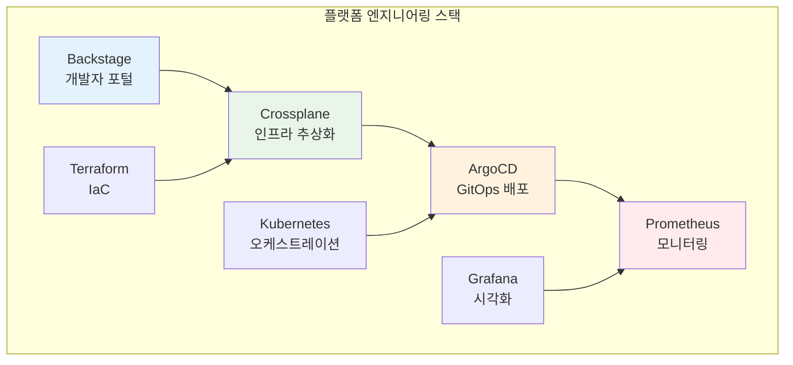
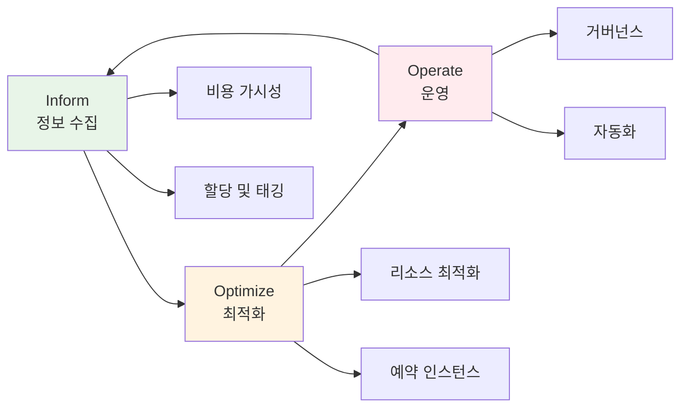
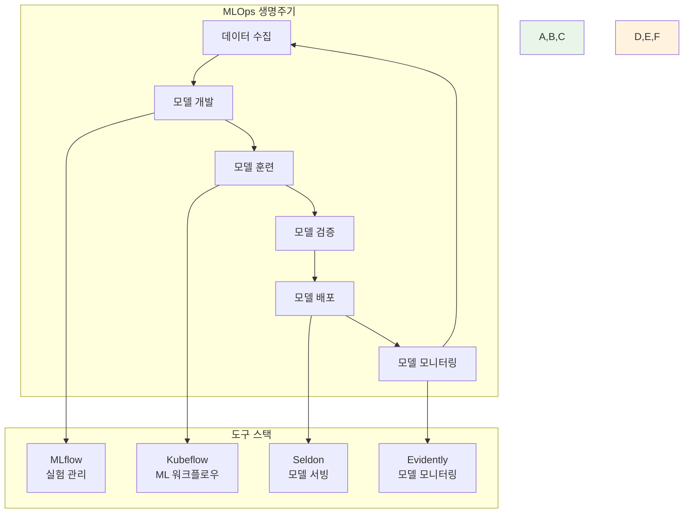
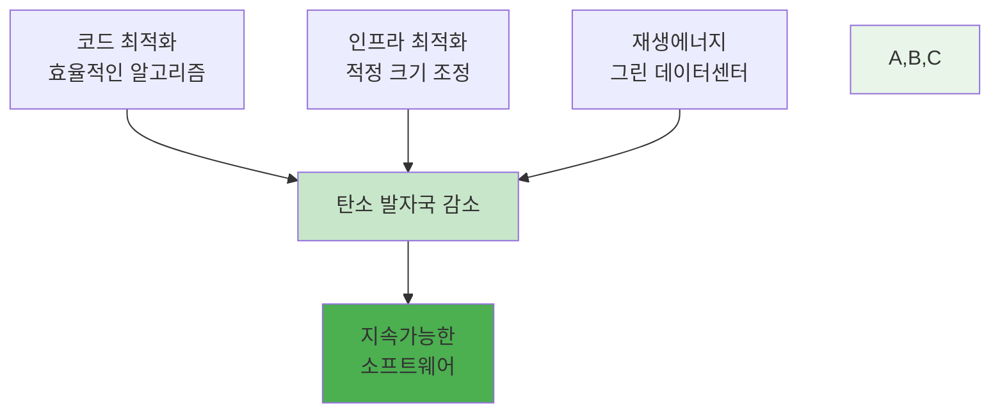
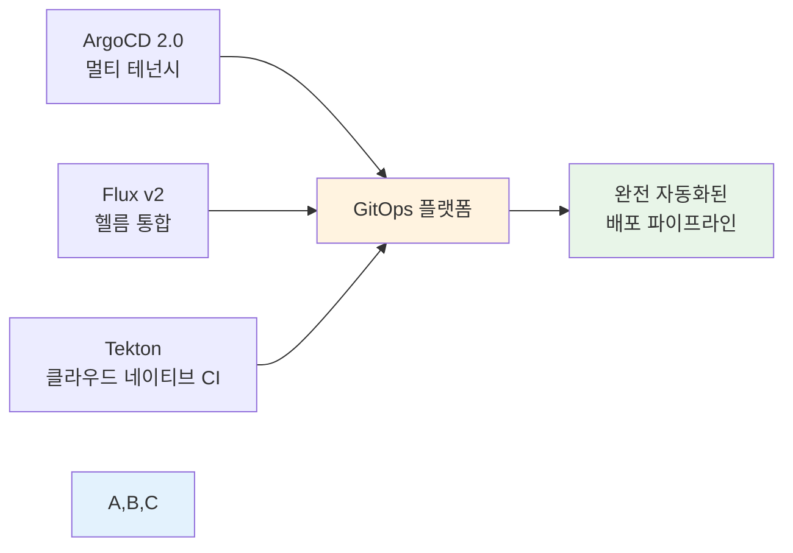
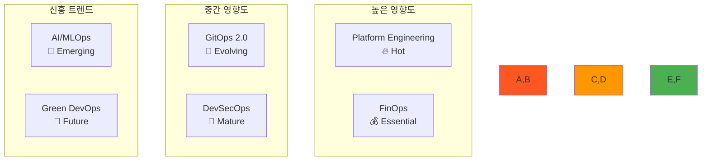

# 2025 DevOps 트렌드 및 최신 기술 가이드

## 🚀 2025년 핵심 DevOps 트렌드

### 1. 🏗️ Platform Engineering (플랫폼 엔지니어링)
**정의**: 개발자 경험(Developer Experience)을 향상시키기 위한 셀프서비스 플랫폼 구축

#### 핵심 개념
- **개발자 포털**: Backstage, Port, OpsLevel
- **셀프서비스 인프라**: 개발자가 직접 리소스 프로비저닝
- **Golden Path**: 표준화된 개발 워크플로우
- **Internal Developer Platform (IDP)**: 내부 개발자 플랫폼

#### 주요 도구

#### 실무 적용
- **개발자 생산성 향상**: 인프라 복잡성 추상화
- **표준화**: 일관된 개발 환경과 배포 프로세스
- **셀프서비스**: 개발팀의 자율성 증대
- **거버넌스**: 보안과 컴플라이언스 자동 적용

### 2. 💰 FinOps (Financial Operations)
**정의**: 클라우드 비용을 최적화하고 관리하는 문화적, 기술적 접근법

#### FinOps 프레임워크

#### 핵심 실무 사항
- **비용 가시성**: 실시간 비용 모니터링 및 알림
- **태깅 전략**: 리소스별 비용 추적을 위한 체계적 태깅
- **예산 관리**: 부서/프로젝트별 예산 설정 및 관리
- **최적화 자동화**: 사용하지 않는 리소스 자동 정리

#### 주요 도구
- **AWS**: Cost Explorer, Budgets, Trusted Advisor
- **Azure**: Cost Management, Advisor
- **GCP**: Cloud Billing, Recommender
- **멀티클라우드**: CloudHealth, Cloudability, Kubecost

### 3. 🤖 AI/MLOps (Machine Learning Operations)
**정의**: 머신러닝 모델의 개발, 배포, 운영을 자동화하는 DevOps 확장

#### MLOps 파이프라인

#### 핵심 개념
- **모델 버전 관리**: Git과 유사한 모델 버전 관리
- **실험 추적**: 하이퍼파라미터, 메트릭 추적
- **자동화된 재훈련**: 데이터 드리프트 감지 시 자동 재훈련
- **A/B 테스팅**: 모델 성능 비교 및 점진적 배포

### 4. 🌱 Green DevOps (지속가능한 DevOps)
**정의**: 환경 영향을 최소화하는 지속가능한 소프트웨어 개발 및 운영

#### 핵심 원칙
- **에너지 효율성**: 최적화된 코드와 인프라
- **탄소 발자국 측정**: 클라우드 사용량의 환경 영향 추적
- **그린 아키텍처**: 에너지 효율적인 시스템 설계
- **지속가능한 배포**: 필요시에만 리소스 사용

#### 실무 적용

### 5. 🔐 DevSecOps 진화
**정의**: 보안을 개발 생명주기 전반에 통합하는 고도화된 접근법

#### 최신 보안 트렌드
- **Shift-Left Security**: 개발 초기 단계부터 보안 적용
- **Zero Trust Architecture**: 모든 접근을 검증하는 보안 모델
- **Supply Chain Security**: 소프트웨어 공급망 보안
- **Policy as Code**: 보안 정책의 코드화

#### 보안 자동화 도구
- **SAST**: SonarQube, Checkmarx, Veracode
- **DAST**: OWASP ZAP, Burp Suite
- **Container Security**: Twistlock, Aqua Security
- **Policy Engine**: Open Policy Agent (OPA)

### 6. 🔄 GitOps 2.0
**정의**: Git을 단일 진실 소스로 하는 선언적 배포의 진화된 형태

#### GitOps 고도화
- **Progressive Delivery**: 카나리, 블루-그린 배포 자동화
- **Multi-Cluster GitOps**: 여러 클러스터 통합 관리
- **Policy-Driven GitOps**: 정책 기반 자동 배포
- **Observability Integration**: 배포와 모니터링 통합

#### 주요 도구 진화

## 🛠️ 실무 적용 가이드

### Platform Engineering 구현 단계
1. **현재 상태 분석**: 개발자 경험 측정
2. **플랫폼 설계**: IDP 아키텍처 정의
3. **도구 선택**: Backstage 등 플랫폼 도구 도입
4. **점진적 구축**: MVP부터 시작하여 확장
5. **피드백 수집**: 개발자 만족도 지속 측정

### FinOps 도입 로드맵
1. **가시성 확보**: 현재 비용 구조 파악
2. **태깅 전략**: 체계적인 리소스 태깅
3. **예산 설정**: 팀/프로젝트별 예산 관리
4. **최적화**: 자동화된 비용 최적화
5. **문화 정착**: FinOps 문화 조성

### MLOps 구축 방법
1. **실험 관리**: MLflow로 실험 추적 시작
2. **파이프라인**: Kubeflow로 ML 워크플로우 구축
3. **모델 서빙**: Seldon/KServe로 모델 배포
4. **모니터링**: 모델 성능 지속 모니터링
5. **자동화**: CI/CD에 ML 파이프라인 통합

## 📊 트렌드별 성숙도 및 도입 우선순위

### 도입 우선순위 매트릭스

### 기업 규모별 도입 전략

#### 스타트업 (10-50명)
- **우선순위**: GitOps, 기본 FinOps
- **도구**: ArgoCD, 클라우드 네이티브 모니터링
- **접근법**: 간단하고 비용 효율적인 솔루션

#### 중견기업 (50-500명)
- **우선순위**: Platform Engineering, 고급 FinOps
- **도구**: Backstage, 종합적인 관측성 플랫폼
- **접근법**: 개발자 생산성과 비용 최적화 균형

#### 대기업 (500명+)
- **우선순위**: 전체 트렌드 통합 적용
- **도구**: 엔터프라이즈급 플랫폼 구축
- **접근법**: 거버넌스와 확장성 중심

## 🎯 학습 로드맵

### 초급자 (기본 DevOps 이해 후)
1. **GitOps 기초** → ArgoCD 실습
2. **FinOps 개념** → 클라우드 비용 모니터링
3. **Platform Engineering 이해** → Backstage 체험

### 중급자 (DevOps 실무 경험 보유)
1. **Platform Engineering** → IDP 구축 프로젝트
2. **고급 FinOps** → 비용 최적화 자동화
3. **MLOps 기초** → ML 파이프라인 구축

### 고급자 (DevOps 전문가)
1. **엔터프라이즈 플랫폼** → 대규모 플랫폼 설계
2. **AI/MLOps 전문화** → 고급 ML 운영
3. **Green DevOps** → 지속가능한 아키텍처

이러한 최신 트렌드를 커리큘럼에 통합하여 학생들이 현재와 미래의 DevOps 환경에 대비할 수 있도록 합니다.