# 강의 교안 작성 템플릿 규칙

## 🎯 기본 원칙

### 📚 초보자 기준 작성
- **모든 이론 강의는 초보자가 이해할 수 있는 수준으로 작성**
- 고급자는 자연스럽게 멘토 역할 수행
- 중급자는 리더십 발휘 기회 제공
- 상호 학습과 협업을 통한 전체 성장

### 🤝 협업 중심 설계
- 페어 프로그래밍과 팀 활동 포함
- 질문과 토론을 통한 상호작용
- 서로 가르치고 배우는 환경 조성
- 자연스러운 역할 분담 유도

## 📝 일일 교안 템플릿

### 🗓️ Day [N]: [주제명]

```markdown
# Week [N] Day [N]: [주제명]

<div align="center">

**🎓 [주제 키워드]** • **[학습 포커스]**

*[한 줄 학습 목표 설명]*

</div>

---

## 🕘 일일 스케줄

### 📊 시간 배분 (신규 구조)
```
📚 이론 강의: 2.5시간 (50분×3세션) - 오전 집중 학습
🛠️ 실습 세션: 1.5-2시간 (50분×1-2세션) - 당일 학습 적용
👥 학생 케어: 개별 맞춤 지원 (필요시)
```

### 🗓️ 상세 스케줄
| 시간 | 구분 | 내용 | 목적 |
|------|------|------|------|
| **09:00-09:50** | 📚 이론 1 | [세션 1 주제] (50분) | [핵심 개념 1] |
| **09:50-10:00** | ☕ 휴식 | 10분 휴식 | |
| **10:00-10:50** | 📚 이론 2 | [세션 2 주제] (50분) | [핵심 개념 2] |
| **10:50-11:00** | ☕ 휴식 | 10분 휴식 | |
| **11:00-11:50** | 📚 이론 3 | [세션 3 주제] (50분) | [핵심 개념 3] |
| **11:50-12:00** | ☕ 휴식 | 10분 휴식 | |
| **12:00-12:50** | 🛠️ 실습 1 | [실습 세션 1] (50분) | [이론 적용] |
| **12:50-13:00** | ☕ 휴식 | 10분 휴식 | |
| **13:00-14:00** | 🍽️ 점심 | 점심시간 (60분) | |
| **14:00-14:50** | 🛠️ 실습 2 | [실습 세션 2] (50분) | [심화 적용] |

---

## 📚 이론 강의 (2.5시간 - 50분×3세션)

### 🎯 이론 세션 구성 원칙
- **Session 1**: 기본 개념과 원리 (기초 다지기)
- **Session 2**: 심화 내용과 실무 연계 (응용 확장)
- **Session 3**: 통합 정리와 실습 준비 (종합 완성)
- **연결성**: 각 세션 간 논리적 흐름과 점진적 심화

### Session 1: [세션 1 주제] (50분)

#### 🎯 학습 목표 (명확하고 측정 가능한 목표)
- **이해 목표**: [초보자도 이해할 수 있는 개념적 목표]
- **적용 목표**: [실습에서 직접 적용할 수 있는 기술적 목표]
- **협업 목표**: [동료와 함께 달성할 수 있는 협력적 목표]

#### 🤔 왜 필요한가? (5분 - 동기부여 및 맥락 제공)
**현실 문제 상황**:
- 💼 **실무 시나리오**: [실제 업무에서 마주치는 구체적 문제]
- 🏠 **일상 비유**: [학습자가 쉽게 이해할 수 있는 실생활 예시]
- ☁️ **AWS 아키텍처**: [해당 개념이 AWS에서 어떻게 구현되는지]
- 📊 **시장 동향**: [해당 기술이 중요한 이유와 트렌드]

**학습 전후 비교**:
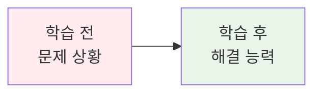

**💡 학습 효과 극대화 예시**:
```markdown
#### 🤔 왜 필요한가? (5분)
**현실 문제 상황**:
- 💼 **실무 시나리오**: "마이크로서비스 간 통신이 복잡해져서 장애 추적이 어려워요"
- 🏠 **일상 비유**: "아파트 단지에서 각 동 간 연락이 복잡해지면 관리사무소가 필요하듯이"
- ☁️ **AWS 아키텍처**: "API Gateway + ALB + Service Mesh(App Mesh)로 트래픽 관리"
- 📊 **시장 동향**: "Netflix, Uber 등 대규모 서비스의 필수 아키텍처 패턴"
```

#### 📖 핵심 개념 (35분 - 체계적 지식 구축)

**🔍 개념 1: [기본 정의 및 원리]**
> **정의**: [간단하고 명확한 한 줄 정의]

**상세 설명**:
- **핵심 원리**: [기본 작동 원리나 철학]
- **주요 특징**: [3-5개 핵심 특징]
- **사용 목적**: [언제, 왜 사용하는가]

**시각적 이해**:
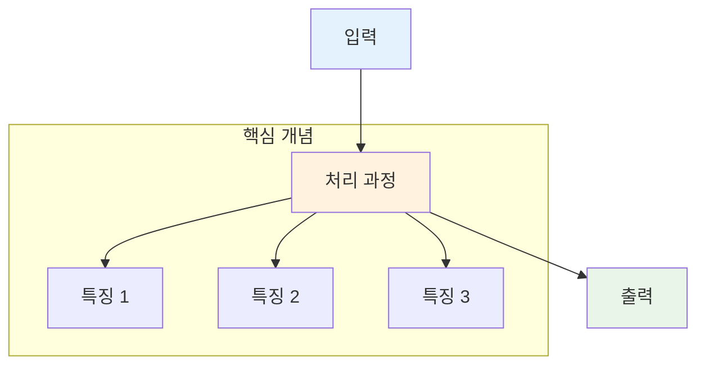

**🔍 개념 2: [심화 내용 및 응용]**
> **정의**: [개념 1과 연결된 심화 정의]

**단계별 이해**:
1. **1단계**: [가장 기본적인 수준]
2. **2단계**: [중간 수준의 이해]
3. **3단계**: [고급 수준의 적용]

**실무 연결**:
- **사용 사례**: [실제 사용되는 구체적 예시]
- **장단점**: [명확한 장점과 한계점]
- **대안 기술**: [비교할 수 있는 다른 기술들]

**🔍 개념 3: [통합 및 연결]**
> **정의**: [개념 1, 2와 연결된 통합적 정의]

**개념 간 관계**:
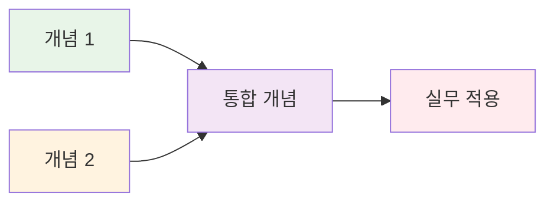

**종합 비교표**:
| 구분 | 개념 1 | 개념 2 | 개념 3 |
|------|--------|--------|--------|
| **목적** | [각 개념의 주요 목적] | [각 개념의 주요 목적] | [각 개념의 주요 목적] |
| **특징** | [핵심 특징] | [핵심 특징] | [핵심 특징] |
| **사용 시기** | [언제 사용하는가] | [언제 사용하는가] | [언제 사용하는가] |
| **장점** | [주요 장점] | [주요 장점] | [주요 장점] |
| **주의사항** | [알아야 할 제약사항] | [알아야 할 제약사항] | [알아야 할 제약사항] |

**🔑 핵심 키워드 정리**:
- **새로운 용어**: [한글명(영문명)] - [간단한 설명]
- **중요 개념**: [핵심 개념] - [왜 중요한가]
- **실무 용어**: [업계에서 사용하는 용어] - [실제 사용 맥락]

#### 💭 함께 생각해보기 (10분 - 상호작용 및 이해도 확인)

**🤝 페어 토론** (5분):
**토론 주제**:
1. **개념 적용**: "오늘 배운 개념을 어떤 상황에서 사용할 수 있을까요?"
2. **문제 해결**: "실무에서 이런 문제가 생긴다면 어떻게 해결하시겠어요?"
3. **경험 공유**: "비슷한 경험이나 관련 지식이 있다면 공유해주세요"

**페어 활동 가이드**:
- 👥 **자유 페어링**: 관심사나 이해도가 비슷한 사람끼리
- 🔄 **역할 교대**: 5분씩 설명자/질문자 역할 바꾸기
- 📝 **핵심 정리**: 대화 내용 중 중요한 점 메모하기

**🎯 전체 공유** (5분):
- **인사이트 공유**: 페어 토론에서 나온 좋은 아이디어
- **질문 수집**: 아직 이해가 어려운 부분
- **다음 연결**: 다음 세션과의 연결고리 확인

**💡 이해도 체크 질문**:
- ✅ "핵심 개념을 한 문장으로 설명할 수 있나요?"
- ✅ "실무에서 언제 사용할지 예상할 수 있나요?"
- ✅ "다른 사람에게 설명할 수 있을 정도로 이해했나요?"

### Session 2: [세션 2 주제] (50분)

#### 🎯 학습 목표
- [세션 2의 학습 목표들]

#### 📖 핵심 개념 (35분)
[세션 2는 세션 1의 구조를 따르되, 다음 요소들을 포함]

**🔍 개념 심화**: 세션 1에서 배운 기본 개념의 고급 활용
**🔗 개념 연결**: 이전 세션과의 논리적 연결고리
**🛠️ 실습 준비**: 오후 실습에서 사용할 구체적 기술

#### 🌟 실무 연계 (15분 - 현장 적용성 강화)

**📊 업계 동향**:
- **시장 현황**: [해당 기술의 현재 시장 점유율이나 사용률]
- **주요 기업 사례**: [Netflix, Google, Amazon 등의 실제 사용 사례]
- **미래 전망**: [기술 발전 방향과 전망]

**🏢 실무 적용 사례**:
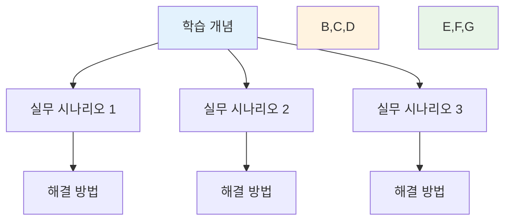

**💼 직무별 활용도**:
- **개발자**: [개발 업무에서의 구체적 활용]
- **운영자**: [시스템 운영에서의 활용]
- **아키텍트**: [시스템 설계에서의 고려사항]

**⚠️ 실무 주의사항**:
- 🚨 **흔한 실수**: [초보자가 자주 하는 실수들]
- 💡 **베스트 프랙티스**: [업계에서 권장하는 방법]
- 🔧 **트러블슈팅**: [문제 발생 시 해결 방법]

### Session 3: [세션 3 주제] (50분)

#### 🎯 학습 목표
- [세션 3의 학습 목표들]

#### 📖 핵심 개념 (35분)
[세션 3은 통합과 정리에 중점을 둔 구조]

**🔄 개념 통합**: 세션 1, 2에서 배운 내용의 종합적 이해
**🚀 고급 활용**: 기본 개념들을 조합한 고급 기법
**🎯 실습 연계**: 오후 실습에서 직접 사용할 구체적 방법

#### 🔗 전체 연결 및 정리 (15분 - 학습 통합)

**📚 3개 세션 통합 맵**:
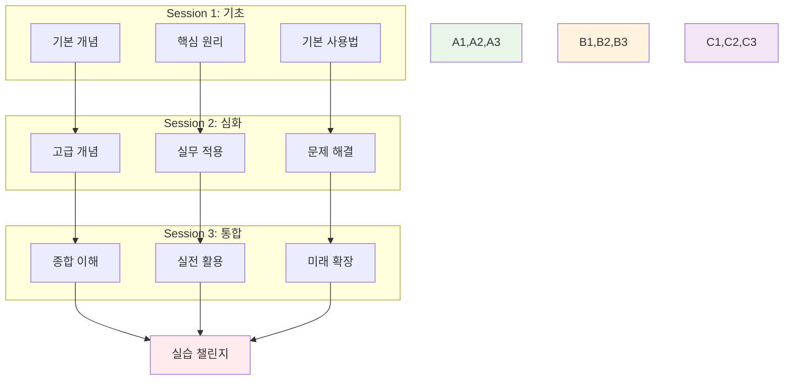

**🎯 실습 챌린지 준비**:
- **Phase 1 연결**: [세션 1 내용이 실습 Phase 1에서 어떻게 사용되는지]
- **Phase 2 연결**: [세션 2 내용이 실습 Phase 2에서 어떻게 활용되는지]
- **Phase 3 연결**: [세션 3 내용이 실습 Phase 3에서 어떻게 확장되는지]

**📋 학습 점검 체크리스트**:
- [ ] **기본 개념 이해**: 핵심 용어와 원리를 설명할 수 있다
- [ ] **실무 연계 파악**: 언제, 어떻게 사용하는지 안다
- [ ] **문제 해결 준비**: 기본적인 문제 상황에 대응할 수 있다
- [ ] **실습 준비 완료**: 오후 실습에 필요한 지식을 갖췄다

**🔮 다음 학습 예고**:
- **내일 연결**: [오늘 학습이 내일 학습과 어떻게 연결되는지]
- **주간 목표**: [이번 주 전체 학습 목표에서의 위치]
- **장기 비전**: [전체 과정에서의 의미와 중요성]

---

## 🛠️ 실습 세션 (1.5-2시간)

### 🎯 실습 세션 구성
- **Lab 1**: 당일 이론 내용 직접 적용 (50분)
- **Lab 2**: 심화 실습 및 고급 기능 구현 (50분)
- **즉시 적용**: 오전 학습 내용을 바로 실습으로 연결
- **단계적 심화**: 기본 → 심화 → 고급 순서로 진행

### 🛠️ Lab 1: 기본 실습 (50분)

#### 🎯 실습 목표
**당일 이론 적용**:
- Session 1-3에서 배운 핵심 개념 직접 실습
- 개별 또는 페어 프로그래밍으로 진행
- 단계별 가이드를 통한 체계적 학습

#### 📋 실습 준비 (5분)
**환경 설정**:
- [필요한 도구나 환경 확인]
- [실습 파일 및 리소스 준비]
- [페어 구성 (필요시)]

#### 🔧 실습 단계 (40분)
**Step 1: [기본 구현]** (15분)
```bash
# 기본 명령어 예시
[실제 실행할 명령어]
```

**Step 2: [기능 확장]** (15분)
[단계별 상세 설명]

**Step 3: [검증 및 테스트]** (10분)
[결과 확인 및 검증 방법]

#### ✅ 실습 체크포인트
- [ ] [기본 기능 구현 완료]
- [ ] [설정 및 구성 확인]
- [ ] [동작 테스트 성공]

#### 🔄 실습 마무리 (5분)
- **결과 공유**: 완성된 결과물 간단 공유
- **질문 해결**: 어려웠던 부분 질의응답
- **다음 연결**: Lab 2 또는 다음 학습 준비

---

### 🌟 Lab 2: 심화 실습 (50분)

#### 🎯 심화 목표
**고급 기능 구현**:
- Lab 1에서 확인한 기본 기능을 바탕으로 심화 기능 구현
- 실무 시나리오 기반 복합 문제 해결
- 성능 최적화 및 베스트 프랙티스 적용
- 창의적 아이디어와 고급 기능 통합

#### 🔧 심화 구현 (45뵔)
**고급 기능 추가**:
- **심화 기능 1**: [복잡한 비즈니스 로직 구현]
- **심화 기능 2**: [실무 환경 연동 및 통합]
- **성능 최적화**: [모니터링, 로깅, 오류 처리]
- **베스트 프랙티스**: [보안, 스케일링, 유지보수성]

#### ✅ 심화 체크포인트
- [ ] **고급 기능 구현**: 복잡한 비즈니스 로직 완성
- [ ] **실무 환경 연동**: 외부 시스템 및 API 통합
- [ ] **성능 최적화**: 모니터링 및 로깅 시스템 구축
- [ ] **베스트 프랙티스**: 보안 및 스케일링 고려사항 적용
- [ ] **문제 해결**: 예상 오류 상황 대응 및 트러블슈팅

#### 🎤 결과 발표 및 회고 (5분)
- **시연**: 완성된 심화 기능 데모 및 성능 비교
- **기술적 인사이트**: 구현 과정에서 발견한 기술적 노하우
- **베스트 프랙티스**: 실무에서 적용 가능한 방법론 공유
- **문제 해결 경험**: 어려웠던 문제와 해결 과정 공유
- **향후 발전 방향**: 추가 개선 아이디어 및 실무 적용 계획

---

## 👥 학생 케어 (유연한 운영)

### 🎯 케어 운영 방식
- **필요 기반**: 학생들의 이해도와 진도에 따라 유연하게 운영
- **개별 맞춤**: 각 학생의 수준과 필요에 맞는 개별 지원
- **상호 학습**: 학생 간 멘토링과 협업 학습 촉진
- **즉시 지원**: 실습 중 어려움 발생 시 즉시 도움 제공

### 🟢 초급자 지원
**개별 멘토링**:
- 당일 학습 내용 완전 이해 확인
- 실습에서 어려웠던 부분 해결
- 개념 재설명 및 추가 연습
- 다음 학습 준비 상태 점검
- 학습 자신감 향상 격려

### 🟡 중급자 지원
**리더십 개발**:
- 실무 적용 방안 심화 토론
- 초급자 멘토링 경험 공유
- 기술 발표 및 지식 공유 연습
- 다음 단계 학습 계획 수립

### 🔴 고급자 지원
**전문성 강화**:
- 고급 활용 방안 탐구
- 최신 기술 트렌드 연결
- 오픈소스 기여 계획
- 기술 블로그 작성 가이드

---

## 📝 일일 마무리

### ✅ 오늘의 성과
- [ ] [학습 목표 1 달성 여부]
- [ ] [학습 목표 2 달성 여부]
- [ ] [학습 목표 3 달성 여부]
- [ ] [협업 활동 참여도]

### 🎯 내일 준비사항
- **예습**: [다음 날 학습을 위한 사전 준비]
- **복습**: [오늘 배운 내용 정리 방법]
- **환경**: [필요한 도구나 설정 확인]

### 📊 학습 진도 체크
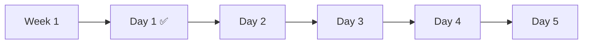

---

## 🔄 피드백 및 개선

### 📈 일일 회고 (15분)
**학습 회고**:
1. 오늘 3개 세션 중 가장 인상 깊었던 내용은?
2. 실습 챌린지에서 가장 어려웠던 부분과 해결 방법은?
3. 팀 협업에서 배운 점과 개선하고 싶은 점은?
4. 내일 학습에 대한 기대와 준비 계획은?

### 🎯 개선 포인트 (지속적 품질 향상)

**📊 강사 관찰 기반 개선**:
- **이해도 격차**: 학생 간 이해도 차이 발견 시 즉시 보완
- **참여도 불균형**: 소극적 학생 참여 유도 방안 마련
- **시간 배분**: 세션별 시간 조정 필요성 파악
- **난이도 조절**: 너무 쉽거나 어려운 부분 식별 및 조정

**💬 학생 피드백 기반 조정**:
- **실시간 피드백**: 세션 중 어려움 표현 시 즉시 대응
- **일일 설문**: 하루 마지막 간단한 만족도 및 개선 요청
- **주간 회고**: 일주일 학습 경험에 대한 종합 피드백
- **개별 상담**: 1:1 상담에서 나온 개인적 요청사항

**🔄 개선 실행 프로세스**:
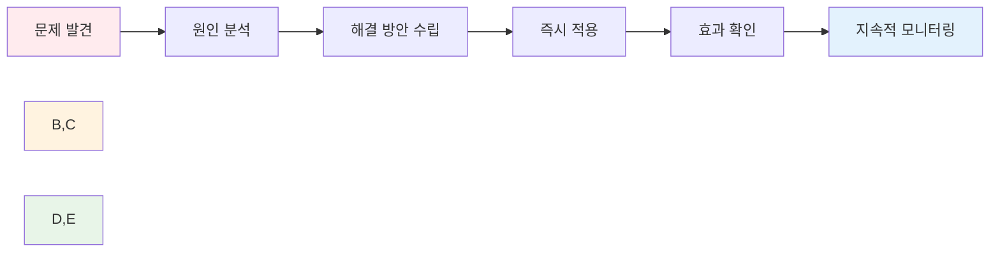

---

<div align="center">

**📚 체계적 학습** • **🤝 협업 중심** • **🚀 실무 연계**

*함께 성장하는 클라우드 네이티브 여정*

</div>
```

## 🎨 시각화 가이드라인 (필수 활용 요소)

### 📊 Mermaid 다이어그램 활용 (각 세션마다 최소 2-3개 필수)

**1. 개념 설명용 다이어그램** (스타일 분리 적용):
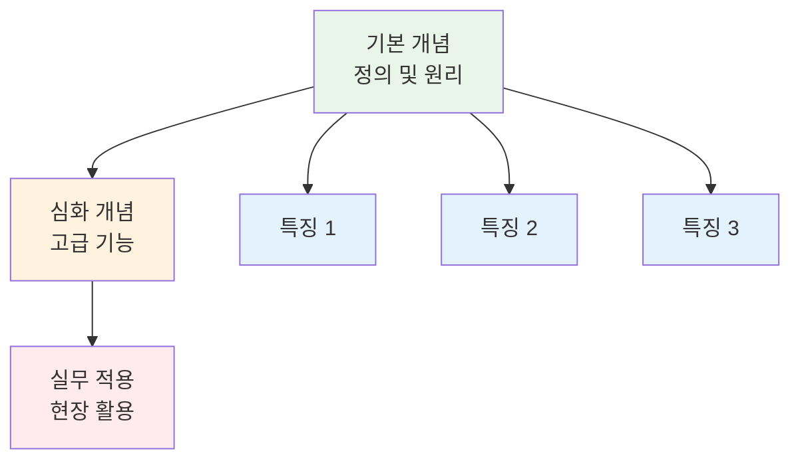

**2. 프로세스/워크플로우 설명용**:
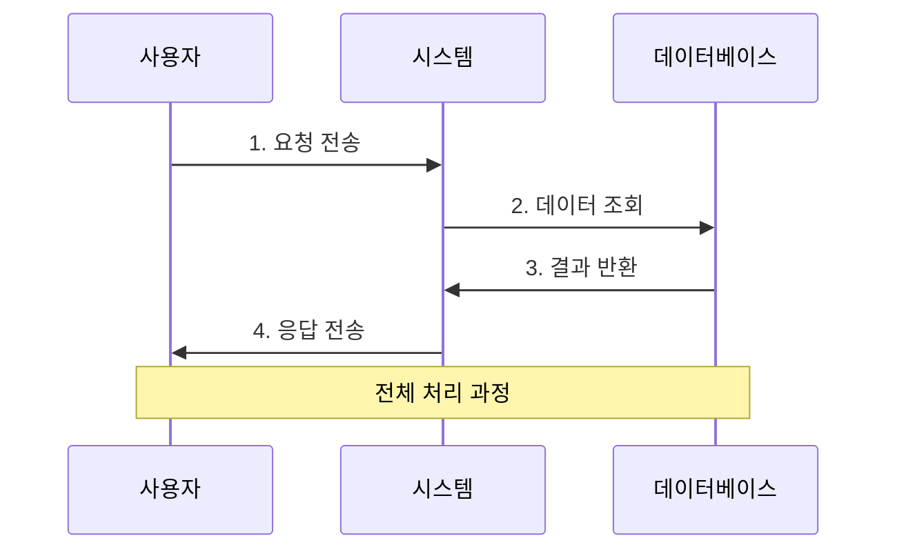

**3. 아키텍처/구조 설명용**:
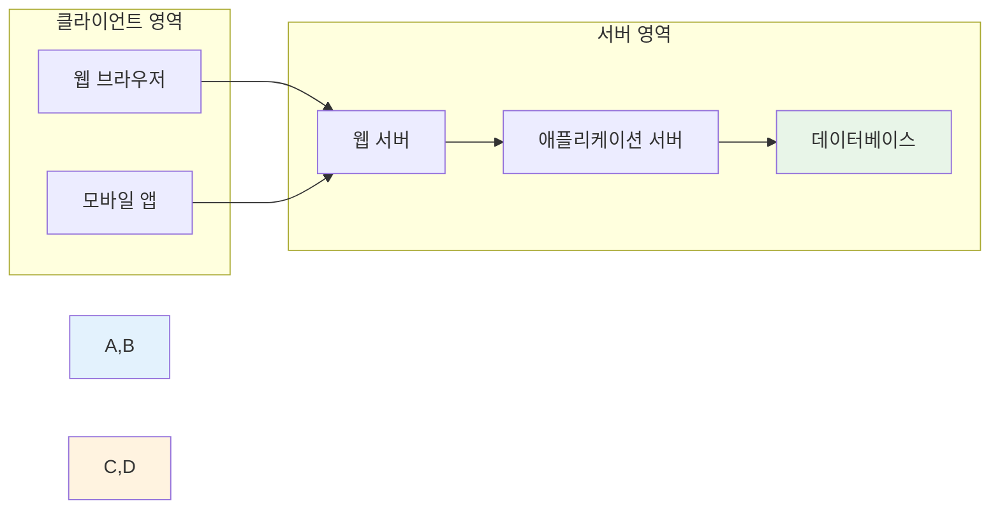

**4. 비교/대조 다이어그램** (스타일 분리 적용):
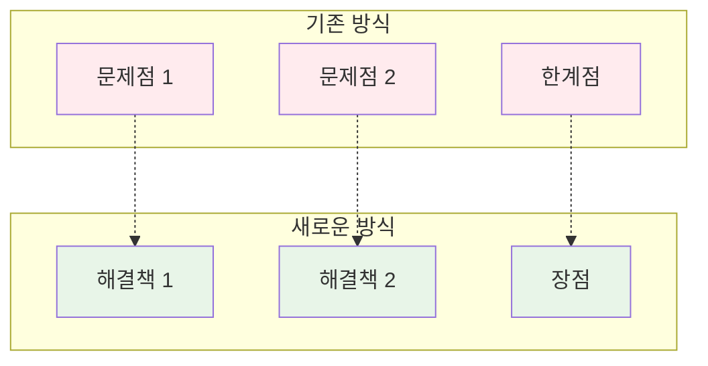

**5. 학습 진행 상황 다이어그램** (신규 구조 반영):
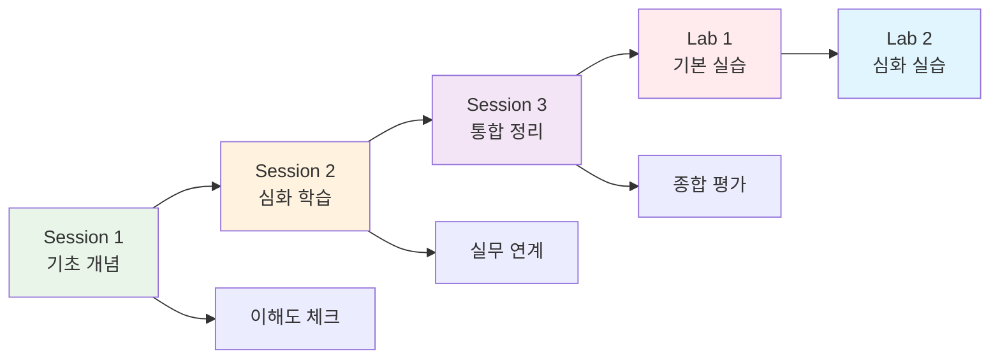

### 🖼️ 추가 시각화 요소 (적극 활용)

**🎨 공식 아이콘 활용 가이드**:
- **클라우드 서비스**: AWS, Azure, GCP 공식 아이콘
- **도구 및 플랫폼**: Docker, Kubernetes, Jenkins 등 공식 로고
- **프로그래밍 언어**: Python, Java, JavaScript 등 공식 아이콘
- **SVG 형태 우선**: 확장성과 품질을 위해 SVG 형태 선호

**📊 Mermaid 스타일 규칙**:
- **개별 스타일링**: `style A fill:#e8f5e8` (쉼표 없이 각자 분리)
- **일관된 색상**: 같은 카테고리는 동일한 색상 체계 사용
- **명확한 구분**: 다른 개념은 다른 색상으로 명확히 구분

**📈 데이터 시각화**:
- 통계 그래프 (막대, 선, 원형)
- 성장 추이 차트
- 비교 분석 표

**🎯 인포그래픽 요소**:
- 아이콘과 텍스트 조합
- 단계별 프로세스 시각화
- 체크리스트와 진행 상황

**⚠️ 주의사항 시각화**:
- 경고 박스와 아이콘
- 색상 코딩 (빨강: 위험, 노랑: 주의, 초록: 안전)
- 강조 표시와 하이라이트

**🔄 상호작용 요소**:
- 클릭 가능한 다이어그램
- 단계별 애니메이션
- 호버 효과와 툴팁

### 🎯 강조 표시 방법

#### ⚠️ 주의사항
```
🚨 중요: 반드시 확인해야 할 사항
💡 팁: 유용한 추가 정보
⚠️ 주의: 실수하기 쉬운 부분
```

#### 📝 코드 블록
```bash
# 명령어 설명
command --option value
```

```yaml
# 설정 파일 예시
key: value
```

## 🔑 키워드 관리 규칙

### 📚 용어 정리 시스템

**🆕 새로운 용어 도입 규칙**:
- **한글명(영문명)**: 컨테이너(Container) - 처음 등장 시 반드시 병기
- **약어 설명**: K8s (Kubernetes), CI/CD (Continuous Integration/Continuous Deployment)
- **발음 가이드**: 어려운 영어 용어는 발음 표기 추가
- **어원 설명**: 용어의 유래나 의미 배경 간단 설명

**📖 용어 사전 구성** (각 Day별):
```markdown
## 📝 오늘의 핵심 용어

### 🔤 기본 용어
- **용어명**: 정의 및 설명
- **영문명**: English Term
- **사용 맥락**: 언제, 어떻게 사용하는가

### 🔤 기술 용어
- **전문 용어**: 기술적 정의
- **실무 활용**: 현장에서의 사용법
- **관련 용어**: 연관된 다른 용어들

### 🔤 약어 및 줄임말
- **약어**: 풀네임 (Full Name)
- **사용 빈도**: 업계에서의 사용 정도
- **대체 표현**: 같은 의미의 다른 표현
```

**🔄 반복 학습 전략**:
- **1차 도입**: 새로운 용어 정의와 기본 설명
- **2차 강화**: 다른 맥락에서 재등장으로 이해 심화
- **3차 정착**: 실습과 토론에서 자연스러운 사용
- **4차 확장**: 관련 용어들과의 연결 관계 설명

**📊 용어 난이도 분류** (스타일 분리 적용):
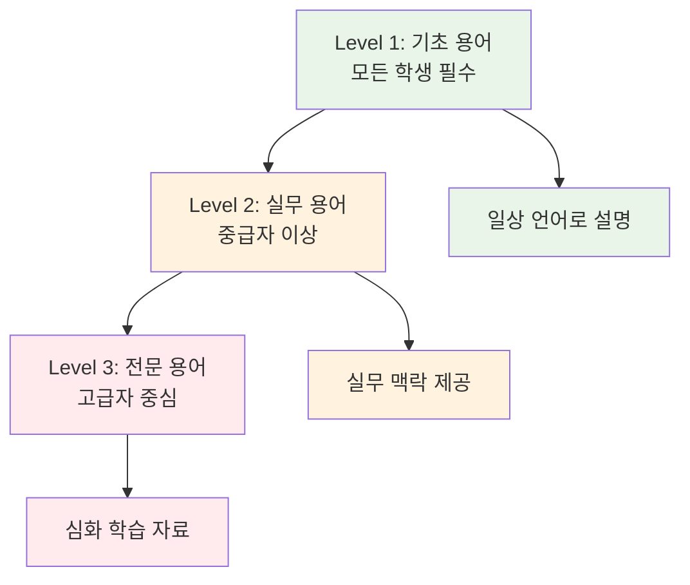

**🎯 용어 학습 효과 측정**:
- **즉시 확인**: 세션 중 간단한 용어 퀴즈
- **상호 설명**: 페어 활동에서 서로 용어 설명하기
- **실습 적용**: 실습에서 올바른 용어 사용 여부 확인
- **일일 정리**: 하루 마지막에 핵심 용어 복습

## 📊 평가 및 피드백 시스템

### ✅ 이해도 체크 (실시간 + 단계별)

**🔍 실시간 이해도 확인**:
- **세션 중 체크**: 5분마다 간단한 확인 질문
- **개념 설명**: 학생이 다른 학생에게 설명하기
- **즉석 퀴즈**: 핵심 개념 3-5문제 즉석 확인
- **손들기 투표**: 이해도를 손들기로 즉시 확인

**📋 단계별 평가 도구** (스타일 분리 적용):
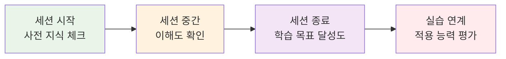

**🎯 이해도 측정 기준**:
- **Level 1**: 기본 용어와 개념 설명 가능
- **Level 2**: 실무 상황에서의 적용 방법 이해
- **Level 3**: 다른 사람에게 가르칠 수 있는 수준
- **Level 4**: 창의적 확장이나 문제 해결 가능

### 🤝 협업 평가 (다면적 관찰)

**👥 참여도 평가 매트릭스**:
| 평가 항목 | 관찰 포인트 | 측정 방법 |
|----------|-------------|----------|
| **질문 참여** | 적극적 질문, 답변 참여 | 발언 횟수 및 질 |
| **동료 지원** | 어려워하는 동료 도움 | 멘토링 행동 관찰 |
| **토론 기여** | 건설적 의견 제시 | 토론 내용의 질 |
| **팀워크** | 팀 활동에서의 협력 | 역할 수행도 |
| **지식 공유** | 자신의 경험/지식 공유 | 공유 빈도 및 유용성 |

**🔄 상호 피드백 시스템**:
- **페어 피드백**: 페어 활동 후 서로 피드백
- **팀 회고**: 팀 활동 후 협업 경험 공유
- **동료 추천**: 도움을 많이 준 동료 추천
- **감사 표현**: 배운 점이나 도움받은 점 표현

### 📈 성장 추적 (개인별 맞춤 관리)

**📊 개인 성장 대시보드** (스타일 분리 적용):
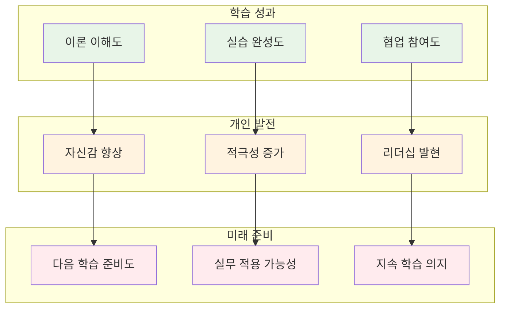

**📝 성장 기록 방법**:
- **일일 체크**: 매일 학습 목표 달성도 자가 평가
- **주간 회고**: 일주일 성장 포인트 정리
- **동료 관찰**: 다른 학생들의 성장 모습 공유
- **강사 피드백**: 개별 성장 포인트와 개선 방향 제시

**🎯 성장 지표**:
- **정량적 지표**: 실습 완성률, 질문 횟수, 참여도 점수
- **정성적 지표**: 자신감, 적극성, 협업 능력, 학습 태도
- **미래 지향**: 다음 단계 준비도, 실무 적용 의지, 지속 학습 계획

### 📋 이론 강의 필수 체크리스트

#### ✅ 세션별 필수 포함 요소
**모든 세션 공통**:
- [ ] 명확한 학습 목표 (이해/적용/협업)
- [ ] 동기부여를 위한 현실 문제 제시
- [ ] 최소 2개 이상의 Mermaid 다이어그램
- [ ] 핵심 개념의 단계별 설명
- [ ] 실생활 비유 및 AWS 아키텍처 매핑
- [ ] 페어 토론 및 상호작용 시간
- [ ] 새로운 용어의 체계적 정리
- [ ] 이해도 확인 질문

**세션 1 (기초) 추가 요소**:
- [ ] 전체적인 맥락과 배경 설명
- [ ] 기본 원리와 핵심 개념 정의
- [ ] 왜 이 기술이 필요한지 명확한 설명

**세션 2 (심화) 추가 요소**:
- [ ] 세션 1과의 논리적 연결
- [ ] 실무 사례와 업계 동향
- [ ] 장단점 및 제약사항 설명
- [ ] 문제 해결 방법론

**세션 3 (통합) 추가 요소**:
- [ ] 전체 세션 내용의 통합 정리
- [ ] 실습 챌린지와의 연결점
- [ ] 다음 학습과의 연계성
- [ ] 종합적 이해도 점검

#### 🎨 시각화 필수 요소
- [ ] 개념 설명 다이어그램 (각 세션 1개 이상)
- [ ] 프로세스/워크플로우 다이어그램
- [ ] 비교/대조 표 또는 차트
- [ ] 아키텍처/구조 다이어그램
- [ ] 학습 진행 상황 시각화

#### 📝 텍스트 설명 필수 요소
- [ ] 각 개념의 명확한 정의
- [ ] 단계별 상세 설명
- [ ] 실무 적용 사례
- [ ] 주의사항 및 베스트 프랙티스
- [ ] 관련 용어 및 개념 연결

#### 🤝 상호작용 필수 요소
- [ ] 페어 토론 주제 및 가이드
- [ ] 전체 공유 시간
- [ ] 질문 수집 및 답변
- [ ] 이해도 체크 활동

---

## 🎓 교안 작성 완료 체크리스트

### ✅ 최종 검토 항목
- [ ] **학습 목표**: 명확하고 측정 가능한 목표 설정
- [ ] **시각화**: 각 세션마다 2-3개 이상의 다이어그램 포함
- [ ] **상호작용**: 페어 활동과 토론 시간 충분히 배정
- [ ] **용어 정리**: 새로운 용어의 체계적 설명과 정리
- [ ] **실무 연계**: 현실적이고 구체적인 사례 포함
- [ ] **난이도 조절**: 초보자 기준으로 단계적 설명
- [ ] **평가 방법**: 이해도 체크와 피드백 시스템 구축
- [ ] **연결성**: 이전/다음 학습과의 논리적 연결

### 🎯 품질 보증 기준
- **이해도**: 초보자도 80% 이상 이해 가능한 수준
- **참여도**: 모든 학생이 적극 참여할 수 있는 구조
- **실용성**: 실무에서 바로 적용 가능한 내용
- **지속성**: 다음 학습으로 자연스럽게 연결되는 구조

<div align="center">

**📚 체계적 학습** • **🤝 협업 중심** • **🚀 실무 연계** • **🎨 풍부한 시각화**

*완벽한 교안으로 함께 성장하는 클라우드 네이티브 여정*

</div>