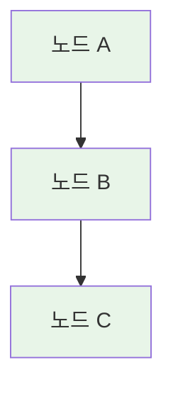
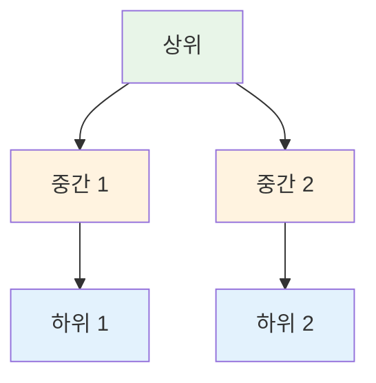

# Mermaid 다이어그램 스타일 작성 규칙

## ⚠️ 필수 규칙: 쉼표(,) 사용 금지

### ❌ 잘못된 방법
```mermaid
graph TB
    A[노드 A] --> B[노드 B]
    B --> C[노드 C]
    
    style A,B,C fill:#e8f5e8  ❌ 쉼표로 묶지 마세요!
```

### ✅ 올바른 방법


## 📋 이유

1. **렌더링 오류 방지**: 쉼표로 묶으면 Mermaid 렌더링 오류 발생 가능
2. **가독성**: 각 노드의 스타일을 명확히 구분 가능
3. **유지보수**: 개별 스타일 수정이 용이
4. **일관성**: 모든 다이어그램에서 동일한 패턴 사용

## 🎨 표준 색상 팔레트

```
#e8f5e8  - 연한 초록 (기본/성공)
#fff3e0  - 연한 주황 (중간/진행)
#ffebee  - 연한 빨강 (중요/경고)
#e3f2fd  - 연한 파랑 (정보/보조)
#f3e5f5  - 연한 보라 (고급/특별)
```

## 📝 적용 예시

### 예시 1: 프로세스 다이어그램


### 예시 2: 계층 구조


## ✅ 체크리스트

모든 Mermaid 다이어그램 작성 시:
- [ ] 쉼표(,)로 스타일 묶지 않음
- [ ] 각 노드마다 개별 style 라인 작성
- [ ] 표준 색상 팔레트 사용
- [ ] 의미에 맞는 색상 선택

---

**이 규칙은 모든 Session, Lab, Challenge 문서에 적용됩니다.**
