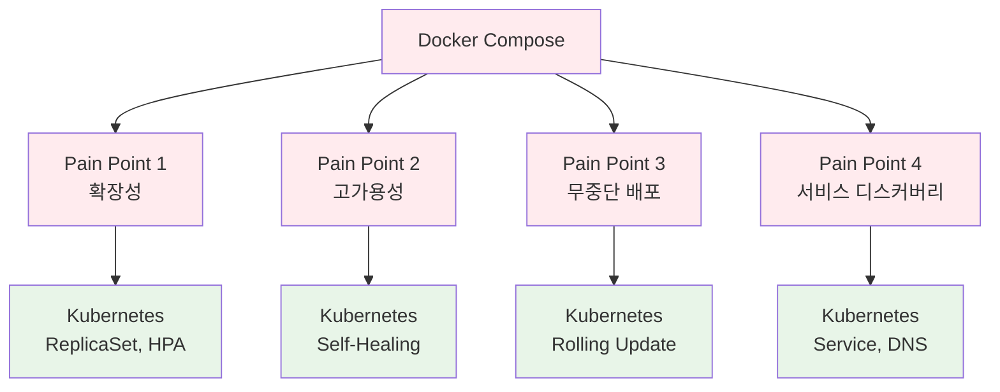
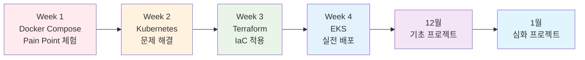

# 11월 보강 수업 커리큘럼 (November Reinforcement Course)

## 🎯 보강 수업 목적

### 전체 흐름
```
11월 보강 (4주) → 12월 기초 프로젝트 (4주) → 1월 심화 프로젝트 (5주)
```

### 핵심 목표
- **기초 프로젝트 준비**: Docker Compose MVP 구축 능력
- **Pain Point 체험**: 왜 Kubernetes가 필요한가?
- **Terraform 기초**: IaC 개념 및 실습
- **심화 프로젝트 준비**: K8s, MSA, Istio 대비

---

## 📅 4주 커리큘럼 구조

### 일일 시간표 (하루 2시간)
```
09:00-09:50  이론 강의 (50분)
09:50-10:00  휴식 (10분)
10:00-10:50  실습 (50분)
10:50-11:00  Q&A 및 정리 (10분)
```

---

## 📚 Week 1 (11/3-11/7): Docker Compose MVP + Pain Point 체험

### 목표
"왜 Kubernetes가 필요한가?"를 몸소 체험

### Day 1 (월): Docker Compose로 간단한 서비스 구축
**이론 (09:00-10:00)**:
- Docker Compose 복습
- 3-Tier 아키텍처 (Frontend-Backend-DB)
- 실제 서비스 예시 (간단한 블로그, TODO 앱)

**실습 (10:00-11:00)**:
- Docker Compose로 WordPress + MySQL 배포
- 로컬에서 서비스 실행 및 테스트

### Day 2 (화): 확장성 문제 체험
**이론 (09:00-10:00)**:
- 단일 컨테이너의 한계
- 로드밸런싱 필요성
- 수평 확장 vs 수직 확장

**실습 (10:00-11:00)**:
- Docker Compose scale 명령어 시도
- 한계점 발견 (포트 충돌, 로드밸런싱 부재)
- **Pain Point 1**: "트래픽 증가 시 어떻게 대응?"

### Day 3 (수): 고가용성 문제 체험
**이론 (09:00-10:00)**:
- 컨테이너 장애 시나리오
- 자동 복구의 필요성
- Health Check와 Self-Healing

**실습 (10:00-11:00)**:
- 컨테이너 강제 종료 시뮬레이션
- 수동 재시작의 번거로움
- **Pain Point 2**: "장애 발생 시 자동 복구?"

### Day 4 (목): 배포 및 롤백 문제 체험
**이론 (09:00-10:00)**:
- 무중단 배포의 필요성
- Blue-Green, Canary 배포
- 버전 관리 및 롤백

**실습 (10:00-11:00)**:
- Docker Compose로 버전 업데이트 시도
- 다운타임 발생 경험
- **Pain Point 3**: "무중단 배포 어떻게?"

### Day 5 (금): 서비스 간 통신 및 보안 문제
**이론 (09:00-10:00)**:
- 마이크로서비스 간 통신
- 서비스 디스커버리
- mTLS와 보안 통신

**실습 (10:00-11:00)**:
- 여러 서비스 간 통신 구성
- 하드코딩된 IP/포트의 문제점
- **Pain Point 4**: "서비스 디스커버리 필요"

**주말 과제**: "Docker Compose의 한계점 정리"

---

## 📚 Week 2 (11/10-11/14): Kubernetes 기초 (Kind 환경)

### 목표
Week 1의 Pain Point를 Kubernetes로 해결

### Pain Point → K8s 기능 매핑
- 확장성 → ReplicaSet, HPA
- 고가용성 → Self-Healing, Liveness/Readiness
- 배포 → Rolling Update, Rollback
- 통신 → Service, DNS

### Day 1 (월): Kubernetes 소개 + Kind 설치
**이론 (09:00-10:00)**:
- Kubernetes가 해결하는 문제들
- Week 1 Pain Point → K8s 기능 매핑
- K8s 아키텍처 개요

**실습 (10:00-11:00)**:
- Kind 클러스터 생성
- kubectl 기본 명령어
- 첫 Pod 배포

### Day 2 (화): Deployment + Service
**이론 (09:00-10:00)**:
- Deployment로 확장성 해결
- Service로 로드밸런싱
- ClusterIP, NodePort, LoadBalancer

**실습 (10:00-11:00)**:
- Week 1의 WordPress를 K8s Deployment로 변환
- Service로 접근
- **Pain Point 1 해결 확인**

### Day 3 (수): ConfigMap + Secret
**이론 (09:00-10:00)**:
- 설정 외부화
- 시크릿 관리
- 환경별 설정 분리

**실습 (10:00-11:00)**:
- ConfigMap으로 설정 관리
- Secret으로 DB 비밀번호 관리
- 환경 변수 주입

### Day 4 (목): Ingress + 네트워킹
**이론 (09:00-10:00)**:
- Ingress Controller
- 도메인 기반 라우팅
- TLS 종료

**실습 (10:00-11:00)**:
- Nginx Ingress Controller 설치
- 도메인 기반 라우팅 설정
- **Pain Point 4 해결 확인**

### Day 5 (금): 통합 실습
**실습 (09:00-11:00)**:
- Week 1의 전체 서비스를 K8s로 마이그레이션
- 모든 Pain Point 해결 확인
- Before/After 비교

**주말 과제**: "K8s로 해결된 문제점 정리"

---

## 📚 Week 3 (11/17-11/21): Terraform 기초 + K8s 리소스 관리

### 목표
IaC로 인프라 코드화

### Day 1 (월): Terraform 기초
**이론 (09:00-10:00)**:
- IaC란? (선언적 vs 명령형)
- Terraform 기본 개념
- Provider, Resource, State

**실습 (10:00-11:00)**:
- Terraform 설치
- 첫 리소스 생성 (로컬 파일)
- terraform init, plan, apply

### Day 2 (화): Terraform으로 K8s 리소스 관리
**이론 (09:00-10:00)**:
- Kubernetes Provider
- kubectl vs Terraform
- 언제 Terraform을 사용하는가?

**실습 (10:00-11:00)**:
- Terraform으로 Namespace 생성
- Terraform으로 Deployment 생성
- State 파일 이해

### Day 3 (수): Module + Variable
**이론 (09:00-10:00)**:
- Module의 필요성
- 재사용 가능한 인프라
- Variable과 Output

**실습 (10:00-11:00)**:
- K8s Deployment Module 작성
- Variable로 환경별 설정
- 여러 환경에 동일 인프라 배포

### Day 4 (목): Terraform으로 전체 스택 관리
**이론 (09:00-10:00)**:
- 전체 인프라를 코드로
- 의존성 관리
- 팀 협업 (State 공유)

**실습 (10:00-11:00)**:
- Week 2의 K8s 리소스를 Terraform으로 변환
- 전체 스택 한 번에 배포
- 변경 사항 추적

### Day 5 (금): GitOps 맛보기
**이론 (09:00-10:00)**:
- GitOps 개념
- Git을 Single Source of Truth로
- CI/CD 파이프라인 기초

**실습 (10:00-11:00)**:
- GitHub에 Terraform 코드 푸시
- GitHub Actions로 자동 배포 (간단한 예제)
- 코드 변경 → 자동 반영

**주말 과제**: "Terraform으로 나만의 인프라 코드 작성"

---

## 📚 Week 4 (11/24-11/28): EKS 전환 + 심화 프로젝트 준비

### 목표
Kind → EKS 마이그레이션 및 실전 준비

### Day 1 (월): AWS EKS 소개
**이론 (09:00-10:00)**:
- Managed K8s의 장점
- EKS 아키텍처
- Kind vs EKS 차이점

**실습 (10:00-11:00)**:
- AWS Console에서 EKS 클러스터 생성
- kubectl 연결
- 기본 Pod 배포

### Day 2 (화): Terraform으로 EKS 생성
**이론 (09:00-10:00)**:
- Terraform AWS Provider
- EKS Module
- VPC, Subnet, Security Group

**실습 (10:00-11:00)**:
- Terraform으로 EKS 클러스터 생성
- Worker Node 구성
- kubectl 연결 확인

### Day 3 (수): Kind → EKS 마이그레이션
**이론 (09:00-10:00)**:
- 마이그레이션 체크리스트
- 환경별 설정 차이
- 스토리지, 네트워킹 고려사항

**실습 (10:00-11:00)**:
- Week 2-3의 애플리케이션을 EKS로 배포
- LoadBalancer Service 사용
- 실제 도메인 연결 (Route 53)

### Day 4 (목): 모니터링 + 로깅
**이론 (09:00-10:00)**:
- CloudWatch Container Insights
- Prometheus + Grafana
- 로그 수집 및 분석

**실습 (10:00-11:00)**:
- CloudWatch 대시보드 구성
- 알람 설정
- 로그 확인

### Day 5 (금): 최종 프로젝트 - 전체 통합
**실습 (09:00-11:00)**:
- Terraform으로 EKS 클러스터 생성
- K8s 리소스 배포
- 모니터링 설정
- 전체 스택 동작 확인

**12월 기초 프로젝트 킥오프**:
- 프로젝트 주제 소개
- 팀 구성
- 아키텍처 설계 워크샵

---

## 📊 주차별 산출물

### Week 1 산출물
- **Pain Point 문서**: Docker Compose의 한계점 정리
- **개선 아이디어**: 각 문제를 어떻게 해결할지 구상

### Week 2 산출물
- **K8s YAML 파일**: 전체 서비스 매니페스트
- **Before/After 비교**: Docker Compose vs K8s

### Week 3 산출물
- **Terraform 코드**: K8s 리소스를 코드로
- **Module**: 재사용 가능한 인프라 모듈

### Week 4 산출물
- **EKS 인프라**: Terraform으로 관리되는 EKS
- **배포 파이프라인**: GitHub Actions CI/CD
- **모니터링 대시보드**: CloudWatch 설정

---

## 🎯 12월 기초 프로젝트 연계

### 기초 프로젝트 시나리오 (예시)
```
주제: "간단한 블로그 플랫폼"

Week 1: Docker Compose로 MVP
- Frontend (React)
- Backend (Node.js/Express)
- Database (PostgreSQL)
- Redis (캐싱)

Week 2: Pain Point 발견 및 개선
- 트래픽 증가 시 확장 문제
- 장애 발생 시 복구 문제
- 배포 시 다운타임 문제

Week 3: Kubernetes로 마이그레이션
- Deployment, Service 구성
- HPA로 자동 확장
- Rolling Update로 무중단 배포

Week 4: Terraform으로 인프라 코드화
- EKS 클러스터 생성
- K8s 리소스 관리
- CI/CD 파이프라인 구축
```

---

## ✅ 보강 완료 후 학생 역량 체크리스트

### 기술 역량
- [ ] Docker Compose로 멀티 컨테이너 앱 구성
- [ ] Kubernetes 기본 리소스 이해 및 배포
- [ ] Terraform으로 인프라 코드 작성
- [ ] Kind와 EKS 차이점 이해
- [ ] 기본적인 CI/CD 파이프라인 구성

### 문제 해결 역량
- [ ] 확장성 문제 인식 및 해결 방안
- [ ] 고가용성 설계 이해
- [ ] 무중단 배포 전략 이해
- [ ] 서비스 간 통신 패턴 이해

### 심화 프로젝트 준비
- [ ] MSA 아키텍처 기초 이해
- [ ] Service Mesh 필요성 인식 (Istio 준비)
- [ ] IaC 사고방식 체득
- [ ] 클라우드 네이티브 패턴 이해

---

## 📝 교안 작성 규칙

### Day별 문서 구조
```markdown
# 11월 보강 Week N Day N: [주제]

## 🎯 오늘의 목표
- [초급자 목표]
- [중급자 목표]
- [고급자 목표]

## 📖 이론 (09:00-10:00)
### 핵심 개념
- 비전공자를 위한 쉬운 설명
- 실생활 비유
- 시각적 다이어그램

### Pain Point 연결
- Week 1에서 발견한 문제
- 이 기술이 어떻게 해결하는가

## 🛠️ 실습 (10:00-11:00)
### 실습 목표
- 구체적인 실습 목표

### 단계별 가이드
1. [Step 1]
2. [Step 2]
3. [Step 3]

### 검증
- 제대로 동작하는지 확인

## 💡 Q&A 및 정리 (10:50-11:00)
### 오늘 배운 내용
- 핵심 개념 요약
- Pain Point 해결 확인

### 다음 시간 예고
- 내일 배울 내용
- 사전 준비 사항
```

---

## 🎨 시각화 요소

### Pain Point 시각화


### 학습 경로 시각화


---

<div align="center">

**🎯 Pain Point 체험** • **🔧 Kubernetes 해결** • **📝 Terraform IaC** • **☁️ EKS 실전**

*11월 보강: 기초 프로젝트 → 심화 프로젝트로 가는 브릿지*

</div>
