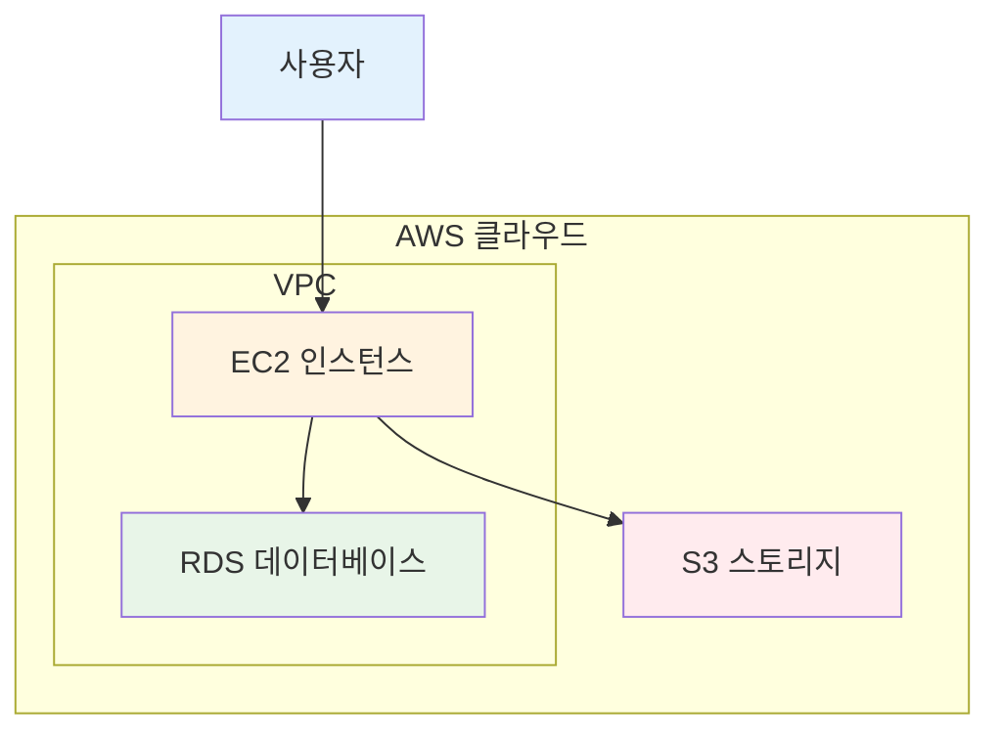
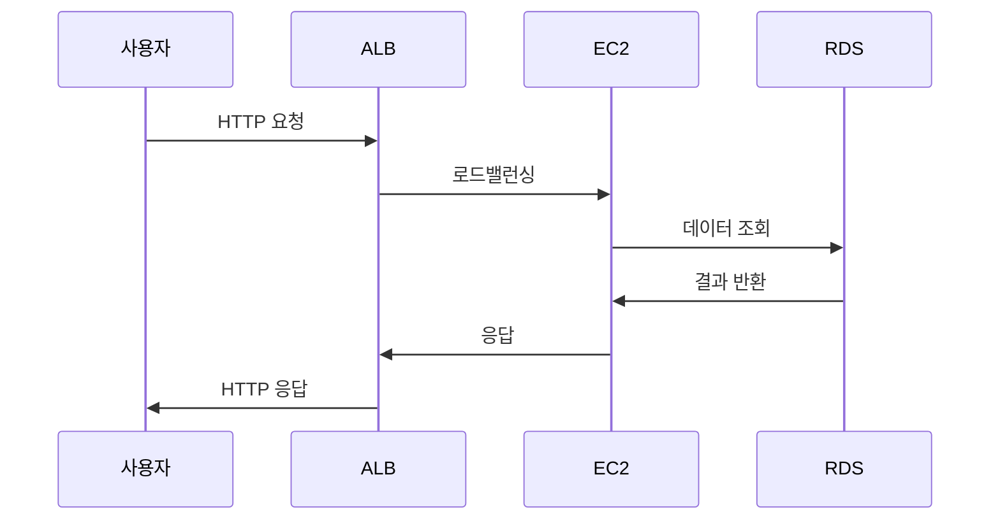
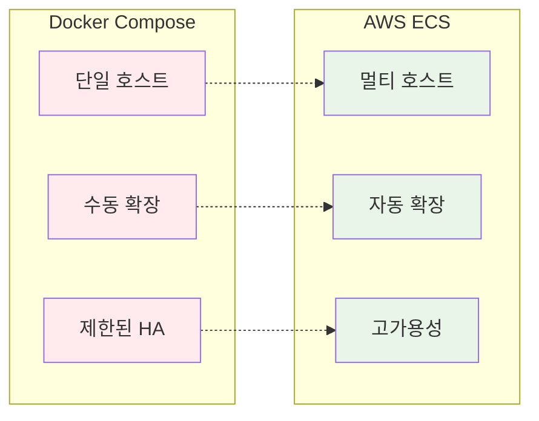
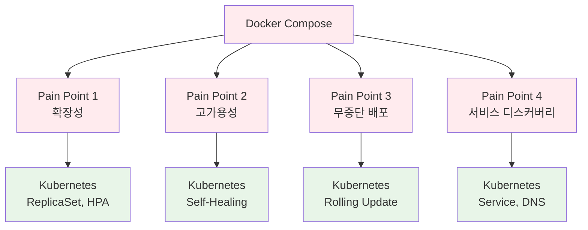
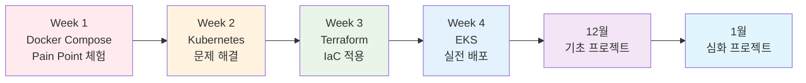

# 11월 AWS 기초 + Terraform 실전 특강 (November AWS & Terraform Course)

## 🎯 특강 목적

### 전체 흐름
```
11월 특강 (4주) → 12월 기초 프로젝트 (4주) → 1월 심화 프로젝트 (5주)
```

### 핵심 목표
- **AWS 기초 완성**: Solution Architect Associate 수준의 핵심 서비스 이해
- **실무 아키텍처**: 서비스 조합 및 실전 케이스 학습
- **Terraform 마스터**: IaC로 AWS 인프라 코드화 및 관리
- **Docker/K8s 연계**: 컨테이너 환경과 AWS 통합 이해

---

## 📅 4주 커리큘럼 구조

### 일일 시간표 (하루 2시간)
```
09:00-09:50  이론 강의 (50분)
09:50-10:00  휴식 (10분)
10:00-10:50  실습 (50분)
10:50-11:00  Q&A 및 정리 (10분)
```

---

## 📚 Week 1 (11/3-11/7): AWS 기초 집중 (Solution Architect Associate 수준)

### 목표
AWS 핵심 서비스 이해 및 실무 아키텍처 패턴 학습

### Day 1 (월): AWS 기초 & 컴퓨팅 서비스
**이론 (09:00-10:00)**:
- **AWS 글로벌 인프라**: Region, AZ, Edge Location
- **EC2 (Elastic Compute Cloud)**:
  - 인스턴스 타입 및 선택 기준
  - AMI, Security Group, Key Pair
  - 실무 사용 케이스: 웹 서버, 애플리케이션 서버
- **Lambda**:
  - 서버리스 컴퓨팅 개념
  - 이벤트 기반 아키텍처
  - EC2 vs Lambda 선택 기준

**실습 (10:00-11:00)**:
- EC2 인스턴스 생성 및 웹 서버 배포
- Security Group 설정
- Docker 설치 및 컨테이너 실행

**Docker/K8s 연계**:
- EC2에서 Docker 실행 시 장점: 완전한 제어, 커스터마이징
- 단점: 인스턴스 관리 부담, 스케일링 복잡도

### Day 2 (화): 네트워킹 & 스토리지
**이론 (09:00-10:00)**:
- **VPC (Virtual Private Cloud)**:
  - Subnet, Route Table, Internet Gateway
  - Security Group vs NACL
  - 실무 아키텍처: Public/Private Subnet 분리
- **S3 (Simple Storage Service)**:
  - 버킷, 객체, 스토리지 클래스
  - 정적 웹 호스팅
  - 실무 케이스: 백업, 로그 저장, CDN 연계
- **EBS vs EFS**:
  - 블록 스토리지 vs 파일 스토리지
  - 사용 시나리오 비교

**실습 (10:00-11:00)**:
- VPC 생성 및 Subnet 구성
- S3 버킷 생성 및 정적 웹사이트 호스팅
- EC2에 EBS 볼륨 연결

**Docker/K8s 연계**:
- S3: Docker 이미지 레지스트리 대안 (ECR)
- EBS: K8s PersistentVolume으로 활용
- EFS: 여러 Pod 간 공유 스토리지

### Day 3 (수): 데이터베이스 & 캐싱
**이론 (09:00-10:00)**:
- **RDS (Relational Database Service)**:
  - 지원 엔진: MySQL, PostgreSQL, Aurora
  - Multi-AZ, Read Replica
  - 실무 케이스: 트랜잭션 처리, 데이터 일관성
- **DynamoDB**:
  - NoSQL 데이터베이스
  - 파티션 키, 정렬 키
  - RDS vs DynamoDB 선택 기준
- **ElastiCache**:
  - Redis vs Memcached
  - 캐싱 전략 (Cache-Aside, Write-Through)

**실습 (10:00-11:00)**:
- RDS PostgreSQL 인스턴스 생성
- EC2에서 RDS 연결
- ElastiCache Redis 클러스터 생성

**Docker/K8s 연계**:
- RDS: Docker Compose의 DB 컨테이너를 관리형 서비스로 대체
- 장점: 자동 백업, 패치, 고가용성
- 단점: 비용, 제한된 커스터마이징

### Day 4 (목): 로드밸런싱 & 고가용성
**이론 (09:00-10:00)**:
- **ELB (Elastic Load Balancing)**:
  - ALB, NLB, CLB 비교
  - Target Group, Health Check
  - 실무 아키텍처: Multi-AZ 로드밸런싱
- **Auto Scaling**:
  - Launch Template, ASG
  - 스케일링 정책 (Target Tracking, Step)
  - ELB + ASG 통합
- **Route 53**:
  - DNS 서비스
  - 라우팅 정책 (Simple, Weighted, Latency)

**실습 (10:00-11:00)**:
- ALB 생성 및 Target Group 설정
- Auto Scaling Group 구성
- 부하 테스트 및 자동 확장 확인

**K8s 연계**:
- ALB: K8s Ingress Controller와 유사
- ASG: K8s HPA (Horizontal Pod Autoscaler)와 비교
- 차이점: K8s는 컨테이너 수준, AWS는 인스턴스 수준

### Day 5 (금): 실전 아키텍처 & 모니터링
**이론 (09:00-10:00)**:
- **실전 아키텍처 패턴**:
  - 3-Tier 웹 애플리케이션 (Web-App-DB)
  - 마이크로서비스 아키텍처 (API Gateway + Lambda)
  - 하이브리드 아키텍처 (EC2 + Serverless)
- **CloudWatch**:
  - 메트릭, 로그, 알람
  - 대시보드 구성
- **주의사항 및 베스트 프랙티스**:
  - 비용 최적화 (Reserved Instance, Spot Instance)
  - 보안 (IAM, Security Group)
  - 백업 및 재해 복구

**실습 (10:00-11:00)**:
- 전체 아키텍처 구축 (VPC + EC2 + RDS + ALB)
- CloudWatch 대시보드 설정
- 비용 계산 및 최적화 방안 검토

**주말 과제**: "AWS 서비스 조합 아키텍처 설계"

---

## 📚 Week 2 (11/10-11/14): Terraform 기초 + AWS 리소스 관리

### 목표
IaC 개념 이해 및 Terraform으로 AWS 인프라 코드화

### Day 1 (월): Terraform 기초
**이론 (09:00-10:00)**:
- **IaC (Infrastructure as Code)**:
  - 선언적 vs 명령형
  - IaC의 장점: 버전 관리, 재사용성, 일관성
- **Terraform 기본 개념**:
  - Provider, Resource, Data Source
  - State 파일의 역할
  - terraform init, plan, apply, destroy

**실습 (10:00-11:00)**:
- Terraform 설치 및 환경 설정
- AWS Provider 설정
- 첫 리소스 생성 (S3 버킷)
- State 파일 확인

### Day 2 (화): Terraform 문법 & 프로그래밍 기술
**이론 (09:00-10:00)**:
- **Variable & Output**:
  - 변수 선언 및 사용
  - 환경별 설정 관리 (dev, staging, prod)
  - Output으로 정보 추출
- **프로그래밍 기술**:
  - for_each, count를 이용한 반복
  - 조건문 (condition)
  - locals를 이용한 계산

**실습 (10:00-11:00)**:
- Variable을 이용한 환경별 설정
- for_each로 여러 S3 버킷 생성
- Output으로 버킷 정보 출력

### Day 3 (수): Terraform으로 VPC & 네트워킹 구성
**이론 (09:00-10:00)**:
- **VPC 리소스 코드화**:
  - VPC, Subnet, Route Table
  - Internet Gateway, NAT Gateway
  - Security Group
- **리소스 간 의존성 관리**:
  - depends_on
  - 암묵적 의존성 (참조)

**실습 (10:00-11:00)**:
- Terraform으로 VPC 생성
- Public/Private Subnet 구성
- Security Group 정의
- terraform plan으로 변경 사항 확인

### Day 4 (목): Terraform으로 EC2 & RDS 배포
**이론 (09:00-10:00)**:
- **EC2 리소스 관리**:
  - AMI 선택
  - User Data 스크립트
  - Key Pair 관리
- **RDS 리소스 관리**:
  - DB Subnet Group
  - Parameter Group
  - 백업 및 유지보수 설정

**실습 (10:00-11:00)**:
- Terraform으로 EC2 인스턴스 생성
- RDS PostgreSQL 배포
- EC2에서 RDS 연결 테스트
- terraform import로 기존 리소스 가져오기

### Day 5 (금): Module & 환경 관리
**이론 (09:00-10:00)**:
- **Module 개념**:
  - 재사용 가능한 인프라 코드
  - Module 구조 (input, output, main)
  - Public Module vs Private Module
- **환경 관리 전략**:
  - Workspace
  - 디렉토리 분리
  - tfvars 파일 활용

**실습 (10:00-11:00)**:
- VPC Module 작성
- 여러 환경에 동일 인프라 배포 (dev, prod)
- terraform workspace 사용
- 전체 스택 배포 및 검증

**주말 과제**: "Terraform으로 Week 1 아키텍처 코드화"

---

## 📚 Week 3 (11/17-11/21): AWS 리소스 실전 관리

### 목표
Terraform으로 복잡한 AWS 인프라 구축 및 관리

### Day 1 (월): ALB + Auto Scaling
**이론 (09:00-10:00)**:
- **Terraform으로 ALB 구성**:
  - Target Group, Listener, Rule
  - Health Check 설정
- **Auto Scaling Group**:
  - Launch Template
  - Scaling Policy
  - ALB 통합

**실습 (10:00-11:00)**:
- Terraform으로 ALB + ASG 구성
- 부하 테스트 및 자동 확장 확인
- terraform plan으로 변경 사항 추적

### Day 2 (화): Multi-AZ 아키텍처
**이론 (09:00-10:00)**:
- **고가용성 설계**:
  - Multi-AZ RDS
  - Multi-AZ NAT Gateway
  - Cross-AZ 로드밸런싱
- **재해 복구 전략**:
  - 백업 및 스냅샷
  - 장애 조치 (Failover)

**실습 (10:00-11:00)**:
- Terraform으로 Multi-AZ 인프라 구축
- RDS Failover 테스트
- 백업 및 복원 시뮬레이션

### Day 3 (수): CloudFront + S3
**이론 (09:00-10:00)**:
- **CDN 아키텍처**:
  - CloudFront Distribution
  - Origin 설정 (S3, ALB)
  - 캐싱 전략
- **정적/동적 콘텐츠 분리**:
  - S3 정적 호스팅
  - ALB 동적 콘텐츠

**실습 (10:00-11:00)**:
- Terraform으로 CloudFront + S3 구성
- 정적 웹사이트 배포
- 캐시 동작 확인

### Day 4 (목): IAM & 보안
**이론 (09:00-10:00)**:
- **IAM 리소스 관리**:
  - User, Group, Role
  - Policy 작성
  - 최소 권한 원칙
- **보안 베스트 프랙티스**:
  - MFA 설정
  - 암호화 (KMS)
  - 감사 로그 (CloudTrail)

**실습 (10:00-11:00)**:
- Terraform으로 IAM 리소스 생성
- Policy 작성 및 테스트
- 보안 그룹 규칙 최적화

### Day 5 (금): 전체 스택 통합
**실습 (09:00-11:00)**:
- Terraform으로 전체 아키텍처 구축:
  - VPC + Subnet
  - ALB + ASG
  - RDS Multi-AZ
  - CloudFront + S3
  - IAM 설정
- terraform plan/apply로 전체 배포
- 동작 검증 및 최적화

**주말 과제**: "실전 아키텍처 설계 및 코드화"

---

## 📚 Week 4 (11/24-11/28): 고급 Terraform 기술 & 실전 프로젝트

### 목표
Terraform 고급 기술 및 실전 프로젝트 완성

### Day 1 (월): Remote State & Backend
**이론 (09:00-10:00)**:
- **Remote State 관리**:
  - S3 Backend
  - State Locking (DynamoDB)
  - 팀 협업 전략
- **State 관리 베스트 프랙티스**:
  - State 분리 전략
  - Sensitive Data 처리

**실습 (10:00-11:00)**:
- S3 + DynamoDB Backend 설정
- Remote State 마이그레이션
- 팀 협업 시뮬레이션

### Day 2 (화): Data Source & Import
**이론 (09:00-10:00)**:
- **Data Source 활용**:
  - 기존 리소스 참조
  - AMI 자동 선택
  - VPC 정보 조회
- **Import 전략**:
  - 기존 인프라 가져오기
  - State 파일 수정

**실습 (10:00-11:00)**:
- Data Source로 기존 리소스 참조
- terraform import로 기존 인프라 가져오기
- State 파일 검증

### Day 3 (수): Terraform Cloud & GitOps
**이론 (09:00-10:00)**:
- **Terraform Cloud**:
  - Workspace 관리
  - Remote Execution
  - Policy as Code (Sentinel)
- **GitOps 워크플로우**:
  - Git 기반 인프라 관리
  - PR 기반 변경 승인
  - CI/CD 통합

**실습 (10:00-11:00)**:
- Terraform Cloud 설정
- GitHub Actions 통합
- 자동 배포 파이프라인 구축

### Day 4 (목): 비용 최적화 & 모니터링
**이론 (09:00-10:00)**:
- **비용 최적화**:
  - Reserved Instance
  - Spot Instance
  - 리소스 태깅 전략
- **모니터링 & 알람**:
  - CloudWatch 통합
  - 비용 알람 설정
  - 리소스 사용률 추적

**실습 (10:00-11:00)**:
- Terraform으로 비용 최적화 구성
- CloudWatch 대시보드 생성
- 비용 알람 설정

### Day 5 (금): 최종 프로젝트 - 프로덕션급 인프라
**실습 (09:00-11:00)**:
- **프로젝트 요구사항**:
  - Multi-AZ 고가용성
  - Auto Scaling
  - CDN 통합
  - 보안 강화
  - 비용 최적화
  - 모니터링 & 알람
- Terraform으로 전체 인프라 구축
- 검증 및 최적화
- 문서화

**12월 기초 프로젝트 킥오프**:
- 프로젝트 주제 소개
- 팀 구성
- 아키텍처 설계 워크샵

---

## 📊 주차별 산출물

### Week 1 산출물
- **AWS 서비스 정리**: 핵심 서비스별 특징 및 사용 케이스
- **아키텍처 다이어그램**: 실무 아키텍처 패턴 설계

### Week 2 산출물
- **Terraform 코드**: AWS 리소스를 코드로 관리
- **환경별 설정**: dev, staging, prod 환경 구성

### Week 3 산출물
- **프로덕션 인프라**: Multi-AZ 고가용성 아키텍처
- **Module 라이브러리**: 재사용 가능한 인프라 모듈

### Week 4 산출물
- **완전한 인프라 코드**: 전체 스택 Terraform 관리
- **CI/CD 파이프라인**: GitOps 기반 자동 배포
- **모니터링 시스템**: CloudWatch 대시보드 및 알람

---

## 🎯 12월 기초 프로젝트 연계

### 기초 프로젝트 시나리오 (예시)
```
주제: "간단한 블로그 플랫폼"

Week 1: Docker Compose로 MVP
- Frontend (React)
- Backend (Node.js/Express)
- Database (PostgreSQL)
- Redis (캐싱)

Week 2: AWS 인프라 구축
- EC2에 Docker 배포
- RDS PostgreSQL
- ElastiCache Redis
- ALB + Auto Scaling

Week 3: Terraform으로 인프라 코드화
- VPC, Subnet 구성
- EC2, RDS, ElastiCache 리소스
- ALB, ASG 설정

Week 4: 프로덕션 배포 및 운영
- Multi-AZ 고가용성
- CloudFront CDN
- 모니터링 및 알람
- 비용 최적화
```

---

## ✅ 보강 완료 후 학생 역량 체크리스트

### 기술 역량
- [ ] AWS 핵심 서비스 이해 및 활용
- [ ] 실무 아키텍처 패턴 설계
- [ ] Terraform으로 인프라 코드 작성
- [ ] AWS 리소스 관리 및 최적화
- [ ] CI/CD 파이프라인 구성

### 문제 해결 역량
- [ ] 서비스 선택 기준 이해
- [ ] 고가용성 설계 능력
- [ ] 비용 최적화 전략
- [ ] 보안 베스트 프랙티스 적용

### 심화 프로젝트 준비
- [ ] 클라우드 네이티브 아키텍처 이해
- [ ] IaC 사고방식 체득
- [ ] 실무 운영 경험
- [ ] Docker/K8s와 AWS 통합 이해

---

## 📝 교안 작성 규칙

### 🎨 시각화 우선순위 (필수)

#### 1순위: generate_diagram MCP (Python Diagrams)
**MCP 도구**: `generate_diagram`, `list_icons`, `get_diagram_examples`

**사용 방법**:
```python
# 1. 사용 가능한 아이콘 확인
list_icons(provider_filter="aws")

# 2. 예제 코드 확인
get_diagram_examples(diagram_type="aws")

# 3. 다이어그램 생성
generate_diagram(code="""
with Diagram("AWS 3-Tier Architecture", show=False):
    users = Users("Users")
    
    with Cluster("VPC"):
        with Cluster("Public Subnet"):
            alb = ELB("ALB")
        
        with Cluster("Private Subnet"):
            web = [EC2("Web1"), EC2("Web2")]
        
        with Cluster("Database"):
            db = RDS("PostgreSQL")
    
    users >> alb >> web >> db
""", workspace_dir="/path/to/workspace")
```

**장점**:
- AWS 공식 아이콘 자동 사용
- 프로그래밍 방식으로 정확한 다이어그램 생성
- PNG 파일로 자동 저장

#### 2순위: AWS Asset Icons (공식 아이콘)
**위치**: `Asset-Package_01312023.../Architecture-Service-Icons_01312023/`

**사용 가능한 아이콘**:
- **Architecture-Service-Icons**: 서비스 아이콘 (Compute, Database, Storage 등)
- **Category-Icons**: 카테고리 아이콘
- **Resource-Icons**: 리소스 아이콘

**크기**: 48px 또는 64px 사용 권장

**사용 예시**:
```markdown
### AWS 서비스 구성

**컴퓨팅**:
-  **EC2**: 가상 서버
-  **Lambda**: 서버리스

**데이터베이스**:
-  **RDS**: 관리형 DB
-  **DynamoDB**: NoSQL
```

#### 3순위: Mermaid 다이어그램 (간단한 구조)
**필수 사항**:
- 각 Session마다 최소 3-5개 다이어그램
- 스타일은 개별 라인으로 분리 (쉼표 사용 금지)
- 표준 색상 팔레트 사용

**아키텍처 다이어그램**:


**프로세스 다이어그램**:


**비교 다이어그램**:


### 🛠️ MCP 도구 활용 (강의 제작 시 필수)

#### AWS 문서 관련 MCP
- **aws___search_documentation**: AWS 서비스 검색
  ```
  사용 예: "VPC networking" 검색
  → 관련 문서 목록 반환
  ```

- **aws___read_documentation**: 문서 내용 읽기
  ```
  사용 예: VPC 사용자 가이드 URL 입력
  → 최신 문서 내용 확인
  ```

- **aws___recommend**: 관련 문서 추천
  ```
  사용 예: VPC 문서 URL 입력
  → 관련 문서 추천 (Highly Rated, New, Similar)
  ```

- **aws___list_regions**: AWS 리전 목록
  ```
  사용 예: 리전 정보 필요 시
  → 모든 리전 ID와 이름 반환
  ```

- **aws___get_regional_availability**: 리전별 서비스 가용성
  ```
  사용 예: 특정 리전에서 서비스 사용 가능 여부 확인
  → API/CloudFormation 리소스 가용성 확인
  ```

#### AWS 비용 관련 MCP
- **get_pricing**: 서비스 가격 정보
  ```
  사용 예: EC2 t3.micro 가격 조회
  → 시간당 비용, 프리티어 정보
  ```

- **get_pricing_service_codes**: 서비스 코드 목록
  ```
  사용 예: "EC2" 검색
  → AmazonEC2 서비스 코드 반환
  ```

- **get_pricing_service_attributes**: 가격 필터 속성
  ```
  사용 예: EC2 가격 필터 가능한 속성 확인
  → instanceType, region, operatingSystem 등
  ```

- **get_pricing_attribute_values**: 속성 값 목록
  ```
  사용 예: EC2 instanceType 값 조회
  → t3.micro, t3.small, m5.large 등
  ```

- **generate_cost_report**: 비용 분석 보고서
  ```
  사용 예: Lab 예상 비용 계산
  → 상세 비용 분석 리포트 생성
  ```

#### 강의 제작 워크플로우
```
1. 서비스 검색
   aws___search_documentation("VPC")
   ↓
2. 문서 읽기
   aws___read_documentation(VPC 가이드 URL)
   ↓
3. 최신 정보 확인
   aws___recommend(VPC 문서 URL) → "New" 섹션 확인
   ↓
4. 비용 정보 수집
   get_pricing("AmazonVPC", "ap-northeast-2")
   ↓
5. Session 작성
   - 생성 배경, 원리, 사용 사례
   - 비용 구조 (MCP 데이터 활용)
   - 최신 업데이트 (MCP 문서 기반)
   - 공식 문서 링크 5개
```

#### Lab 제작 시 MCP 활용
```
1. 리전 가용성 확인
   aws___get_regional_availability("ap-northeast-2", "api", ["EC2"])
   ↓
2. 비용 계산
   get_pricing("AmazonEC2", "ap-northeast-2", filters)
   generate_cost_report(pricing_data)
   ↓
3. Lab 문서 작성
   - 예상 비용 표 (MCP 데이터)
   - 리전별 주의사항
```

### Day별 문서 구조
```markdown
# 11월 보강 Week N Day N: [주제]

## 🎯 오늘의 목표
- [초급자 목표]
- [중급자 목표]
- [고급자 목표]

## 📖 이론 (09:00-10:00)
### 핵심 개념
- 비전공자를 위한 쉬운 설명
- 실생활 비유
- 시각적 다이어그램

### Pain Point 연결
- Week 1에서 발견한 문제
- 이 기술이 어떻게 해결하는가

## 🛠️ 실습 (10:00-11:00)
### 실습 목표
- 구체적인 실습 목표

### 단계별 가이드
1. [Step 1]
2. [Step 2]
3. [Step 3]

### 검증
- 제대로 동작하는지 확인

## 💡 Q&A 및 정리 (10:50-11:00)
### 오늘 배운 내용
- 핵심 개념 요약
- Pain Point 해결 확인

### 다음 시간 예고
- 내일 배울 내용
- 사전 준비 사항
```

---

## 🎨 시각화 요소

### Pain Point 시각화


### 학습 경로 시각화


---

<div align="center">

**🎯 Pain Point 체험** • **🔧 Kubernetes 해결** • **📝 Terraform IaC** • **☁️ EKS 실전**

*11월 보강: 기초 프로젝트 → 심화 프로젝트로 가는 브릿지*

</div>


---

## 📋 Session 작성 상세 규칙 (필수)

### 모든 Session은 다음 11가지 요소를 반드시 포함:

1. **생성 배경 (Why?)** - 5분
2. **핵심 원리 (How?)** - 10분
3. **주요 사용 사례 (When?)** - 5분
4. **비슷한 서비스 비교 (Which?)** - 5분
5. **장단점 분석** - 3분
6. **비용 구조 💰** - 5분 (필수)
7. **최신 업데이트 🆕** - 2분 (필수)
8. **잘 사용하는 방법 ✅** - 3분 (필수)
9. **잘못 사용하는 방법 ❌** - 3분 (필수)
10. **구성 요소 상세** - 5분 (필수)
11. **공식 문서 링크** - 5개 (필수)

### 비용 구조 작성 규칙 (필수)

**반드시 포함해야 할 내용**:
- **과금 방식**: 시간당, GB당, 요청당 등 구체적 단위
- **프리티어 혜택**: 무료 사용량 명시
- **비용 최적화 팁**: 실무에서 사용하는 절감 방법 3-5개
- **예상 비용 계산**: Lab 실습 기준 구체적 금액
- **리전별 가격**: ap-northeast-2 (서울) 기준

**예시**:
```markdown
#### 6. 비용 구조 💰

**과금 방식**:
- On-Demand: 초 단위 과금 (최소 60초)
- Reserved Instance: 1-3년 약정 (최대 72% 할인)
- Spot Instance: 경매 방식 (최대 90% 할인)

**프리티어 혜택** (12개월):
- t3.micro: 750시간/월 무료
- 30GB EBS 스토리지
- 2백만 IO

**비용 최적화 팁**:
1. 인스턴스 타입 최적화
2. Spot Instance 활용
3. Auto Scaling으로 필요할 때만 실행
4. Reserved Instance로 장기 워크로드 할인
5. 중지 vs 종료 구분 (EBS 비용 주의)

**예상 비용 (ap-northeast-2)**:
| 인스턴스 | vCPU | 메모리 | 시간당 | 월간 |
|----------|------|--------|--------|------|
| t3.micro | 2 | 1GB | $0.0104 | $7.59 |
| t3.small | 2 | 2GB | $0.0208 | $15.18 |

**Lab 예상 비용**:
- t3.micro 1시간: $0.0104
- EBS 8GB: $0.0008/시간
- 합계: ~$0.01/시간
```

### 최신 업데이트 작성 규칙 (필수)

**반드시 포함해야 할 내용**:
- **2024년 주요 변경사항**: 최근 1년 이내 업데이트
- **2025년 예정**: 향후 계획
- **Deprecated 기능**: 사용 중단 예정 기능
- **참조 링크**: AWS What's New 페이지

**예시**:
```markdown
#### 7. 최신 업데이트 🆕

**2024년 주요 변경사항**:
- Graviton3 인스턴스: 40% 성능 향상
- Nitro System v5: 보안 강화
- EBS gp3 기본값: 더 나은 성능/가격

**2025년 예정**:
- Graviton4 프로세서 출시
- 더 큰 인스턴스 타입

**Deprecated 기능**:
- EC2-Classic: 2022년 종료
- IMDSv1: 2025년 단계적 종료 예정

**참조**: [AWS EC2 What's New](https://aws.amazon.com/ec2/whats-new/)
```

### 잘 사용하는 방법 작성 규칙 (필수)

**반드시 포함해야 할 내용**:
- **베스트 프랙티스**: AWS 공식 권장 사항 3-5개
- **실무 팁**: 현장에서 검증된 방법 3-5개
- **성능 최적화**: 효율적 사용법 3-5개

**예시**:
```markdown
#### 8. 잘 사용하는 방법 ✅

**베스트 프랙티스**:
1. IAM Role 사용 (Access Key 대신)
2. 태그 전략 (비용 추적)
3. AMI 백업 (정기 스냅샷)
4. 모니터링 (CloudWatch 알람)
5. 보안 그룹 (최소 권한 원칙)

**실무 팁**:
- 인스턴스 메타데이터 활용
- User Data로 초기화 자동화
- Placement Groups로 네트워크 최적화

**성능 최적화**:
- EBS 최적화 (gp3 사용)
- Enhanced Networking 활성화
- T 시리즈 CPU 크레딧 모니터링
```

### 잘못 사용하는 방법 작성 규칙 (필수)

**반드시 포함해야 할 내용**:
- **흔한 실수**: 초보자가 자주 하는 실수 5개
- **안티 패턴**: 피해야 할 구성 3-5개
- **보안 취약점**: 주의해야 할 설정 3-5개

**예시**:
```markdown
#### 9. 잘못 사용하는 방법 ❌

**흔한 실수**:
1. Root 계정 사용 (IAM User/Role 필수)
2. Security Group 전체 오픈 (0.0.0.0/0 SSH 금지)
3. Access Key 하드코딩 (코드에 키 포함 금지)
4. 백업 없음 (정기 스냅샷 필수)
5. 모니터링 미설정 (장애 감지 불가)

**안티 패턴**:
- 단일 AZ 배포 (고가용성 부족)
- 과도한 인스턴스 크기 (비용 낭비)
- 중지된 인스턴스 방치 (EBS 비용 발생)

**보안 취약점**:
- Public Subnet에 DB (Private 필수)
- SSH 키 공유 (개인별 키 사용)
- 패치 미적용 (정기 업데이트 필수)
```

### 구성 요소 상세 작성 규칙 (필수)

**반드시 포함해야 할 내용**:
- **주요 구성 요소**: 각 요소별 역할 설명
- **설정 옵션**: 선택 가능한 옵션들
- **의존성**: 다른 서비스와의 관계

**예시**:
```markdown
#### 10. 구성 요소 상세

**주요 구성 요소**:

**1. AMI (Amazon Machine Image)**:
- 역할: OS 및 소프트웨어 템플릿
- 종류: Amazon Linux, Ubuntu, Windows, Custom
- 선택 기준: 워크로드, 라이선스, 보안

**2. Instance Type**:
- 범용 (T, M): 웹 서버, 개발
- 컴퓨팅 최적화 (C): CPU 집약적
- 메모리 최적화 (R, X): DB, 캐시
- 스토리지 최적화 (I, D): 빅데이터

**설정 옵션**:
- Tenancy: Shared, Dedicated, Dedicated Host
- Monitoring: Basic (5분), Detailed (1분)
- Termination Protection: 실수 삭제 방지

**의존성**:
- VPC: 네트워크 환경 필수
- Subnet: 인스턴스 배치 위치
- IAM Role: AWS 서비스 접근 권한
```

### 공식 문서 링크 규칙 (필수 5개)

**반드시 포함해야 할 5개 링크**:
1. 📘 서비스 개요 (What is...)
2. 📗 사용자 가이드 (User Guide)
3. 📙 API 레퍼런스 (API Reference)
4. 📕 요금 정보 (Pricing)
5. 🆕 최신 업데이트 (What's New)

**예시**:
```markdown
#### 11. 공식 문서 링크 (필수 5개)

**⚠️ 학생들이 직접 확인해야 할 공식 문서**:
- 📘 [EC2란 무엇인가?](https://docs.aws.amazon.com/AWSEC2/latest/UserGuide/concepts.html)
- 📗 [EC2 사용자 가이드](https://docs.aws.amazon.com/AWSEC2/latest/UserGuide/)
- 📙 [EC2 API 레퍼런스](https://docs.aws.amazon.com/AWSEC2/latest/APIReference/)
- 📕 [EC2 요금](https://aws.amazon.com/ec2/pricing/)
- 🆕 [EC2 최신 업데이트](https://aws.amazon.com/ec2/whats-new/)
```

---

## 🛠️ MCP 도구 활용 워크플로우 (강의 제작 시)

### Session 작성 전 필수 단계:

```
1. aws___search_documentation("서비스명")
   → 관련 문서 검색

2. aws___read_documentation(문서 URL)
   → 최신 정보 확인

3. aws___recommend(문서 URL)
   → "New" 섹션에서 최신 업데이트 확인

4. get_pricing_service_codes(filter="서비스명")
   → 서비스 코드 확인

5. get_pricing("서비스코드", "ap-northeast-2")
   → 비용 정보 수집

6. Session 작성
   → 11가지 필수 요소 모두 포함
```

### 비용 정보 수집 예시:

```python
# 1. 서비스 코드 찾기
get_pricing_service_codes(filter="EC2")
# → "AmazonEC2"

# 2. 가격 정보 조회
get_pricing(
    service_code="AmazonEC2",
    region="ap-northeast-2",
    filters=[
        {"Field": "instanceType", "Value": "t3.micro"},
        {"Field": "operatingSystem", "Value": "Linux"}
    ]
)

# 3. 비용 리포트 생성
generate_cost_report(pricing_data, service_name="EC2")
```

---

## ✅ Session 작성 완료 체크리스트

### 필수 포함 사항
- [ ] 생성 배경 (Why?) - 5분
- [ ] 핵심 원리 (How?) - 10분
- [ ] 주요 사용 사례 (When?) - 5분
- [ ] 비슷한 서비스 비교 (Which?) - 5분
- [ ] 장단점 분석 - 3분
- [ ] **비용 구조 💰** - 5분 (과금 방식, 프리티어, 최적화, 예상 비용)
- [ ] **최신 업데이트 🆕** - 2분 (2024년 변경, 2025년 예정, Deprecated)
- [ ] **잘 사용하는 방법 ✅** - 3분 (베스트 프랙티스, 실무 팁, 성능 최적화)
- [ ] **잘못 사용하는 방법 ❌** - 3분 (흔한 실수, 안티 패턴, 보안 취약점)
- [ ] **구성 요소 상세** - 5분 (주요 요소, 설정 옵션, 의존성)
- [ ] **공식 문서 링크** - 5개 (개요, 가이드, API, 요금, 업데이트)

### MCP 도구 활용 확인
- [ ] aws___search_documentation 사용
- [ ] aws___read_documentation 사용
- [ ] aws___recommend 사용 (최신 업데이트 확인)
- [ ] get_pricing 사용 (비용 정보)
- [ ] 모든 정보가 최신 AWS 문서 기반

### 품질 기준
- [ ] 비용 정보가 구체적이고 정확함
- [ ] 최신 업데이트가 2024-2025년 기준
- [ ] 베스트 프랙티스가 AWS 공식 권장사항
- [ ] 안티 패턴이 실무 경험 기반
- [ ] 공식 문서 링크가 모두 유효함

---

<div align="center">

**💰 비용 투명성** • **🆕 최신 정보** • **✅ 베스트 프랙티스** • **❌ 안티 패턴**

*디테일한 정보로 실무 역량 강화*

</div>
