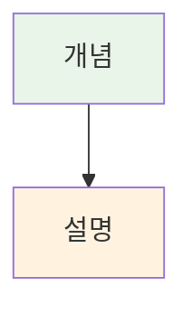
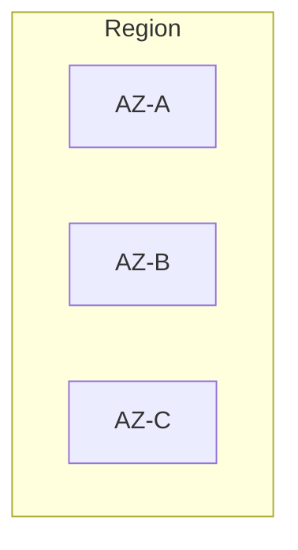
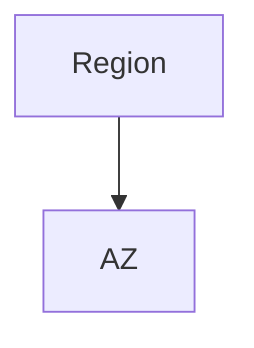

# 시각화 우선순위 규칙

## 🎯 시각화 우선순위 (중요!)

모든 Session, Lab, Challenge 작성 시 다음 우선순위를 따릅니다.

## ⚠️ 필수 검증 절차 (모든 이미지/아이콘 사용 전)

### 1. AWS Asset Icons 검증
```bash
# 파일 존재 확인
ls Asset-Package_01312023.../Arch_[Category]/64/Arch_[Service-Name]_64.svg
```

### 2. MCP 공식 이미지 검증
```bash
# 1. MCP로 문서 읽기
aws___read_documentation(url)

# 2. 이미지 URL 추출
# 3. 브라우저에서 직접 접근 테스트
# 4. 접근 가능한 경우에만 사용
```

### 3. 검증 실패 시
- 아이콘 없음 → 대체 아이콘 찾기
- 이미지 접근 불가 → Mermaid 다이어그램 사용
- 불확실 → 텍스트만 사용

## 1순위: AWS Asset Icons (Week 5 전용)

**Week 5 (AWS 집중 과정)에서는 AWS Asset Icons 적극 활용**

**참조**: [AWS Asset Icons 사용 규칙](./aws_asset_icons_usage.md)

```markdown
### 아키텍처 구성

**사용된 AWS 서비스**:
-  **Amazon EC2**: 가상 서버
-  **Amazon VPC**: 네트워크 격리
-  **Amazon RDS**: 관리형 데이터베이스
```

**활용 방법**:
1. **아키텍처 다이어그램**: 각 서비스 아이콘 배치
2. **서비스 설명**: 제목 옆에 아이콘 표시
3. **비교표**: 서비스 비교 시 아이콘 포함
4. **단계별 가이드**: 각 단계에서 사용하는 서비스 아이콘

**활용 방법**:
1. **아키텍처 다이어그램**: 각 서비스 아이콘 배치
2. **서비스 설명**: 제목 옆에 아이콘 표시
3. **비교표**: 서비스 비교 시 아이콘 포함
4. **단계별 가이드**: 각 단계에서 사용하는 서비스 아이콘

### 2순위: AWS/공식 이미지 (MCP에서 확인 가능 시)

```markdown

*출처: AWS 공식 문서*
```

### 2순위: AWS/공식 이미지 (MCP에서 확인 가능 시)

```markdown

*출처: AWS 공식 문서*
```

**사용 조건**:
- MCP 도구로 AWS 문서 읽을 때 이미지 URL 확인
- 공식 이미지가 존재하는 경우 **반드시 우선 사용**
- 공식 이미지가 가장 정확하고 최신 정보 반영
- 저작권 문제 없음

**MCP 워크플로우**:
```
1. aws___search_documentation("주제")
2. aws___read_documentation(URL)
3. 문서 내 이미지 URL 확인
4. 이미지 링크를 Session에 포함
```

**예시**:
```markdown
### 📐 AWS 글로벌 인프라


*출처: [AWS Global Infrastructure](https://aws.amazon.com/about-aws/global-infrastructure/)*

위 공식 다이어그램은 AWS의 Region, AZ, Edge Location 구조를 보여줍니다.
```

---

### 3순위: Mermaid 다이어그램 (공식 이미지 없을 시)



**사용 조건**:
- 공식 이미지가 없는 경우
- 커스터마이징이 필요한 경우
- 개념 설명을 위한 추가 다이어그램

**필수 사항**:
- 각 세션마다 최소 2-3개 필수
- 스타일은 개별 라인으로 분리 (쉼표 사용 금지)
- 표준 색상 팔레트 사용

---

### 4순위: 커스텀 SVG (복잡한 구조 필요 시)

```markdown

```

**사용 조건**:
- Mermaid로 표현하기 어려운 복잡한 구조
- 특별한 디자인이 필요한 경우

**저장 위치**:
```
theory/week_0n/images/
├── day1/
│   ├── session1_custom.svg
│   └── lab1_architecture.svg
├── day2/
└── ...
```

---

### 5순위: ASCII Art (간단한 구조)

```
┌─────────────────┐
│   간단한 구조   │
│                 │
│  ┌───┐  ┌───┐  │
│  │ A │→ │ B │  │
│  └───┘  └───┘  │
└─────────────────┘
```

**사용 조건**:
- 매우 간단한 구조
- 터미널에서도 확인 가능해야 할 때
- 빠른 스케치가 필요할 때

---

## ✅ 체크리스트

Session/Lab/Challenge 작성 시:
- [ ] **Week 5**: AWS Asset Icons 적극 활용
- [ ] MCP로 AWS 공식 문서 확인
- [ ] 공식 이미지 존재 여부 확인
- [ ] 공식 이미지 있으면 **2순위로 사용**
- [ ] 공식 이미지 없으면 Mermaid 다이어그램 작성
- [ ] 복잡한 구조는 SVG로 별도 제작
- [ ] 간단한 구조는 ASCII Art 활용

---

## 📝 실제 적용 예시

### 좋은 예시 ✅

```markdown
### 📐 AWS 글로벌 인프라

#### AWS 공식 아키텍처

*출처: AWS 공식 문서*

#### 상세 구조 (Mermaid로 보완)

```

### 나쁜 예시 ❌

```markdown
### 📐 AWS 글로벌 인프라

#### 직접 그린 다이어그램

```
(공식 이미지가 있는데 사용하지 않음)
```

---

**이 규칙은 모든 강의 자료 작성 시 필수로 적용됩니다.**
