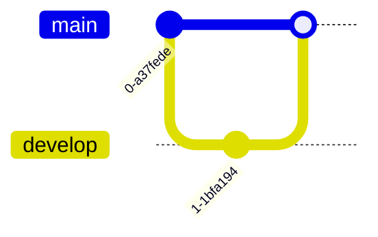

# 시각화 우선순위 규칙

## 🎯 시각화 우선순위 (중요!)

**필수 원칙**: 모든 개념은 텍스트 + 시각화 자료를 함께 제공

### 시각화 의무 사항
- **각 Session**: 최소 5-7개 다양한 차트 필수
- **각 Lab**: 최소 3-4개 아키텍처/프로세스 다이어그램
- **각 Challenge**: 최소 2-3개 시스템 구조도
- **모든 개념 설명**: 텍스트 설명 + 시각화 자료 병행

### 시각화 품질 기준
- ✅ **다양성**: 같은 차트 타입 반복 금지, 최소 5가지 이상 타입 사용
- ✅ **적합성**: 개념에 가장 적합한 차트 타입 선택
- ✅ **명확성**: 복잡한 개념을 단순하게 표현
- ✅ **일관성**: 색상, 스타일 표준 준수

모든 Session, Lab, Challenge 작성 시 다음 우선순위를 따릅니다.

## ⚠️ 필수 검증 절차 (모든 이미지/아이콘 사용 전)

### 1. AWS Asset Icons 검증
```bash
# 파일 존재 확인
ls Asset-Package_01312023.../Arch_[Category]/64/Arch_[Service-Name]_64.svg
```

### 2. MCP 공식 이미지 검증
```bash
# 1. MCP로 문서 읽기
aws___read_documentation(url)

# 2. 이미지 URL 추출
# 3. 브라우저에서 직접 접근 테스트
# 4. 접근 가능한 경우에만 사용
```

### 3. 검증 실패 시
- 아이콘 없음 → 대체 아이콘 찾기
- 이미지 접근 불가 → Mermaid 다이어그램 사용
- 불확실 → 텍스트만 사용

## 1순위: AWS Asset Icons (Week 5 전용)

**Week 5 (AWS 집중 과정)에서는 AWS Asset Icons 적극 활용**

**참조**: [AWS Asset Icons 사용 규칙](./aws_asset_icons_usage.md)

```markdown
### 아키텍처 구성

**사용된 AWS 서비스**:
-  **Amazon EC2**: 가상 서버
-  **Amazon VPC**: 네트워크 격리
-  **Amazon RDS**: 관리형 데이터베이스
```

**활용 방법**:
1. **아키텍처 다이어그램**: 각 서비스 아이콘 배치
2. **서비스 설명**: 제목 옆에 아이콘 표시
3. **비교표**: 서비스 비교 시 아이콘 포함
4. **단계별 가이드**: 각 단계에서 사용하는 서비스 아이콘

**활용 방법**:
1. **아키텍처 다이어그램**: 각 서비스 아이콘 배치
2. **서비스 설명**: 제목 옆에 아이콘 표시
3. **비교표**: 서비스 비교 시 아이콘 포함
4. **단계별 가이드**: 각 단계에서 사용하는 서비스 아이콘

### 2순위: AWS/공식 이미지 (MCP에서 확인 가능 시)

```markdown

*출처: AWS 공식 문서*
```

### 2순위: AWS/공식 이미지 (MCP에서 확인 가능 시)

```markdown

*출처: AWS 공식 문서*
```

**사용 조건**:
- MCP 도구로 AWS 문서 읽을 때 이미지 URL 확인
- 공식 이미지가 존재하는 경우 **반드시 우선 사용**
- 공식 이미지가 가장 정확하고 최신 정보 반영
- 저작권 문제 없음

**MCP 워크플로우**:
```
1. aws___search_documentation("주제")
2. aws___read_documentation(URL)
3. 문서 내 이미지 URL 확인
4. 이미지 링크를 Session에 포함
```

**예시**:
```markdown
### 📐 AWS 글로벌 인프라


*출처: [AWS Global Infrastructure](https://aws.amazon.com/about-aws/global-infrastructure/)*

위 공식 다이어그램은 AWS의 Region, AZ, Edge Location 구조를 보여줍니다.
```

---

### 3순위: Mermaid 다이어그램 (공식 이미지 없을 시)

**필수 사항**:
- **각 세션마다 최소 5-7개 다양한 차트 사용**
- 스타일은 개별 라인으로 분리 (쉼표 사용 금지)
- 표준 색상 팔레트 사용
- **개념에 가장 적합한 차트 타입 선택**

#### 📊 Mermaid 차트 타입별 활용 가이드

##### 1. **Architecture Diagram** (아키텍처 구조)


**사용 시기**:
- 시스템 아키텍처 설명
- 인프라 구조 표현
- 서비스 간 물리적 배치

**⚠️ 중요 규칙**:
- **특수문자 금지**: `:`, `-`, `/` 등 특수문자 사용 금지
- **대괄호 내 텍스트**: 영문 또는 한글만 사용, 특수문자 제거
- **간결한 이름**: 긴 이름은 축약 (Internet Gateway → IGW)
- **IP 주소 제거**: 가독성을 위해 IP 주소는 별도 설명으로

**올바른 예시**:


**잘못된 예시**:


##### 2. **Timeline** (시간 흐름)


**사용 시기**:
- 기술 진화 과정
- 단계별 발전 설명
- 역사적 맥락 제공

##### 3. **Quadrant Chart** (4분면 분석)


**사용 시기**:
- 의사결정 매트릭스
- 비교 분석
- 우선순위 결정

**⚠️ 주의**: title, axis, quadrant, 데이터 포인트 모두 영문 사용 필수

##### 4. **Mind Map** (마인드맵)


**사용 시기**:
- 개념 분류
- 계층 구조 표현
- 브레인스토밍 결과

##### 5. **State Diagram** (상태 전이)


**사용 시기**:
- 프로세스 흐름
- 상태 변화 과정
- 워크플로우 설명

##### 6. **Sequence Diagram** (시퀀스)


**사용 시기**:
- 시스템 간 통신
- API 호출 흐름
- 시간 순서 중요한 프로세스

##### 7. **Sankey Diagram** (흐름 분석)
```mermaid
sankey-beta
소스,대상1,10
소스,대상2,20
대상1,최종,10
```

**사용 시기**:
- 데이터 흐름
- 리소스 분배
- 비율 시각화

##### 8. **Git Graph** (버전 관리)


**사용 시기**:
- Git 워크플로우
- 브랜치 전략
- 배포 프로세스

##### 9. **Pie Chart** (비율)


**사용 시기**:
- 비율 표현
- 시장 점유율
- 리소스 분배

##### 10. **Class Diagram** (클래스 구조)


**사용 시기**:
- 객체 관계
- 시스템 설계
- 데이터 모델

##### 11. **ER Diagram** (데이터베이스)


**사용 시기**:
- 데이터베이스 설계
- 엔티티 관계
- 데이터 모델링

##### 12. **Journey** (사용자 여정)


**사용 시기**:
- 사용자 경험 흐름
- 고객 여정 맵
- 프로세스 만족도

#### 🎯 차트 선택 가이드

| 표현 목적 | 추천 차트 | 예시 |
|----------|----------|------|
| **구조/아키텍처** | Architecture, Graph | 시스템 구조, 인프라 배치 |
| **시간 흐름** | Timeline, Sequence | 기술 진화, API 호출 순서 |
| **비교 분석** | Quadrant, Pie | 기술 선택, 시장 점유율 |
| **계층 구조** | Mind Map, Class | 개념 분류, 객체 관계 |
| **상태 변화** | State, Journey | 프로세스 흐름, 사용자 경험 |
| **데이터 흐름** | Sankey, Sequence | 리소스 분배, 통신 과정 |
| **관계 표현** | ER, Class | 데이터베이스, 시스템 설계 |

#### 📋 Session별 차트 구성 예시

**Session 1 (기초 개념)**:
1. Architecture - 전체 시스템 구조
2. Timeline - 기술 발전 과정
3. Mind Map - 핵심 개념 분류
4. Quadrant - 기술 선택 기준
5. Pie - 시장 현황

**Session 2 (심화 내용)**:
1. Sequence - 동작 원리
2. State - 상태 전이
3. Sankey - 데이터 흐름
4. Class - 구조 설계
5. ER - 데이터 관계

**Session 3 (통합 정리)**:
1. Architecture - 통합 아키텍처
2. Journey - 전체 프로세스
3. Git Graph - 배포 전략
4. Mind Map - 종합 정리
5. Quadrant - 의사결정 매트릭스

---

### 4순위: 커스텀 SVG (복잡한 구조 필요 시)

```markdown

```

**사용 조건**:
- Mermaid로 표현하기 어려운 복잡한 구조
- 특별한 디자인이 필요한 경우

**저장 위치**:
```
theory/week_0n/images/
├── day1/
│   ├── session1_custom.svg
│   └── lab1_architecture.svg
├── day2/
└── ...
```

---

### 5순위: ASCII Art (간단한 구조)

```
┌─────────────────┐
│   간단한 구조   │
│                 │
│  ┌───┐  ┌───┐  │
│  │ A │→ │ B │  │
│  └───┘  └───┘  │
└─────────────────┘
```

**사용 조건**:
- 매우 간단한 구조
- 터미널에서도 확인 가능해야 할 때
- 빠른 스케치가 필요할 때

---

## ✅ 체크리스트

Session/Lab/Challenge 작성 시:
- [ ] **Week 5**: AWS Asset Icons 적극 활용
- [ ] MCP로 AWS 공식 문서 확인
- [ ] 공식 이미지 존재 여부 확인
- [ ] 공식 이미지 있으면 **2순위로 사용**
- [ ] 공식 이미지 없으면 Mermaid 다이어그램 작성
- [ ] 복잡한 구조는 SVG로 별도 제작
- [ ] 간단한 구조는 ASCII Art 활용

---

## 📝 실제 적용 예시

### 좋은 예시 ✅

```markdown
### 📐 AWS 글로벌 인프라

#### AWS 공식 아키텍처

*출처: AWS 공식 문서*

#### 상세 구조 (Mermaid로 보완)

```

### 나쁜 예시 ❌

```markdown
### 📐 AWS 글로벌 인프라

#### 직접 그린 다이어그램

```
(공식 이미지가 있는데 사용하지 않음)
```

---

**이 규칙은 모든 강의 자료 작성 시 필수로 적용됩니다.**
