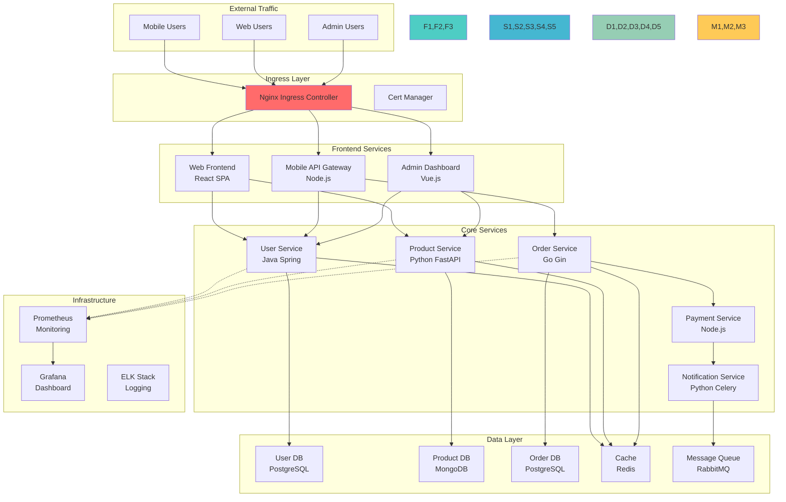
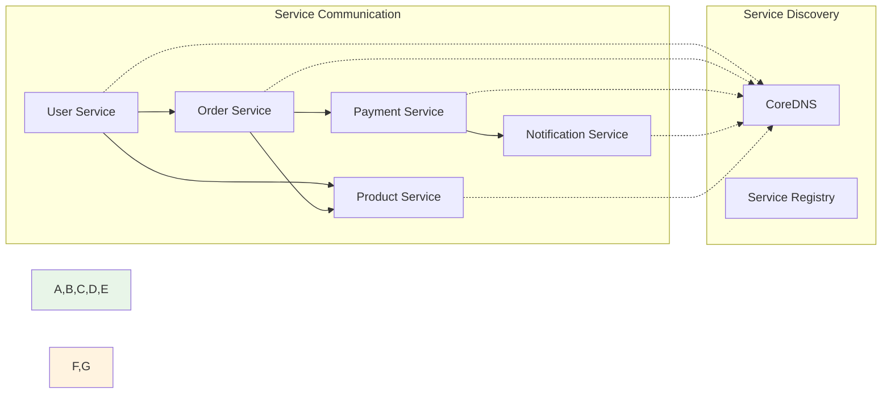

# Challenge 템플릿 예제: 마이크로서비스 플랫폼 구축

## Challenge 1: "E-Commerce 마이크로서비스 플랫폼 장애 복구" (90분)

### 🎯 Challenge 목표
**시나리오**: 
급성장하는 E-Commerce 스타트업 "CloudMart"가 Kubernetes 기반 마이크로서비스로 전환했지만, 
Black Friday 세일 준비 중 여러 시스템 장애가 발생했습니다. 
DevOps 엔지니어로서 시스템을 복구하고 안정화해야 합니다.

### 🏗️ 시스템 아키텍처



### 🔧 구현 요구사항

#### 1. 네임스페이스 구조
```yaml
# 네임스페이스 분리 전략
Namespaces:
- frontend: 사용자 인터페이스 서비스들
- backend: 핵심 비즈니스 로직 서비스들  
- data: 데이터베이스 및 스토리지 서비스들
- monitoring: 모니터링 및 로깅 시스템
- ingress-system: Ingress Controller 및 관련 서비스
```

#### 2. 서비스 메시 구성


#### 3. 데이터 영속성 전략
```yaml
Storage Requirements:
- User DB: 고가용성 PostgreSQL (Primary-Replica)
- Product DB: 샤딩된 MongoDB 클러스터
- Order DB: 트랜잭션 보장 PostgreSQL
- Cache: Redis Cluster (3 Master + 3 Replica)
- Message Queue: RabbitMQ HA 클러스터
```

### ⚠️ 의도적 오류 시나리오

#### 시나리오 1: 클러스터 컴포넌트 장애 (25분)
**상황**: API Server가 응답하지 않고 kubectl 명령어가 실행되지 않음

```yaml
# 의도적 오류: API Server 설정 파일
apiVersion: v1
kind: Pod
metadata:
  name: kube-apiserver
  namespace: kube-system
spec:
  containers:
  - name: kube-apiserver
    image: k8s.gcr.io/kube-apiserver:v1.25.0
    command:
    - kube-apiserver
    - --advertise-address=192.168.1.100
    - --etcd-servers=https://127.0.0.1:2380  # 잘못된 포트
    - --secure-port=6444                      # 잘못된 포트
    - --service-cluster-ip-range=10.96.0.0/12
```

**증상**:
- kubectl 명령어 타임아웃
- 모든 API 요청 실패
- 새로운 Pod 생성 불가

**해결 과정**:
1. 마스터 노드 SSH 접속
2. API Server 로그 확인: `journalctl -u kubelet`
3. 설정 파일 수정: `/etc/kubernetes/manifests/kube-apiserver.yaml`
4. 올바른 ETCD 포트(2379)와 API Server 포트(6443) 설정
5. kubelet 재시작 및 상태 확인

#### 시나리오 2: 네트워킹 장애 (25분)
**상황**: 서비스 간 통신이 불가능하고 DNS 해결이 실패함

```yaml
# 의도적 오류: 잘못된 Service 설정
apiVersion: v1
kind: Service
metadata:
  name: user-service
  namespace: backend
spec:
  type: ClusterIP
  ports:
  - port: 8080
    targetPort: 3000  # 잘못된 타겟 포트
  selector:
    app: user-service
    version: v2       # 존재하지 않는 버전 라벨
---
apiVersion: v1
kind: Service
metadata:
  name: product-service
  namespace: backend
spec:
  type: ClusterIP
  ports:
  - port: 8080
    targetPort: 8080
  selector:
    app: wrong-product-service  # 잘못된 셀렉터
```

**증상**:
- 서비스 간 HTTP 요청 실패
- DNS 해결 오류 (NXDOMAIN)
- Endpoint가 비어있음

**해결 과정**:
1. Service와 Pod 라벨 매칭 확인
2. Endpoint 상태 점검: `kubectl get endpoints`
3. DNS 해결 테스트: `nslookup` Pod 실행
4. 네트워크 정책 확인
5. 올바른 포트 매핑 설정

#### 시나리오 3: 스토리지 장애 (20분)
**상황**: 데이터베이스 Pod들이 시작되지 않고 PVC가 Pending 상태

```yaml
# 의도적 오류: 불가능한 스토리지 요청
apiVersion: v1
kind: PersistentVolumeClaim
metadata:
  name: postgres-data
  namespace: data
spec:
  accessModes:
  - ReadWriteOnce
  resources:
    requests:
      storage: 10Ti  # 사용 불가능한 용량
  storageClassName: fast-ssd-nonexistent  # 존재하지 않는 StorageClass
---
apiVersion: v1
kind: PersistentVolumeClaim
metadata:
  name: mongodb-data
  namespace: data
spec:
  accessModes:
  - ReadWriteMany  # MongoDB에 부적절한 액세스 모드
  resources:
    requests:
      storage: 100Gi
  storageClassName: standard
```

**증상**:
- PVC가 Pending 상태로 고정
- 데이터베이스 Pod가 ContainerCreating 상태
- 볼륨 마운트 실패 오류

**해결 과정**:
1. StorageClass 목록 확인: `kubectl get storageclass`
2. PV 가용성 점검: `kubectl get pv`
3. 적절한 스토리지 크기로 수정
4. 올바른 액세스 모드 설정
5. 동적 프로비저닝 확인

#### 시나리오 4: 애플리케이션 배포 장애 (20분)
**상황**: 새로운 버전 배포 후 서비스가 불안정하고 롤백이 필요함

```yaml
# 의도적 오류: 잘못된 Deployment 설정
apiVersion: apps/v1
kind: Deployment
metadata:
  name: order-service
  namespace: backend
spec:
  replicas: 5
  strategy:
    type: RollingUpdate
    rollingUpdate:
      maxUnavailable: 100%  # 모든 Pod 동시 제거
      maxSurge: 0%
  selector:
    matchLabels:
      app: order-service
  template:
    metadata:
      labels:
        app: order-service
        version: v2.1
    spec:
      containers:
      - name: order-service
        image: order-service:v2.1-broken  # 버그가 있는 이미지
        ports:
        - containerPort: 8080
        resources:
          requests:
            cpu: 2000m      # 과도한 CPU 요청
            memory: 4Gi     # 과도한 메모리 요청
        livenessProbe:
          httpGet:
            path: /health
            port: 8080
          initialDelaySeconds: 5
          periodSeconds: 5
          timeoutSeconds: 1   # 너무 짧은 타임아웃
        readinessProbe:
          httpGet:
            path: /ready
            port: 8080
          initialDelaySeconds: 5
          periodSeconds: 5
```

**증상**:
- 서비스 완전 중단 (모든 Pod 동시 제거)
- 새 Pod들이 스케줄링되지 않음 (리소스 부족)
- 헬스체크 실패로 Pod 재시작 반복

**해결 과정**:
1. Deployment 히스토리 확인: `kubectl rollout history`
2. 이전 버전으로 롤백: `kubectl rollout undo`
3. 리소스 요청량 적절히 조정
4. 롤링 업데이트 전략 수정
5. 헬스체크 설정 최적화

### 🎯 성공 기준

#### 기능적 요구사항
- [ ] 모든 서비스가 정상적으로 통신
- [ ] 외부에서 웹사이트 접근 가능
- [ ] 데이터베이스 연결 및 데이터 영속성 확보
- [ ] 모니터링 대시보드에서 모든 메트릭 수집

#### 성능 요구사항
- [ ] API 응답 시간 < 200ms
- [ ] 서비스 가용성 > 99.9%
- [ ] 동시 사용자 1000명 처리 가능
- [ ] 데이터베이스 쿼리 성능 최적화

#### 보안 요구사항
- [ ] HTTPS 인증서 자동 갱신
- [ ] 서비스 간 통신 암호화
- [ ] 민감 정보 Secret으로 관리
- [ ] 네트워크 정책으로 트래픽 제어

### 🏆 도전 과제 (보너스)

#### 고급 기능 구현 (+20점)
1. **카나리 배포**: 새 버전을 10%의 트래픽으로 테스트
2. **서킷 브레이커**: 장애 서비스 자동 차단 및 복구
3. **분산 추적**: Jaeger를 이용한 요청 추적
4. **자동 스케일링**: HPA로 트래픽 기반 확장

#### 창의적 해결책 (+10점)
1. **비용 최적화**: Spot Instance 활용 전략
2. **장애 시뮬레이션**: Chaos Engineering 도구 적용
3. **성능 최적화**: 캐싱 전략 및 CDN 연동
4. **운영 자동화**: GitOps 파이프라인 구축

### 📊 평가 매트릭스

| 영역 | 기본 (60%) | 우수 (80%) | 탁월 (100%) |
|------|------------|------------|--------------|
| **문제 해결** | 기본 오류 수정 | 근본 원인 분석 | 예방 대책 수립 |
| **아키텍처** | 요구사항 충족 | 확장성 고려 | 최적화 적용 |
| **보안** | 기본 보안 설정 | 심화 보안 정책 | 제로 트러스트 |
| **모니터링** | 기본 메트릭 수집 | 커스텀 대시보드 | 예측적 알림 |
| **협업** | 개별 작업 완료 | 팀 내 지식 공유 | 전체 팀 멘토링 |

### 💡 힌트 및 팁

**디버깅 체크리스트**:
1. **클러스터 상태**: `kubectl cluster-info`, `kubectl get nodes`
2. **Pod 상태**: `kubectl get pods --all-namespaces`
3. **서비스 연결**: `kubectl get svc`, `kubectl get endpoints`
4. **로그 확인**: `kubectl logs`, `journalctl -u kubelet`
5. **리소스 사용량**: `kubectl top nodes`, `kubectl top pods`

**문제 해결 순서**:
1. 증상 파악 및 영향 범위 확인
2. 로그 분석을 통한 근본 원인 추적
3. 임시 해결책으로 서비스 복구
4. 근본적 해결책 적용
5. 재발 방지 대책 수립

이 Challenge를 통해 실제 운영 환경에서 발생할 수 있는 복합적인 문제 상황을 경험하고, 
체계적인 문제 해결 능력을 기를 수 있습니다! 🚀