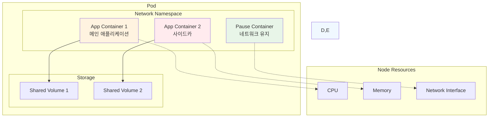
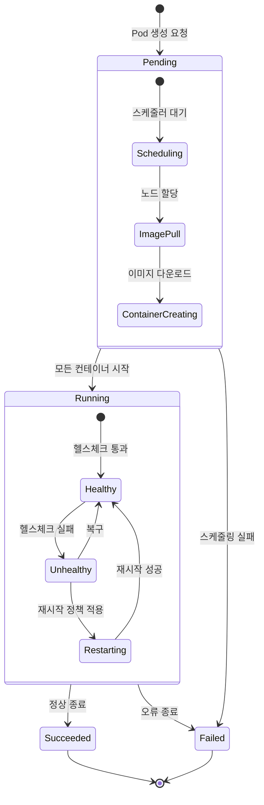
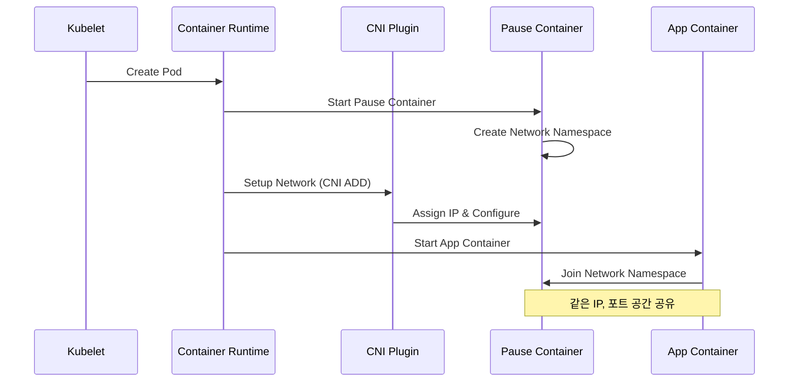

# Session 템플릿 예제: Pod 개념과 동작 원리

## Session 1: Pod 아키텍처 & 생명주기 (50분)

### 🎯 필수 요소
- **Pod 설계 철학**: 왜 컨테이너가 아닌 Pod인가?
- **Pod 내부 구조**: Pause 컨테이너와 애플리케이션 컨테이너
- **Pod 생명주기**: 생성부터 삭제까지의 전체 과정
- **Pod 네트워킹**: IP 할당과 포트 공유 메커니즘

### 🔍 핵심 설명

**Pod - 최소 배포 단위의 설계 철학**:


**Pod 생명주기 상세 동작**:


**Pod 네트워킹 동작 원리**:


**동작 원리 상세**:

1. **Pod 생성 초기화**:
   - Kubelet이 Pod 스펙을 받아 Container Runtime에 전달
   - Pause 컨테이너가 먼저 생성되어 네트워크 네임스페이스 확보
   - CNI 플러그인이 IP 할당 및 네트워크 설정 수행

2. **컨테이너 시작 과정**:
   - 애플리케이션 컨테이너들이 Pause 컨테이너의 네트워크 네임스페이스 공유
   - 볼륨 마운트 설정에 따라 스토리지 공유 구성
   - 각 컨테이너의 헬스체크 및 라이프사이클 훅 실행

3. **런타임 관리**:
   - Kubelet이 주기적으로 Pod 상태 모니터링
   - 컨테이너 재시작 정책에 따른 장애 복구
   - 리소스 사용량 추적 및 제한 적용

**사용 예제**:

```yaml
# 기본 단일 컨테이너 Pod
apiVersion: v1
kind: Pod
metadata:
  name: simple-web
  labels:
    app: web
    tier: frontend
spec:
  containers:
  - name: web-server
    image: nginx:1.20
    ports:
    - containerPort: 80
      name: http
    resources:
      requests:
        cpu: 100m
        memory: 128Mi
      limits:
        cpu: 500m
        memory: 512Mi
```

```yaml
# 사이드카 패턴 멀티 컨테이너 Pod
apiVersion: v1
kind: Pod
metadata:
  name: web-with-sidecar
  labels:
    app: web
    pattern: sidecar
spec:
  containers:
  # 메인 애플리케이션 컨테이너
  - name: web-app
    image: nginx:1.20
    ports:
    - containerPort: 80
    volumeMounts:
    - name: shared-logs
      mountPath: /var/log/nginx
    
  # 로그 수집 사이드카 컨테이너
  - name: log-collector
    image: fluent/fluent-bit:1.8
    volumeMounts:
    - name: shared-logs
      mountPath: /var/log/nginx
      readOnly: true
    - name: fluent-config
      mountPath: /fluent-bit/etc
  
  volumes:
  - name: shared-logs
    emptyDir: {}
  - name: fluent-config
    configMap:
      name: fluent-bit-config
```

```yaml
# 초기화 컨테이너 패턴
apiVersion: v1
kind: Pod
metadata:
  name: web-with-init
spec:
  initContainers:
  # 데이터베이스 연결 대기
  - name: wait-for-db
    image: busybox:1.35
    command: ['sh', '-c']
    args:
    - |
      until nc -z database-service 5432; do
        echo "Waiting for database..."
        sleep 2
      done
      echo "Database is ready!"
  
  # 설정 파일 다운로드
  - name: download-config
    image: alpine/curl:latest
    command: ['sh', '-c']
    args:
    - |
      curl -o /shared/app-config.json \
           https://config-server/api/config
    volumeMounts:
    - name: config-volume
      mountPath: /shared
  
  containers:
  - name: web-app
    image: my-app:v1.0
    volumeMounts:
    - name: config-volume
      mountPath: /app/config
  
  volumes:
  - name: config-volume
    emptyDir: {}
```

### 🎉 Fun Facts & 기업 사례

**기술적 재미**:
- **Pod 어원**: 고래 떼(Pod of whales)에서 유래, Docker의 고래 로고와 연결
- **Pause 컨테이너**: 실제로는 단 몇 KB 크기의 초경량 컨테이너
- **네트워크 마법**: 같은 Pod 내 컨테이너들은 localhost로 통신 가능
- **IP 절약**: 하나의 Pod = 하나의 IP로 IP 주소 효율적 사용

**Netflix 사례**:
- **문제 상황**: 마이크로서비스 간 로그 수집과 메트릭 전송의 복잡성
- **해결 방법**: 사이드카 패턴으로 각 애플리케이션 Pod에 로그 수집기 배치
- **결과**: 애플리케이션 코드 변경 없이 통합 로깅 시스템 구축
- **교훈**: 관심사 분리를 통한 시스템 복잡도 감소

**Spotify 사례**:
- **문제 상황**: 음악 스트리밍 서비스의 캐시 워밍업 시간 단축 필요
- **해결 방법**: Init Container로 캐시 데이터 사전 로딩
- **결과**: 서비스 시작 시간 70% 단축, 사용자 경험 개선
- **교훈**: Init Container를 활용한 애플리케이션 시작 최적화

**Airbnb 사례**:
- **문제 상황**: 다양한 언어로 작성된 마이크로서비스의 보안 정책 적용
- **해결 방법**: 보안 프록시를 사이드카로 배치하여 모든 트래픽 검사
- **결과**: 언어별 보안 라이브러리 개발 없이 통합 보안 정책 적용
- **교훈**: 사이드카 패턴으로 횡단 관심사(Cross-cutting Concerns) 해결

**업계 통계**:
- **Pod 평균 수명**: 프로덕션 환경에서 평균 2-3일 (Netflix 기준)
- **컨테이너 비율**: 단일 컨테이너 Pod 85%, 멀티 컨테이너 Pod 15%
- **재시작 빈도**: 정상 운영 시 Pod 재시작률 0.1% 미만
- **리소스 효율**: 사이드카 패턴 사용 시 메모리 오버헤드 평균 5-10%

**Google 내부 데이터**:
- **Borg 경험**: 15년간 수십억 개의 컨테이너 운영 경험이 Pod 설계에 반영
- **장애 복구**: Pod 재시작을 통한 자동 복구율 99.9%
- **스케일링**: 단일 클러스터에서 최대 15,000개 노드, 300,000개 Pod 운영
- **효율성**: Pod 단위 스케줄링으로 리소스 활용률 70% 이상 달성

### 💡 실무 팁

**Pod 설계 베스트 프랙티스**:
1. **단일 책임 원칙**: 하나의 Pod는 하나의 주요 기능만 담당
2. **사이드카 활용**: 로깅, 모니터링, 보안 등은 사이드카로 분리
3. **리소스 설정**: 항상 requests와 limits 설정으로 안정성 확보
4. **헬스체크**: liveness와 readiness probe로 장애 대응 자동화

**흔한 실수와 해결책**:
- **실수**: 여러 애플리케이션을 하나의 Pod에 배치
- **해결**: 각 애플리케이션을 별도 Pod로 분리하여 독립적 확장 가능
- **실수**: 사이드카 컨테이너의 리소스 제한 미설정
- **해결**: 사이드카도 적절한 리소스 제한으로 메인 앱 영향 방지