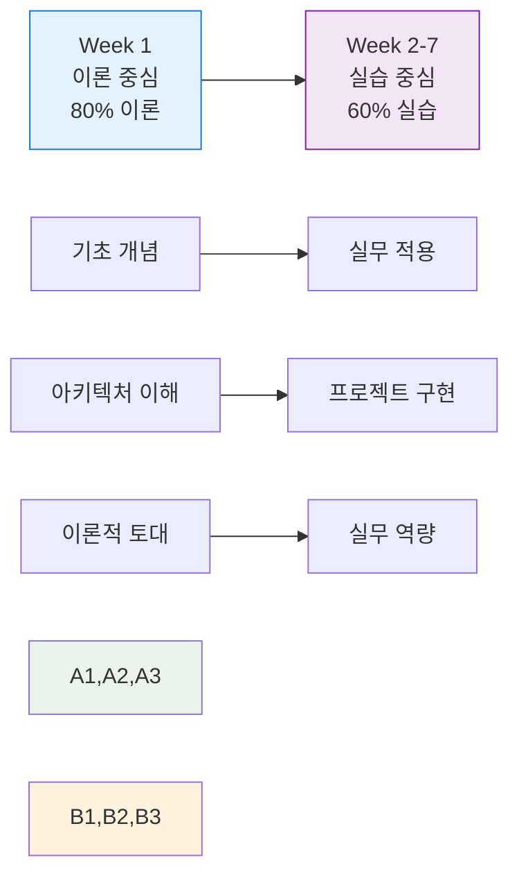

# 🚀 DevOps Engineer 7주 완성 과정

<div align="center">

**🎓 현대 소프트웨어 개발의 필수 역량** • **DevOps 문화와 기술의 체계적 학습**

*이론적 토대부터 실무 적용까지, 7주간의 집중 학습 여정*


</div>

---

## 📚 과정 소개

> **현대 소프트웨어 개발의 필수 역량인 DevOps 문화와 기술을 체계적으로 학습하는 7주 집중 과정**

🌟 **특징**: 이론적 토대 구축 → 실무 중심 실습 → 프로젝트 완성

## 🎯 학습 목표

| 영역 | 학습 목표 | 성취 수준 |
|------|-----------|----------|
| 🏢 **DevOps 문화** | 문화와 철학 완전 이해 | 전문가 수준 |
| 🐳 **Docker** | 컨테이너 기술 마스터 | 실무 적용 가능 |
| ⚙️ **Kubernetes** | 오케스트레이션 활용 | 클러스터 관리 가능 |
| 🔄 **CI/CD** | 파이프라인 구축 | 자동화 시스템 구축 |
| 🏢 **IaC** | Infrastructure as Code 실무 적용 | 인프라 자동화 |
| 🔮 **트렌드** | 최신 DevOps 트렌드 습득 | 미래 기술 대비 |

## 📅 과정 구성

```mermaid
gantt
    title DevOps Engineer 7주 과정
    dateFormat  X
    axisFormat %s
    
    section Week 1
    DevOps 기초 + Docker 이론    :w1, 0, 1
    
    section Week 2-7
    Docker 심화 + 실습           :w2, 1, 2
    Kubernetes 아키텍처        :w3, 2, 3
    CI/CD 파이프라인          :w4, 3, 4
    Infrastructure as Code    :w5, 4, 5
    클라우드 보안             :w6, 5, 6
    AWS 통합 + 프로젝트        :w7, 6, 7
```



| 항목 | 내용 | 비고 |
|------|------|------|
| 🕰️ **총 기간** | 7주 (280시간) | 집중 학습 과정 |
| ⏰ **주당 시간** | 40시간 (8시간/일 × 5일) | 전일제 과정 |
| 📚 **세션 구성** | 50분 수업 + 10분 휴식 | 효율적 학습 리듬 |

## 🔄 학습 방식 개편

<div align="center">

### 🎓 **이론 → 실습 단계적 학습**

</div>



| 단계 | 학습 방식 | 비중 | 특징 |
|------|-----------|------|------|
| 🎓 **Week 1** | 이론 중심 | 80% 이론 + 20% 개념 예시 | 토대 구축 |
| 🛠️ **Week 2-7** | 실습 중심 | 40% 이론 + 60% 실습 | 실무 역량 |

## 📖 주차별 커리큘럼 (7주 이론 과정)

### [Week 1: DevOps 기초 및 Docker 이론](./week_01/README.md) ✅ 완성
- **학습 방식**: 이론 80% + 개념 예시 20%
- DevOps 개념과 문화 철학
- 컨테이너 기술 이론적 배경
- Docker 아키텍처 및 구조 분석
- 네트워킹, 스토리지, 보안 이론

### [Week 2: Docker 심화 이론 및 컨테이너 생태계](./week_02/README.md) 🔄 재구성 중
- **학습 방식**: 이론 80% + 개념 예시 20%
- Docker 고급 개념 및 최적화 이론
- 컨테이너 오케스트레이션 개념
- Docker Compose 아키텍처 분석
- 컨테이너 보안 및 모범 사례

### [Week 3: Kubernetes 아키텍처 및 핵심 개념](./week_03/README.md) 🆕 신규 구성
- **학습 방식**: 이론 80% + 개념 예시 20%
- Kubernetes 아키텍처 심화 분석
- 핵심 오브젝트 (Pod, Service, Deployment) 이론
- 클러스터 네트워킹 및 스토리지 개념
- 스케줄링 및 리소스 관리 이론

### [Week 4: CI/CD 파이프라인 이론 및 설계](./week_04/README.md) 🆕 신규 구성
- **학습 방식**: 이론 80% + 개념 예시 20%
- CI/CD 개념 및 파이프라인 설계 원리
- Git 워크플로우 및 브랜치 전략
- 테스트 자동화 이론 및 전략
- 배포 패턴 및 릴리스 관리

### [Week 5: Infrastructure as Code 및 클라우드 네이티브](./week_05/README.md) 🆕 신규 구성
- **학습 방식**: 이론 80% + 개념 예시 20%
- IaC 개념 및 Terraform 아키텍처
- 클라우드 네이티브 설계 원칙
- 마이크로서비스 아키텍처 패턴
- 서비스 메시 및 API Gateway 이론

### [Week 6: 클라우드 보안 및 거버넌스](./week_06/README.md) 🆕 신규 구성
- **학습 방식**: 이론 80% + 개념 예시 20%
- DevSecOps 개념 및 보안 통합 전략
- 클라우드 보안 모델 및 컴플라이언스
- 접근 제어 및 권한 관리 (IAM)
- 보안 모니터링 및 감사 체계

### [Week 7: AWS Cloud 기초 및 DevOps 통합](./week_07/README.md) 🆕 신규 구성
- **학습 방식**: 이론 80% + 개념 예시 20%
- AWS 핵심 서비스 아키텍처 분석
- AWS DevOps 서비스 생태계
- 클라우드 비용 최적화 전략
- 미래 DevOps 트렌드 및 전망

## 🛠 실습 환경
- **운영체제**: Windows/Linux/macOS 지원
- **필수 도구**: Docker Desktop, kubectl, Terraform
- **클라우드**: AWS (실습용 계정 필요)
- **IDE**: VS Code 권장

## 📊 이론-실습 비율
```
Week 1: ████████████████████ 80% 이론 + ████████ 20% 예시
Week 2: ████████████ 40% 이론 + ████████████████████ 60% 실습
Week 3: ████████████ 40% 이론 + ████████████████████ 60% 실습
Week 4: ████████████ 40% 이론 + ████████████████████ 60% 실습
Week 5: ████████████ 40% 이론 + ████████████████████ 60% 실습
Week 6: ████████████ 40% 이론 + ████████████████████ 60% 실습
Week 7: ████████████ 40% 이론 + ████████████████████ 60% 실습
```

## 📋 평가 방법
- **Week 1**: 이론 과제 및 개념 토론 (100%)
- **Week 2-7**: 실습 과제 (40%) + 주간 프로젝트 (30%) + 최종 프로젝트 (30%)

## 🎓 수료 조건
- 출석률 80% 이상
- Week 1 이론 과제 완료
- Week 2-7 모든 실습 과제 완료
- 최종 프로젝트 발표

## 📚 참고 자료
- [Docker 공식 문서](https://docs.docker.com/)
- [Kubernetes 공식 문서](https://kubernetes.io/docs/)
- [Terraform 공식 문서](https://www.terraform.io/docs/)
- [AWS 문서](https://docs.aws.amazon.com/)

## 🔄 개편 사항
- **Week 1**: 완전한 이론 과정으로 재설계 완료
- **Week 2-7**: 실습 중심으로 재구성 필요
- **연결성**: Week 1 이론 → Week 2+ 실습 자연스러운 연결

---
*본 과정은 탄탄한 이론적 토대 위에 실무 중심의 DevOps 엔지니어 양성을 목표로 합니다.*