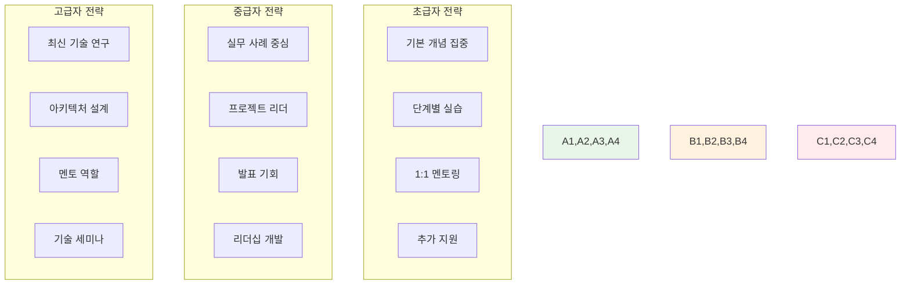
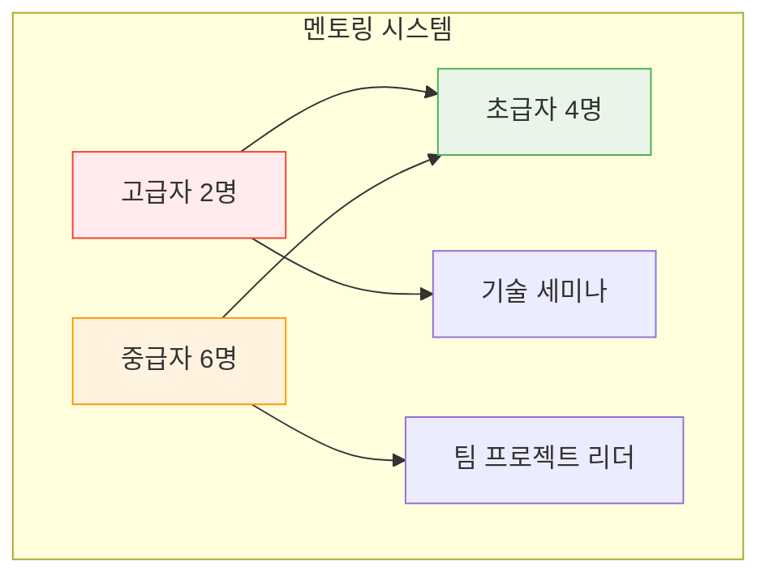

# 🚀 KT Cloud TECH UP 2025 - 클라우드 네이티브 과정

<div align="center">

**🎓 6주 이론 집중 과정** • **레벨별 맞춤 학습**

*DevOps 문화부터 클라우드 네이티브까지, 체계적 이론 학습*


</div>

---

## 🎯 과정 개요

> **현대 소프트웨어 개발의 필수 역량인 DevOps 문화와 클라우드 네이티브 기술을 체계적으로 학습하는 6주 집중 이론 과정**

### 📅 전체 교육 일정
```
📚 이론 기간: 2024.09.23 ~ 2024.10.31 (6주)
🛠️ 기본 프로젝트: 2024.11.03 ~ 2024.12.01 (4주)
🚀 심화 프로젝트: 2024.12.02 ~ 2025.01.08 (5주)
⚡ 해커톤: 2025.01.08 ~ 2025.01.13 (1주)
💼 실무 프로젝트: 2025.01.14 ~ 2025.04.20 (14주)
```

## 👥 학생 구성 및 레벨별 전략

### 📊 학생 레벨 분석
- **🟢 초급자 (4명)**: 개발 경험 부족, 기본 개념부터 체계적 학습 필요
- **🟡 중급자 (6명)**: 2-6년 개발 경험, 실무 적용 가능한 심화 학습 필요
- **🔴 고급자 (2명)**: 인프라/DevOps 경험, 최신 기술과 멘토링 역할

### 🎯 레벨별 학습 전략


## ⏰ 일일 8시간 교육 구조

### 📊 시간 배분 원칙
```
📚 이론 강의: 3시간 (37.5%)
🛠️ 기본 실습: 3시간 (37.5%)
👥 학생 케어: 2시간 (25%)
```

### 🗓️ 일일 스케줄
| 시간 | 구분 | 내용 | 비고 |
|------|------|------|------|
| **09:00-10:30** | 📚 이론 1 | 기본 개념 설명 (60분) + 질의응답 (30분) | 집중도 높은 오전 |
| **10:30-10:45** | ☕ 휴식 | 15분 휴식 | |
| **10:45-12:00** | 🛠️ 실습 1 | 개념 적용 실습 (60분) + 결과 공유 (15분) | |
| **12:00-13:00** | 🍽️ 점심 | 점심시간 | |
| **13:00-14:30** | 📚 이론 2 | 심화 개념 (60분) + 사례 분석 (30분) | |
| **14:30-14:45** | ☕ 휴식 | 15분 휴식 | |
| **14:45-16:30** | 🛠️ 실습 2 | 종합 실습 (90분) + 리뷰 (15분) | |
| **16:30-16:45** | ☕ 휴식 | 15분 휴식 | |
| **16:45-18:00** | 👥 케어 | 레벨별 개별 멘토링 | 맞춤형 지원 |

## 📚 6주 커리큘럼 구조

### Week 1-2: DevOps & Docker 기초
**목표**: 전체 학생 기본 개념 통일

#### [Week 1: DevOps 문화와 Docker 기초](./theory/week_01/README.md)
- Day 1: DevOps 개념 및 문화
- Day 2: 컨테이너 기술 이론  
- Day 3: Docker 아키텍처
- Day 4: Docker 이미지와 레지스트리
- Day 5: Docker 네트워킹과 스토리지

#### [Week 2: Docker 심화와 컨테이너 생태계](./theory/week_02/README.md)
- Day 1: Docker Compose와 멀티 컨테이너
- Day 2: 컨테이너 보안과 최적화
- Day 3: 컨테이너 모니터링과 로깅
- Day 4: 컨테이너 오케스트레이션 개념
- Day 5: Week 1-2 종합 정리

### Week 3-4: Kubernetes & 오케스트레이션
**목표**: 실무 핵심 기술 습득

#### [Week 3: Kubernetes 기초](./theory/week_03/README.md)
- Day 1: Kubernetes 아키텍처
- Day 2: Pod와 기본 오브젝트
- Day 3: Service와 네트워킹
- Day 4: Deployment와 ReplicaSet
- Day 5: ConfigMap과 Secret

#### [Week 4: Kubernetes 심화](./theory/week_04/README.md)
- Day 1: 스토리지와 PersistentVolume
- Day 2: Ingress와 로드밸런싱
- Day 3: 모니터링과 로깅
- Day 4: 보안과 RBAC
- Day 5: Week 3-4 종합 정리

### Week 5-6: CI/CD & 클라우드 네이티브
**목표**: 통합 시스템 이해

#### [Week 5: CI/CD 파이프라인](./theory/week_05/README.md)
- Day 1: CI/CD 개념과 도구
- Day 2: Git 워크플로우와 브랜치 전략
- Day 3: 빌드와 테스트 자동화
- Day 4: 컨테이너 기반 배포
- Day 5: GitOps와 선언적 배포

#### [Week 6: 클라우드 네이티브 통합](./theory/week_06/README.md)
- Day 1: 마이크로서비스 아키텍처
- Day 2: API Gateway와 서비스 메시
- Day 3: 관측성과 모니터링
- Day 4: 보안과 컴플라이언스
- Day 5: 6주 종합 정리 및 프로젝트 준비

## 🤝 협업 학습 시스템

### 👥 멘토링 구조


### 🔄 페어 프로그래밍
- **초급자 ↔ 중급자**: 지식 전수 및 상호 학습
- **정기 로테이션**: 주간 단위로 페어 변경
- **코드 리뷰**: 학습 결과물 상호 검토

## 📊 평가 및 피드백

### 📈 성공 지표
- **초급자**: 기본 개념 이해도 80% 이상
- **중급자**: 실무 시나리오 해결 90% 이상  
- **고급자**: 고급 토픽 완료 + 멘토링 만족도 4.5/5

### 🔄 피드백 시스템
- **일일 회고**: 10분 학습 회고
- **주간 조사**: 만족도 및 개선사항
- **멘토-멘티 피드백**: 상호 평가
- **실시간 조정**: 학습 속도 및 난이도 조절

## 🎯 다음 단계 준비

### 🛠️ 기본 프로젝트 (4주)
- **팀 구성**: 레벨 혼합 (초급 1-2명 + 중급 2명 + 고급 1명)
- **프로젝트**: 컨테이너 기반 웹 서비스 구축
- **목표**: 이론 지식의 실무 적용

### 🚀 심화 프로젝트 (5주)
- **트랙 분화**: 인프라/개발/기초 트랙
- **전문화**: 개별 관심사에 따른 심화 학습
- **포트폴리오**: 취업 연계 결과물 생성

---

<div align="center">

**🎓 체계적 이론 학습** • **🤝 협업 중심 교육** • **🚀 실무 연계 강화**

*6주간의 집중 이론 교육을 통해 클라우드 네이티브 전문가로 성장*

</div>