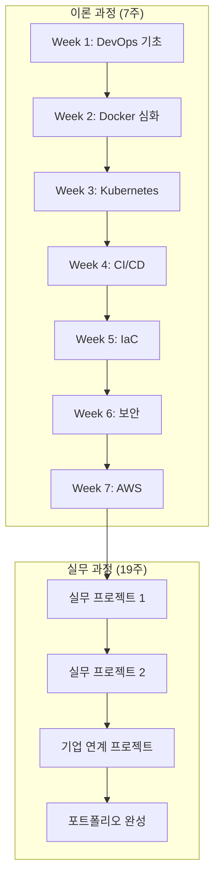

# DevOps Engineer 전체 과정 개요

## 📚 전체 과정 구조 (6개월)

### 🎓 **이론 과정 (7주) - 현재 구성 중**
DevOps와 클라우드 기술의 이론적 기초를 탄탄히 다지는 과정

### 💼 **실무 과정 (약 19주) - 향후 구성 예정**
실제 기업 프로젝트와 연계한 실무 중심 과정

---

## 📖 이론 과정 상세 (7주)

### **Week 1: DevOps 기초 및 Docker 이론** ✅ 완성
- **학습 방식**: 이론 80% + 개념 예시 20%
- **주요 내용**:
  - DevOps 문화와 조직 변화
  - 컨테이너 기술 이론적 배경
  - Docker 아키텍처 및 구조 분석
  - 네트워킹, 스토리지, 보안 이론

### **Week 2: Docker 심화 이론 및 컨테이너 생태계** 🔄 재구성 완료
- **학습 방식**: 이론 80% + 개념 예시 20%
- **주요 내용**:
  - Docker Engine 내부 아키텍처
  - 컨테이너 오케스트레이션 개념
  - Docker Compose 설계 원리
  - 컨테이너 보안 모델 및 모범 사례

### **Week 3: Kubernetes 아키텍처 및 핵심 개념** 🆕 신규 구성 예정
- **학습 방식**: 이론 80% + 개념 예시 20%
- **주요 내용**:
  - Kubernetes 클러스터 아키텍처 심화
  - 핵심 오브젝트 (Pod, Service, Deployment) 이론
  - 클러스터 네트워킹 및 스토리지 개념
  - 스케줄링 및 리소스 관리 이론

### **Week 4: CI/CD 파이프라인 이론 및 설계** 🆕 신규 구성 예정
- **학습 방식**: 이론 80% + 개념 예시 20%
- **주요 내용**:
  - CI/CD 개념 및 파이프라인 설계 원리
  - Git 워크플로우 및 브랜치 전략
  - 테스트 자동화 이론 및 전략
  - 배포 패턴 및 릴리스 관리

### **Week 5: Infrastructure as Code 및 클라우드 네이티브** 🆕 신규 구성 예정
- **학습 방식**: 이론 80% + 개념 예시 20%
- **주요 내용**:
  - IaC 개념 및 Terraform 아키텍처
  - 클라우드 네이티브 설계 원칙
  - 마이크로서비스 아키텍처 패턴
  - 서비스 메시 및 API Gateway 이론

### **Week 6: 클라우드 보안 및 거버넌스** 🆕 신규 구성 예정
- **학습 방식**: 이론 80% + 개념 예시 20%
- **주요 내용**:
  - DevSecOps 개념 및 보안 통합 전략
  - 클라우드 보안 모델 및 컴플라이언스
  - 접근 제어 및 권한 관리 (IAM)
  - 보안 모니터링 및 감사 체계

### **Week 7: AWS Cloud 기초 및 DevOps 통합** 🆕 신규 구성 예정
- **학습 방식**: 이론 80% + 개념 예시 20%
- **주요 내용**:
  - AWS 핵심 서비스 아키텍처 분석
  - AWS DevOps 서비스 생태계
  - 클라우드 비용 최적화 전략
  - 미래 DevOps 트렌드 및 전망

---

## 🎯 이론 과정 학습 목표

### **기술적 목표**
- DevOps 문화와 철학의 완전한 이해
- 컨테이너 및 오케스트레이션 기술 마스터
- CI/CD 파이프라인 설계 능력 배양
- 클라우드 네이티브 아키텍처 이해
- 보안 및 거버넌스 전략 수립 능력

### **실무적 목표**
- 엔터프라이즈급 DevOps 전략 수립
- 기술 의사결정 능력 향상
- 아키텍처 설계 및 검토 역량
- 팀 리딩 및 기술 전파 능력

---

## 📊 이론-실무 연계 구조

---

## 🛠 학습 환경 및 도구

### **이론 과정 도구**
- **시각화**: Mermaid 다이어그램, 아키텍처 분석
- **사례 연구**: 실제 기업 사례 분석
- **설계 실습**: 아키텍처 설계 및 토론
- **개념 검증**: 이해도 확인 퀴즈 및 토론

### **실무 과정 도구 (예정)**
- **클라우드 환경**: AWS, Azure, GCP
- **개발 도구**: Docker, Kubernetes, Terraform
- **CI/CD 도구**: Jenkins, GitHub Actions, GitLab CI
- **모니터링**: Prometheus, Grafana, ELK Stack

---

## 📋 평가 및 인증

### **이론 과정 평가**
- **주간 평가**: 이론 이해도 테스트 (40%)
- **설계 과제**: 아키텍처 설계 과제 (35%)
- **사례 분석**: 기업 사례 분석 리포트 (25%)

### **실무 과정 평가 (예정)**
- **프로젝트 결과물**: 실제 구현 결과 (50%)
- **코드 품질**: 코드 리뷰 및 베스트 프랙티스 (30%)
- **발표 및 문서화**: 기술 발표 및 문서 작성 (20%)

---

## 🚀 수료 후 진로

### **취업 분야**
- DevOps Engineer
- Cloud Engineer
- Site Reliability Engineer (SRE)
- Platform Engineer
- Infrastructure Engineer

### **기대 역량**
- 엔터프라이즈급 DevOps 환경 구축
- 클라우드 네이티브 애플리케이션 설계
- CI/CD 파이프라인 구축 및 운영
- 인프라 자동화 및 모니터링
- 보안 및 컴플라이언스 관리

---

## 📚 지원 자료

### **이론 과정 자료**
- [전체 용어집](./GLOSSARY.md)
- [Week별 용어집](./week_01/GLOSSARY_WEEK1.md)
- [레벨 테스트](./LEVEL_TEST.md)

### **추가 학습 자료**
- 공식 문서 링크 모음
- 추천 도서 및 온라인 강의
- 커뮤니티 및 네트워킹 가이드

---

*이 과정은 이론적 기초부터 실무 적용까지 체계적으로 DevOps 전문가를 양성하는 것을 목표로 합니다.*
