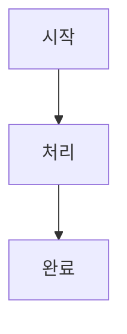

# 통합 LMS 빌드 시스템

## 🎯 개요

KT Cloud TECH UP 2025 과정의 마크다운 파일을 LMS용으로 변환하는 통합 빌드 시스템입니다.

### 🔄 처리 과정
1. **Mermaid 추출**: MD 파일에서 Mermaid 차트 코드 추출 → `.mmd` 파일 생성
2. **이미지 생성**: `.mmd` 파일을 PNG 이미지로 변환
3. **마크다운 변환**: Mermaid 코드 블록을 GitHub 이미지 링크로 교체
4. **파일 복사**: 추가 필요 파일들을 LMS 폴더로 복사

## 🚀 사용 방법

### 방법 1: 배치 파일 사용 (권장)
```bash
# Windows에서 실행
scripts\build_lms.bat
```

### 방법 2: Python 직접 실행
```bash
# Python 스크립트 직접 실행
cd scripts
python build_lms_integrated.py
```

## 📋 사전 요구사항

### 필수 설치
- **Python 3.7+**: 스크립트 실행용
- **Node.js**: Mermaid CLI 설치용
- **Mermaid CLI**: PNG 변환용

### Mermaid CLI 설치
```bash
npm install -g @mermaid-js/mermaid-cli
```

## 📁 출력 구조

### 생성되는 파일들
```
lms/                           # LMS용 변환된 파일들
├── .amazonq/                  # Amazon Q 설정
├── agents/                    # AI 에이전트 설정
├── analysis/                  # 분석 문서
├── theory/                    # 이론 강의 (변환됨)
│   ├── week_01/
│   │   ├── day1/
│   │   │   ├── README.md     # Mermaid → 이미지 링크로 변환
│   │   │   ├── session_1.md  # Mermaid → 이미지 링크로 변환
│   │   │   └── ...
│   │   └── images/           # 원본 PNG 파일들 (참조용)
│   └── ...
├── GLOSSARY.md               # 용어집
├── LEVEL_TEST.md            # 레벨 테스트
└── README.md                # 메인 README (변환됨)

theory/                       # 원본 파일들 (변경되지 않음)
├── week_01/
│   ├── images/              # 생성된 PNG 파일들
│   │   ├── *.mmd           # 추출된 Mermaid 파일
│   │   └── *.png           # 변환된 PNG 이미지
│   └── ...
```

## 🔧 설정 변경

### GitHub URL 변경
`build_lms_integrated.py` 파일에서 다음 부분 수정:

```python
self.github_base_url = "https://github.com/YOUR_USERNAME/YOUR_REPO/blob/main"
```

### 이미지 설정 변경
PNG 변환 옵션 수정:

```python
cmd = [
    'mmdc',
    '-i', str(mmd_file),
    '-o', str(png_file),
    '-t', 'neutral',        # 테마: neutral, dark, forest 등
    '-b', 'white',          # 배경색
    '--width', '1200',      # 너비
    '--height', '800'       # 높이
]
```

## 📊 처리 결과 예시

### 변환 전 (원본)
```markdown

```

### 변환 후 (LMS용)
```markdown

```

## 🔍 파일명 규칙

### Mermaid 파일명 패턴
```
{파일경로}_{순서}_{해시}.mmd
{파일경로}_{순서}_{해시}.png
```

### 예시
- 원본: `theory/week_01/day1/session_1.md`
- Mermaid: `day1_session_1_01_a1b2c3d4.mmd`
- PNG: `day1_session_1_01_a1b2c3d4.png`

## ⚠️ 주의사항

### 1. GitHub 저장소 설정
- PNG 파일들이 GitHub에 업로드되어 있어야 함
- GitHub URL이 실제 저장소와 일치해야 함
- 브랜치명 확인 (main/master)

### 2. 이미지 접근성
- `?raw=true` 파라미터로 직접 이미지 접근
- LMS에서 외부 이미지 로딩 허용 필요
- 네트워크 연결 상태 확인

### 3. 파일 경로
- Windows 경로 구분자(`\`) 처리
- 상대 경로 계산 정확성
- 특수 문자 처리

## 🐛 문제 해결

### Mermaid CLI 오류
```bash
# 재설치
npm uninstall -g @mermaid-js/mermaid-cli
npm install -g @mermaid-js/mermaid-cli

# 버전 확인
mmdc --version
```

### Python 인코딩 오류
```python
# UTF-8 인코딩 강제 설정
import locale
locale.setlocale(locale.LC_ALL, 'ko_KR.UTF-8')
```

### 이미지 링크 오류
1. GitHub에서 PNG 파일 존재 확인
2. URL 형식 검증
3. 브라우저에서 직접 접근 테스트

## 📈 성능 최적화

### 병렬 처리 (향후 개선)
```python
from concurrent.futures import ThreadPoolExecutor

# 멀티스레드로 PNG 변환 처리
with ThreadPoolExecutor(max_workers=4) as executor:
    futures = [executor.submit(convert_mmd_to_png, mmd_file) 
              for mmd_file in mmd_files]
```

### 캐싱 (향후 개선)
- 이미 변환된 파일 스킵
- 해시 기반 중복 제거
- 증분 빌드 지원

## 🔄 지속적 통합

### GitHub Actions 예시
```yaml
name: Build LMS
on:
  push:
    paths:
      - 'theory/**/*.md'

jobs:
  build:
    runs-on: ubuntu-latest
    steps:
      - uses: actions/checkout@v3
      - name: Setup Node.js
        uses: actions/setup-node@v3
        with:
          node-version: '18'
      - name: Install Mermaid CLI
        run: npm install -g @mermaid-js/mermaid-cli
      - name: Build LMS
        run: python scripts/build_lms_integrated.py
      - name: Commit LMS files
        run: |
          git add lms/
          git commit -m "Update LMS files"
          git push
```

## 📞 지원

문제가 발생하면 다음을 확인하세요:

1. **로그 메시지**: 상세한 오류 정보 확인
2. **파일 권한**: 읽기/쓰기 권한 확인  
3. **경로 설정**: 절대/상대 경로 정확성
4. **의존성**: 필수 도구 설치 상태

---

<div align="center">

**🚀 효율적인 LMS 변환** • **🎨 자동 이미지 생성** • **🔗 GitHub 통합**

*한 번의 실행으로 완벽한 LMS 콘텐츠 생성*

</div>