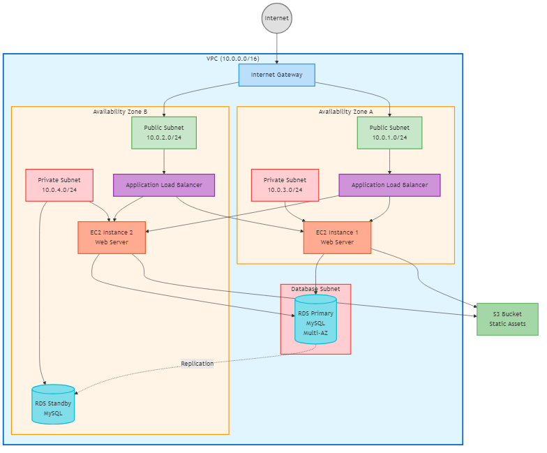
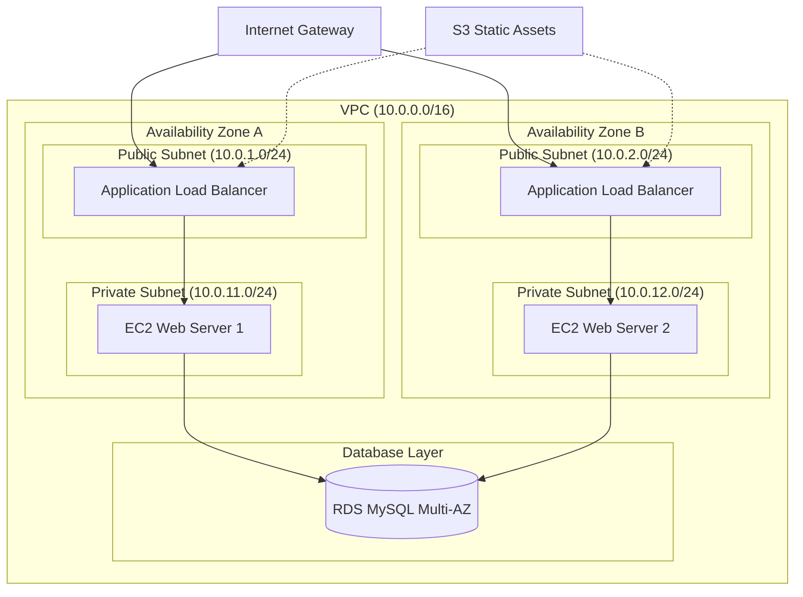

# 실습 과제 1: AWS 3계층 아키텍처

## 목표

Draw.io를 사용하여 AWS 기반 3계층 웹 애플리케이션 아키텍처 다이어그램을 작성합니다.

**예상 소요 시간**: 15분

## 과제 설명

전형적인 웹 애플리케이션을 위한 AWS 아키텍처를 설계하고 다이어그램으로 표현하세요. 이 아키텍처는 고가용성과 보안을 고려하여 퍼블릭 서브넷과 프라이빗 서브넷을 분리하고, 여러 가용 영역(AZ)에 걸쳐 리소스를 배치합니다.

### 3계층 구조
1. **프레젠테이션 계층**: Application Load Balancer (퍼블릭 서브넷)
2. **애플리케이션 계층**: EC2 인스턴스 (프라이빗 서브넷)
3. **데이터 계층**: RDS 데이터베이스 (프라이빗 서브넷)

## 요구사항

다음 AWS 리소스를 포함하는 다이어그램을 작성하세요:

### 네트워크 구성
- [x] **VPC** 1개 (예: 10.0.0.0/16)
- [x] **퍼블릭 서브넷** 2개 (서로 다른 AZ)
  - 예: 10.0.1.0/24 (AZ-A), 10.0.2.0/24 (AZ-B)
- [x] **프라이빗 서브넷** 2개 (서로 다른 AZ)
  - 예: 10.0.11.0/24 (AZ-A), 10.0.12.0/24 (AZ-B)
- [x] **Internet Gateway** 1개

### 컴퓨팅 리소스
- [x] **Application Load Balancer** (퍼블릭 서브넷에 배치)
- [x] **EC2 인스턴스** 최소 2개 (각 프라이빗 서브넷에 1개씩)
- [x] **Auto Scaling Group** (EC2 인스턴스를 포함)

### 데이터베이스
- [x] **RDS** (Multi-AZ 구성, 프라이빗 서브넷)

### 스토리지
- [x] **S3 버킷** (정적 자산 저장용)

## 단계별 가이드

### 1단계: VPC 그리기 (2분)

1. Draw.io에서 새 다이어그램 시작
2. 왼쪽 패널에서 **사각형** 도형 선택
3. 큰 사각형을 그려 VPC 표현
4. 스타일 설정:
   - 채우기: 연한 파란색 (#E3F2FD)
   - 테두리: 진한 파란색, 두께 2px
5. 텍스트 추가: "VPC (10.0.0.0/16)"

### 2단계: 가용 영역 표시 (2분)

1. VPC 내부에 2개의 세로 영역 구분
2. 각 영역에 텍스트 추가:
   - "Availability Zone A"
   - "Availability Zone B"
3. 점선으로 구분선 추가 (선택사항)

### 3단계: 서브넷 추가 (3분)

각 가용 영역에 2개의 서브넷 추가:

**퍼블릭 서브넷** (상단)
1. 사각형 도형 추가
2. 채우기: 연한 초록색 (#E8F5E9)
3. 텍스트: "Public Subnet A (10.0.1.0/24)"
4. 같은 방식으로 AZ-B에도 추가

**프라이빗 서브넷** (하단)
1. 사각형 도형 추가
2. 채우기: 연한 주황색 (#FFF3E0)
3. 텍스트: "Private Subnet A (10.0.11.0/24)"
4. 같은 방식으로 AZ-B에도 추가

### 4단계: Internet Gateway 추가 (1분)

1. AWS 아이콘 라이브러리에서 "Internet Gateway" 검색
2. VPC 외부 상단에 배치
3. 레이블: "Internet Gateway"

### 5단계: Application Load Balancer 추가 (2분)

1. AWS 아이콘에서 "Elastic Load Balancing" 검색
2. 두 퍼블릭 서브넷에 걸쳐 배치
3. 레이블: "Application Load Balancer"
4. Internet Gateway에서 ALB로 화살표 연결

### 6단계: EC2 인스턴스 추가 (2분)

1. AWS 아이콘에서 "EC2" 검색
2. 각 프라이빗 서브넷에 EC2 아이콘 배치
3. 레이블: "Web Server 1", "Web Server 2"
4. Auto Scaling Group 표시:
   - EC2 인스턴스들을 점선 사각형으로 묶기
   - 레이블: "Auto Scaling Group"
5. ALB에서 각 EC2로 화살표 연결

### 7단계: RDS 추가 (2분)

1. AWS 아이콘에서 "RDS" 검색
2. 두 프라이빗 서브넷에 걸쳐 배치
3. 레이블: "RDS MySQL (Multi-AZ)"
4. 각 EC2에서 RDS로 화살표 연결

### 8단계: S3 추가 (1분)

1. AWS 아이콘에서 "S3" 검색
2. VPC 외부에 배치
3. 레이블: "S3 (Static Assets)"
4. ALB에서 S3로 점선 화살표 연결

## 체크리스트

다이어그램을 제출하기 전에 다음 항목을 확인하세요:

### 구조
- [ ] VPC가 명확히 표시되고 CIDR 블록이 레이블됨
- [ ] 2개의 가용 영역이 구분되어 표시됨
- [ ] 퍼블릭 서브넷과 프라이빗 서브넷이 색상으로 구분됨
- [ ] 각 서브넷에 CIDR 블록이 레이블됨

### 리소스
- [ ] Internet Gateway가 VPC 외부에 배치됨
- [ ] ALB가 퍼블릭 서브넷에 배치됨
- [ ] EC2 인스턴스가 프라이빗 서브넷에 배치됨
- [ ] Auto Scaling Group이 표시됨
- [ ] RDS가 Multi-AZ로 표시됨
- [ ] S3가 포함됨

### 연결
- [ ] Internet Gateway → ALB 연결
- [ ] ALB → EC2 인스턴스 연결
- [ ] EC2 → RDS 연결
- [ ] ALB → S3 연결 (점선)

### 레이블
- [ ] 모든 리소스에 명확한 레이블
- [ ] 서브넷 CIDR 블록 표시
- [ ] 가용 영역 표시

### 시각적 품질
- [ ] 정렬이 깔끔함
- [ ] 색상 구분이 명확함
- [ ] 화살표 방향이 논리적임
- [ ] 텍스트가 읽기 쉬움

## 참고 예제

아래는 Mermaid로 작성한 참고 예제입니다. Draw.io로 작성할 때 이 구조를 참고하세요.

### Mermaid 코드

## 일반적인 실수

### 1. 서브넷 배치 오류
❌ **잘못된 예**: ALB를 프라이빗 서브넷에 배치
✅ **올바른 예**: ALB는 반드시 퍼블릭 서브넷에 배치

### 2. 가용 영역 미표시
❌ **잘못된 예**: 모든 리소스를 하나의 영역에 배치
✅ **올바른 예**: 고가용성을 위해 2개 이상의 AZ 사용

### 3. 연결 방향 오류
❌ **잘못된 예**: RDS에서 EC2로 화살표
✅ **올바른 예**: EC2에서 RDS로 화살표 (클라이언트 → 서버)

### 4. 레이블 누락
❌ **잘못된 예**: 서브넷에 CIDR 블록 미표시
✅ **올바른 예**: 모든 서브넷에 CIDR 블록 명시

## 추가 도전 과제 (선택사항)

시간이 남으면 다음 요소를 추가해보세요:

1. **NAT Gateway**: 프라이빗 서브넷의 아웃바운드 인터넷 접속용
2. **보안 그룹**: 각 계층의 보안 그룹 표시
3. **CloudWatch**: 모니터링 서비스 추가
4. **Route 53**: DNS 서비스 추가
5. **CloudFront**: CDN 추가

## 제출

### 파일 형식
- **형식**: PNG
- **파일명**: `이름_01.png` (예: `홍길동_01.png`)
- **해상도**: 최소 1920x1080

### 제출 방법
1. Draw.io에서 File > Export as > PNG
2. Zoom: 100%, Border: 10px
3. Discord #실습-제출 채널에 업로드
4. 메시지에 간단한 설명 추가 (선택사항)

### 평가 기준
- **구조 (30%)**: VPC, 서브넷, AZ 구성의 정확성
- **리소스 (30%)**: 필수 AWS 리소스 포함 여부
- **연결 (20%)**: 리소스 간 연결의 논리성
- **시각화 (20%)**: 레이블, 정렬, 색상 구분의 명확성

## 다음 단계

이 과제를 완료했다면 다음 실습으로 넘어가세요:

- [실습 2: Kubernetes 배포](02_k8s_deployment.md)

## 참고 자료

- [AWS 아키텍처 센터](https://aws.amazon.com/architecture/)
- [AWS Well-Architected Framework](https://aws.amazon.com/architecture/well-architected/)
- [AWS 아이콘 가이드](../reference/aws_icons_guide.md)
