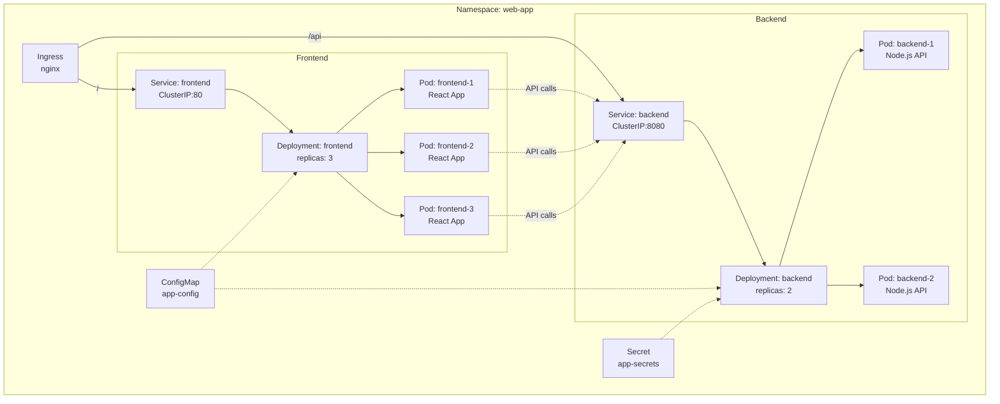

# 실습 과제 2: Kubernetes 배포

## 목표

Draw.io를 사용하여 Kubernetes 기반 웹 애플리케이션 배포 아키텍처 다이어그램을 작성합니다.

**예상 소요 시간**: 15분

## 과제 설명

간단한 웹 애플리케이션(프론트엔드 + 백엔드)의 Kubernetes 배포 구조를 설계하고 다이어그램으로 표현하세요. 이 아키텍처는 Ingress를 통한 외부 접근, Service를 통한 내부 통신, 그리고 ConfigMap/Secret을 통한 설정 관리를 포함합니다.

### 애플리케이션 구조
1. **프론트엔드**: React 웹 애플리케이션 (3 replicas)
2. **백엔드**: Node.js API 서버 (2 replicas)
3. **설정**: ConfigMap 및 Secret

## 요구사항

다음 Kubernetes 리소스를 포함하는 다이어그램을 작성하세요:

### 네임스페이스
- [x] **Namespace** 1개 (예: `web-app`)

### 네트워킹
- [x] **Ingress** 1개 (외부 트래픽 라우팅)
- [x] **Service - Frontend** 1개 (ClusterIP 타입)
- [x] **Service - Backend** 1개 (ClusterIP 타입)

### 워크로드
- [x] **Deployment - Frontend** 1개 (3 replicas)
- [x] **Deployment - Backend** 1개 (2 replicas)
- [x] **Pod** 표현 (각 Deployment 내부)

### 설정
- [x] **ConfigMap** 1개 (애플리케이션 설정)
- [x] **Secret** 1개 (민감한 정보)

## 단계별 가이드

### 1단계: Namespace 경계 그리기 (2분)

1. Draw.io에서 새 다이어그램 시작
2. 큰 사각형을 그려 Namespace 표현
3. 스타일 설정:
   - 채우기: 연한 회색 (#F5F5F5)
   - 테두리: 검은색, 두께 2px, 점선
4. 텍스트 추가: "Namespace: web-app"

### 2단계: Ingress 추가 (2분)

1. Namespace 상단에 사각형 추가
2. 스타일:
   - 채우기: 연한 보라색 (#E1BEE7)
   - 아이콘: 화살표 또는 게이트웨이 모양
3. 레이블: "Ingress"
4. 라우팅 규칙 표시:
   - `/` → Frontend Service
   - `/api` → Backend Service

### 3단계: Frontend Service 및 Deployment 추가 (4분)

**Service 추가**
1. Ingress 아래에 사각형 추가
2. 스타일:
   - 채우기: 연한 파란색 (#BBDEFB)
3. 레이블: "Frontend Service (ClusterIP)"

**Deployment 추가**
1. Service 아래에 사각형 추가
2. 스타일:
   - 채우기: 파란색 (#2196F3)
3. 레이블: "Frontend Deployment"

**Pod 추가**
1. Deployment 내부에 작은 원 3개 추가
2. 레이블: "Pod 1", "Pod 2", "Pod 3"
3. 각 Pod에 "React App" 표시

**연결**
- Ingress → Frontend Service (실선 화살표)
- Frontend Service → Pods (실선 화살표)

### 4단계: Backend Service 및 Deployment 추가 (4분)

**Service 추가**
1. Frontend 옆에 사각형 추가
2. 스타일:
   - 채우기: 연한 초록색 (#C8E6C9)
3. 레이블: "Backend Service (ClusterIP)"

**Deployment 추가**
1. Service 아래에 사각형 추가
2. 스타일:
   - 채우기: 초록색 (#4CAF50)
3. 레이블: "Backend Deployment"

**Pod 추가**
1. Deployment 내부에 작은 원 2개 추가
2. 레이블: "Pod 1", "Pod 2"
3. 각 Pod에 "Node.js API" 표시

**연결**
- Ingress → Backend Service (실선 화살표, `/api` 레이블)
- Backend Service → Pods (실선 화살표)
- Frontend Pods → Backend Service (점선 화살표)

### 5단계: ConfigMap 및 Secret 추가 (2분)

**ConfigMap**
1. Namespace 왼쪽 하단에 사각형 추가
2. 스타일:
   - 채우기: 연한 노란색 (#FFF9C4)
3. 레이블: "ConfigMap"
4. 내용 예시:
   - `API_URL`
   - `LOG_LEVEL`

**Secret**
1. ConfigMap 옆에 사각형 추가
2. 스타일:
   - 채우기: 연한 빨간색 (#FFCDD2)
3. 레이블: "Secret"
4. 내용 예시:
   - `DB_PASSWORD`
   - `API_KEY`

**연결**
- ConfigMap → Frontend Deployment (점선)
- ConfigMap → Backend Deployment (점선)
- Secret → Backend Deployment (점선)

### 6단계: 레이블 및 주석 추가 (1분)

1. 각 리소스에 명확한 레이블 추가
2. Replica 수 표시 (예: "replicas: 3")
3. Service 타입 표시 (예: "ClusterIP")
4. 포트 정보 추가 (선택사항)

## 체크리스트

다이어그램을 제출하기 전에 다음 항목을 확인하세요:

### 구조
- [ ] Namespace 경계가 명확히 표시됨
- [ ] 리소스가 논리적으로 배치됨 (상단: Ingress, 중간: Services, 하단: Deployments)
- [ ] Pod가 Deployment 내부에 표시됨

### 리소스
- [ ] Ingress가 포함됨
- [ ] Frontend Service (ClusterIP)가 포함됨
- [ ] Backend Service (ClusterIP)가 포함됨
- [ ] Frontend Deployment (3 replicas)가 포함됨
- [ ] Backend Deployment (2 replicas)가 포함됨
- [ ] ConfigMap이 포함됨
- [ ] Secret이 포함됨

### 연결
- [ ] Ingress → Frontend Service 연결
- [ ] Ingress → Backend Service 연결 (`/api` 경로)
- [ ] Service → Pod 연결
- [ ] Frontend → Backend 통신 표시
- [ ] ConfigMap → Deployment 연결
- [ ] Secret → Deployment 연결

### 레이블
- [ ] 모든 리소스에 명확한 이름
- [ ] Replica 수 표시
- [ ] Service 타입 표시
- [ ] Ingress 라우팅 규칙 표시

### 시각적 품질
- [ ] 색상으로 리소스 타입 구분
- [ ] 정렬이 깔끔함
- [ ] 화살표 방향이 논리적임
- [ ] 텍스트가 읽기 쉬움

## 참고 예제

아래는 Mermaid로 작성한 참고 예제입니다. Draw.io로 작성할 때 이 구조를 참고하세요.

### Mermaid 코드

## 일반적인 실수

### 1. Service 타입 오류
❌ **잘못된 예**: Frontend Service를 LoadBalancer로 설정
✅ **올바른 예**: Ingress를 사용하므로 Service는 ClusterIP

### 2. Pod 표현 누락
❌ **잘못된 예**: Deployment만 표시하고 Pod 미표시
✅ **올바른 예**: Deployment 내부에 Pod 명시적으로 표시

### 3. 연결 방향 오류
❌ **잘못된 예**: Service에서 Ingress로 화살표
✅ **올바른 예**: Ingress에서 Service로 화살표 (트래픽 흐름)

### 4. ConfigMap/Secret 연결 누락
❌ **잘못된 예**: ConfigMap/Secret을 독립적으로 표시
✅ **올바른 예**: Deployment와의 연결 관계 표시

### 5. Namespace 경계 미표시
❌ **잘못된 예**: 리소스만 나열
✅ **올바른 예**: Namespace 경계로 리소스 그룹화

## 추가 도전 과제 (선택사항)

시간이 남으면 다음 요소를 추가해보세요:

1. **PersistentVolumeClaim**: 데이터 영속성
2. **HorizontalPodAutoscaler**: 자동 스케일링
3. **NetworkPolicy**: 네트워크 보안 정책
4. **ServiceAccount**: 권한 관리
5. **Liveness/Readiness Probe**: 헬스 체크

## Kubernetes 리소스 설명

### Ingress
- 외부 HTTP/HTTPS 트래픽을 클러스터 내부 Service로 라우팅
- 경로 기반 라우팅 지원 (`/`, `/api` 등)
- TLS 종료 가능

### Service
- Pod 집합에 대한 안정적인 네트워크 엔드포인트
- ClusterIP: 클러스터 내부에서만 접근 가능
- 로드 밸런싱 제공

### Deployment
- Pod의 선언적 업데이트 관리
- Replica 수 지정
- 롤링 업데이트 지원

### Pod
- Kubernetes의 최소 배포 단위
- 하나 이상의 컨테이너 포함
- 임시적(ephemeral) 특성

### ConfigMap
- 비밀이 아닌 설정 데이터 저장
- 환경 변수, 명령줄 인수, 설정 파일로 사용

### Secret
- 민감한 정보 저장 (비밀번호, 토큰, 키)
- Base64 인코딩
- 암호화 가능

## 제출

### 파일 형식
- **형식**: PNG
- **파일명**: `이름_02.png` (예: `홍길동_02.png`)
- **해상도**: 최소 1920x1080

### 제출 방법
1. Draw.io에서 File > Export as > PNG
2. Zoom: 100%, Border: 10px
3. Discord #실습-제출 채널에 업로드
4. 메시지에 간단한 설명 추가 (선택사항)

### 평가 기준
- **구조 (30%)**: Namespace, Service, Deployment 구성의 정확성
- **리소스 (30%)**: 필수 Kubernetes 리소스 포함 여부
- **연결 (20%)**: 리소스 간 연결의 논리성
- **시각화 (20%)**: 레이블, 정렬, 색상 구분의 명확성

## 다음 단계

이 과제를 완료했다면 다음 실습으로 넘어가세요:

- [실습 3: CI/CD 파이프라인](03_cicd_pipeline.md)

## 참고 자료

- [Kubernetes 공식 문서](https://kubernetes.io/docs/)
- [Kubernetes 패턴](https://www.redhat.com/en/resources/oreilly-kubernetes-patterns-cloud-native-apps)
- [Kubernetes 아키텍처 가이드](../lecture/04_kubernetes_diagrams.md)
