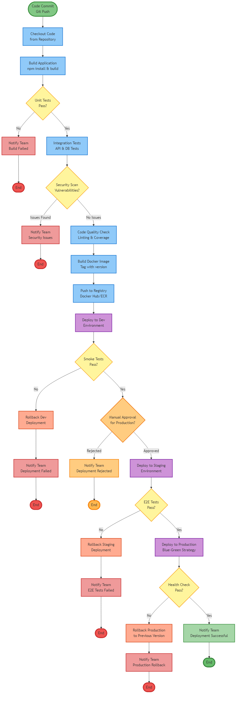
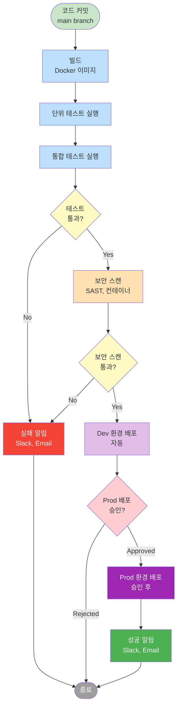

# 실습 과제 3: CI/CD 파이프라인

## 목표

Draw.io를 사용하여 GitHub Actions 기반 CI/CD 파이프라인 다이어그램을 작성합니다.

**예상 소요 시간**: 10분

## 과제 설명

GitHub Actions를 사용한 자동화된 CI/CD 파이프라인을 설계하고 순서도로 표현하세요. 이 파이프라인은 코드 커밋부터 프로덕션 배포까지의 전체 프로세스를 포함하며, 테스트, 보안 스캔, 승인 게이트 등의 단계를 거칩니다.

### 파이프라인 단계
1. **CI (Continuous Integration)**: 빌드, 테스트, 보안 스캔
2. **CD (Continuous Deployment)**: Dev 환경 자동 배포, Prod 환경 승인 후 배포
3. **알림**: 성공/실패 알림

## 요구사항

다음 단계를 포함하는 순서도를 작성하세요:

### 시작
- [x] **코드 커밋** (시작 노드)

### CI 단계
- [x] **빌드** (Docker 이미지 빌드)
- [x] **단위 테스트** 실행
- [x] **통합 테스트** 실행
- [x] **보안 스캔** (SAST, 컨테이너 스캔)

### 의사결정
- [x] **테스트 통과 여부** (의사결정 노드)
- [x] **보안 스캔 통과 여부** (의사결정 노드)
- [x] **프로덕션 배포 승인** (의사결정 노드)

### CD 단계
- [x] **Dev 환경 배포**
- [x] **Prod 환경 배포** (승인 후)

### 알림
- [x] **성공 알림** (Slack, Email)
- [x] **실패 알림** (Slack, Email)

## 단계별 가이드

### 1단계: 시작 노드 추가 (1분)

1. Draw.io에서 새 다이어그램 시작
2. 타원 도형 추가 (시작/종료용)
3. 스타일:
   - 채우기: 연한 초록색 (#C8E6C9)
4. 텍스트: "코드 커밋 (main branch)"

### 2단계: 빌드 단계 추가 (2분)

**빌드**
1. 사각형 도형 추가
2. 스타일:
   - 채우기: 연한 파란색 (#BBDEFB)
3. 텍스트: "빌드\n(Docker 이미지)"

**단위 테스트**
1. 사각형 도형 추가
2. 텍스트: "단위 테스트 실행"

**통합 테스트**
1. 사각형 도형 추가
2. 텍스트: "통합 테스트 실행"

**연결**
- 시작 → 빌드 → 단위 테스트 → 통합 테스트 (화살표로 연결)

### 3단계: 의사결정 노드 추가 (2분)

**테스트 결과 확인**
1. 마름모 도형 추가
2. 스타일:
   - 채우기: 연한 노란색 (#FFF9C4)
3. 텍스트: "테스트 통과?"

**분기**
- "Yes" 경로: 다음 단계로
- "No" 경로: 실패 알림으로

### 4단계: 보안 스캔 추가 (1분)

**보안 스캔**
1. 사각형 도형 추가
2. 스타일:
   - 채우기: 연한 주황색 (#FFE0B2)
3. 텍스트: "보안 스캔\n(SAST, 컨테이너)"

**의사결정**
1. 마름모 도형 추가
2. 텍스트: "보안 스캔 통과?"
3. 분기:
   - "Yes": Dev 배포로
   - "No": 실패 알림으로

### 5단계: Dev 환경 배포 추가 (1분)

**Dev 배포**
1. 사각형 도형 추가
2. 스타일:
   - 채우기: 연한 보라색 (#E1BEE7)
3. 텍스트: "Dev 환경 배포\n(자동)"

### 6단계: 승인 게이트 추가 (1분)

**승인 요청**
1. 마름모 도형 추가
2. 스타일:
   - 채우기: 연한 빨간색 (#FFCDD2)
3. 텍스트: "Prod 배포 승인?"
4. 분기:
   - "Approved": Prod 배포로
   - "Rejected": 종료

### 7단계: Prod 환경 배포 추가 (1분)

**Prod 배포**
1. 사각형 도형 추가
2. 스타일:
   - 채우기: 진한 보라색 (#9C27B0), 텍스트 흰색
3. 텍스트: "Prod 환경 배포\n(승인 후)"

### 8단계: 알림 및 종료 추가 (1분)

**성공 알림**
1. 사각형 도형 추가
2. 스타일:
   - 채우기: 초록색 (#4CAF50), 텍스트 흰색
3. 텍스트: "성공 알림\n(Slack, Email)"

**실패 알림**
1. 사각형 도형 추가
2. 스타일:
   - 채우기: 빨간색 (#F44336), 텍스트 흰색
3. 텍스트: "실패 알림\n(Slack, Email)"

**종료**
1. 타원 도형 추가
2. 스타일:
   - 채우기: 회색 (#9E9E9E), 텍스트 흰색
3. 텍스트: "종료"

**연결**
- Prod 배포 → 성공 알림 → 종료
- 모든 실패 경로 → 실패 알림 → 종료

## 체크리스트

다이어그램을 제출하기 전에 다음 항목을 확인하세요:

### 구조
- [ ] 시작 노드가 명확함 (타원)
- [ ] 프로세스 노드가 사각형으로 표현됨
- [ ] 의사결정 노드가 마름모로 표현됨
- [ ] 종료 노드가 명확함 (타원)

### 단계
- [ ] 빌드 단계 포함
- [ ] 단위 테스트 포함
- [ ] 통합 테스트 포함
- [ ] 보안 스캔 포함
- [ ] Dev 환경 배포 포함
- [ ] Prod 환경 배포 포함

### 의사결정
- [ ] 테스트 통과 여부 확인
- [ ] 보안 스캔 통과 여부 확인
- [ ] Prod 배포 승인 확인
- [ ] 각 의사결정에 Yes/No 레이블

### 알림
- [ ] 성공 알림 포함
- [ ] 실패 알림 포함
- [ ] 알림 채널 명시 (Slack, Email)

### 흐름
- [ ] 화살표 방향이 논리적임
- [ ] 성공 경로가 명확함
- [ ] 실패 경로가 명확함
- [ ] 모든 경로가 종료로 연결됨

### 시각적 품질
- [ ] 색상으로 단계 구분
- [ ] 정렬이 깔끔함
- [ ] 텍스트가 읽기 쉬움
- [ ] 화살표에 레이블 (Yes/No)

## 참고 예제

아래는 Mermaid로 작성한 참고 예제입니다. Draw.io로 작성할 때 이 구조를 참고하세요.



### Mermaid 코드


## 일반적인 실수

### 1. 노드 모양 오류
❌ **잘못된 예**: 의사결정을 사각형으로 표현
✅ **올바른 예**: 의사결정은 마름모, 프로세스는 사각형

### 2. 화살표 레이블 누락
❌ **잘못된 예**: 의사결정 분기에 레이블 없음
✅ **올바른 예**: Yes/No 또는 Approved/Rejected 명시

### 3. 실패 경로 누락
❌ **잘못된 예**: 성공 경로만 표시
✅ **올바른 예**: 모든 실패 시나리오 포함

### 4. 종료 노드 누락
❌ **잘못된 예**: 경로가 끝나지 않음
✅ **올바른 예**: 모든 경로가 종료 노드로 연결

### 5. 순서 오류
❌ **잘못된 예**: 배포 후 테스트
✅ **올바른 예**: 테스트 → 배포 순서

## 추가 도전 과제 (선택사항)

시간이 남으면 다음 요소를 추가해보세요:

1. **병렬 실행**: 단위 테스트와 통합 테스트를 병렬로
2. **롤백**: 배포 실패 시 이전 버전으로 롤백
3. **스모크 테스트**: 배포 후 기본 동작 확인
4. **성능 테스트**: 부하 테스트 단계 추가
5. **아티팩트 저장**: 빌드 결과물을 레지스트리에 저장

## CI/CD 단계 설명

### CI (Continuous Integration)
- **빌드**: 소스 코드를 실행 가능한 형태로 변환
- **테스트**: 코드 품질 검증
- **보안 스캔**: 취약점 조기 발견

### CD (Continuous Deployment)
- **Dev 배포**: 개발 환경에 자동 배포
- **승인 게이트**: 프로덕션 배포 전 수동 승인
- **Prod 배포**: 프로덕션 환경에 배포

### 알림
- **성공 알림**: 팀에 성공 알림
- **실패 알림**: 즉시 문제 인지 및 대응

## GitHub Actions 예시

이 파이프라인은 다음과 같은 GitHub Actions 워크플로우로 구현할 수 있습니다:

```yaml
name: CI/CD Pipeline

on:
  push:
    branches: [main]

jobs:
  build-and-test:
    runs-on: ubuntu-latest
    steps:
      - uses: actions/checkout@v3
      - name: Build Docker image
        run: docker build -t myapp .
      - name: Run unit tests
        run: npm test
      - name: Run integration tests
        run: npm run test:integration
      - name: Security scan
        run: trivy image myapp

  deploy-dev:
    needs: build-and-test
    runs-on: ubuntu-latest
    steps:
      - name: Deploy to Dev
        run: kubectl apply -f k8s/dev/

  deploy-prod:
    needs: deploy-dev
    runs-on: ubuntu-latest
    environment: production
    steps:
      - name: Deploy to Prod
        run: kubectl apply -f k8s/prod/
```

## 제출

### 파일 형식
- **형식**: PNG
- **파일명**: `이름_03.png` (예: `홍길동_03.png`)
- **해상도**: 최소 1920x1080

### 제출 방법
1. Draw.io에서 File > Export as > PNG
2. Zoom: 100%, Border: 10px
3. Discord #실습-제출 채널에 업로드
4. 메시지에 간단한 설명 추가 (선택사항)

### 평가 기준
- **구조 (30%)**: 순서도 기호의 올바른 사용
- **단계 (30%)**: 필수 CI/CD 단계 포함 여부
- **흐름 (20%)**: 성공/실패 경로의 논리성
- **시각화 (20%)**: 레이블, 정렬, 색상 구분의 명확성

## 다음 단계

이 과제를 완료했다면 다음 실습으로 넘어가세요:

- [실습 4: 로직 플로우](04_logic_flow.md)

## 참고 자료

- [GitHub Actions 문서](https://docs.github.com/en/actions)
- [CI/CD 베스트 프랙티스](https://www.atlassian.com/continuous-delivery/principles/continuous-integration-vs-delivery-vs-deployment)
- [순서도 가이드](../lecture/05_cicd_logic_flow.md)
