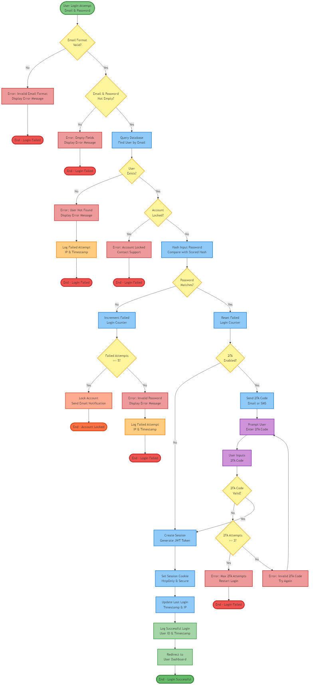
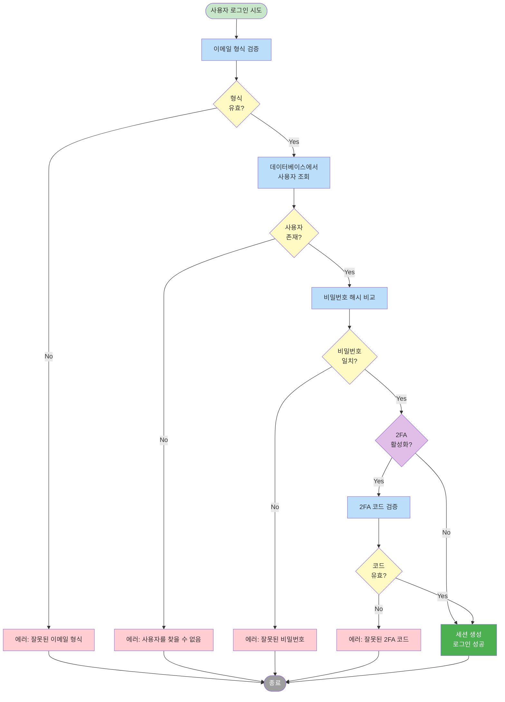

# 실습 과제 4: 로직 플로우

## 목표

Draw.io를 사용하여 사용자 로그인 프로세스의 로직 플로우 다이어그램을 작성합니다.

**예상 소요 시간**: 10분

## 과제 설명

사용자 로그인 시스템의 인증 로직을 설계하고 순서도로 표현하세요. 이 로직은 이메일 검증, 사용자 확인, 비밀번호 검증, 2단계 인증(2FA) 등 여러 검증 단계를 포함하며, 각 단계에서 실패 시 적절한 에러 처리를 수행합니다.

### 로직 흐름
1. **입력 검증**: 이메일 형식 확인
2. **사용자 확인**: 데이터베이스에서 사용자 조회
3. **비밀번호 검증**: 해시 비교
4. **2FA 확인**: 2FA 활성화 여부 확인
5. **2FA 검증**: 코드 확인 (활성화된 경우)
6. **세션 생성**: 로그인 성공

## 요구사항

다음 단계를 포함하는 순서도를 작성하세요:

### 시작
- [x] **사용자 로그인 시도** (시작 노드)

### 검증 단계
- [x] **이메일 형식 검증**
- [x] **사용자 존재 확인** (데이터베이스 조회)
- [x] **비밀번호 검증** (해시 비교)
- [x] **2FA 활성화 확인**
- [x] **2FA 코드 검증** (활성화된 경우)

### 의사결정
- [x] **이메일 형식 유효?**
- [x] **사용자 존재?**
- [x] **비밀번호 일치?**
- [x] **2FA 활성화?**
- [x] **2FA 코드 유효?**

### 결과
- [x] **세션 생성** (성공)
- [x] **에러 반환** (실패)
- [x] **로그인 성공/실패** (종료)

## 단계별 가이드

### 1단계: 시작 노드 추가 (1분)

1. Draw.io에서 새 다이어그램 시작
2. 타원 도형 추가
3. 스타일:
   - 채우기: 연한 초록색 (#C8E6C9)
4. 텍스트: "사용자 로그인 시도"

### 2단계: 이메일 검증 추가 (2분)

**이메일 형식 검증**
1. 사각형 도형 추가
2. 스타일:
   - 채우기: 연한 파란색 (#BBDEFB)
3. 텍스트: "이메일 형식 검증"

**의사결정**
1. 마름모 도형 추가
2. 스타일:
   - 채우기: 연한 노란색 (#FFF9C4)
3. 텍스트: "형식 유효?"

**에러 처리**
1. 사각형 도형 추가
2. 스타일:
   - 채우기: 연한 빨간색 (#FFCDD2)
3. 텍스트: "에러: 잘못된 이메일 형식"

**연결**
- 시작 → 이메일 검증 → 의사결정
- 의사결정 → No → 에러 → 종료
- 의사결정 → Yes → 다음 단계

### 3단계: 사용자 확인 추가 (2분)

**사용자 조회**
1. 사각형 도형 추가
2. 텍스트: "데이터베이스에서\n사용자 조회"

**의사결정**
1. 마름모 도형 추가
2. 텍스트: "사용자 존재?"

**에러 처리**
1. 사각형 도형 추가
2. 스타일:
   - 채우기: 연한 빨간색
3. 텍스트: "에러: 사용자를 찾을 수 없음"

**연결**
- 이전 단계 → 사용자 조회 → 의사결정
- 의사결정 → No → 에러 → 종료
- 의사결정 → Yes → 다음 단계

### 4단계: 비밀번호 검증 추가 (2분)

**비밀번호 검증**
1. 사각형 도형 추가
2. 텍스트: "비밀번호 해시 비교"

**의사결정**
1. 마름모 도형 추가
2. 텍스트: "비밀번호 일치?"

**에러 처리**
1. 사각형 도형 추가
2. 스타일:
   - 채우기: 연한 빨간색
3. 텍스트: "에러: 잘못된 비밀번호"

**연결**
- 이전 단계 → 비밀번호 검증 → 의사결정
- 의사결정 → No → 에러 → 종료
- 의사결정 → Yes → 다음 단계

### 5단계: 2FA 확인 추가 (2분)

**2FA 활성화 확인**
1. 마름모 도형 추가
2. 스타일:
   - 채우기: 연한 보라색 (#E1BEE7)
3. 텍스트: "2FA 활성화?"

**2FA 코드 검증** (활성화된 경우)
1. 사각형 도형 추가
2. 텍스트: "2FA 코드 검증"

**의사결정**
1. 마름모 도형 추가
2. 텍스트: "코드 유효?"

**에러 처리**
1. 사각형 도형 추가
2. 스타일:
   - 채우기: 연한 빨간색
3. 텍스트: "에러: 잘못된 2FA 코드"

**연결**
- 이전 단계 → 2FA 확인
- 2FA 확인 → No → 세션 생성 (2FA 없음)
- 2FA 확인 → Yes → 2FA 코드 검증 → 의사결정
- 의사결정 → No → 에러 → 종료
- 의사결정 → Yes → 세션 생성

### 6단계: 성공 처리 추가 (1분)

**세션 생성**
1. 사각형 도형 추가
2. 스타일:
   - 채우기: 초록색 (#4CAF50), 텍스트 흰색
3. 텍스트: "세션 생성\n로그인 성공"

**종료**
1. 타원 도형 추가
2. 스타일:
   - 채우기: 회색 (#9E9E9E), 텍스트 흰색
3. 텍스트: "종료"

**연결**
- 세션 생성 → 종료
- 모든 에러 → 종료

## 체크리스트

다이어그램을 제출하기 전에 다음 항목을 확인하세요:

### 구조
- [ ] 시작 노드가 명확함 (타원)
- [ ] 프로세스 노드가 사각형으로 표현됨
- [ ] 의사결정 노드가 마름모로 표현됨
- [ ] 종료 노드가 명확함 (타원)

### 검증 단계
- [ ] 이메일 형식 검증 포함
- [ ] 사용자 존재 확인 포함
- [ ] 비밀번호 검증 포함
- [ ] 2FA 활성화 확인 포함
- [ ] 2FA 코드 검증 포함 (조건부)

### 의사결정
- [ ] 각 검증 단계마다 의사결정 노드
- [ ] Yes/No 레이블 명시
- [ ] 2FA 활성화 여부 분기

### 에러 처리
- [ ] 각 검증 실패 시 에러 메시지
- [ ] 에러 메시지가 구체적임
- [ ] 모든 에러 경로가 종료로 연결

### 성공 경로
- [ ] 세션 생성 단계 포함
- [ ] 로그인 성공 표시
- [ ] 성공 경로가 명확함

### 흐름
- [ ] 화살표 방향이 논리적임
- [ ] 모든 경로가 종료로 연결됨
- [ ] 조건부 분기가 명확함

### 시각적 품질
- [ ] 색상으로 단계 구분
- [ ] 에러 노드가 시각적으로 구분됨
- [ ] 정렬이 깔끔함
- [ ] 텍스트가 읽기 쉬움

## 참고 예제

아래는 Mermaid로 작성한 참고 예제입니다. Draw.io로 작성할 때 이 구조를 참고하세요.



### Mermaid 코드


## 일반적인 실수

### 1. 검증 순서 오류
❌ **잘못된 예**: 비밀번호 검증 후 사용자 확인
✅ **올바른 예**: 사용자 확인 → 비밀번호 검증 순서

### 2. 에러 처리 누락
❌ **잘못된 예**: 실패 경로가 끊김
✅ **올바른 예**: 모든 실패 경로가 에러 메시지와 종료로 연결

### 3. 의사결정 레이블 누락
❌ **잘못된 예**: Yes/No 표시 없음
✅ **올바른 예**: 모든 분기에 명확한 레이블

### 4. 2FA 조건부 처리 오류
❌ **잘못된 예**: 2FA를 항상 실행
✅ **올바른 예**: 2FA 활성화 여부에 따라 분기

### 5. 에러 메시지 불명확
❌ **잘못된 예**: "에러 발생"
✅ **올바른 예**: "에러: 잘못된 비밀번호" (구체적)

## 추가 도전 과제 (선택사항)

시간이 남으면 다음 요소를 추가해보세요:

1. **로그인 시도 횟수 제한**: 5회 실패 시 계정 잠금
2. **비밀번호 재설정**: 비밀번호 찾기 링크
3. **로그 기록**: 로그인 시도 로깅
4. **디바이스 인증**: 새 디바이스 확인
5. **소셜 로그인**: OAuth 통합

## 로직 플로우 설계 원칙

### 1. 명확성
- 각 단계의 목적이 명확해야 함
- 의사결정 조건이 구체적이어야 함

### 2. 완전성
- 모든 가능한 경로 포함
- 에러 처리 빠짐없이

### 3. 효율성
- 불필요한 단계 제거
- 조기 실패 (fail fast) 원칙

### 4. 보안
- 민감한 정보 보호
- 적절한 검증 순서

## 실제 구현 예시

이 로직 플로우는 다음과 같은 코드로 구현할 수 있습니다:

```javascript
async function login(email, password, twoFACode) {
  // 이메일 형식 검증
  if (!isValidEmail(email)) {
    return { error: "잘못된 이메일 형식" };
  }
  
  // 사용자 조회
  const user = await findUserByEmail(email);
  if (!user) {
    return { error: "사용자를 찾을 수 없음" };
  }
  
  // 비밀번호 검증
  const isPasswordValid = await comparePassword(password, user.passwordHash);
  if (!isPasswordValid) {
    return { error: "잘못된 비밀번호" };
  }
  
  // 2FA 확인
  if (user.twoFAEnabled) {
    const isTwoFAValid = await verifyTwoFACode(user.id, twoFACode);
    if (!isTwoFAValid) {
      return { error: "잘못된 2FA 코드" };
    }
  }
  
  // 세션 생성
  const session = await createSession(user.id);
  return { success: true, session };
}
```

## 제출

### 파일 형식
- **형식**: PNG
- **파일명**: `이름_04.png` (예: `홍길동_04.png`)
- **해상도**: 최소 1920x1080

### 제출 방법
1. Draw.io에서 File > Export as > PNG
2. Zoom: 100%, Border: 10px
3. Discord #실습-제출 채널에 업로드
4. 메시지에 간단한 설명 추가 (선택사항)

### 평가 기준
- **구조 (30%)**: 순서도 기호의 올바른 사용
- **검증 (30%)**: 모든 검증 단계 포함 여부
- **에러 처리 (20%)**: 에러 경로의 완전성
- **시각화 (20%)**: 레이블, 정렬, 색상 구분의 명확성

## 완료!

축하합니다! 모든 실습 과제를 완료했습니다.

### 학습한 내용
- ✅ Draw.io 기본 사용법
- ✅ AWS 아키텍처 다이어그램
- ✅ Kubernetes 배포 다이어그램
- ✅ CI/CD 파이프라인
- ✅ 로직 플로우

### 다음 단계
1. 제출한 다이어그램 검토
2. 피드백 반영
3. 실제 프로젝트에 적용

## 참고 자료

- [순서도 기호 가이드](https://www.lucidchart.com/pages/flowchart-symbols-meaning-explained)
- [로직 플로우 베스트 프랙티스](https://www.visual-paradigm.com/tutorials/flowchart-tutorial/)
- [Mermaid 치트시트](../reference/mermaid_cheatsheet.md)
