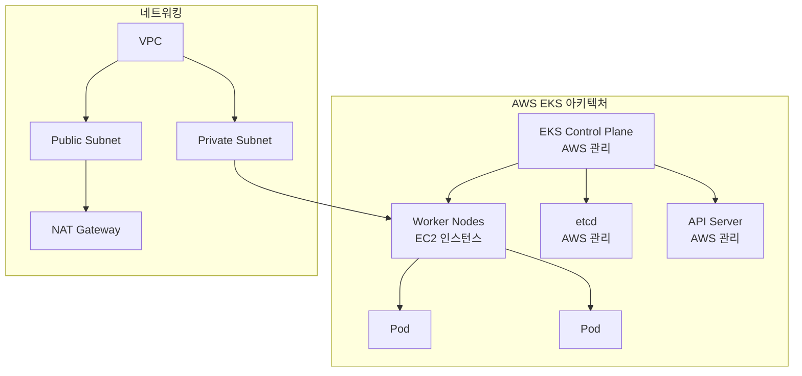

# Session 1: EKS 기초 + 클러스터 생성 (50분)

## 🎯 세션 목표
- EKS 아키텍처 핵심 개념 이해
- eksctl을 사용한 실제 클러스터 생성

## ⏰ 시간 배분
- **이론** (20분): EKS 아키텍처 핵심 개념
- **실습** (30분): eksctl로 클러스터 생성

---

## 🎓 이론: EKS 아키텍처 (20분)

### EKS란?
Amazon Elastic Kubernetes Service (EKS)는 AWS에서 **완전 관리형**으로 제공하는 Kubernetes 서비스입니다.

### 핵심 구성 요소


### EKS의 장점
| 구분 | EKS | 자체 관리 Kubernetes |
|------|-----|---------------------|
| **Control Plane** | AWS 완전 관리 | 직접 설치/관리 |
| **업그레이드** | 원클릭 업그레이드 | 수동 업그레이드 |
| **고가용성** | 멀티 AZ 기본 제공 | 직접 구성 필요 |
| **보안 패치** | 자동 적용 | 수동 적용 |
| **비용** | 시간당 $0.10 + 인프라 | 인프라 비용만 |

### 네트워킹 구조
- **Public Subnet**: NAT Gateway, Load Balancer
- **Private Subnet**: Worker Nodes (보안 강화)
- **Security Groups**: 클러스터 간 통신 제어

---

## 🛠️ 실습: eksctl로 클러스터 생성 (30분)

### 1. 사전 준비 확인 (5분)
```bash
# AWS CLI 설정 확인
aws sts get-caller-identity

# eksctl 설치 확인
eksctl version

# kubectl 설치 확인
kubectl version --client
```

### 2. 클러스터 설정 파일 확인 (5분)
제공된 `cluster-config.yaml` 파일 내용:
```yaml
apiVersion: eksctl.io/v1alpha5
kind: ClusterConfig

metadata:
  name: my-eks-cluster
  region: ap-northeast-2
  version: "1.28"

vpc:
  cidr: "10.0.0.0/16"
  nat:
    gateway: Single  # 비용 절약

nodeGroups:
  - name: worker-nodes
    instanceType: t3.medium
    desiredCapacity: 2
    minSize: 1
    maxSize: 4
```

### 3. 클러스터 생성 실행 (15분)
```bash
# 클러스터 생성 시작 (약 15-20분 소요)
eksctl create cluster -f cluster-config.yaml

# 별도 터미널에서 진행 상황 확인
eksctl get cluster --region ap-northeast-2
```

### 4. 생성 과정 설명 (5분)
클러스터 생성 중 AWS에서 자동으로 생성되는 리소스들:

#### VPC 및 네트워킹
- VPC (10.0.0.0/16)
- Public Subnet x2 (각 AZ)
- Private Subnet x2 (각 AZ)
- Internet Gateway
- NAT Gateway (Single)
- Route Tables

#### IAM 역할
- **클러스터 서비스 역할**: EKS가 AWS 리소스 관리
- **노드 그룹 역할**: EC2 인스턴스가 EKS와 통신

#### 보안 그룹
- **클러스터 보안 그룹**: Control Plane ↔ Worker Node 통신
- **노드 보안 그룹**: Worker Node 간 통신

---

## ✅ 세션 완료 체크리스트

### 이론 이해도 확인
- [ ] EKS와 자체 관리 Kubernetes의 차이점 이해
- [ ] EKS 아키텍처 구성 요소 파악
- [ ] 네트워킹 구조 (Public/Private Subnet) 이해

### 실습 완료 확인
- [ ] 클러스터 생성 명령어 실행 완료
- [ ] 생성 과정에서 만들어지는 AWS 리소스 이해
- [ ] eksctl 명령어 사용법 숙지

---

## 🔄 다음 세션 준비
Session 2에서는 생성된 클러스터에 연결하고 상태를 확인합니다.

### 예상 완료 시점
- 클러스터 생성이 완료되면 Session 2 시작
- 만약 생성이 지연되면 이론 복습 및 Q&A 진행
