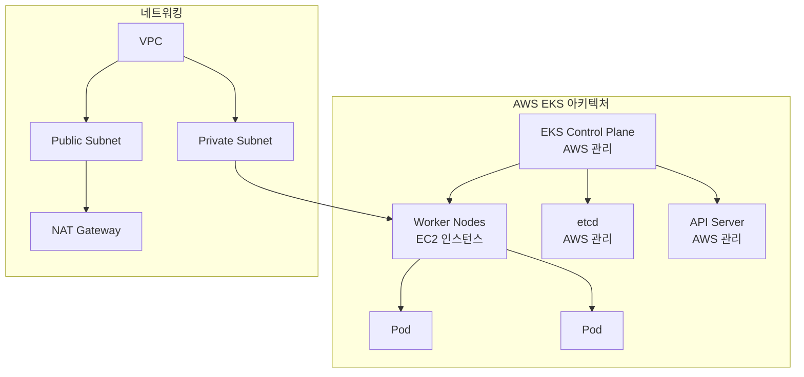
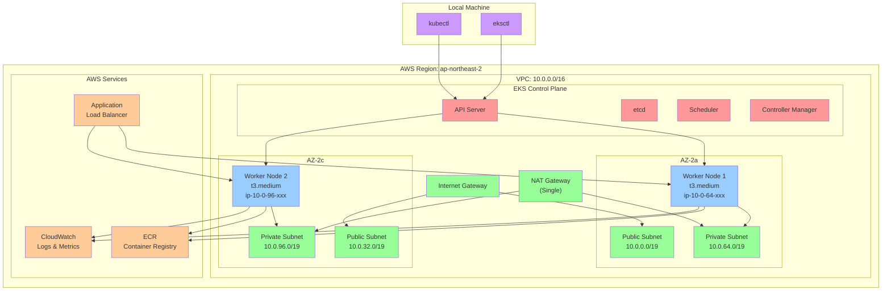
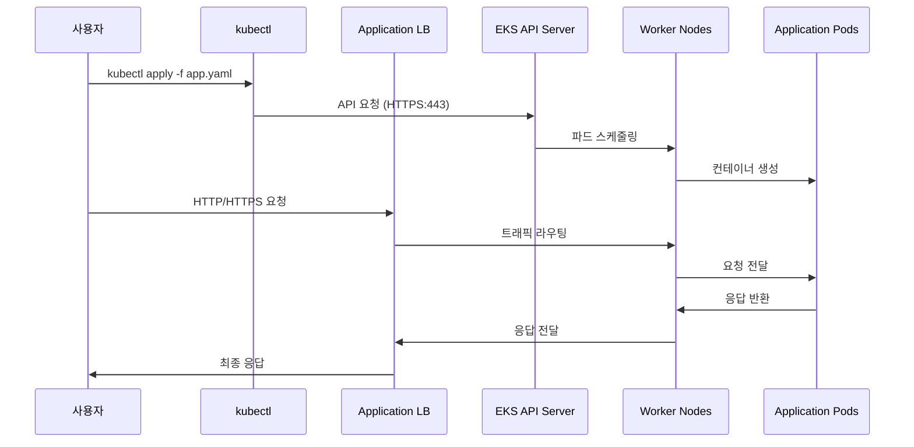
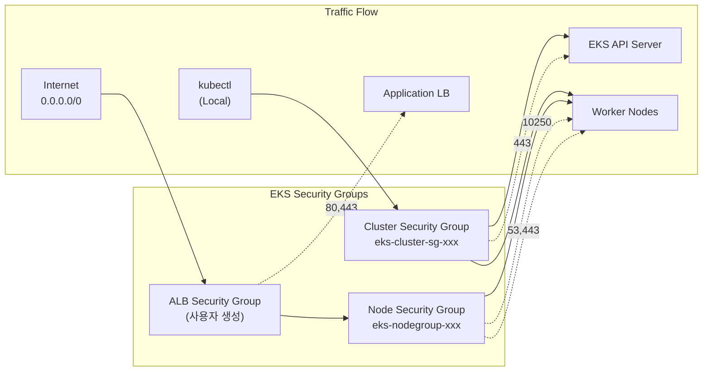

# Session 1: EKS 기초 + 클러스터 생성 (50분)

## 🎯 세션 목표
- EKS 아키텍처 핵심 개념 이해
- eksctl을 사용한 실제 클러스터 생성

## ⏰ 시간 배분
- **이론** (20분): EKS 아키텍처 핵심 개념
- **실습** (30분): eksctl로 클러스터 생성

---

## 🎓 이론: EKS 아키텍처 (20분)

### EKS란?
Amazon Elastic Kubernetes Service (EKS)는 AWS에서 **완전 관리형**으로 제공하는 Kubernetes 서비스입니다.

### 핵심 구성 요소


### EKS의 장점
| 구분 | EKS | 자체 관리 Kubernetes |
|------|-----|---------------------|
| **Control Plane** | AWS 완전 관리 | 직접 설치/관리 |
| **업그레이드** | 원클릭 업그레이드 | 수동 업그레이드 |
| **고가용성** | 멀티 AZ 기본 제공 | 직접 구성 필요 |
| **보안 패치** | 자동 적용 | 수동 적용 |
| **비용** | 시간당 $0.10 + 인프라 | 인프라 비용만 |

### EKS 시스템 컴포넌트
**AWS 완전 관리 (Control Plane)**:
- kube-apiserver, etcd, kube-scheduler
- kube-controller-manager, cloud-controller-manager

**Worker Node 자동 설치**:
- VPC CNI (aws-node) - Pod 네트워킹
- kube-proxy - 서비스 프록시  
- CoreDNS - 클러스터 DNS

### 네트워킹 구조
- **Public Subnet**: NAT Gateway, Load Balancer
- **Private Subnet**: Worker Nodes (보안 강화)
- **Security Groups**: 클러스터 간 통신 제어

---

## 🛠️ 실습: eksctl로 클러스터 생성 (30분)

### 1. 사전 준비 확인 (5분)
```bash
# AWS CLI 설정 확인
aws sts get-caller-identity

# eksctl 설치 확인
eksctl version

# kubectl 설치 확인
kubectl version --client
```

### 2. 클러스터 설정 파일 확인 (5분)
제공된 `cluster-config.yaml` 파일 내용:
```yaml
apiVersion: eksctl.io/v1alpha5
kind: ClusterConfig

metadata:
  name: my-eks-cluster
  region: ap-northeast-2
  version: "1.28"

vpc:
  cidr: "10.0.0.0/16"  # 새 VPC 생성 (10.0.0.0/16)
  nat:
    gateway: Single  # 비용 절약

nodeGroups:
  - name: worker-nodes
    instanceType: t3.medium
    desiredCapacity: 2
    minSize: 1
    maxSize: 4
```

**⚠️ 중요**: 이 설정은 **새로운 VPC를 생성**합니다!

#### VPC 선택 옵션 확인
```bash
# 기존 VPC 및 서브넷 확인
./vpc-check.sh

# 옵션 1: 새 VPC 생성 (권장 - 교육용)
# - 깨끗한 네트워크 환경
# - EKS 전용 설정 최적화
eksctl create cluster -f cluster-config.yaml

# 옵션 2: 기존 VPC 사용 (고급 사용자)
# - cluster-config-existing-vpc.yaml 수정 후 사용
# - 기존 리소스와 통합 가능
```
    gateway: Single  # 비용 절약

nodeGroups:
  - name: worker-nodes
    instanceType: t3.medium
    desiredCapacity: 2
    minSize: 1
    maxSize: 4
```

### 3. 클러스터 생성 실행 (15분)
```bash
# 클러스터 생성 시작 (약 15-20분 소요)
eksctl create cluster -f cluster-config.yaml

# 별도 터미널에서 진행 상황 확인
eksctl get cluster --region ap-northeast-2
```

### 4. 생성 과정 설명 (5분)
클러스터 생성 중 AWS에서 자동으로 생성되는 리소스들:

#### 새로 생성되는 VPC 및 네트워킹
- **VPC** (10.0.0.0/16) - 완전히 새로운 VPC
- **Public Subnet** x2 (10.0.0.0/19, 10.0.32.0/19) - 각 AZ
- **Private Subnet** x2 (10.0.64.0/19, 10.0.96.0/19) - 각 AZ  
- **Internet Gateway** - 인터넷 연결
- **NAT Gateway** (Single) - Private Subnet 아웃바운드
- **Route Tables** - 라우팅 규칙

#### 자동 생성되는 보안 및 IAM
- **클러스터 보안 그룹**: Control Plane ↔ Worker Node 통신
- **노드 보안 그룹**: Worker Node 간 통신
- **클러스터 서비스 역할**: EKS가 AWS 리소스 관리
- **노드 그룹 역할**: EC2 인스턴스가 EKS와 통신

#### 예상 비용 (참고용)
- **EKS 클러스터**: $0.10/시간 ($72/월)
- **EC2 인스턴스**: t3.medium 2대 (~$60/월)
- **NAT Gateway**: $32/월 + 데이터 전송비
- **EBS 볼륨**: 20GB x 2 (~$4/월)
- **총 예상 비용**: ~$170/월

### 5. 클러스터 연결 확인 (10분)

#### kubeconfig 업데이트
```bash
# EKS 클러스터에 연결하기 위한 kubeconfig 설정
aws eks update-kubeconfig --region ap-northeast-2 --name my-eks-cluster --profile sso

# 연결 확인
kubectl get nodes
kubectl get pods -A
```

#### 기본 연결 테스트
```bash
# 클러스터 정보 확인
kubectl cluster-info

# 네임스페이스 확인
kubectl get namespaces

# 시스템 파드 상태 확인
kubectl get pods -n kube-system
```

#### 예상 출력 결과
```bash
# kubectl get nodes
NAME                                               STATUS   ROLES    AGE   VERSION
ip-10-0-xx-xxx.ap-northeast-2.compute.internal   Ready    <none>   5m    v1.34.x
ip-10-0-xx-xxx.ap-northeast-2.compute.internal   Ready    <none>   5m    v1.34.x

# kubectl get pods -n kube-system
NAME                       READY   STATUS    RESTARTS   AGE
aws-node-xxxxx            1/1     Running   0          5m
coredns-xxxxxxxxx-xxxxx   1/1     Running   0          8m
kube-proxy-xxxxx          1/1     Running   0          5m
```

#### 연결 문제 해결
```bash
# kubeconfig 파일 위치 확인
echo $KUBECONFIG
ls ~/.kube/config

# 현재 컨텍스트 확인
kubectl config current-context

# 사용 가능한 컨텍스트 목록
kubectl config get-contexts
```

### 6. 생성된 클러스터 아키텍처 (5분)

#### EKS 클러스터 전체 구조


#### 네트워크 플로우


#### 보안 그룹 구조


### 4. 생성 과정 설명 (5분)
클러스터 생성 중 AWS에서 자동으로 생성되는 리소스들:

#### VPC 및 네트워킹
- VPC (10.0.0.0/16)
- Public Subnet x2 (각 AZ)
- Private Subnet x2 (각 AZ)
- Internet Gateway
- NAT Gateway (Single)
- Route Tables

#### IAM 역할
- **클러스터 서비스 역할**: EKS가 AWS 리소스 관리
- **노드 그룹 역할**: EC2 인스턴스가 EKS와 통신

#### 보안 그룹
- **클러스터 보안 그룹**: Control Plane ↔ Worker Node 통신
- **노드 보안 그룹**: Worker Node 간 통신

---

## ✅ 세션 완료 체크리스트

### 이론 이해도 확인
- [ ] EKS와 자체 관리 Kubernetes의 차이점 이해
- [ ] EKS 아키텍처 구성 요소 파악
- [ ] 네트워킹 구조 (Public/Private Subnet) 이해

### 실습 완료 확인
- [ ] 클러스터 생성 명령어 실행 완료
- [ ] 생성 과정에서 만들어지는 AWS 리소스 이해
- [ ] eksctl 명령어 사용법 숙지

---

## 🔄 다음 세션 준비
Session 2에서는 생성된 클러스터에 연결하고 상태를 확인합니다.

### 예상 완료 시점
- 클러스터 생성이 완료되면 Session 2 시작
- 만약 생성이 지연되면 이론 복습 및 Q&A 진행
