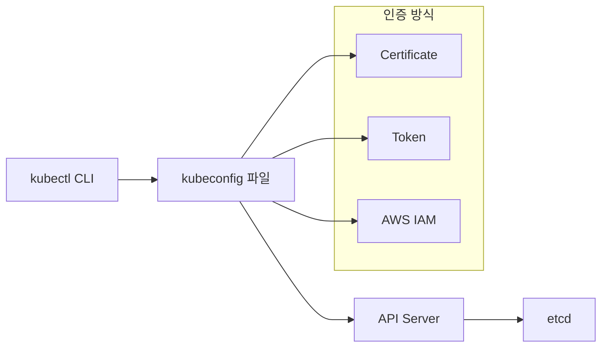

# Session 1: kubectl 설정 및 관리 (50분)

## 🎯 세션 목표
- kubectl과 kubeconfig 심화 이해
- 다중 클러스터 환경 관리
- 네임스페이스 및 컨텍스트 활용

## ⏰ 시간 배분
- **이론** (15분): kubectl, kubeconfig 심화 개념
- **실습** (35분): 클러스터 연결, 컨텍스트 관리

---

## 🎓 이론: kubectl & kubeconfig 심화 (15분)

### kubectl 아키텍처


### kubeconfig 구조
```yaml
apiVersion: v1
kind: Config
clusters:          # 클러스터 정보
- name: my-cluster
  cluster:
    server: https://api.server.url
    certificate-authority-data: [BASE64_CERT]

users:             # 사용자 인증 정보
- name: my-user
  user:
    exec:          # AWS IAM 인증
      apiVersion: client.authentication.k8s.io/v1beta1
      command: aws
      args: ["eks", "get-token", "--cluster-name", "my-cluster"]

contexts:          # 클러스터 + 사용자 + 네임스페이스 조합
- name: my-context
  context:
    cluster: my-cluster
    user: my-user
    namespace: default

current-context: my-context
```

### 다중 환경 관리 전략
- **개발/스테이징/프로덕션** 클러스터 분리
- **네임스페이스**로 환경 격리
- **컨텍스트 스위칭**으로 빠른 전환

---

## 🛠️ 실습: 클러스터 연결 및 컨텍스트 관리 (35분)

### 1. 현재 kubeconfig 분석 (10분)

#### kubeconfig 파일 위치 확인
```bash
# 기본 kubeconfig 파일 위치
echo $KUBECONFIG
ls -la ~/.kube/config

# kubeconfig 내용 확인
kubectl config view

# 민감 정보 포함해서 보기
kubectl config view --raw
```

#### 현재 설정 상태 확인
```bash
# 현재 컨텍스트
kubectl config current-context

# 모든 컨텍스트 보기
kubectl config get-contexts

# 클러스터 목록
kubectl config get-clusters

# 사용자 목록
kubectl config get-users
```

### 2. 네임스페이스 관리 (10분)

#### 네임스페이스 생성 및 관리
```bash
# 네임스페이스 목록 확인
kubectl get namespaces

# 새 네임스페이스 생성
kubectl create namespace development
kubectl create namespace staging
kubectl create namespace production

# 네임스페이스 상세 정보
kubectl describe namespace development

# 네임스페이스에 라벨 추가
kubectl label namespace development env=dev
kubectl label namespace staging env=staging
kubectl label namespace production env=prod
```

#### 기본 네임스페이스 변경
```bash
# 현재 컨텍스트의 네임스페이스 변경
kubectl config set-context --current --namespace=development

# 확인
kubectl config view --minify | grep namespace

# 기본 네임스페이스로 되돌리기
kubectl config set-context --current --namespace=default
```

### 3. 컨텍스트 관리 (10분)

#### 새로운 컨텍스트 생성
```bash
# development 환경용 컨텍스트 생성
kubectl config set-context dev-context \
  --cluster=my-eks-cluster.ap-northeast-2.eksctl.io \
  --user=my-user@my-eks-cluster.ap-northeast-2.eksctl.io \
  --namespace=development

# staging 환경용 컨텍스트 생성
kubectl config set-context staging-context \
  --cluster=my-eks-cluster.ap-northeast-2.eksctl.io \
  --user=my-user@my-eks-cluster.ap-northeast-2.eksctl.io \
  --namespace=staging

# 컨텍스트 목록 확인
kubectl config get-contexts
```

#### 컨텍스트 전환
```bash
# development 컨텍스트로 전환
kubectl config use-context dev-context

# 현재 네임스페이스 확인
kubectl config view --minify | grep namespace

# 기본 컨텍스트로 되돌리기
kubectl config use-context arn:aws:eks:ap-northeast-2:ACCOUNT:cluster/my-eks-cluster
```

### 4. kubectl 별칭 및 자동완성 설정 (5분)

#### 유용한 별칭 설정
```bash
# ~/.bashrc 또는 ~/.zshrc에 추가
alias k=kubectl
alias kgp='kubectl get pods'
alias kgs='kubectl get services'
alias kgd='kubectl get deployments'
alias kaf='kubectl apply -f'
alias kdel='kubectl delete'

# 컨텍스트 전환 별칭
alias kdev='kubectl config use-context dev-context'
alias kstg='kubectl config use-context staging-context'
alias kprd='kubectl config use-context prod-context'

# 별칭 적용
source ~/.bashrc
```

#### kubectl 자동완성 설정
```bash
# bash 자동완성 설정
echo 'source <(kubectl completion bash)' >>~/.bashrc
echo 'complete -F __start_kubectl k' >>~/.bashrc

# zsh 자동완성 설정 (zsh 사용시)
echo 'source <(kubectl completion zsh)' >>~/.zshrc
echo 'complete -F __start_kubectl k' >>~/.zshrc

# 즉시 적용
source ~/.bashrc
```

---

## ✅ 세션 완료 체크리스트

### 이론 이해도 확인
- [ ] kubeconfig 파일 구조 이해
- [ ] 클러스터, 사용자, 컨텍스트 개념 파악
- [ ] 네임스페이스의 역할 이해

### 실습 완료 확인
- [ ] kubeconfig 파일 내용 분석 완료
- [ ] 3개 네임스페이스 생성 (development, staging, production)
- [ ] 컨텍스트 생성 및 전환 성공
- [ ] kubectl 별칭 및 자동완성 설정 완료

### 환경 상태 확인
```bash
# 네임스페이스 확인
kubectl get namespaces --show-labels

# 컨텍스트 확인
kubectl config get-contexts

# 현재 설정 확인
kubectl config current-context
kubectl config view --minify
```

---

## 🔄 다음 세션 준비
Session 2에서는 각 네임스페이스에 실제 워크로드를 배포해보겠습니다.

### 준비사항
- 생성한 네임스페이스들이 정상 상태인지 확인
- kubectl 명령어가 원활하게 작동하는지 테스트
