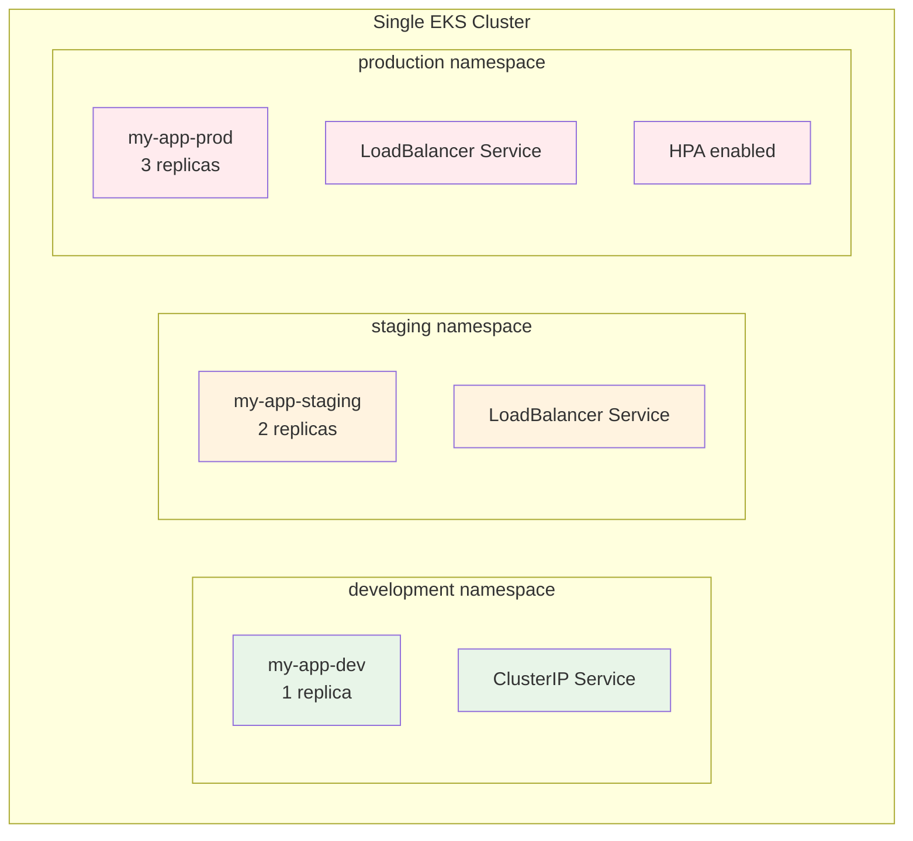
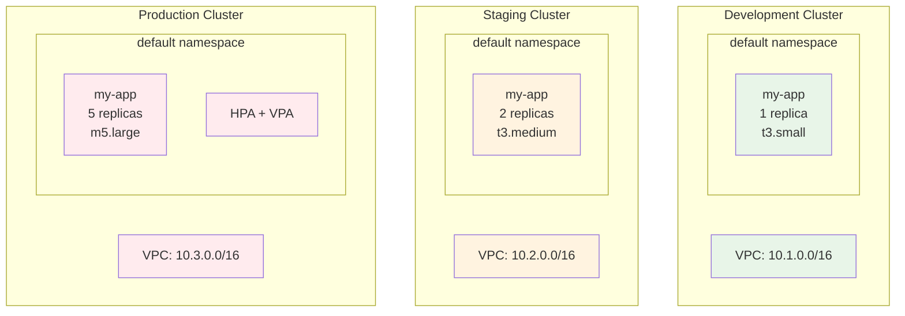
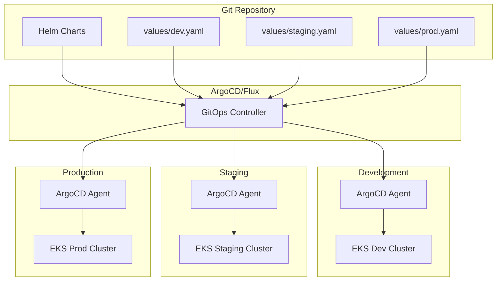

# Session 1: Helm 기초 및 설치 (50분)

## 🎯 세션 목표
- Helm의 필요성과 아키텍처 이해
- Chart 구조 및 템플릿 시스템 학습
- 기본 Chart 생성 및 구조 분석

## ⏰ 시간 배분
- **이론** (20분): Helm 개념, Chart 구조
- **실습** (30분): Helm 설치, 기본 Chart 생성

---

## 🎓 이론: Helm 아키텍처 및 개념 (20분)

### Helm이란?
Helm은 Kubernetes의 **패키지 매니저**로, 복잡한 애플리케이션을 쉽게 배포하고 관리할 수 있게 해줍니다.

### Helm의 필요성


### Helm 핵심 개념
- **Chart**: Kubernetes 리소스를 정의하는 패키지
- **Release**: 클러스터에 설치된 Chart 인스턴스
- **Repository**: Chart들이 저장되는 저장소
- **Values**: Chart 설정을 위한 변수들

### Chart 구조
```
my-chart/
├── Chart.yaml          # Chart 메타데이터
├── values.yaml         # 기본 설정값
├── templates/          # Kubernetes 매니페스트 템플릿
│   ├── deployment.yaml
│   ├── service.yaml
│   ├── configmap.yaml
│   └── _helpers.tpl    # 템플릿 헬퍼 함수
├── charts/             # 의존성 Chart들
└── .helmignore         # 패키징 시 제외할 파일들
```

### 템플릿 시스템
```yaml
# templates/deployment.yaml
apiVersion: apps/v1
kind: Deployment
metadata:
  name: {{ .Values.appName }}
  labels:
    app: {{ .Values.appName }}
spec:
  replicas: {{ .Values.replicaCount }}
  selector:
    matchLabels:
      app: {{ .Values.appName }}
  template:
    spec:
      containers:
      - name: {{ .Values.appName }}
        image: {{ .Values.image.repository }}:{{ .Values.image.tag }}
        ports:
        - containerPort: {{ .Values.service.port }}
```

---

## 🛠️ 실습: Helm 설치 및 기본 Chart 생성 (30분)

### 1. Helm 설치 (5분)

#### Helm 설치 확인
```bash
# Helm 버전 확인
helm version

# 설치되지 않은 경우 설치
curl https://raw.githubusercontent.com/helm/helm/main/scripts/get-helm-3 | bash

# 설치 확인
helm version --short
```

#### Helm 기본 설정
```bash
# Helm 저장소 추가
helm repo add stable https://charts.helm.sh/stable
helm repo add bitnami https://charts.bitnami.com/bitnami

# 저장소 업데이트
helm repo update

# 저장소 목록 확인
helm repo list
```

### 2. 기존 Chart 설치 테스트 (10분)

#### 간단한 Chart 설치
```bash
# nginx Chart 검색
helm search repo nginx

# nginx Chart 설치
helm install my-nginx bitnami/nginx -n development

# 설치 상태 확인
helm list -n development
kubectl get all -n development -l app.kubernetes.io/instance=my-nginx

# Chart 정보 확인
helm show chart bitnami/nginx
helm show values bitnami/nginx
```

#### Release 관리
```bash
# Release 상태 확인
helm status my-nginx -n development

# Release 히스토리
helm history my-nginx -n development

# Release 삭제
helm uninstall my-nginx -n development
```

### 3. 커스텀 Chart 생성 (15분)

#### 새 Chart 생성
```bash
# Chart 생성
helm create my-web-app

# Chart 구조 확인
tree my-web-app/
ls -la my-web-app/
```

#### Chart.yaml 분석
```yaml
# my-web-app/Chart.yaml
apiVersion: v2
name: my-web-app
description: A Helm chart for Kubernetes
type: application
version: 0.1.0
appVersion: "1.16.0"
```

#### values.yaml 분석
```yaml
# my-web-app/values.yaml (주요 부분)
replicaCount: 1

image:
  repository: nginx
  pullPolicy: IfNotPresent
  tag: ""

service:
  type: ClusterIP
  port: 80

ingress:
  enabled: false

resources: {}

autoscaling:
  enabled: false
  minReplicas: 1
  maxReplicas: 100
```

#### 템플릿 파일 분석
```bash
# 주요 템플릿 파일들 확인
cat my-web-app/templates/deployment.yaml
cat my-web-app/templates/service.yaml
cat my-web-app/templates/_helpers.tpl
```

#### Chart 검증
```bash
# Chart 문법 검증
helm lint my-web-app/

# 템플릿 렌더링 테스트
helm template my-web-app ./my-web-app/

# 특정 값으로 렌더링 테스트
helm template my-web-app ./my-web-app/ --set replicaCount=3
```

---

## ✅ 세션 완료 체크리스트

### 이론 이해도 확인
- [ ] Helm의 필요성과 장점 이해
- [ ] Chart, Release, Repository 개념 파악
- [ ] Chart 구조 및 템플릿 시스템 이해

### 실습 완료 확인
- [ ] Helm 설치 및 기본 설정 완료
- [ ] 기존 Chart 설치/삭제 경험
- [ ] 커스텀 Chart 생성 및 구조 분석 완료
- [ ] Chart 검증 및 템플릿 렌더링 테스트 성공

### 환경 상태 확인
```bash
# Helm 설치 확인
helm version

# Chart 생성 확인
ls -la my-web-app/

# Chart 검증
helm lint my-web-app/
```

## 🏗️ 실제 운영 환경 배포 전략 이해

### 환경 분리 전략 비교

#### 1. 네임스페이스 기반 분리 (교육용)


**장점**: 비용 효율적, 리소스 공유, 관리 단순
**단점**: 보안 격리 부족, 리소스 경합, 장애 전파 위험

#### 2. 클러스터 기반 분리 (실제 운영)


**장점**: 완전한 격리, 독립적 스케일링, 보안 강화
**단점**: 비용 증가, 관리 복잡성, 리소스 중복

### 실제 운영에서의 Helm 사용법

#### kubeconfig 컨텍스트 관리
```bash
# 각 클러스터의 kubeconfig 설정
aws eks update-kubeconfig --region ap-northeast-2 --name dev-cluster --alias dev
aws eks update-kubeconfig --region ap-northeast-2 --name staging-cluster --alias staging  
aws eks update-kubeconfig --region us-east-1 --name prod-cluster --alias prod

# 컨텍스트 확인 및 전환
kubectl config get-contexts
kubectl config use-context dev
```

#### 환경별 Values 파일 전략
```bash
# 실제 운영 Values 구조
values/
├── common.yaml              # 공통 설정
├── environments/
│   ├── dev.yaml            # 개발 환경
│   ├── staging.yaml        # 스테이징 환경
│   └── prod.yaml           # 운영 환경
└── regions/
    ├── ap-northeast-2.yaml # 서울 리전
    └── us-east-1.yaml      # 버지니아 리전
```

### GitOps 기반 멀티 클러스터 배포


### 💡 교육 과정에서의 접근법
- **Session 1**: 개념 이해 (네임스페이스 vs 클러스터)
- **Session 2**: 실습 (네임스페이스 기반으로 시작)
- **고급 과정**: 멀티 클러스터 실제 구현

---

## 🔄 다음 세션 준비
Session 2에서는 생성한 Chart를 커스터마이징하고 실제로 배포해보겠습니다.

### 준비사항
- 생성한 my-web-app Chart가 정상 상태인지 확인
- values.yaml 파일 내용 숙지
