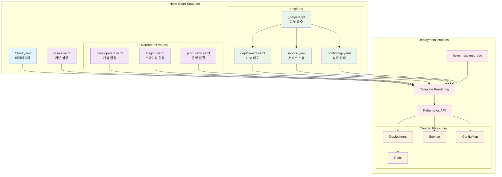
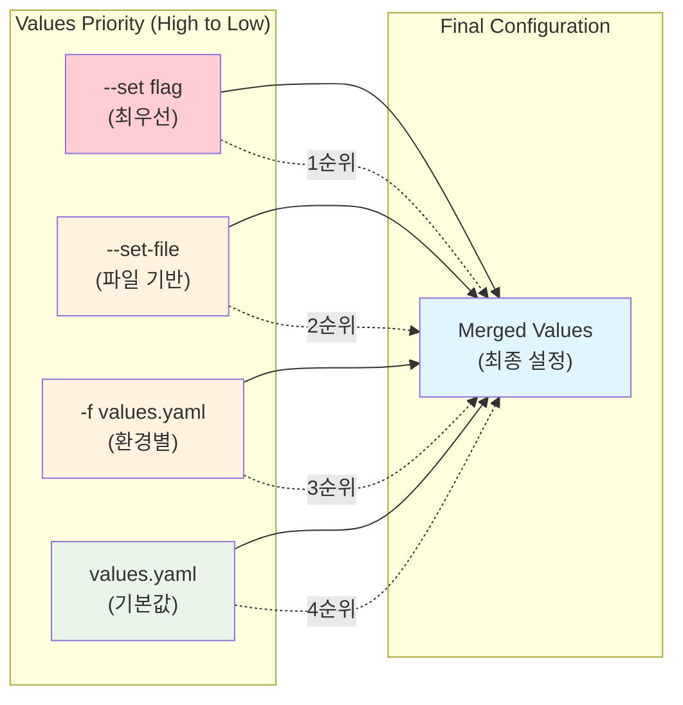
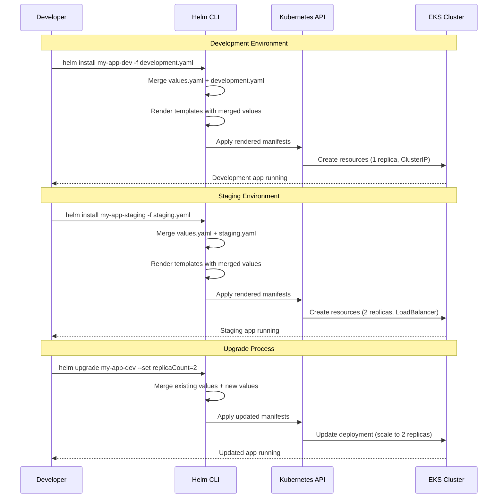

# Session 2: Chart 커스터마이징 및 배포 (50분)

## 🎯 세션 목표
- Values 파일을 통한 Chart 커스터마이징
- 환경별 설정 관리
- Chart 배포 및 업그레이드 실습

## ⏰ 시간 배분
- **실습** (40분): Values 파일 수정, 템플릿 커스터마이징
- **정리** (10분): 체크포인트 확인

---

### Helm Chart 구성도


### Values 파일 우선순위


### 환경별 배포 플로우


---

## 🛠️ 실습: Chart 커스터마이징 및 배포 (40분)

### 1. Values 파일 커스터마이징 (15분)

#### 기본 values.yaml 수정
```bash
# my-web-app/values.yaml 편집
cat > my-web-app/values.yaml << 'EOF'
replicaCount: 2

image:
  repository: nginx
  pullPolicy: IfNotPresent
  tag: "1.21"

nameOverride: ""
fullnameOverride: ""

service:
  type: LoadBalancer
  port: 80

ingress:
  enabled: false

resources:
  limits:
    cpu: 500m
    memory: 512Mi
  requests:
    cpu: 250m
    memory: 256Mi

autoscaling:
  enabled: false

nodeSelector: {}
tolerations: []
affinity: {}

# 커스텀 설정 추가
app:
  name: my-web-app
  environment: development
  
config:
  message: "Hello from Helm Chart!"
  debug: true
EOF
```

#### 환경별 Values 파일 생성
```bash
# 환경별 디렉토리 생성
mkdir -p values/

# Development 환경 설정
cat > values/development.yaml << 'EOF'
replicaCount: 1

image:
  tag: "1.21"

service:
  type: ClusterIP

app:
  environment: development

config:
  message: "Development Environment"
  debug: true

resources:
  requests:
    cpu: 100m
    memory: 128Mi
EOF

# Staging 환경 설정
cat > values/staging.yaml << 'EOF'
replicaCount: 2

image:
  tag: "1.21"

service:
  type: LoadBalancer

app:
  environment: staging

config:
  message: "Staging Environment"
  debug: false

resources:
  requests:
    cpu: 250m
    memory: 256Mi
  limits:
    cpu: 500m
    memory: 512Mi
EOF

# Production 환경 설정
cat > values/production.yaml << 'EOF'
replicaCount: 3

image:
  tag: "1.21"

service:
  type: LoadBalancer

app:
  environment: production

config:
  message: "Production Environment"
  debug: false

resources:
  requests:
    cpu: 500m
    memory: 512Mi
  limits:
    cpu: 1000m
    memory: 1Gi

autoscaling:
  enabled: true
  minReplicas: 3
  maxReplicas: 10
  targetCPUUtilizationPercentage: 80
EOF
```

### 2. 템플릿 커스터마이징 (10분)

#### ConfigMap 템플릿 추가
```bash
# ConfigMap 템플릿 생성
cat > my-web-app/templates/configmap.yaml << 'EOF'
apiVersion: v1
kind: ConfigMap
metadata:
  name: {{ include "my-web-app.fullname" . }}-config
  labels:
    {{- include "my-web-app.labels" . | nindent 4 }}
data:
  message: {{ .Values.config.message | quote }}
  debug: {{ .Values.config.debug | quote }}
  environment: {{ .Values.app.environment | quote }}
  nginx.conf: |
    server {
        listen 80;
        server_name localhost;
        
        location / {
            root /usr/share/nginx/html;
            index index.html index.htm;
        }
        
        location /health {
            access_log off;
            return 200 "healthy\n";
            add_header Content-Type text/plain;
        }
    }
EOF
```

#### Deployment 템플릿 수정
```bash
# Deployment에 ConfigMap 마운트 추가
cat > my-web-app/templates/deployment.yaml << 'EOF'
apiVersion: apps/v1
kind: Deployment
metadata:
  name: {{ include "my-web-app.fullname" . }}
  labels:
    {{- include "my-web-app.labels" . | nindent 4 }}
spec:
  {{- if not .Values.autoscaling.enabled }}
  replicas: {{ .Values.replicaCount }}
  {{- end }}
  selector:
    matchLabels:
      {{- include "my-web-app.selectorLabels" . | nindent 6 }}
  template:
    metadata:
      labels:
        {{- include "my-web-app.selectorLabels" . | nindent 8 }}
    spec:
      containers:
        - name: {{ .Chart.Name }}
          image: "{{ .Values.image.repository }}:{{ .Values.image.tag | default .Chart.AppVersion }}"
          imagePullPolicy: {{ .Values.image.pullPolicy }}
          ports:
            - name: http
              containerPort: 80
              protocol: TCP
          livenessProbe:
            httpGet:
              path: /health
              port: http
            initialDelaySeconds: 30
            periodSeconds: 10
          readinessProbe:
            httpGet:
              path: /health
              port: http
            initialDelaySeconds: 5
            periodSeconds: 5
          resources:
            {{- toYaml .Values.resources | nindent 12 }}
          env:
            - name: ENVIRONMENT
              valueFrom:
                configMapKeyRef:
                  name: {{ include "my-web-app.fullname" . }}-config
                  key: environment
            - name: DEBUG
              valueFrom:
                configMapKeyRef:
                  name: {{ include "my-web-app.fullname" . }}-config
                  key: debug
          volumeMounts:
            - name: nginx-config
              mountPath: /etc/nginx/conf.d
      volumes:
        - name: nginx-config
          configMap:
            name: {{ include "my-web-app.fullname" . }}-config
            items:
              - key: nginx.conf
                path: default.conf
EOF
```

### 3. Chart 배포 및 관리 (15분)

#### Development 환경 배포
```bash
# 템플릿 렌더링 확인
helm template my-web-app ./my-web-app/ -f values/development.yaml

# Development 환경에 배포
helm install my-web-app-dev ./my-web-app/ \
  -f values/development.yaml \
  -n development

# 배포 상태 확인
helm status my-web-app-dev -n development
kubectl get all -n development -l app.kubernetes.io/instance=my-web-app-dev
```

#### Staging 환경 배포
```bash
# Staging 환경에 배포
helm install my-web-app-staging ./my-web-app/ \
  -f values/staging.yaml \
  -n staging

# 배포 상태 확인
helm status my-web-app-staging -n staging
kubectl get all -n staging -l app.kubernetes.io/instance=my-web-app-staging
```

#### Chart 업그레이드
```bash
# Values 파일 수정 (레플리카 수 증가)
helm upgrade my-web-app-dev ./my-web-app/ \
  -f values/development.yaml \
  --set replicaCount=2 \
  -n development

# 업그레이드 확인
helm history my-web-app-dev -n development
kubectl get pods -n development -l app.kubernetes.io/instance=my-web-app-dev
```

#### 롤백 테스트
```bash
# 이전 버전으로 롤백
helm rollback my-web-app-dev 1 -n development

# 롤백 확인
helm history my-web-app-dev -n development
kubectl get pods -n development -l app.kubernetes.io/instance=my-web-app-dev
```

#### Chart 패키징
```bash
# Chart 패키징
helm package my-web-app/

# 패키지 파일 확인
ls -la *.tgz

# 패키지에서 설치 테스트
helm install my-web-app-package ./my-web-app-0.1.0.tgz \
  --set replicaCount=1 \
  -n development \
  --dry-run
```

---

## ✅ 체크포인트 (10분)

### 완료 확인 사항
- [ ] 환경별 Values 파일 생성 완료
- [ ] ConfigMap 템플릿 추가 및 Deployment 수정 완료
- [ ] Development와 Staging 환경에 Chart 배포 성공
- [ ] Chart 업그레이드 및 롤백 테스트 완료

### 배포된 Release 확인
```bash
# 모든 네임스페이스의 Helm Release 확인
helm list --all-namespaces

# 각 환경별 상태 확인
helm status my-web-app-dev -n development
helm status my-web-app-staging -n staging

# 배포된 리소스 확인
kubectl get all -n development -l app.kubernetes.io/managed-by=Helm
kubectl get all -n staging -l app.kubernetes.io/managed-by=Helm
```

### ConfigMap 및 환경 변수 확인
```bash
# ConfigMap 내용 확인
kubectl get configmap -n development -l app.kubernetes.io/instance=my-web-app-dev
kubectl describe configmap my-web-app-dev-config -n development

# Pod 환경 변수 확인
POD_NAME=$(kubectl get pods -n development -l app.kubernetes.io/instance=my-web-app-dev -o jsonpath='{.items[0].metadata.name}')
kubectl exec -n development $POD_NAME -- env | grep -E "(ENVIRONMENT|DEBUG)"
```

---

## 🎯 세션 완료 후 상태

### 배포된 Chart Release
```
Development 네임스페이스:
└── my-web-app-dev (Release)
    ├── Deployment (1 replica)
    ├── Service (ClusterIP)
    └── ConfigMap (환경 설정)

Staging 네임스페이스:
└── my-web-app-staging (Release)
    ├── Deployment (2 replicas)
    ├── Service (LoadBalancer)
    └── ConfigMap (환경 설정)
```

### Chart 구조
```
my-web-app/
├── Chart.yaml
├── values.yaml (기본 설정)
├── values/ (환경별 설정)
│   ├── development.yaml
│   ├── staging.yaml
│   └── production.yaml
└── templates/
    ├── deployment.yaml (수정됨)
    ├── service.yaml
    ├── configmap.yaml (추가됨)
    └── _helpers.tpl
```

## 🔄 다음 세션 준비

### Day 4 예습 내용
- 컨테이너 이미지 빌드 프로세스
- ECR (Elastic Container Registry) 사용법
- 멀티 티어 애플리케이션 아키텍처

### 숙제
1. 배포한 애플리케이션들이 정상 작동하는지 확인
2. Helm 명령어 치트시트 숙지
3. Chart 템플릿 문법 기본 학습

### 정리 작업 (선택사항)
```bash
# Release 정리 (다음 세션에서 사용하지 않을 경우)
helm uninstall my-web-app-dev -n development
helm uninstall my-web-app-staging -n staging

# 패키지 파일 정리
rm -f *.tgz
```

---

## 🛠️ 추가: Helm 고급 기능 (보너스)

### Helm Dashboard 설치
```bash
# Helm Dashboard 설치 (웹 UI)
helm plugin install https://github.com/komodorio/helm-dashboard.git

# Dashboard 실행
helm dashboard &
echo "Helm Dashboard: http://localhost:8080"
```

### Chart 테스팅 및 검증
```bash
# Chart 테스트 추가
cat > my-web-app/templates/tests/test-connection.yaml << 'EOF'
apiVersion: v1
kind: Pod
metadata:
  name: "{{ include "my-web-app.fullname" . }}-test"
  labels:
    {{- include "my-web-app.labels" . | nindent 4 }}
  annotations:
    "helm.sh/hook": test
spec:
  restartPolicy: Never
  containers:
    - name: wget
      image: busybox
      command: ['wget']
      args: ['{{ include "my-web-app.fullname" . }}:{{ .Values.service.port }}']
EOF

# 테스트 실행
helm test my-web-app-dev -n development

# Chart 보안 스캔 (Checkov)
pip install checkov
checkov -f my-web-app/templates/ --framework helm
```

### 고급 Values 관리
```bash
# 환경별 Values 병합
helm template my-web-app ./my-web-app/ \
  -f values/development.yaml \
  -f values/secrets.yaml \
  --set image.tag=v1.1.0

# Values 스키마 검증
cat > my-web-app/values.schema.json << 'EOF'
{
  "$schema": "https://json-schema.org/draft-07/schema#",
  "type": "object",
  "properties": {
    "replicaCount": {
      "type": "integer",
      "minimum": 1
    },
    "image": {
      "type": "object",
      "properties": {
        "repository": {"type": "string"},
        "tag": {"type": "string"}
      },
      "required": ["repository", "tag"]
    }
  }
}
EOF
```
