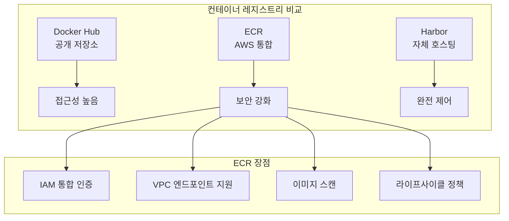

# Session 1: 컨테이너 이미지 관리 (50분)

## 🎯 세션 목표
- ECR (Elastic Container Registry) 이해 및 활용
- 컨테이너 이미지 빌드 및 푸시 프로세스
- 이미지 태깅 전략 및 보안 관리

## ⏰ 시간 배분
- **이론** (15분): ECR, 이미지 전략
- **실습** (35분): ECR 연동, 이미지 푸시

---

## 🎓 이론: ECR 및 이미지 전략 (15분)

### ECR (Elastic Container Registry)란?
AWS에서 제공하는 **완전 관리형 컨테이너 레지스트리** 서비스입니다.

### ECR vs 다른 레지스트리


### 이미지 태깅 전략
| 전략 | 예시 | 용도 |
|------|------|------|
| **Semantic Versioning** | `v1.2.3` | 프로덕션 릴리스 |
| **Git Commit** | `abc1234` | 개발 빌드 |
| **Environment** | `dev`, `staging`, `prod` | 환경별 구분 |
| **Latest** | `latest` | 최신 개발 버전 |

### ECR 보안 기능
- **이미지 스캔**: 취약점 자동 검사
- **IAM 통합**: 세밀한 권한 제어
- **암호화**: 저장 및 전송 중 암호화
- **VPC 엔드포인트**: 프라이빗 네트워크 접근

---

## 🛠️ 실습: ECR 연동 및 이미지 푸시 (35분)

### 1. ECR 저장소 생성 (10분)

#### AWS 계정 정보 확인
```bash
# 현재 AWS 계정 ID 확인
ACCOUNT_ID=$(aws sts get-caller-identity --query Account --output text)
REGION="ap-northeast-2"
echo "Account ID: $ACCOUNT_ID"
echo "Region: $REGION"
```

#### ECR 저장소 생성
```bash
# 애플리케이션별 저장소 생성
aws ecr create-repository \
    --repository-name frontend-app \
    --region $REGION

aws ecr create-repository \
    --repository-name backend-api \
    --region $REGION

aws ecr create-repository \
    --repository-name nginx-proxy \
    --region $REGION

# 생성된 저장소 확인
aws ecr describe-repositories --region $REGION
```

#### ECR 로그인
```bash
# ECR 로그인 토큰 획득 및 Docker 로그인
aws ecr get-login-password --region $REGION | \
    docker login --username AWS --password-stdin \
    $ACCOUNT_ID.dkr.ecr.$REGION.amazonaws.com

# 로그인 확인
docker system info | grep -A 5 "Registry Mirrors"
```

### 2. 샘플 애플리케이션 준비 (10분)

#### Frontend 애플리케이션 (React)
```bash
# 작업 디렉토리 생성
mkdir -p apps/frontend
cd apps/frontend

# 간단한 React 앱 Dockerfile 생성
cat > Dockerfile << 'EOF'
FROM node:18-alpine AS builder
WORKDIR /app
COPY package*.json ./
RUN npm ci --only=production

COPY . .
RUN npm run build

FROM nginx:alpine
COPY --from=builder /app/build /usr/share/nginx/html
COPY nginx.conf /etc/nginx/nginx.conf
EXPOSE 80
CMD ["nginx", "-g", "daemon off;"]
EOF

# 간단한 package.json 생성
cat > package.json << 'EOF'
{
  "name": "frontend-app",
  "version": "1.0.0",
  "scripts": {
    "build": "echo 'Building frontend...' && mkdir -p build && echo '<h1>Frontend App v1.0.0</h1>' > build/index.html"
  }
}
EOF

# nginx 설정 파일
cat > nginx.conf << 'EOF'
events {
    worker_connections 1024;
}
http {
    server {
        listen 80;
        location / {
            root /usr/share/nginx/html;
            index index.html;
            try_files $uri $uri/ /index.html;
        }
    }
}
EOF

cd ../..
```

#### Backend API (Node.js)
```bash
# Backend 디렉토리 생성
mkdir -p apps/backend
cd apps/backend

# Backend Dockerfile 생성
cat > Dockerfile << 'EOF'
FROM node:18-alpine
WORKDIR /app
COPY package*.json ./
RUN npm ci --only=production
COPY . .
EXPOSE 3000
CMD ["node", "server.js"]
EOF

# 간단한 Express 서버
cat > package.json << 'EOF'
{
  "name": "backend-api",
  "version": "1.0.0",
  "main": "server.js",
  "dependencies": {
    "express": "^4.18.0"
  }
}
EOF

cat > server.js << 'EOF'
const express = require('express');
const app = express();
const port = 3000;

app.get('/api/health', (req, res) => {
  res.json({ status: 'healthy', version: '1.0.0', timestamp: new Date().toISOString() });
});

app.get('/api/data', (req, res) => {
  res.json({ 
    message: 'Hello from Backend API',
    data: [
      { id: 1, name: 'Item 1' },
      { id: 2, name: 'Item 2' }
    ]
  });
});

app.listen(port, () => {
  console.log(`Backend API listening at http://localhost:${port}`);
});
EOF

cd ../..
```

### 3. 이미지 빌드 및 푸시 (15분)

#### Frontend 이미지 빌드 및 푸시
```bash
# Frontend 이미지 빌드
cd apps/frontend
docker build -t frontend-app:v1.0.0 .

# ECR 태그 추가
docker tag frontend-app:v1.0.0 \
    $ACCOUNT_ID.dkr.ecr.$REGION.amazonaws.com/frontend-app:v1.0.0

docker tag frontend-app:v1.0.0 \
    $ACCOUNT_ID.dkr.ecr.$REGION.amazonaws.com/frontend-app:latest

# ECR에 푸시
docker push $ACCOUNT_ID.dkr.ecr.$REGION.amazonaws.com/frontend-app:v1.0.0
docker push $ACCOUNT_ID.dkr.ecr.$REGION.amazonaws.com/frontend-app:latest

cd ../..
```

#### Backend 이미지 빌드 및 푸시
```bash
# Backend 이미지 빌드
cd apps/backend
docker build -t backend-api:v1.0.0 .

# ECR 태그 추가
docker tag backend-api:v1.0.0 \
    $ACCOUNT_ID.dkr.ecr.$REGION.amazonaws.com/backend-api:v1.0.0

docker tag backend-api:v1.0.0 \
    $ACCOUNT_ID.dkr.ecr.$REGION.amazonaws.com/backend-api:latest

# ECR에 푸시
docker push $ACCOUNT_ID.dkr.ecr.$REGION.amazonaws.com/backend-api:v1.0.0
docker push $ACCOUNT_ID.dkr.ecr.$REGION.amazonaws.com/backend-api:latest

cd ../..
```

#### ECR 이미지 확인
```bash
# 푸시된 이미지 확인
aws ecr list-images --repository-name frontend-app --region $REGION
aws ecr list-images --repository-name backend-api --region $REGION

# 이미지 상세 정보 확인
aws ecr describe-images \
    --repository-name frontend-app \
    --region $REGION \
    --query 'imageDetails[*].[imageTags[0],imageSizeInBytes,imagePushedAt]' \
    --output table
```

#### 이미지 스캔 활성화
```bash
# 이미지 스캔 설정 활성화
aws ecr put-image-scanning-configuration \
    --repository-name frontend-app \
    --image-scanning-configuration scanOnPush=true \
    --region $REGION

aws ecr put-image-scanning-configuration \
    --repository-name backend-api \
    --image-scanning-configuration scanOnPush=true \
    --region $REGION

# 스캔 결과 확인 (푸시 후 몇 분 소요)
aws ecr describe-image-scan-findings \
    --repository-name frontend-app \
    --image-id imageTag=v1.0.0 \
    --region $REGION
```

---

## ✅ 세션 완료 체크리스트

### 이론 이해도 확인
- [ ] ECR의 장점과 특징 이해
- [ ] 이미지 태깅 전략 파악
- [ ] ECR 보안 기능 이해

### 실습 완료 확인
- [ ] ECR 저장소 생성 완료
- [ ] Docker 이미지 빌드 성공
- [ ] ECR에 이미지 푸시 완료
- [ ] 이미지 스캔 설정 완료

### 환경 상태 확인
```bash
# ECR 저장소 확인
aws ecr describe-repositories --region $REGION --query 'repositories[*].repositoryName'

# 푸시된 이미지 확인
aws ecr list-images --repository-name frontend-app --region $REGION
aws ecr list-images --repository-name backend-api --region $REGION

# Docker 이미지 확인
docker images | grep -E "(frontend-app|backend-api)"
```

---

## 🔄 다음 세션 준비
Session 2에서는 ECR에 푸시한 이미지를 사용해서 멀티 티어 애플리케이션을 배포하겠습니다.

### 준비사항
- ECR 저장소에 이미지가 정상적으로 푸시되었는지 확인
- 이미지 URI 정보 기록 (다음 세션에서 사용)
