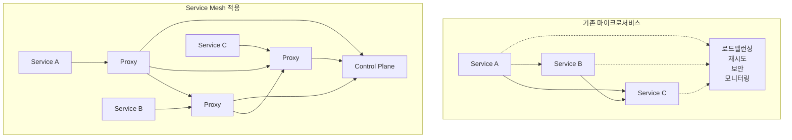
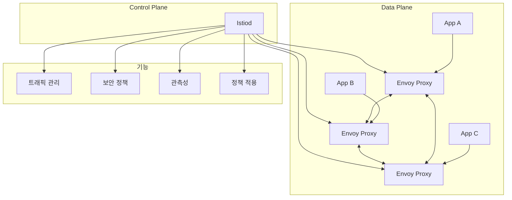

# Session 1: Istio 설치 및 기본 설정 (50분)

## 🎯 세션 목표
- Service Mesh 개념 및 Istio 아키텍처 이해
- Istio 설치 및 기본 구성 요소 확인
- 사이드카 프록시 주입 및 동작 원리 학습

## ⏰ 시간 배분
- **이론** (15분): Service Mesh 개념, Istio 아키텍처
- **실습** (35분): Istio 설치, 사이드카 주입

---

## 🎓 이론: Service Mesh 및 Istio 아키텍처 (15분)

### Service Mesh란?
마이크로서비스 간 **통신을 관리하는 인프라 계층**으로, 애플리케이션 코드 변경 없이 네트워킹 기능을 제공합니다.

### Service Mesh의 필요성


### Istio 아키텍처


### Istio 핵심 구성 요소
- **Istiod**: Control Plane (Pilot + Citadel + Galley 통합)
- **Envoy Proxy**: Data Plane 사이드카
- **Gateway**: 외부 트래픽 진입점
- **VirtualService**: 트래픽 라우팅 규칙
- **DestinationRule**: 로드 밸런싱 정책

---

## 🛠️ 실습: Istio 설치 및 사이드카 주입 (35분)

### 1. Istio 설치 (15분)

#### Istio CLI 설치
```bash
# Istio 다운로드 및 설치
curl -L https://istio.io/downloadIstio | sh -

# 최신 버전 디렉토리로 이동
cd istio-*

# PATH에 istioctl 추가
export PATH=$PWD/bin:$PATH

# 설치 확인
istioctl version --remote=false
```

#### Istio Control Plane 설치
```bash
# 사전 검사
istioctl analyze

# Istio 설치 (demo 프로필 사용)
istioctl install --set values.defaultRevision=default -y

# 설치 확인
kubectl get pods -n istio-system
kubectl get services -n istio-system
```

#### Istio 구성 요소 확인
```bash
# Istiod 상태 확인
kubectl get deployment istiod -n istio-system

# Istio Ingress Gateway 확인
kubectl get service istio-ingressgateway -n istio-system

# Istio 설정 확인
istioctl proxy-config cluster -n istio-system istiod-xxx
```

### 2. 네임스페이스 사이드카 주입 설정 (10분)

#### 자동 사이드카 주입 활성화
```bash
# production 네임스페이스에 사이드카 주입 라벨 추가
kubectl label namespace production istio-injection=enabled

# 라벨 확인
kubectl get namespace production --show-labels

# 기존 Pod 재시작 (사이드카 주입을 위해)
kubectl rollout restart deployment -n production
```

#### 사이드카 주입 확인
```bash
# Pod 상태 확인 (2/2 Ready 상태 확인)
kubectl get pods -n production

# 사이드카 컨테이너 확인
kubectl describe pod -n production -l app=backend-api

# Envoy 프록시 설정 확인
POD_NAME=$(kubectl get pods -n production -l app=backend-api -o jsonpath='{.items[0].metadata.name}')
istioctl proxy-config bootstrap $POD_NAME -n production
```

### 3. 기본 트래픽 확인 (10분)

#### 서비스 간 통신 테스트
```bash
# 백엔드 API 직접 호출
kubectl exec -n production -c backend deployment/backend-api -- curl -s http://mysql-service:3306

# 프론트엔드에서 백엔드 호출
kubectl exec -n production -c frontend deployment/frontend-app -- curl -s http://backend-service:3000/api/health
```

#### Envoy 프록시 통계 확인
```bash
# Envoy 관리 인터페이스 접근
kubectl port-forward -n production $POD_NAME 15000:15000 &

# 브라우저에서 http://localhost:15000 접근
# 또는 curl로 통계 확인
curl -s http://localhost:15000/stats | grep -E "(inbound|outbound)"

# 포트 포워딩 종료
pkill -f "kubectl port-forward"
```

#### Istio 프록시 로그 확인
```bash
# Envoy 사이드카 로그 확인
kubectl logs -n production $POD_NAME -c istio-proxy

# 실시간 로그 모니터링
kubectl logs -n production -l app=backend-api -c istio-proxy -f
```

---

## ✅ 세션 완료 체크리스트

### 이론 이해도 확인
- [ ] Service Mesh의 필요성과 장점 이해
- [ ] Istio 아키텍처 (Control Plane vs Data Plane) 파악
- [ ] 사이드카 프록시 패턴 이해

### 실습 완료 확인
- [ ] Istio Control Plane 설치 완료
- [ ] 네임스페이스에 사이드카 주입 활성화
- [ ] 모든 Pod에 Envoy 사이드카 주입 확인 (2/2 Ready)
- [ ] Envoy 프록시 통계 및 로그 확인 완료

### 환경 상태 확인
```bash
# Istio 시스템 상태 확인
kubectl get pods -n istio-system
istioctl analyze -n production

# 사이드카 주입 상태 확인
kubectl get pods -n production
kubectl get namespace production --show-labels

# Envoy 프록시 설정 확인
istioctl proxy-status
```

---

## 🔄 다음 세션 준비
Session 2에서는 Gateway와 VirtualService를 설정하여 트래픽을 제어하고 관측성 도구를 활용하겠습니다.

### 준비사항
- Istio가 정상적으로 설치되고 작동하는지 확인
- 모든 애플리케이션 Pod에 사이드카가 주입되었는지 확인
