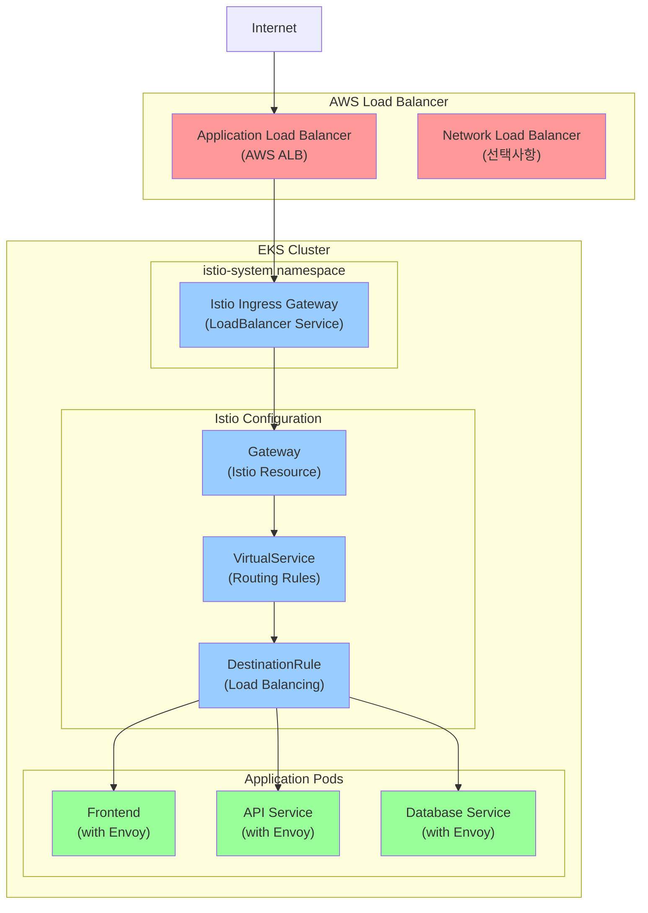
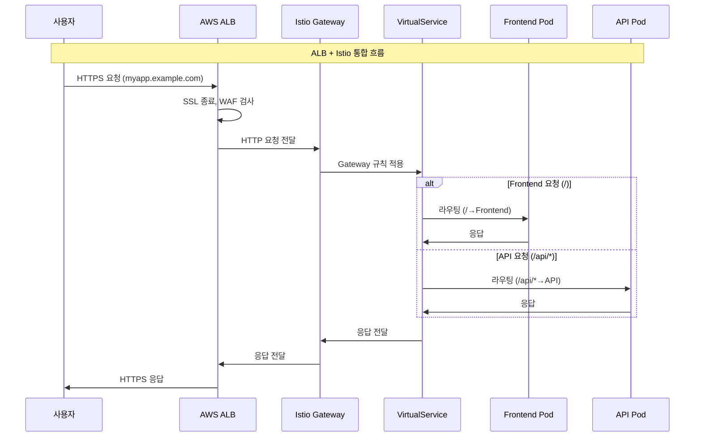
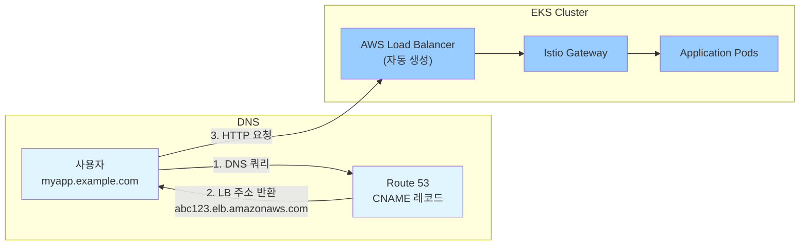
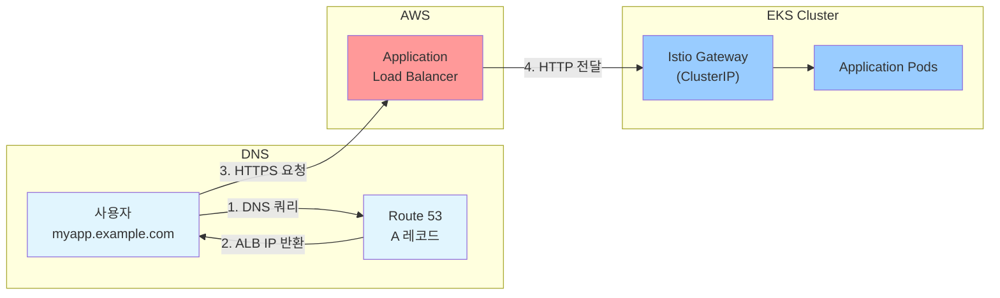

# Session 2: 트래픽 관리 및 관측성 (50분)

## 🎯 세션 목표
- Gateway와 VirtualService를 통한 트래픽 라우팅
- 로드 밸런싱 및 트래픽 분할 실습
- Kiali를 통한 서비스 메시 관측성 확인

## ⏰ 시간 배분
- **실습** (35분): Gateway, Virtual Service 설정
- **실습** (15분): Kiali 대시보드 확인

---

## 🏗️ Istio와 ALB 통합 아키텍처

### 실제 운영 환경에서의 트래픽 흐름


### ALB + Istio 통합의 장점
- **ALB**: SSL 종료, WAF, 인증서 관리, AWS 네이티브 기능
- **Istio Gateway**: 세밀한 트래픽 제어, 서비스 메시 기능, 카나리 배포

### 설정 방법 비교

#### 방법 1: ALB → Istio Gateway (권장)
```bash
# ALB Ingress Controller로 Istio Gateway 노출
cat > alb-istio-ingress.yaml << 'EOF'
apiVersion: networking.k8s.io/v1
kind: Ingress
metadata:
  name: istio-gateway-ingress
  namespace: istio-system
  annotations:
    kubernetes.io/ingress.class: alb
    alb.ingress.kubernetes.io/scheme: internet-facing
    alb.ingress.kubernetes.io/target-type: ip
    alb.ingress.kubernetes.io/certificate-arn: arn:aws:acm:region:account:certificate/cert-id
    alb.ingress.kubernetes.io/ssl-redirect: '443'
spec:
  rules:
  - host: myapp.example.com
    http:
      paths:
      - path: /
        pathType: Prefix
        backend:
          service:
            name: istio-ingressgateway
            port:
              number: 80
EOF

kubectl apply -f alb-istio-ingress.yaml
```

#### 방법 2: Istio Gateway만 사용 (현재 교육 과정)
```bash
# Istio Gateway를 LoadBalancer로 직접 노출
kubectl get service istio-ingressgateway -n istio-system
# TYPE: LoadBalancer (AWS에서 자동으로 CLB/NLB 생성)
```

## 🛠️ 실습: Gateway 및 VirtualService 설정 (35분)

### 1. Gateway 설정 (10분)

#### Istio Gateway 생성
```bash
# 외부 트래픽을 위한 Gateway 생성
cat > gateway.yaml << 'EOF'
apiVersion: networking.istio.io/v1beta1
kind: Gateway
metadata:
  name: frontend-gateway
  namespace: production
spec:
  selector:
    istio: ingressgateway
  servers:
  - port:
      number: 80
      name: http
      protocol: HTTP
    hosts:
    - "*"
EOF

kubectl apply -f gateway.yaml
```

#### Gateway 상태 확인
```bash
# Gateway 리소스 확인
kubectl get gateway -n production
kubectl describe gateway frontend-gateway -n production

# Istio Ingress Gateway 서비스 확인
kubectl get service istio-ingressgateway -n istio-system

# 외부 IP 확인
INGRESS_HOST=$(kubectl get service istio-ingressgateway -n istio-system -o jsonpath='{.status.loadBalancer.ingress[0].hostname}')
INGRESS_PORT=$(kubectl get service istio-ingressgateway -n istio-system -o jsonpath='{.spec.ports[?(@.name=="http2")].port}')
GATEWAY_URL="http://$INGRESS_HOST:$INGRESS_PORT"

echo "Gateway URL: $GATEWAY_URL"
```

### 2. VirtualService 설정 (15분)

#### 기본 VirtualService 생성
```bash
# 프론트엔드 VirtualService 생성
cat > virtualservice-frontend.yaml << 'EOF'
apiVersion: networking.istio.io/v1beta1
kind: VirtualService
metadata:
  name: frontend-vs
  namespace: production
spec:
  hosts:
  - "*"
  gateways:
  - frontend-gateway
  http:
  - match:
    - uri:
        prefix: /api/
    route:
    - destination:
        host: backend-service
        port:
          number: 3000
  - match:
    - uri:
        prefix: /
    route:
    - destination:
        host: frontend-service
        port:
          number: 80
EOF

kubectl apply -f virtualservice-frontend.yaml
```

#### 백엔드 트래픽 분할 VirtualService
```bash
# 백엔드 서비스용 VirtualService (트래픽 분할)
cat > virtualservice-backend.yaml << 'EOF'
apiVersion: networking.istio.io/v1beta1
kind: VirtualService
metadata:
  name: backend-vs
  namespace: production
spec:
  hosts:
  - backend-service
  http:
  - match:
    - headers:
        canary:
          exact: "true"
    route:
    - destination:
        host: backend-service
        subset: v2
      weight: 100
  - route:
    - destination:
        host: backend-service
        subset: v1
      weight: 90
    - destination:
        host: backend-service
        subset: v2
      weight: 10
EOF

kubectl apply -f virtualservice-backend.yaml
```

#### DestinationRule 설정
```bash
# 백엔드 서비스용 DestinationRule
cat > destinationrule-backend.yaml << 'EOF'
apiVersion: networking.istio.io/v1beta1
kind: DestinationRule
metadata:
  name: backend-dr
  namespace: production
spec:
  host: backend-service
  trafficPolicy:
    loadBalancer:
      simple: LEAST_CONN
  subsets:
  - name: v1
    labels:
      version: v1
    trafficPolicy:
      connectionPool:
        tcp:
          maxConnections: 10
        http:
          http1MaxPendingRequests: 10
          maxRequestsPerConnection: 2
  - name: v2
    labels:
      version: v2
    trafficPolicy:
      connectionPool:
        tcp:
          maxConnections: 20
        http:
          http1MaxPendingRequests: 20
          maxRequestsPerConnection: 5
EOF

kubectl apply -f destinationrule-backend.yaml
```

### 3. 트래픽 테스트 (10분)

#### 외부 접근 테스트
```bash
# Gateway를 통한 프론트엔드 접근
curl -s "$GATEWAY_URL/" | head -5

# Gateway를 통한 API 접근
curl -s "$GATEWAY_URL/api/health" | jq .

# 헤더를 통한 카나리 테스트
curl -s -H "canary: true" "$GATEWAY_URL/api/health" | jq .
```

#### 내부 트래픽 테스트
```bash
# 백엔드 서비스 직접 호출 (여러 번 실행하여 로드 밸런싱 확인)
for i in {1..10}; do
  kubectl exec -n production deployment/frontend-app -c frontend -- \
    curl -s http://backend-service:3000/api/health | jq -r '.timestamp'
done
```

#### 트래픽 분할 확인
```bash
# 트래픽 분할 테스트 (v1:90%, v2:10%)
for i in {1..20}; do
  kubectl exec -n production deployment/frontend-app -c frontend -- \
    curl -s http://backend-service:3000/api/health | jq -r '.version // "v1"'
done | sort | uniq -c
```

---

## 🛠️ 실습: Kiali 관측성 대시보드 (15분)

### 1. Kiali 설치 및 설정 (5분)

#### Kiali 설치
```bash
# Kiali 설치
kubectl apply -f https://raw.githubusercontent.com/istio/istio/release-1.20/samples/addons/kiali.yaml

# Prometheus 설치 (메트릭 수집용)
kubectl apply -f https://raw.githubusercontent.com/istio/istio/release-1.20/samples/addons/prometheus.yaml

# Grafana 설치 (대시보드용)
kubectl apply -f https://raw.githubusercontent.com/istio/istio/release-1.20/samples/addons/grafana.yaml

# 설치 확인
kubectl get pods -n istio-system | grep -E "(kiali|prometheus|grafana)"
```

### 2. Kiali 대시보드 접근 (5분)

#### Kiali 대시보드 열기
```bash
# Kiali 대시보드 포트 포워딩
kubectl port-forward -n istio-system service/kiali 20001:20001 &

echo "Kiali 대시보드: http://localhost:20001"
echo "사용자명/비밀번호: admin/admin"
```

#### 트래픽 생성 (모니터링용)
```bash
# 지속적인 트래픽 생성
while true; do
  curl -s "$GATEWAY_URL/api/health" > /dev/null
  curl -s "$GATEWAY_URL/" > /dev/null
  sleep 1
done &

TRAFFIC_PID=$!
echo "트래픽 생성 중... (PID: $TRAFFIC_PID)"
```

### 3. 관측성 확인 (5분)

#### Kiali에서 확인할 항목들
1. **Graph 탭**: 서비스 간 트래픽 흐름 시각화
2. **Applications 탭**: 애플리케이션별 상태 및 메트릭
3. **Workloads 탭**: Pod 및 Deployment 상태
4. **Services 탭**: 서비스별 트래픽 및 성능 지표

#### Istio 프록시 메트릭 확인
```bash
# Envoy 메트릭 확인
kubectl exec -n production $POD_NAME -c istio-proxy -- \
  curl -s http://localhost:15000/stats/prometheus | grep istio

# 서비스 메시 구성 확인
istioctl proxy-config cluster $POD_NAME -n production
istioctl proxy-config listener $POD_NAME -n production
istioctl proxy-config route $POD_NAME -n production
```

#### 트래픽 정리
```bash
# 트래픽 생성 중지
kill $TRAFFIC_PID

# 포트 포워딩 정리
pkill -f "kubectl port-forward"
```

---

## ✅ 체크포인트 (10분)

### 완료 확인 사항
- [ ] Gateway를 통한 외부 트래픽 라우팅 성공
- [ ] VirtualService로 API와 프론트엔드 트래픽 분리
- [ ] DestinationRule을 통한 로드 밸런싱 설정
- [ ] Kiali 대시보드에서 서비스 메시 시각화 확인

### Istio 리소스 확인
```bash
# Istio 설정 리소스 확인
kubectl get gateway,virtualservice,destinationrule -n production

# Istio 프록시 상태 확인
istioctl proxy-status

# 설정 검증
istioctl analyze -n production
```

### 트래픽 흐름 다이어그램


### 실제 운영 vs 교육 환경

#### 실제 운영 환경 (ALB + Istio)
```bash
# 1. ALB Ingress Controller 설치
helm repo add eks https://aws.github.io/eks-charts
helm install aws-load-balancer-controller eks/aws-load-balancer-controller \
  -n kube-system \
  --set clusterName=my-eks-cluster

# 2. Istio Gateway를 ClusterIP로 변경
kubectl patch service istio-ingressgateway -n istio-system -p '{"spec":{"type":"ClusterIP"}}'

# 3. ALB Ingress로 Istio Gateway 노출
kubectl apply -f alb-istio-ingress.yaml
```

#### 교육 환경 (Istio Gateway만)
```bash
# Istio Gateway를 LoadBalancer로 직접 노출 (현재 방식)
kubectl get service istio-ingressgateway -n istio-system
# 자동으로 AWS Classic Load Balancer 생성됨
```

## 🌐 Route 53 도메인 연결 방법

### 방법 1: Route 53 → Kubernetes (직접 연결)


**설정 방법**:
```bash
# 1. LoadBalancer 주소 확인
kubectl get service istio-ingressgateway -n istio-system
# EXTERNAL-IP: abc123-456789.ap-northeast-2.elb.amazonaws.com

# 2. Route 53에서 CNAME 레코드 생성
# myapp.example.com → abc123-456789.ap-northeast-2.elb.amazonaws.com

# 3. 도메인으로 접근
curl http://myapp.example.com/api/health
```

### 방법 2: Route 53 → ALB → Kubernetes (운영 환경)


**설정 방법**:
```bash
# 1. ALB Ingress 생성 (도메인 포함)
cat > alb-ingress.yaml << 'EOF'
apiVersion: networking.k8s.io/v1
kind: Ingress
metadata:
  name: istio-alb
  annotations:
    kubernetes.io/ingress.class: alb
    alb.ingress.kubernetes.io/scheme: internet-facing
    external-dns.alpha.kubernetes.io/hostname: myapp.example.com
spec:
  rules:
  - host: myapp.example.com
    http:
      paths:
      - path: /
        pathType: Prefix
        backend:
          service:
            name: istio-ingressgateway
            port:
              number: 80
EOF

# 2. External DNS가 자동으로 Route 53 레코드 생성
kubectl apply -f alb-ingress.yaml

# 3. HTTPS로 접근 (ALB에서 SSL 처리)
curl https://myapp.example.com/api/health
```

### 자동화된 DNS 관리 (External DNS)
```bash
# External DNS 설치
helm repo add external-dns https://kubernetes-sigs.github.io/external-dns/
helm install external-dns external-dns/external-dns \
  --set provider=aws \
  --set aws.zoneType=public \
  --set txtOwnerId=my-cluster

# 서비스에 어노테이션만 추가하면 자동으로 Route 53 레코드 생성
kubectl annotate service istio-ingressgateway -n istio-system \
  external-dns.alpha.kubernetes.io/hostname=myapp.example.com

# 몇 분 후 자동으로 DNS 레코드 생성됨
nslookup myapp.example.com
```

### 실습: 도메인 연결 테스트
```bash
# 현재 LoadBalancer 주소 확인
INGRESS_HOST=$(kubectl get service istio-ingressgateway -n istio-system \
  -o jsonpath='{.status.loadBalancer.ingress[0].hostname}')
echo "LoadBalancer 주소: $INGRESS_HOST"

# 임시 도메인 테스트 (hosts 파일 수정)
echo "# 임시 테스트용 - /etc/hosts에 추가"
echo "$(nslookup $INGRESS_HOST | grep Address | tail -1 | cut -d' ' -f2) myapp.local"

# 도메인으로 테스트
curl -H "Host: myapp.local" http://$INGRESS_HOST/api/health
```
```bash
# 외부 → Gateway → VirtualService → Service 흐름 테스트
echo "Testing traffic flow:"
echo "1. Frontend: $GATEWAY_URL/"
echo "2. API: $GATEWAY_URL/api/health"

# 실제 테스트
curl -s "$GATEWAY_URL/api/health" | jq .
```

---

## 🎯 세션 완료 후 상태

### 구성된 Istio 서비스 메시
```
Internet
    ↓
Istio Ingress Gateway (LoadBalancer)
    ↓
Gateway (frontend-gateway)
    ↓
VirtualService (라우팅 규칙)
    ├── /api/* → Backend Service
    └── /* → Frontend Service
    ↓
DestinationRule (로드 밸런싱)
    ├── Backend v1 (90%)
    └── Backend v2 (10%)
    ↓
Envoy Sidecar Proxies
    ↓
Application Pods
```

### 관측성 도구
- **Kiali**: 서비스 메시 토폴로지 및 트래픽 시각화
- **Prometheus**: 메트릭 수집 및 저장
- **Grafana**: 대시보드 및 알림

---

## 🔄 과정 완료 및 다음 단계

### 5일 과정 요약
1. **Day 1**: EKS 클러스터 생성 및 기본 설정
2. **Day 2**: kubectl 관리 및 기본 워크로드 배포
3. **Day 3**: Helm을 통한 패키지 관리
4. **Day 4**: ECR 및 멀티 티어 애플리케이션 배포
5. **Day 5**: Istio 서비스 메시 구성

### 향후 학습 방향
- **고급 Istio 기능**: 보안 정책, 카나리 배포, 서킷 브레이커
- **GitOps**: ArgoCD를 통한 지속적 배포
- **모니터링**: Prometheus + Grafana 고급 설정
- **보안**: Pod Security Standards, Network Policies

### 실무 적용 가이드
```bash
# 환경 정리 (선택사항)
kubectl delete gateway,virtualservice,destinationrule --all -n production
istioctl uninstall --purge -y
kubectl delete namespace istio-system
```

축하합니다! Kubernetes Advanced 과정을 완료하셨습니다! 🎉

---

## 🛠️ 추가: 고급 Istio 기능 (보너스)

### 카나리 배포 고급 설정
```bash
# 트래픽 점진적 증가 스크립트
cat > canary-rollout.sh << 'EOF'
#!/bin/bash
WEIGHTS=(10 25 50 75 100)
for weight in "${WEIGHTS[@]}"; do
    echo "카나리 트래픽을 ${weight}%로 설정 중..."
    kubectl patch virtualservice backend-vs -n production --type='merge' -p="
    spec:
      http:
      - route:
        - destination:
            host: backend-service
            subset: v1
          weight: $((100-weight))
        - destination:
            host: backend-service
            subset: v2
          weight: ${weight}"
    
    echo "30초 대기 중..."
    sleep 30
done
EOF

chmod +x canary-rollout.sh
```

### 보안 정책 강화
```bash
# 네트워크 보안 정책
cat > security-policies.yaml << 'EOF'
apiVersion: security.istio.io/v1beta1
kind: AuthorizationPolicy
metadata:
  name: deny-all
  namespace: production
spec:
  {}
---
apiVersion: security.istio.io/v1beta1
kind: AuthorizationPolicy
metadata:
  name: allow-frontend-to-backend
  namespace: production
spec:
  selector:
    matchLabels:
      app: backend-api
  action: ALLOW
  rules:
  - from:
    - source:
        principals: ["cluster.local/ns/production/sa/default"]
  - to:
    - operation:
        methods: ["GET", "POST"]
---
apiVersion: security.istio.io/v1beta1
kind: PeerAuthentication
metadata:
  name: default
  namespace: production
spec:
  mtls:
    mode: STRICT
EOF

kubectl apply -f security-policies.yaml
```

### 고급 관측성 설정
```bash
# 커스텀 메트릭 수집
cat > telemetry-config.yaml << 'EOF'
apiVersion: telemetry.istio.io/v1alpha1
kind: Telemetry
metadata:
  name: custom-metrics
  namespace: production
spec:
  metrics:
  - providers:
    - name: prometheus
  - overrides:
    - match:
        metric: ALL_METRICS
      tagOverrides:
        request_id:
          value: "%{REQUEST_ID}"
        user_agent:
          value: "%{REQUEST_HEADERS['user-agent']}"
EOF

kubectl apply -f telemetry-config.yaml

# 분산 추적 샘플링 설정
cat > tracing-config.yaml << 'EOF'
apiVersion: v1
kind: ConfigMap
metadata:
  name: istio
  namespace: istio-system
data:
  mesh: |
    defaultConfig:
      proxyStatsMatcher:
        inclusionRegexps:
        - ".*outlier_detection.*"
        - ".*circuit_breakers.*"
        - ".*upstream_rq_retry.*"
        - ".*_cx_.*"
      tracing:
        sampling: 100.0
        zipkin:
          address: jaeger-collector.istio-system:9411
EOF

kubectl apply -f tracing-config.yaml
```

### 성능 최적화
```bash
# Envoy 프록시 최적화
cat > proxy-optimization.yaml << 'EOF'
apiVersion: v1
kind: ConfigMap
metadata:
  name: istio-proxy-config
  namespace: istio-system
data:
  custom_bootstrap.json: |
    {
      "stats_config": {
        "stats_tags": [
          {
            "tag_name": "custom_tag",
            "regex": "^cluster\\.((.+?)\\.).*",
            "fixed_value": "\\1"
          }
        ]
      }
    }
EOF

kubectl apply -f proxy-optimization.yaml

# 리소스 제한 설정
kubectl patch deployment -n production backend-api -p='
{
  "spec": {
    "template": {
      "metadata": {
        "annotations": {
          "sidecar.istio.io/proxyCPU": "100m",
          "sidecar.istio.io/proxyMemory": "128Mi",
          "sidecar.istio.io/proxyCPULimit": "200m",
          "sidecar.istio.io/proxyMemoryLimit": "256Mi"
        }
      }
    }
  }
}'
```
