# Mermaid 소개 (10분)

## 학습 목표
- Mermaid의 개념과 장점 이해
- 기본 다이어그램 문법 습득
- 실무에서 Mermaid 활용 방법 학습

---

## 1. Mermaid란 무엇인가?

### 1.1 개념
**Mermaid**는 텍스트 기반으로 다이어그램을 생성하는 JavaScript 라이브러리입니다.

```
코드로 작성 → 자동으로 다이어그램 생성
```

**간단한 예시**:
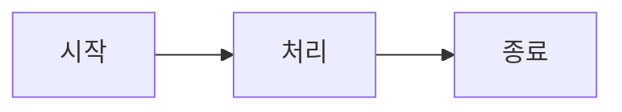

### 1.2 왜 Mermaid를 사용하는가?

**장점**:
- ✅ **버전 관리 가능**: Git으로 다이어그램 변경 이력 추적
- ✅ **마크다운 통합**: README, 문서에 직접 포함
- ✅ **빠른 작성**: 마우스 없이 키보드만으로 작성
- ✅ **일관성**: 자동 레이아웃으로 깔끔한 결과
- ✅ **무료**: 오픈소스, 별도 도구 설치 불필요

**단점**:
- ❌ **세밀한 제어 어려움**: 위치, 크기 조정 제한적
- ❌ **복잡한 다이어그램**: 매우 복잡한 구조는 Draw.io가 더 적합
- ❌ **학습 곡선**: 문법 학습 필요

### 1.3 언제 사용하는가?

**Mermaid 사용 권장**:
- 📝 README.md 문서화
- 📝 기술 문서 (Confluence, Notion)
- 📝 빠른 아이디어 스케치
- 📝 간단한 플로우차트

**Draw.io 사용 권장**:
- 🎨 프레젠테이션용 다이어그램
- 🎨 복잡한 AWS 아키텍처
- 🎨 세밀한 디자인 필요
- 🎨 공식 문서 제출

---

## 2. Mermaid 기본 문법

### 2.1 순서도 (Flowchart)

#### 기본 구조
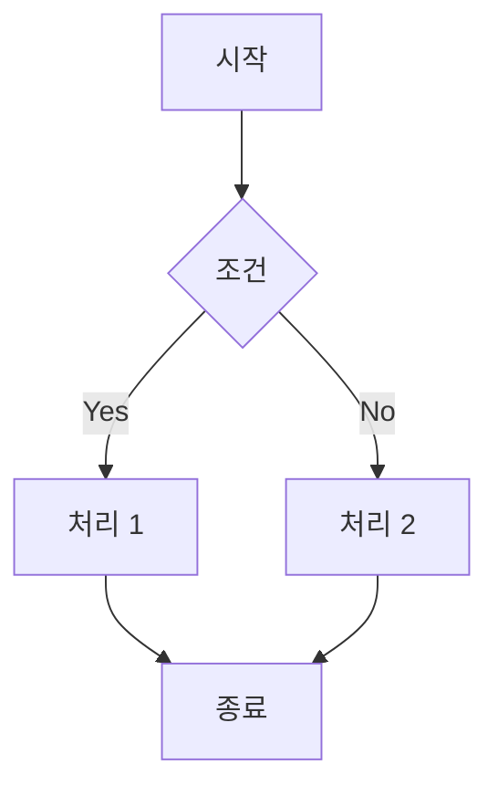

**코드**:
```
graph TD
    A[시작] --> B{조건}
    B -->|Yes| C[처리 1]
    B -->|No| D[처리 2]
    C --> E[종료]
    D --> E
```

#### 방향 지정
- `graph TD`: Top Down (위에서 아래)
- `graph LR`: Left to Right (왼쪽에서 오른쪽)
- `graph BT`: Bottom to Top (아래에서 위)
- `graph RL`: Right to Left (오른쪽에서 왼쪽)

#### 노드 모양
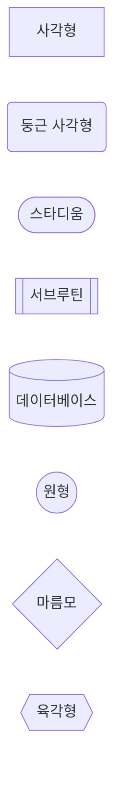

**코드**:
```
graph LR
    A[사각형]
    B(둥근 사각형)
    C([스타디움])
    D[[서브루틴]]
    E[(데이터베이스)]
    F((원형))
    G{마름모}
    H{{육각형}}
```

#### 연결선 스타일
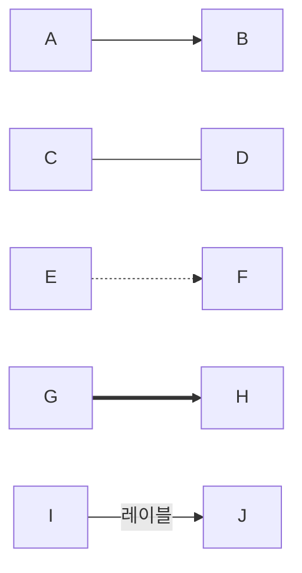

**코드**:
```
graph LR
    A --> B     %% 화살표
    C --- D     %% 선
    E -.-> F    %% 점선 화살표
    G ==> H     %% 굵은 화살표
    I -->|레이블| J  %% 레이블 있는 화살표
```

### 2.2 시퀀스 다이어그램 (Sequence Diagram)

#### 기본 구조
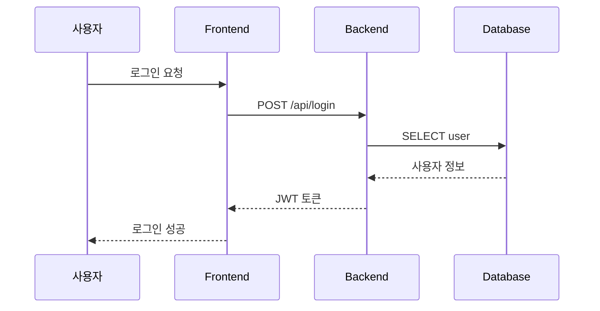

**코드**:
```
sequenceDiagram
    participant U as 사용자
    participant F as Frontend
    participant B as Backend
    participant D as Database
    
    U->>F: 로그인 요청
    F->>B: POST /api/login
    B->>D: SELECT user
    D-->>B: 사용자 정보
    B-->>F: JWT 토큰
    F-->>U: 로그인 성공
```

#### 화살표 종류
- `->`: 실선
- `-->`: 점선 (응답)
- `->>`: 화살표
- `-->>`: 점선 화살표 (응답)

#### 활성화 박스
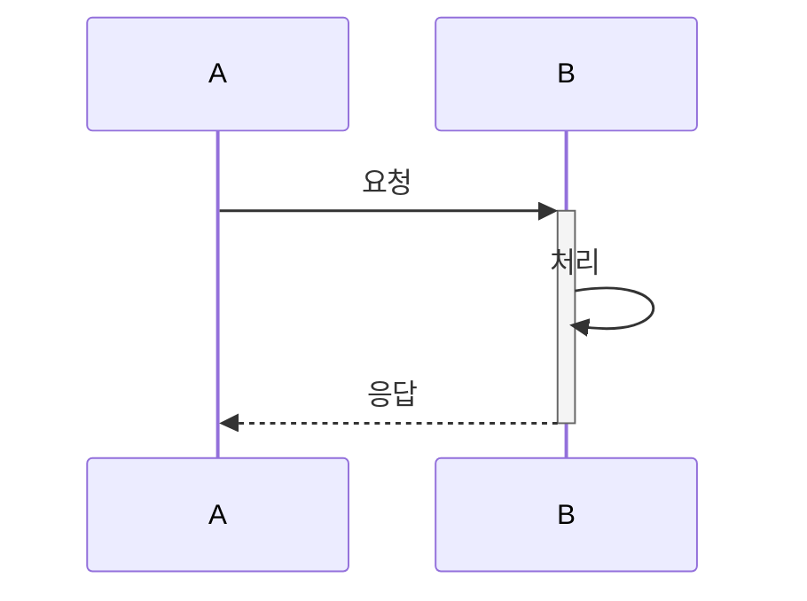

**코드**:
```
sequenceDiagram
    participant A
    participant B
    
    A->>+B: 요청      %% +는 활성화 시작
    B->>B: 처리
    B-->>-A: 응답     %% -는 활성화 종료
```

### 2.3 아키텍처 다이어그램

#### C4 다이어그램 스타일
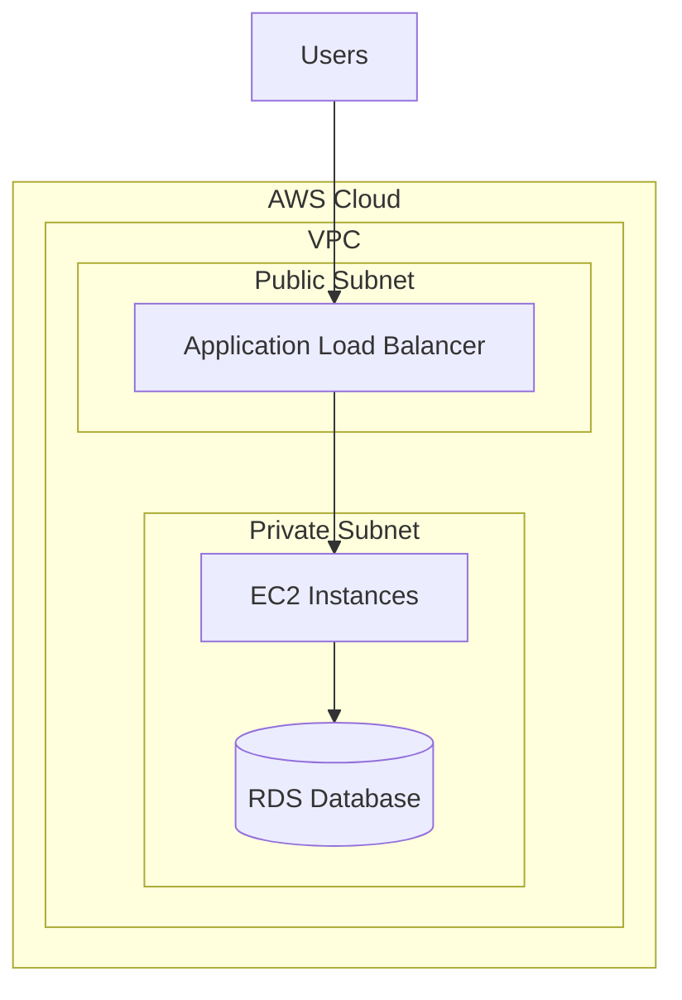

**코드**:
```
graph TB
    subgraph "AWS Cloud"
        subgraph "VPC"
            subgraph "Public Subnet"
                ALB[Application Load Balancer]
            end
            subgraph "Private Subnet"
                EC2[EC2 Instances]
                RDS[(RDS Database)]
            end
        end
    end
    
    Users[Users] --> ALB
    ALB --> EC2
    EC2 --> RDS
```

---

## 3. 실전 예제

### 예제 1: CI/CD 파이프라인

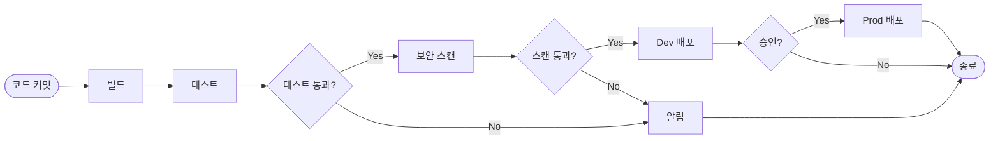

**코드**:
```
graph LR
    A([코드 커밋]) --> B[빌드]
    B --> C[테스트]
    C --> D{테스트 통과?}
    D -->|Yes| E[보안 스캔]
    D -->|No| F[알림]
    E --> G{스캔 통과?}
    G -->|Yes| H[Dev 배포]
    G -->|No| F
    H --> I{승인?}
    I -->|Yes| J[Prod 배포]
    I -->|No| K([종료])
    J --> K
    F --> K
```

### 예제 2: 사용자 인증 흐름

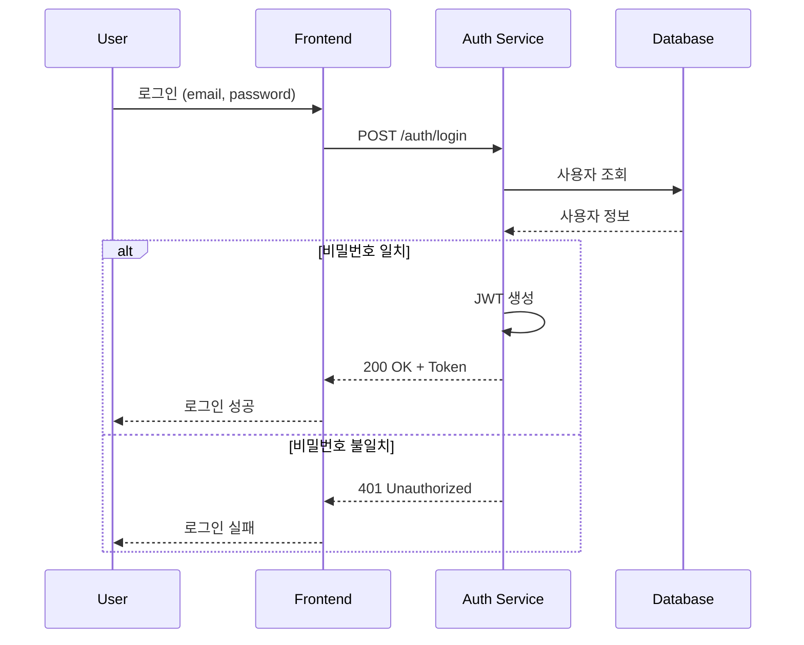

**코드**:
```
sequenceDiagram
    participant U as User
    participant F as Frontend
    participant A as Auth Service
    participant D as Database
    
    U->>F: 로그인 (email, password)
    F->>A: POST /auth/login
    A->>D: 사용자 조회
    D-->>A: 사용자 정보
    
    alt 비밀번호 일치
        A->>A: JWT 생성
        A-->>F: 200 OK + Token
        F-->>U: 로그인 성공
    else 비밀번호 불일치
        A-->>F: 401 Unauthorized
        F-->>U: 로그인 실패
    end
```

### 예제 3: Kubernetes 배포

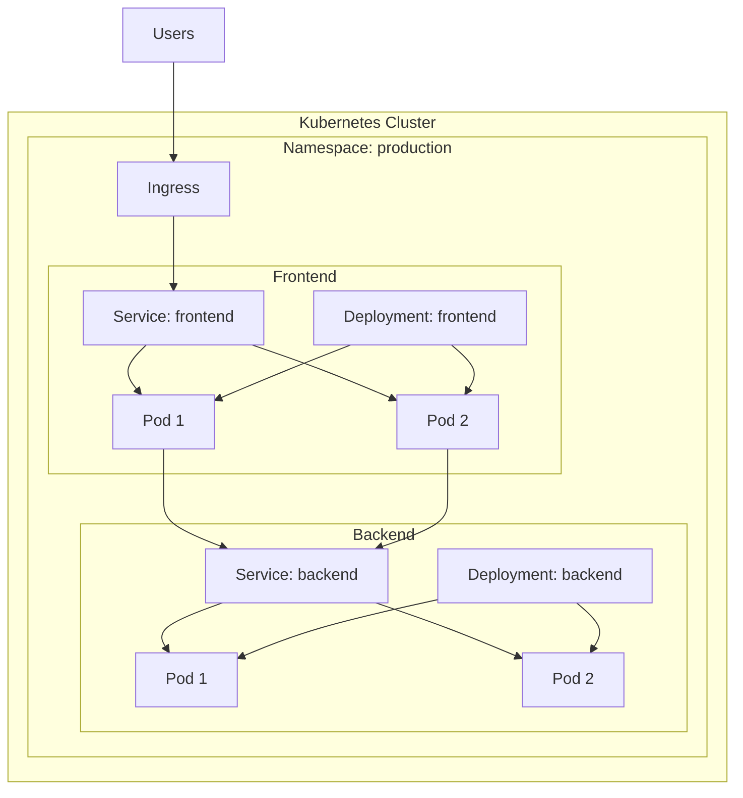

---

## 4. Mermaid 사용 방법

### 4.1 GitHub/GitLab
마크다운 파일에 직접 작성:

````markdown
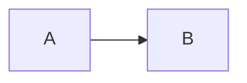
````

### 4.2 Mermaid Live Editor
- URL: https://mermaid.live
- 실시간 미리보기
- PNG/SVG 내보내기
- 코드 공유

### 4.3 VS Code
확장 프로그램 설치:
- "Markdown Preview Mermaid Support"
- "Mermaid Markdown Syntax Highlighting"

### 4.4 Notion, Confluence
코드 블록 언어를 `mermaid`로 설정

---

## 5. 실전 팁

### 5.1 가독성 향상
```
✅ 좋은 예:
graph TD
    A[사용자 입력] --> B[검증]
    B --> C{유효한가?}
    C -->|Yes| D[저장]
    C -->|No| E[에러 메시지]

❌ 나쁜 예:
graph TD
    A-->B
    B-->C
    C-->D
    C-->E
```

### 5.2 주석 활용
```
graph LR
    A[시작] --> B[처리]  %% 이것은 주석입니다
    B --> C[종료]
```

### 5.3 복잡도 관리
- 한 다이어그램에 10-15개 노드 이하 권장
- 복잡하면 여러 다이어그램으로 분리
- subgraph로 그룹화

### 5.4 스타일링 (선택사항)
```
graph LR
    A[시작]
    B[종료]
    A --> B
    
    style A fill:#f9f,stroke:#333,stroke-width:4px
    style B fill:#bbf,stroke:#333,stroke-width:2px
```

---

## 6. 다른 다이어그램 타입

Mermaid는 더 많은 다이어그램을 지원합니다:

### 6.1 간트 차트
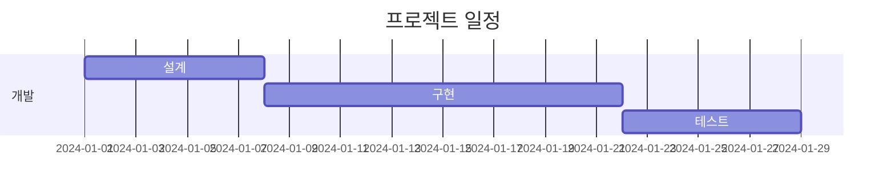

### 6.2 파이 차트
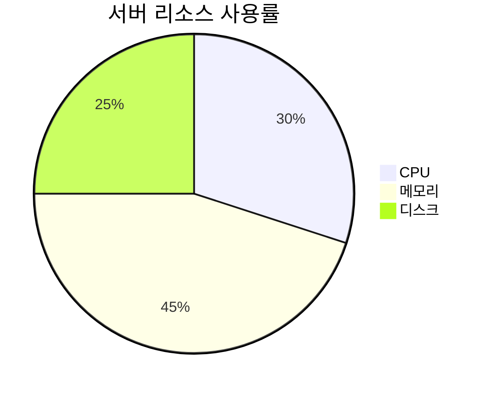

### 6.3 상태 다이어그램
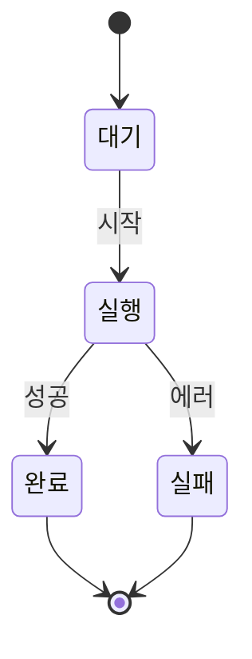

---

## 7. 실습 준비

다음 실습에서는 Draw.io를 사용하지만, Mermaid로 먼저 스케치하면 도움이 됩니다:

**워크플로우**:
1. Mermaid로 빠르게 구조 스케치
2. 팀원과 리뷰
3. Draw.io로 정식 다이어그램 작성
4. 최종 결과를 README에 포함

---

## 8. 참고 자료

### 공식 문서
- Mermaid 공식 문서: https://mermaid.js.org
- Mermaid Live Editor: https://mermaid.live

### 치트시트
- 이 워크샵의 `reference/mermaid_cheatsheet.md` 참조

---

## 핵심 요약

✅ **Mermaid란?**
- 텍스트 기반 다이어그램 도구
- 마크다운에 포함 가능
- 버전 관리 용이

✅ **주요 다이어그램**
- 순서도 (Flowchart): `graph TD`
- 시퀀스 (Sequence): `sequenceDiagram`
- 아키텍처: `subgraph` 활용

✅ **언제 사용?**
- 문서화, 빠른 스케치
- Draw.io는 프레젠테이션용

✅ **다음 단계**
- AWS 아키텍처 다이어그램 학습
- 실습에서 Draw.io 사용
