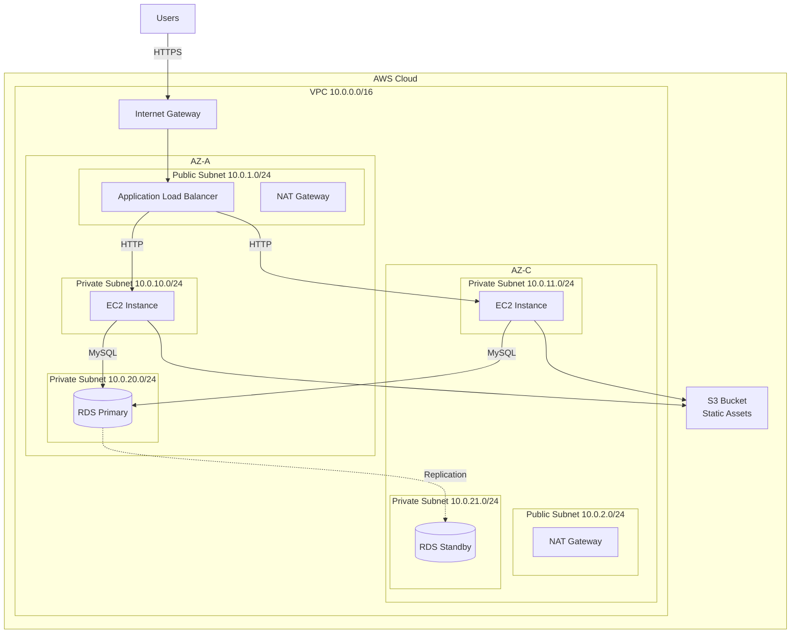

# AWS 아키텍처 다이어그램 (10분)

## 학습 목표
- AWS 네트워크 구성 요소 시각화 방법 습득
- 3계층 웹 애플리케이션 아키텍처 패턴 이해
- AWS 공식 아이콘 사용법 학습

---

## 1. AWS 다이어그램 기초

### 1.1 왜 AWS 다이어그램이 중요한가?

**실무 시나리오**:
- 📋 **설계 단계**: 인프라 구조 계획
- 🔍 **보안 검토**: 네트워크 경계 및 접근 제어 확인
- 🚨 **장애 대응**: 문제 지점 빠르게 파악
- 📚 **문서화**: 팀원 온보딩 및 지식 공유
- 💰 **비용 최적화**: 리소스 사용 현황 파악

### 1.2 AWS 다이어그램의 핵심 요소

```
[Region]
  └─ [VPC]
      ├─ [Public Subnet]
      │   └─ [Internet-facing 리소스]
      └─ [Private Subnet]
          └─ [내부 리소스]
```

---

## 2. AWS 네트워크 구성 요소

### 2.1 VPC (Virtual Private Cloud)

**개념**: AWS 클라우드 내의 논리적으로 격리된 네트워크 공간

**다이어그램 표현**:
```
┌─────────────────────────────────────┐
│ VPC (10.0.0.0/16)                   │
│                                     │
│  [서브넷들과 리소스들]               │
│                                     │
└─────────────────────────────────────┘
```

**표현 방법**:
- 큰 사각형으로 전체 VPC 표시
- VPC CIDR 블록 명시 (예: 10.0.0.0/16)
- 색상: 연한 회색 또는 파란색 배경

### 2.2 서브넷 (Subnet)

**개념**: VPC 내의 IP 주소 범위

**퍼블릭 서브넷**:
- Internet Gateway를 통해 인터넷 접근 가능
- 웹 서버, 로드 밸런서 배치
- 색상: 녹색 또는 연한 초록색

**프라이빗 서브넷**:
- 인터넷 직접 접근 불가
- 애플리케이션 서버, 데이터베이스 배치
- NAT Gateway를 통해 아웃바운드 트래픽만 가능
- 색상: 파란색 또는 연한 파란색

**다이어그램 표현**:
```
┌─────────────────────────────────────────────┐
│ VPC (10.0.0.0/16)                           │
│                                             │
│  ┌──────────────────┐  ┌──────────────────┐│
│  │ Public Subnet    │  │ Private Subnet   ││
│  │ 10.0.1.0/24      │  │ 10.0.10.0/24     ││
│  │ AZ: ap-northeast-2a                    ││
│  └──────────────────┘  └──────────────────┘│
│                                             │
│  ┌──────────────────┐  ┌──────────────────┐│
│  │ Public Subnet    │  │ Private Subnet   ││
│  │ 10.0.2.0/24      │  │ 10.0.11.0/24     ││
│  │ AZ: ap-northeast-2c                    ││
│  └──────────────────┘  └──────────────────┘│
└─────────────────────────────────────────────┘
```

### 2.3 가용 영역 (Availability Zone)

**개념**: 물리적으로 분리된 데이터센터

**고가용성 패턴**:
- 최소 2개 AZ 사용
- 각 AZ에 동일한 구성 배치
- 장애 발생 시 다른 AZ로 자동 전환

**표현 방법**:
- 서브넷 레이블에 AZ 명시
- 또는 점선으로 AZ 경계 표시

### 2.4 보안 그룹 (Security Group)

**개념**: 인스턴스 레벨의 가상 방화벽

**표현 방법**:
- 리소스 주변에 점선 박스
- 화살표에 포트 번호 표시 (예: :80, :443, :3306)
- 인바운드/아웃바운드 규칙 명시

**예시**:
```
[ALB] --:443--> [EC2] --:3306--> [RDS]
       HTTPS      HTTP            MySQL
```

---

## 3. 주요 AWS 서비스 표현

### 3.1 컴퓨팅

**EC2 (Elastic Compute Cloud)**:
- 아이콘: 주황색 큐브
- 레이블: 인스턴스 타입 (예: t3.medium)
- Auto Scaling 시: 여러 인스턴스 표시

**Lambda**:
- 아이콘: 주황색 람다 기호
- 서버리스 함수 표현

### 3.2 네트워킹

**Application Load Balancer (ALB)**:
- 아이콘: 보라색 로드 밸런서
- 퍼블릭 서브넷에 배치
- 여러 타겟으로 화살표

**Internet Gateway (IGW)**:
- 아이콘: 파란색 게이트웨이
- VPC 경계에 배치
- 인터넷과 VPC 연결

**NAT Gateway**:
- 아이콘: 파란색 NAT
- 퍼블릭 서브넷에 배치
- 프라이빗 서브넷의 아웃바운드 트래픽 처리

### 3.3 스토리지

**S3 (Simple Storage Service)**:
- 아이콘: 녹색 버킷
- VPC 외부에 배치 (글로벌 서비스)
- 정적 자산, 백업 저장

**EBS (Elastic Block Store)**:
- 아이콘: 주황색 디스크
- EC2 인스턴스에 연결

### 3.4 데이터베이스

**RDS (Relational Database Service)**:
- 아이콘: 파란색 데이터베이스
- 프라이빗 서브넷에 배치
- Multi-AZ: 2개 인스턴스 표시 (Primary, Standby)

**ElastiCache**:
- 아이콘: 빨간색 캐시
- 프라이빗 서브넷에 배치

---

## 4. 3계층 웹 애플리케이션 패턴

### 4.1 아키텍처 개요

**3계층 구조**:
1. **프레젠테이션 계층**: 사용자 인터페이스 (ALB, CloudFront)
2. **애플리케이션 계층**: 비즈니스 로직 (EC2, Lambda)
3. **데이터 계층**: 데이터 저장 (RDS, S3)

### 4.2 기본 3계층 다이어그램

```
                    [Internet]
                        │
                        ↓
                [Internet Gateway]
                        │
┌───────────────────────┼───────────────────────┐
│ VPC                   │                       │
│                       ↓                       │
│  ┌────────────────────────────────────────┐  │
│  │ Public Subnet (AZ-A)                   │  │
│  │                                        │  │
│  │    [Application Load Balancer]        │  │
│  │              │                         │  │
│  └──────────────┼─────────────────────────┘  │
│                 │                             │
│  ┌──────────────┼─────────────────────────┐  │
│  │ Private Subnet (AZ-A)  │               │  │
│  │                        ↓               │  │
│  │              [EC2 Instance 1]          │  │
│  │                        │               │  │
│  └────────────────────────┼───────────────┘  │
│                           │                   │
│  ┌────────────────────────┼───────────────┐  │
│  │ Private Subnet (AZ-A)  │               │  │
│  │                        ↓               │  │
│  │              [RDS Primary]             │  │
│  │                                        │  │
│  └────────────────────────────────────────┘  │
│                                               │
│  [동일 구조가 AZ-B에도 존재]                  │
└───────────────────────────────────────────────┘

[S3 Bucket] ← 정적 자산
```

### 4.3 고가용성 3계층 다이어그램

```
                        [Users]
                           │
                           ↓
                    [Route 53 DNS]
                           │
                           ↓
                    [CloudFront CDN]
                           │
                           ↓
                  [Internet Gateway]
                           │
┌──────────────────────────┼──────────────────────────┐
│ VPC (10.0.0.0/16)        │                          │
│                          ↓                          │
│  ┌─────────────────────────────────────────────┐   │
│  │ Public Subnet (AZ-A)  │  Public Subnet (AZ-C)│  │
│  │ 10.0.1.0/24           │  10.0.2.0/24         │  │
│  │                       │                      │  │
│  │  [ALB] ───────────────┴──────────────────┐  │  │
│  │    │                                     │  │  │
│  └────┼─────────────────────────────────────┼──┘  │
│       │                                     │      │
│  ┌────┼─────────────────────────────────────┼───┐ │
│  │ Private Subnet (AZ-A) │ Private Subnet (AZ-C)│ │
│  │ 10.0.10.0/24          │ 10.0.11.0/24        │ │
│  │    │                  │                     │ │
│  │    ↓                  ↓                     │ │
│  │ [EC2-1]            [EC2-2]                  │ │
│  │ [EC2-3]            [EC2-4]                  │ │
│  │    │                  │                     │ │
│  │    └──────────┬───────┘                     │ │
│  └───────────────┼─────────────────────────────┘ │
│                  │                                │
│  ┌───────────────┼─────────────────────────────┐ │
│  │ Private Subnet (AZ-A) │ Private Subnet (AZ-C)│ │
│  │ 10.0.20.0/24          │ 10.0.21.0/24        │ │
│  │                       │                     │ │
│  │    [RDS Primary] ←──→ [RDS Standby]        │ │
│  │         │                                   │ │
│  └─────────┼───────────────────────────────────┘ │
└────────────┼─────────────────────────────────────┘
             │
             ↓
        [S3 Bucket]
```

### 4.4 데이터 흐름 표시

**화살표 방향**:
- 실선 화살표: 주요 데이터 흐름
- 점선 화살표: 백업, 로그 등
- 양방향 화살표: 동기화, 복제

**레이블**:
- 프로토콜: HTTP, HTTPS, MySQL
- 포트: :80, :443, :3306
- 작업: Read, Write, Sync

---

## 5. AWS 아이콘 사용법

### 5.1 공식 AWS 아이콘

**위치**: 이 프로젝트의 `Asset-Package/` 디렉토리

**구조**:
```
Asset-Package/
├── Architecture-Service-Icons_01312023/
│   ├── Arch_Compute/
│   ├── Arch_Database/
│   ├── Arch_Networking-Content-Delivery/
│   └── ...
└── Category-Icons_01312023/
```

### 5.2 Draw.io에서 AWS 라이브러리 추가

**방법 1: 내장 라이브러리**
1. Draw.io 열기
2. 좌측 패널 하단 "More Shapes" 클릭
3. "Networking" 섹션에서 "AWS 19" 체크
4. "Apply" 클릭

**방법 2: 커스텀 아이콘**
1. Asset-Package에서 필요한 아이콘 찾기
2. Draw.io로 드래그 앤 드롭
3. 재사용을 위해 "Scratchpad"에 저장

### 5.3 아이콘 사용 가이드

**크기**:
- 주요 서비스: 64x64px
- 보조 서비스: 48x48px
- 작은 아이콘: 32x32px

**색상**:
- AWS 공식 아이콘 색상 유지
- 배경: 흰색 또는 투명

**레이블**:
- 아이콘 아래 또는 옆에 서비스 이름
- 인스턴스 타입, 용량 등 추가 정보

---

## 6. 실전 예제: 간단한 웹 애플리케이션

### 6.1 요구사항
- 웹 애플리케이션 호스팅
- 고가용성 (2개 AZ)
- 데이터베이스 백업
- 정적 자산 CDN 제공

### 6.2 Mermaid 코드



### 6.3 설명

**계층 1: 프레젠테이션**
- Internet Gateway: 인터넷 연결
- ALB: 트래픽 분산, SSL 종료

**계층 2: 애플리케이션**
- EC2 인스턴스: 웹 애플리케이션 실행
- 2개 AZ에 분산 배치
- Auto Scaling 가능

**계층 3: 데이터**
- RDS Multi-AZ: 자동 장애 조치
- S3: 정적 자산 저장

**보안**:
- 퍼블릭 서브넷: ALB만 인터넷 접근
- 프라이빗 서브넷: EC2, RDS는 내부만
- NAT Gateway: 아웃바운드 트래픽 (패치, 업데이트)

---

## 7. 다이어그램 작성 팁

### 7.1 레이아웃 원칙

**위에서 아래로**:
```
사용자
  ↓
인터넷 계층 (CloudFront, Route 53)
  ↓
네트워크 계층 (IGW, ALB)
  ↓
애플리케이션 계층 (EC2, Lambda)
  ↓
데이터 계층 (RDS, S3)
```

**왼쪽에서 오른쪽으로**:
```
AZ-A          AZ-C
[서브넷]      [서브넷]
[EC2]         [EC2]
[RDS]         [RDS]
```

### 7.2 색상 코딩

**권장 색상**:
- 퍼블릭 서브넷: 연한 녹색 (#E8F5E9)
- 프라이빗 서브넷: 연한 파란색 (#E3F2FD)
- VPC 경계: 회색 (#F5F5F5)
- 데이터 흐름: 파란색 화살표
- 관리 흐름: 주황색 화살표

### 7.3 레이블링

**필수 정보**:
- 서비스 이름
- CIDR 블록 (서브넷)
- 가용 영역
- 인스턴스 타입 (선택)

**예시**:
```
[Application Load Balancer]
Name: web-alb
Scheme: internet-facing
```

### 7.4 복잡도 관리

**단계별 접근**:
1. **레벨 1**: 전체 개요 (VPC, 주요 서비스만)
2. **레벨 2**: 네트워크 상세 (서브넷, 라우팅)
3. **레벨 3**: 보안 상세 (보안 그룹, NACL)

---

## 8. 일반적인 실수

### 8.1 네트워크 경계 불명확
❌ **나쁜 예**: VPC, 서브넷 경계 없음
✅ **좋은 예**: 명확한 박스로 경계 표시

### 8.2 데이터 흐름 방향 누락
❌ **나쁜 예**: 선만 있고 방향 없음
✅ **좋은 예**: 화살표로 방향 명시

### 8.3 가용 영역 미표시
❌ **나쁜 예**: 모든 리소스가 한 곳에
✅ **좋은 예**: AZ별로 구분하여 표시

### 8.4 보안 그룹 생략
❌ **나쁜 예**: 모든 연결이 가능한 것처럼 표현
✅ **좋은 예**: 허용된 포트와 프로토콜 명시

---

## 9. 실습 준비

다음 실습에서는 Draw.io를 사용하여 AWS 3계층 아키텍처를 직접 작성합니다.

**준비물**:
- Draw.io 웹 브라우저 (https://app.diagrams.net)
- AWS 아이콘 라이브러리
- 이 강의 자료

**실습 내용**:
- VPC 및 서브넷 구성
- ALB, EC2, RDS 배치
- 데이터 흐름 표시
- 레이블 및 주석 추가

---

## 핵심 요약

✅ **AWS 네트워크 구성**
- VPC: 논리적 네트워크 격리
- 서브넷: 퍼블릭 (녹색), 프라이빗 (파란색)
- 가용 영역: 최소 2개 사용

✅ **3계층 아키텍처**
- 프레젠테이션: ALB, CloudFront
- 애플리케이션: EC2, Lambda
- 데이터: RDS, S3

✅ **다이어그램 작성**
- 위에서 아래로 레이아웃
- 명확한 경계 표시
- 데이터 흐름 방향 명시
- AWS 공식 아이콘 사용

✅ **다음 단계**
- Kubernetes 다이어그램 학습
- Draw.io 실습
