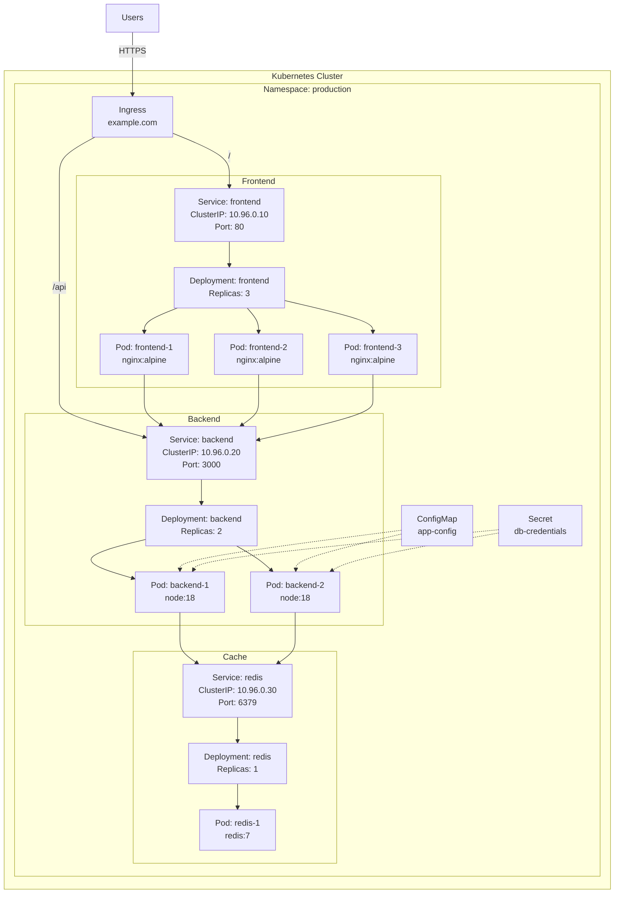

# Kubernetes 아키텍처 다이어그램 (10분)

## 학습 목표
- Kubernetes 주요 리소스 시각화 방법 습득
- 애플리케이션 배포 패턴 이해
- Namespace와 리소스 그룹화 표현 학습

---

## 1. Kubernetes 다이어그램 기초

### 1.1 왜 Kubernetes 다이어그램이 중요한가?

**실무 시나리오**:
- 🚀 **배포 계획**: 애플리케이션 구조 설계
- 🔍 **트러블슈팅**: Pod, Service 관계 파악
- 📚 **문서화**: 클러스터 구성 기록
- 👥 **팀 협업**: 개발자-운영자 간 소통
- 🎓 **교육**: 신규 팀원 온보딩

### 1.2 Kubernetes vs AWS 다이어그램

**차이점**:
| 측면 | AWS | Kubernetes |
|------|-----|------------|
| 초점 | 인프라 (네트워크, 서버) | 애플리케이션 (컨테이너, 서비스) |
| 경계 | VPC, 서브넷 | Namespace, Cluster |
| 주요 요소 | EC2, RDS, ALB | Pod, Service, Deployment |
| 스케일 | 인스턴스 단위 | 컨테이너 단위 |

---

## 2. Kubernetes 주요 리소스

### 2.1 Pod

**개념**: 하나 이상의 컨테이너를 포함하는 최소 배포 단위

**특징**:
- 동일한 네트워크 네임스페이스 공유
- 동일한 스토리지 볼륨 공유
- 일시적 (Ephemeral) - 언제든 재생성 가능

**다이어그램 표현**:
```
┌─────────────────┐
│ Pod             │
│ ┌─────────────┐ │
│ │ Container 1 │ │
│ └─────────────┘ │
│ ┌─────────────┐ │
│ │ Container 2 │ │
│ └─────────────┘ │
└─────────────────┘
```

**표현 방법**:
- 작은 사각형 또는 원형
- 컨테이너 이미지 이름 표시
- 여러 컨테이너는 Pod 내부에 표시

### 2.2 Deployment

**개념**: Pod의 선언적 업데이트 및 복제 관리

**특징**:
- 원하는 Pod 개수 유지 (Replica)
- 롤링 업데이트
- 롤백 지원

**다이어그램 표현**:
```
┌─────────────────────────────┐
│ Deployment: frontend        │
│ Replicas: 3                 │
│                             │
│  ┌─────┐  ┌─────┐  ┌─────┐ │
│  │Pod 1│  │Pod 2│  │Pod 3│ │
│  └─────┘  └─────┘  └─────┘ │
└─────────────────────────────┘
```

**표현 방법**:
- 큰 박스로 Deployment 표시
- 내부에 여러 Pod 표시
- Replica 수 명시

### 2.3 Service

**개념**: Pod 집합에 대한 네트워크 접근을 제공하는 추상화

**Service 타입**:
- **ClusterIP**: 클러스터 내부에서만 접근 (기본값)
- **NodePort**: 노드의 특정 포트로 외부 접근
- **LoadBalancer**: 클라우드 로드 밸런서 생성

**다이어그램 표현**:
```
[Service: frontend]
  ClusterIP: 10.96.0.10
  Port: 80
       ↓
  ┌────┴────┐
  ↓         ↓
[Pod 1]  [Pod 2]
```

**표현 방법**:
- 마름모 또는 육각형
- Service 이름과 타입 표시
- Pod로 향하는 화살표

### 2.4 Ingress

**개념**: HTTP/HTTPS 라우팅을 제공하는 API 객체

**특징**:
- 도메인 기반 라우팅
- 경로 기반 라우팅
- SSL/TLS 종료

**다이어그램 표현**:
```
[Internet]
    ↓
[Ingress]
  example.com/api → [Service: backend]
  example.com/    → [Service: frontend]
```

**표현 방법**:
- 클러스터 경계 상단에 배치
- 라우팅 규칙 표시
- Service로 향하는 화살표

### 2.5 ConfigMap & Secret

**ConfigMap**: 설정 데이터 저장
**Secret**: 민감한 데이터 저장 (암호화)

**다이어그램 표현**:
```
[ConfigMap: app-config]
        ↓ (환경변수)
      [Pod]
        ↑ (볼륨)
[Secret: db-credentials]
```

**표현 방법**:
- 작은 문서 아이콘
- Pod로 향하는 점선 화살표
- 마운트 방식 표시 (환경변수/볼륨)

### 2.6 Namespace

**개념**: 클러스터 내 가상 클러스터 (논리적 분리)

**사용 사례**:
- 환경 분리 (dev, staging, prod)
- 팀별 분리
- 프로젝트별 분리

**다이어그램 표현**:
```
┌─────────────────────────────────────┐
│ Namespace: production               │
│                                     │
│  [Ingress] → [Service] → [Pod]     │
│                                     │
└─────────────────────────────────────┘
```

**표현 방법**:
- 큰 박스로 경계 표시
- Namespace 이름 명시
- 내부에 모든 리소스 배치

---

## 3. 간단한 애플리케이션 배포 패턴

### 3.1 단일 애플리케이션 패턴

**구조**:
```
[Ingress]
    ↓
[Service]
    ↓
[Deployment]
  ├─ [Pod 1]
  ├─ [Pod 2]
  └─ [Pod 3]
```

**사용 사례**:
- 간단한 웹 애플리케이션
- 정적 사이트
- API 서버

### 3.2 Frontend + Backend 패턴

**구조**:
```
                [Ingress]
                    ↓
        ┌───────────┴───────────┐
        ↓                       ↓
[Service: frontend]    [Service: backend]
        ↓                       ↓
[Deployment: frontend] [Deployment: backend]
  ├─ [Pod 1]             ├─ [Pod 1]
  └─ [Pod 2]             └─ [Pod 2]
```

**사용 사례**:
- React + Node.js
- Vue + Spring Boot
- Angular + Django

### 3.3 Microservices 패턴

**구조**:
```
                    [Ingress]
                        ↓
        ┌───────────────┼───────────────┐
        ↓               ↓               ↓
[Service: user]  [Service: order] [Service: payment]
        ↓               ↓               ↓
[Deployment]     [Deployment]     [Deployment]
```

**사용 사례**:
- 대규모 애플리케이션
- 독립적인 서비스 배포
- 팀별 개발

### 3.4 Database 포함 패턴

**구조**:
```
[Ingress]
    ↓
[Service: web]
    ↓
[Deployment: web]
    ↓
[Service: db]
    ↓
[StatefulSet: db]
  ├─ [Pod 1] ← [PVC 1]
  └─ [Pod 2] ← [PVC 2]
```

**특징**:
- StatefulSet: 상태를 가진 애플리케이션
- PVC (PersistentVolumeClaim): 영구 스토리지
- Headless Service: Pod 직접 접근

---

## 4. 실전 예제: 웹 애플리케이션 배포

### 4.1 요구사항
- Frontend (React): 3 replicas
- Backend (Node.js): 2 replicas
- Redis (캐시): 1 replica
- 도메인 라우팅: example.com

### 4.2 Mermaid 코드



### 4.3 설명

**Ingress 계층**:
- 외부 트래픽 진입점
- `/` → Frontend Service
- `/api` → Backend Service

**Frontend 계층**:
- Service: ClusterIP (내부 접근)
- Deployment: 3개 Pod 유지
- Pod: Nginx로 정적 파일 서빙

**Backend 계층**:
- Service: ClusterIP
- Deployment: 2개 Pod 유지
- Pod: Node.js API 서버

**Cache 계층**:
- Service: ClusterIP
- Deployment: 1개 Pod
- Pod: Redis 캐시

**설정**:
- ConfigMap: 애플리케이션 설정
- Secret: 데이터베이스 자격증명

---

## 5. Namespace와 리소스 그룹화

### 5.1 환경별 Namespace

**구조**:
```
┌─────────────────────────────┐
│ Namespace: development      │
│  [Ingress] → [Services]     │
└─────────────────────────────┘

┌─────────────────────────────┐
│ Namespace: staging          │
│  [Ingress] → [Services]     │
└─────────────────────────────┘

┌─────────────────────────────┐
│ Namespace: production       │
│  [Ingress] → [Services]     │
└─────────────────────────────┘
```

**장점**:
- 환경 격리
- 리소스 할당량 관리
- 접근 제어

### 5.2 팀별 Namespace

**구조**:
```
┌─────────────────────────────┐
│ Namespace: team-frontend    │
│  [Frontend 리소스]          │
└─────────────────────────────┘

┌─────────────────────────────┐
│ Namespace: team-backend     │
│  [Backend 리소스]           │
└─────────────────────────────┘

┌─────────────────────────────┐
│ Namespace: team-data        │
│  [Database 리소스]          │
└─────────────────────────────┘
```

### 5.3 리소스 그룹화 표현

**방법 1: 색상 코딩**
- Frontend: 파란색
- Backend: 녹색
- Database: 주황색
- Cache: 빨간색

**방법 2: 레이블**
```
[Pod: frontend-1]
Labels:
  app: frontend
  tier: web
  env: production
```

**방법 3: 서브그래프**
```
subgraph "Web Tier"
    [Frontend]
end

subgraph "Application Tier"
    [Backend]
end

subgraph "Data Tier"
    [Database]
end
```

---

## 6. 네트워크 흐름 표현

### 6.1 Service 간 통신

**ClusterIP**:
```
[Pod A] → [Service B] → [Pod B]
         (DNS: service-b.namespace.svc.cluster.local)
```

**표현 방법**:
- 실선 화살표: 동기 호출
- 점선 화살표: 비동기 메시지
- 레이블: 프로토콜, 포트

### 6.2 외부 서비스 접근

**Egress (외부로 나가는 트래픽)**:
```
[Pod] → [External API]
       (예: AWS S3, 외부 DB)
```

**표현 방법**:
- 클러스터 경계 밖에 외부 서비스 표시
- 점선 화살표로 연결

### 6.3 데이터 흐름

**읽기 흐름**:
```
[User] → [Ingress] → [Frontend] → [Backend] → [Database]
```

**쓰기 흐름**:
```
[User] → [Ingress] → [Backend] → [Database]
                              → [Cache] (무효화)
```

---

## 7. 다이어그램 작성 팁

### 7.1 레이아웃 원칙

**계층적 구조**:
```
위: Ingress
중간: Service
아래: Deployment/Pod
```

**왼쪽에서 오른쪽**:
```
Frontend → Backend → Database
```

### 7.2 복잡도 관리

**레벨 1: 개요**
```
[Ingress] → [Frontend] → [Backend] → [Database]
```

**레벨 2: 서비스 상세**
```
[Ingress]
    ↓
[Service: frontend] → [Service: backend]
    ↓                      ↓
[Deployment]          [Deployment]
```

**레벨 3: Pod 상세**
```
[Service]
    ↓
[Deployment]
  ├─ [Pod 1: Container A, Container B]
  ├─ [Pod 2: Container A, Container B]
  └─ [Pod 3: Container A, Container B]
```

### 7.3 레이블링

**필수 정보**:
- 리소스 타입 (Service, Deployment, Pod)
- 리소스 이름
- Replica 수 (Deployment)
- 포트 번호 (Service)

**선택 정보**:
- 컨테이너 이미지
- 리소스 제한 (CPU, Memory)
- 레이블 셀렉터

### 7.4 색상 및 스타일

**권장 색상**:
- Namespace: 연한 회색 배경
- Frontend: 파란색 계열
- Backend: 녹색 계열
- Database: 주황색 계열
- Cache: 빨간색 계열

**화살표 스타일**:
- 실선: HTTP/gRPC 호출
- 점선: 설정 참조, 비동기 메시지
- 굵은 선: 주요 데이터 흐름

---

## 8. 일반적인 실수

### 8.1 Service 생략
❌ **나쁜 예**: Pod 간 직접 연결 표시
✅ **좋은 예**: Service를 통한 연결 표시

### 8.2 Namespace 경계 불명확
❌ **나쁜 예**: 모든 리소스가 한 곳에
✅ **좋은 예**: Namespace 박스로 구분

### 8.3 Replica 수 미표시
❌ **나쁜 예**: Deployment만 표시
✅ **좋은 예**: Pod 개수 명시

### 8.4 네트워크 흐름 방향 누락
❌ **나쁜 예**: 선만 있고 방향 없음
✅ **좋은 예**: 화살표로 방향 명시

---

## 9. Kubernetes vs Docker Compose

**비교**:
| 측면 | Docker Compose | Kubernetes |
|------|----------------|------------|
| 용도 | 로컬 개발 | 프로덕션 배포 |
| 스케일 | 단일 호스트 | 다중 노드 클러스터 |
| 고가용성 | 제한적 | 완전 지원 |
| 네트워킹 | 간단 | 복잡 (Service, Ingress) |

**다이어그램 차이**:
- Docker Compose: 컨테이너 간 연결
- Kubernetes: Service, Pod, Deployment 관계

---

## 10. 실습 준비

다음 실습에서는 Draw.io를 사용하여 Kubernetes 배포 다이어그램을 작성합니다.

**준비물**:
- Draw.io 웹 브라우저
- Kubernetes 아이콘 (기본 도형 사용 가능)
- 이 강의 자료

**실습 내용**:
- Namespace 생성
- Ingress, Service, Deployment 배치
- Pod 표현
- 네트워크 흐름 표시

---

## 핵심 요약

✅ **주요 리소스**
- Pod: 최소 배포 단위
- Deployment: Pod 복제 관리
- Service: 네트워크 접근 제공
- Ingress: HTTP 라우팅

✅ **배포 패턴**
- 단일 애플리케이션
- Frontend + Backend
- Microservices
- Database 포함

✅ **Namespace**
- 환경별 분리 (dev, staging, prod)
- 팀별 분리
- 리소스 그룹화

✅ **다이어그램 작성**
- 계층적 레이아웃 (위에서 아래)
- Service를 통한 연결 표시
- Namespace 경계 명확히
- 네트워크 흐름 방향 표시

✅ **다음 단계**
- CI/CD 파이프라인 학습
- Draw.io 실습
