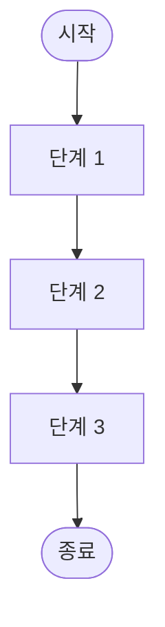
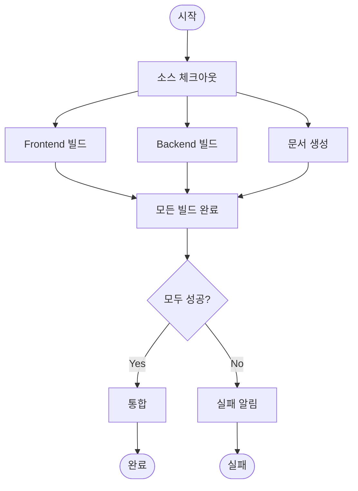

# CI/CD 파이프라인 & 로직 플로우 (10분)

## 학습 목표
- 순서도 기호와 의미 이해
- CI/CD 파이프라인 다이어그램 작성법 습득
- 로직 플로우 패턴 (순차, 조건부, 반복) 학습

---

## 1. 순서도 (Flowchart) 기초

### 1.1 왜 순서도가 중요한가?

**실무 시나리오**:
- 🔄 **프로세스 문서화**: CI/CD 파이프라인, 배포 절차
- 🐛 **디버깅**: 로직 흐름 추적
- 💡 **설계**: 구현 전 로직 검증
- 📖 **교육**: 복잡한 프로세스 설명
- 🤝 **협업**: 개발자-비개발자 간 소통

### 1.2 순서도 vs 다른 다이어그램

| 다이어그램 | 목적 | 초점 |
|-----------|------|------|
| 순서도 | 프로세스 흐름 | 단계, 의사결정 |
| 아키텍처 | 시스템 구조 | 구성 요소, 관계 |
| 시퀀스 | 상호작용 | 시간 순서, 메시지 |

---

## 2. 순서도 기호 및 의미

### 2.1 기본 기호

#### 시작/종료 (Terminator)
```
 ╭─────────╮
 │  시작   │
 ╰─────────╯
```
**용도**: 프로세스의 시작과 끝
**모양**: 타원 또는 둥근 사각형
**예시**: "시작", "종료", "완료"

#### 프로세스 (Process)
```
 ┌─────────┐
 │  처리   │
 └─────────┘
```
**용도**: 작업, 처리, 계산
**모양**: 직사각형
**예시**: "코드 빌드", "테스트 실행", "데이터 저장"

#### 의사결정 (Decision)
```
     ╱╲
    ╱  ╲
   ╱ 조건╲
   ╲    ╱
    ╲  ╱
     ╲╱
```
**용도**: 조건 분기 (if/else)
**모양**: 마름모
**예시**: "테스트 통과?", "승인됨?", "에러 발생?"

#### 입력/출력 (Input/Output)
```
  ╱────────╲
 ╱  입력   ╱
 ╲────────╱
```
**용도**: 데이터 입력 또는 출력
**모양**: 평행사변형
**예시**: "사용자 입력", "로그 출력", "파일 읽기"

#### 연결선 (Flow Line)
```
  ↓  →  ←  ↑
```
**용도**: 흐름 방향 표시
**모양**: 화살표
**규칙**: 위에서 아래, 왼쪽에서 오른쪽

### 2.2 고급 기호

#### 서브프로세스 (Predefined Process)
```
 ┌═════════┐
 ║ 서브루틴 ║
 └═════════┘
```
**용도**: 별도로 정의된 프로세스 호출
**모양**: 양쪽에 세로선이 있는 직사각형
**예시**: "배포 함수 호출", "알림 전송"

#### 데이터베이스 (Database)
```
  ┌─────┐
  │ DB  │
  └─────┘
   ╲   ╱
    ╲ ╱
```
**용도**: 데이터 저장소 접근
**모양**: 원통형
**예시**: "사용자 조회", "로그 저장"

#### 문서 (Document)
```
 ┌─────────┐
 │  문서   │
 └─────────┘
  ╲       ╱
```
**용도**: 문서 생성 또는 참조
**모양**: 아래가 물결 모양인 직사각형
**예시**: "보고서 생성", "로그 파일"

#### 지연 (Delay)
```
  ┌────────╲
  │  대기  │
  └────────╱
```
**용도**: 시간 지연 또는 대기
**모양**: 반원이 붙은 직사각형
**예시**: "승인 대기", "타이머"

---

## 3. CI/CD 파이프라인 다이어그램

### 3.1 CI/CD란?

**CI (Continuous Integration)**:
- 코드 변경 사항을 자동으로 빌드 및 테스트
- 통합 문제를 조기에 발견

**CD (Continuous Delivery/Deployment)**:
- 자동으로 배포 준비 또는 배포
- 빠른 릴리스 주기

### 3.2 기본 CI/CD 파이프라인


**단계 설명**:
1. **코드 커밋**: 개발자가 Git에 푸시
2. **소스 체크아웃**: CI 서버가 코드 가져오기
3. **의존성 설치**: npm install, pip install 등
4. **빌드**: 컴파일, 번들링
5. **테스트**: 자동화된 테스트 실행
6. **의사결정**: 테스트 결과에 따라 분기
7. **배포**: 성공 시 환경에 배포
8. **알림**: 실패 시 팀에 알림

### 3.3 승인 게이트가 있는 파이프라인


**주요 특징**:
- **보안 스캔**: 취약점 검사 (SAST, DAST)
- **승인 게이트**: 수동 검토 및 승인
- **단계별 배포**: Dev → Staging → Production
- **스모크 테스트**: 기본 기능 확인

### 3.4 GitHub Actions 예제


### 3.5 GitOps 워크플로우


---

## 4. 로직 플로우 패턴

### 4.1 순차 패턴 (Sequential)

**개념**: 단계가 순서대로 실행



**사용 사례**:
- 데이터 처리 파이프라인
- 초기화 프로세스
- 순차적 작업 흐름

**예시: 사용자 등록**


### 4.2 조건부 패턴 (Conditional)

**개념**: 조건에 따라 다른 경로 실행


**사용 사례**:
- 입력 검증
- 권한 확인
- 에러 처리

**예시: 사용자 로그인**


### 4.3 반복 패턴 (Loop)

**개념**: 조건이 만족될 때까지 반복


**사용 사례**:
- 배치 처리
- 재시도 로직
- 데이터 순회

**예시: 파일 업로드 재시도**


### 4.4 병렬 패턴 (Parallel)

**개념**: 여러 작업을 동시에 실행


**사용 사례**:
- 병렬 테스트 실행
- 다중 API 호출
- 독립적인 작업 처리

**예시: 병렬 빌드**


### 4.5 에러 처리 패턴

**개념**: 예외 상황 처리


---

## 5. 실전 예제

### 예제 1: 사용자 인증 플로우


### 예제 2: 주문 처리 플로우


### 예제 3: 데이터 백업 프로세스


---

## 6. 다이어그램 작성 팁

### 6.1 명확성

**좋은 예**:
```
[사용자 입력] → {이메일 유효?} → [계정 생성]
                     ↓ No
                [에러 메시지]
```

**나쁜 예**:
```
[A] → {B} → [C]
       ↓
      [D]
```

### 6.2 일관성

**화살표 방향**:
- 위에서 아래: 주요 흐름
- 왼쪽에서 오른쪽: 순차 흐름
- 아래에서 위: 반복 (루프)

**레이블**:
- 의사결정: Yes/No, True/False, 성공/실패
- 명확한 조건 표시

### 6.3 단순성

**복잡한 플로우 분해**:
```
[메인 플로우]
    ↓
[서브프로세스 A] ← 별도 다이어그램
    ↓
[서브프로세스 B] ← 별도 다이어그램
```

### 6.4 주석

**중요한 결정 지점에 주석 추가**:
```
{재시도 < 3?}
(최대 3번까지 재시도)
```

---

## 7. 도구별 작성 방법

### 7.1 Mermaid
```
graph TD
    A[시작] --> B{조건}
    B -->|Yes| C[처리]
    B -->|No| D[종료]
    C --> D
```

### 7.2 Draw.io
1. 좌측 패널에서 "Flowchart" 선택
2. 기호 드래그 앤 드롭
3. 연결선으로 연결
4. 레이블 추가

### 7.3 Lucidchart
- 템플릿 사용
- 자동 정렬 기능
- 협업 기능

---

## 8. 실습 준비

다음 실습에서는 Draw.io를 사용하여:
1. **CI/CD 파이프라인**: GitHub Actions 워크플로우
2. **로직 플로우**: 사용자 인증 프로세스

**준비물**:
- Draw.io 웹 브라우저
- 순서도 기호 이해
- 이 강의 자료

---

## 핵심 요약

✅ **순서도 기호**
- 시작/종료: 타원
- 프로세스: 직사각형
- 의사결정: 마름모
- 입력/출력: 평행사변형

✅ **CI/CD 파이프라인**
- 빌드 → 테스트 → 배포
- 승인 게이트
- 에러 처리 및 알림

✅ **로직 플로우 패턴**
- 순차: 단계별 실행
- 조건부: if/else 분기
- 반복: 루프
- 병렬: 동시 실행

✅ **작성 팁**
- 명확한 레이블
- 일관된 방향
- 복잡도 관리
- 에러 처리 포함

✅ **다음 단계**
- Draw.io 실습
- 실제 파이프라인 작성
