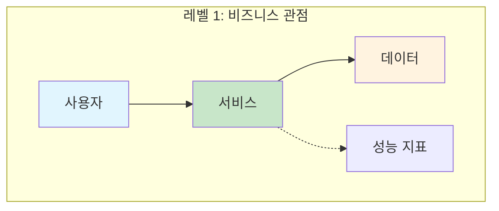
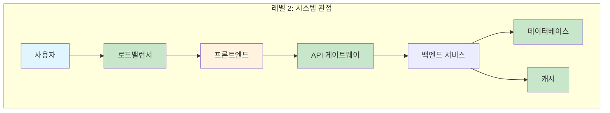
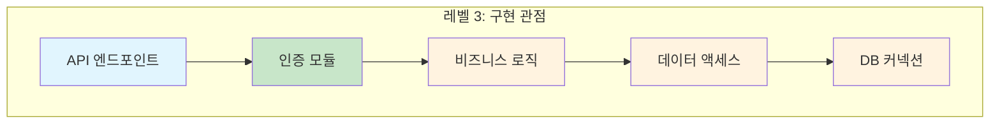
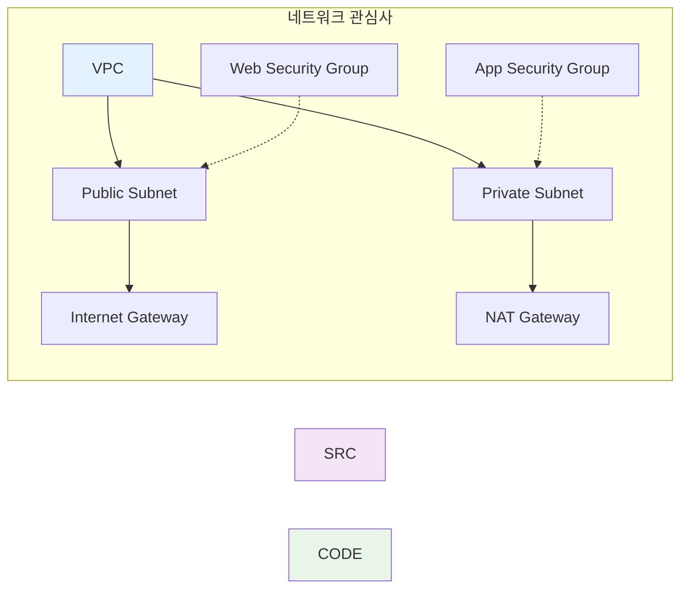
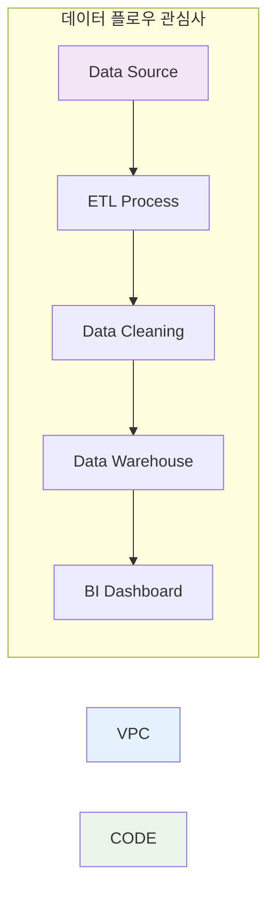
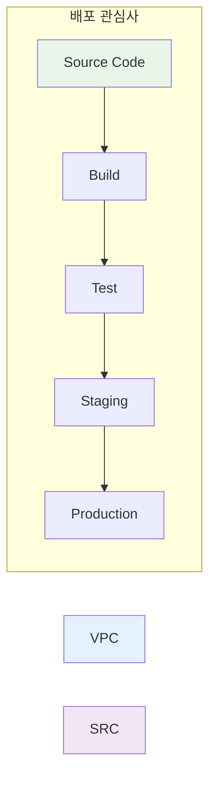
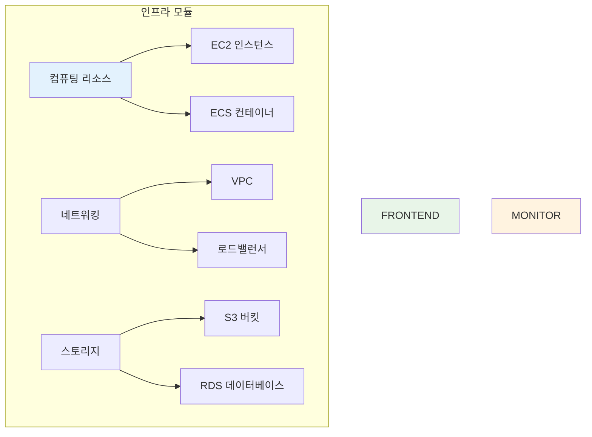
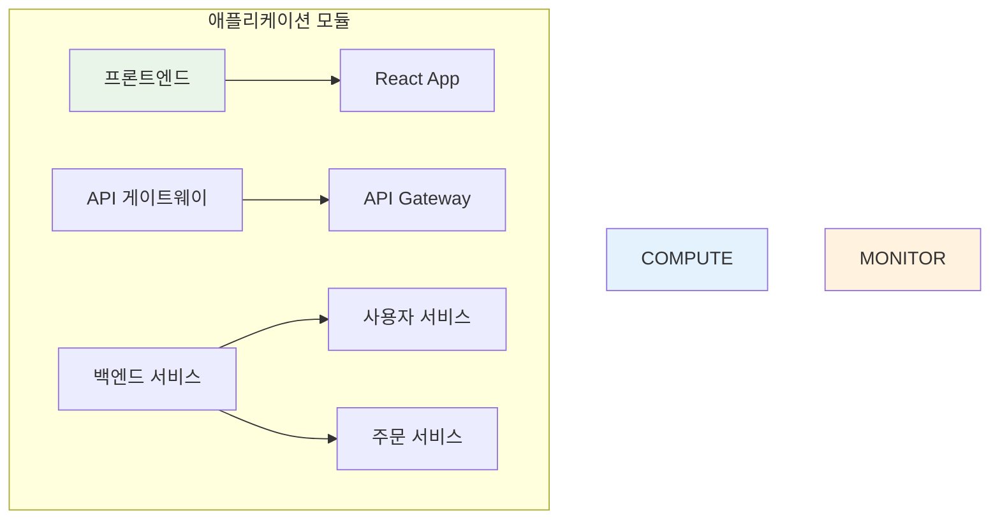
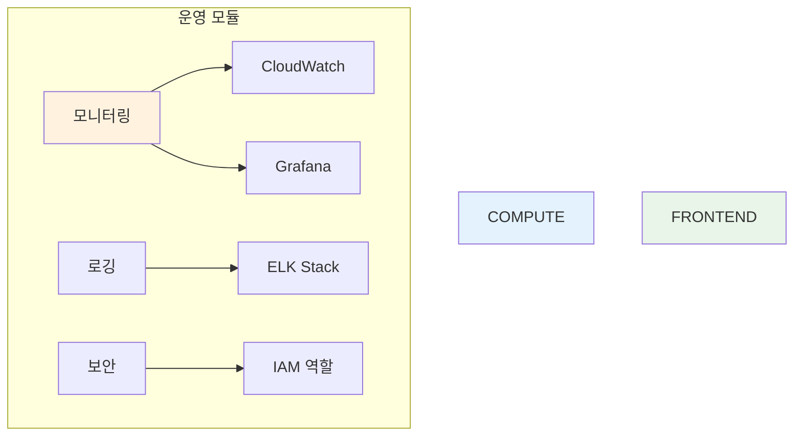

# 복잡도 관리 (10분)

## 학습 목표
- 다이어그램 복잡도를 평가하는 기준 학습
- 효과적인 분해 전략 습득
- DevOps 환경에서 계층적 문서화 방법 이해

## 1. 복잡도 평가 기준 (3분)

### 정량적 지표
- **요소 개수**: 박스, 화살표, 라벨의 총 개수
- **연결 복잡도**: 각 요소당 평균 연결 수
- **계층 깊이**: 중첩된 그룹의 단계 수

### DevOps 관점의 복잡도 신호

#### 🚨 위험 신호들
```
❌ 한 화면에 20개 이상의 서비스
❌ 교차하는 화살표가 5개 이상
❌ 3단계 이상의 중첩 그룹
❌ 라벨을 읽기 위해 확대가 필요
```

#### ✅ 적절한 복잡도
```
✅ 핵심 구성요소 5-9개
✅ 명확한 데이터/제어 흐름
✅ 2단계 이하의 그룹화
✅ 한눈에 들어오는 전체 구조
```

### 실제 측정 방법
1. **동료 테스트**: 5분 안에 설명 가능한지 확인
2. **신규자 테스트**: 처음 보는 사람도 이해할 수 있는지
3. **인쇄 테스트**: A4 용지에 인쇄했을 때 읽을 수 있는지

## 2. 분해 전략 (4분)

### 계층적 분해 (Layered Decomposition)

#### 전략 1: 추상화 레벨별 분해
```
레벨 1: 비즈니스 관점 (경영진용)
├── 사용자 → 서비스 → 데이터
└── 비용, 성능, 가용성 지표
```

```
레벨 2: 시스템 관점 (아키텍트용)  
├── 프론트엔드 → API → 백엔드 → DB
└── 로드밸런서, 캐시, 큐 포함
```

```
레벨 3: 구현 관점 (개발자용)
├── 각 서비스의 내부 구조
└── 함수, 클래스, 모듈 수준
```


**실제 복잡도 관리 예시**:


출처: https://server-engineer.tistory.com/930*


*출처: https://www.stormit.cloud/blog/aws-security-hub/*

**복잡도 분석**:
- **상단 이미지**: 너무 많은 세부사항으로 5분 내 설명 어려움
- **하단 이미지**: 핵심 보안 요소만 표현하여 이해하기 쉬움
- **교훈**: 목적에 맞는 추상화 레벨 선택이 중요

#### 전략 2: 관심사별 분해
```
🔍 네트워크 다이어그램
├── VPC, 서브넷, 보안그룹
└── 트래픽 흐름과 방화벽 규칙
```

```
🔍 데이터 플로우 다이어그램  
├── 데이터 소스 → 처리 → 저장
└── ETL 파이프라인과 데이터 변환
```

```
🔍 배포 다이어그램
├── CI/CD 파이프라인 단계
└── 환경별 배포 전략
```


**관심사별 분해 실제 예시**:


*배포 관심사에 집중한 다이어그램 - 소스부터 프로덕션까지의 플로우 (출처: https://github.com/stefanprodan/gh-actions-demo)*


*인프라 관심사에 집중한 다이어그램 - 코드형 인프라 관리 (출처: https://jeromedecoster.github.io/aws/gitops--terraform/)*

**관심사 분해의 장점**:
- **배포 관심사**: CI/CD 파이프라인의 각 단계와 게이트웨이 명확히 표현
- **인프라 관심사**: Terraform을 통한 인프라 코드 관리 프로세스 집중
- **효과**: 각 다이어그램이 특정 목적에 최적화되어 5분 내 설명 가능

### 모듈식 분해 (Modular Decomposition)

#### DevOps 도메인별 모듈화
```
📦 인프라 모듈
├── 컴퓨팅 리소스 (EC2, 컨테이너)
├── 네트워킹 (VPC, 로드밸런서)
└── 스토리지 (S3, EBS, RDS)
```

```
📦 애플리케이션 모듈
├── 프론트엔드 서비스
├── API 게이트웨이
└── 백엔드 마이크로서비스
```

```
📦 운영 모듈
├── 모니터링 (CloudWatch, Grafana)
├── 로깅 (ELK Stack)
└── 보안 (IAM, 보안그룹)
```


**모듈식 분해 실제 예시**:


*애플리케이션 배포 모듈 - Helm을 통한 Kubernetes 애플리케이션 관리 (출처: https://circleci.com/blog/what-is-helm/)*

**모듈식 분해의 효과**:
- **배포 모듈**: Helm을 통한 애플리케이션 라이프사이클 관리에 집중
- **패키징 모듈**: 차트 구조와 템플릿 관계에 집중
- **독립성**: 각 모듈을 별도로 이해하고 관리 가능
- **재사용성**: 모듈별로 다른 프로젝트에서 재활용 가능

## 3. 관계 유지 전략 (3분)

### 다이어그램 간 연결 방법

#### 1. 명시적 참조
```
📋 마스터 다이어그램: "전체 시스템 개요"
├── 📄 상세 다이어그램 A: "API 게이트웨이 상세"
├── 📄 상세 다이어그램 B: "MSA 구성"
├── 📄 상세 다이어그램 C: "VPC 네트워크 상세"
└── 📄 상세 다이어그램 D: "모니터링 스택"
```

#### 2. 일관된 명명 규칙
```
✅ 좋은 예:
- user-api (마스터) → user-api-internal (상세)
- prod-vpc (마스터) → prod-vpc-subnets (상세)

❌ 나쁜 예:
- API (마스터) → 사용자서비스상세 (상세)
- 네트워크 (마스터) → subnet_details (상세)
```

#### 3. 시각적 연결 표시
```
🔗 하이퍼링크: Draw.io에서 클릭 가능한 링크
🔗 QR 코드: 인쇄물에서 디지털 연결
🔗 색상 코딩: 관련 다이어그램 간 일관된 색상
```

### DevOps 워크플로우에서의 적용

#### 장애 대응 시나리오
```
1️⃣ 알람 발생 → 모니터링 대시보드 확인
2️⃣ 영향 범위 파악 → 시스템 개요 다이어그램
3️⃣ 근본 원인 분석 → 해당 서비스 상세 다이어그램
4️⃣ 복구 계획 수립 → 의존성 다이어그램
```

#### 아키텍처 리뷰 시나리오
```
1️⃣ 비즈니스 요구사항 → 고수준 아키텍처
2️⃣ 기술적 제약사항 → 인프라 다이어그램  
3️⃣ 보안 요구사항 → 네트워크/보안 다이어그램
4️⃣ 운영 고려사항 → 모니터링/배포 다이어그램
```

## 실습 예제

### 복잡한 마이크로서비스 아키텍처 분해하기

#### 원본 (복잡함)
- 15개 마이크로서비스
- 3개 데이터베이스
- 2개 메시지 큐
- 로드밸런서, API 게이트웨이, 모니터링

#### 분해 결과
1. **비즈니스 플로우**: 사용자 여정 중심
2. **시스템 아키텍처**: 서비스 간 의존성
3. **인프라 레이어**: 네트워크와 보안
4. **데이터 플로우**: 데이터 이동과 변환

### 체크리스트: 분해가 필요한 시점
- [ ] 5분 안에 설명하기 어려움
- [ ] 화면을 확대해야 읽을 수 있음
- [ ] 청중이 중간에 질문을 멈춤
- [ ] 같은 다이어그램으로 다른 목적 설명 시도
- [ ] 새로운 팀원이 이해하지 못함

---
*다음: [03_시각적_커뮤니케이션.md](03_visual_communication.md)*