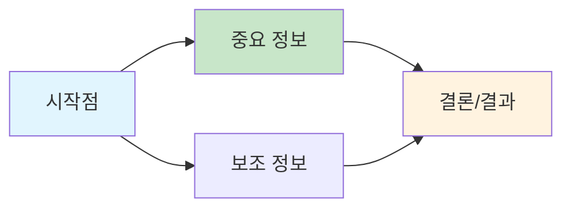
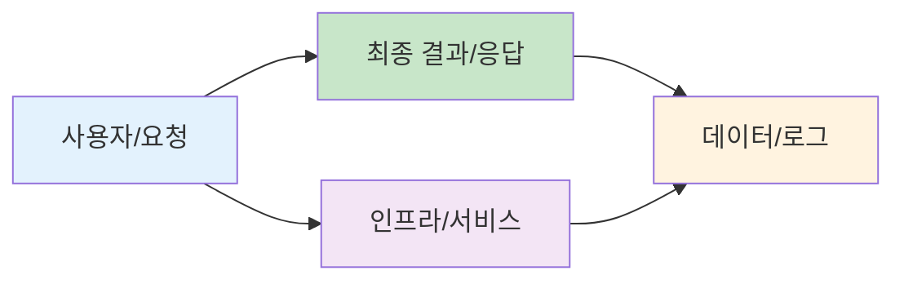
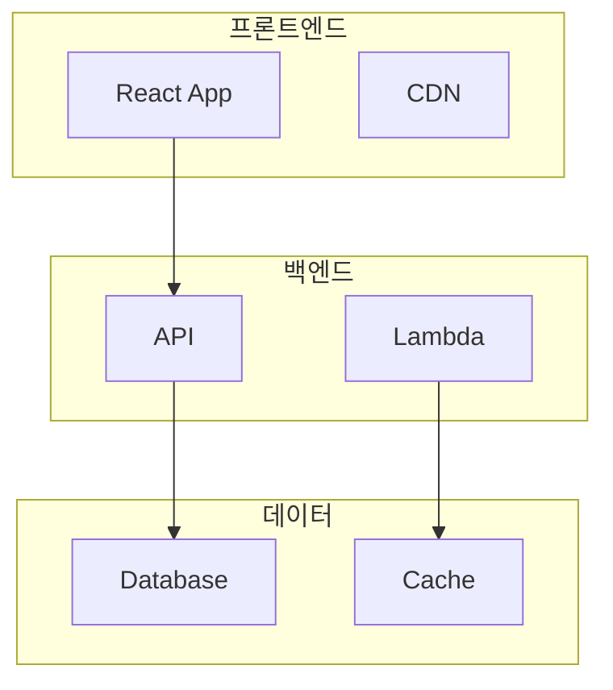
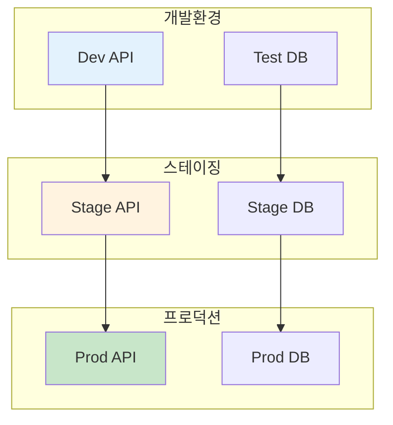
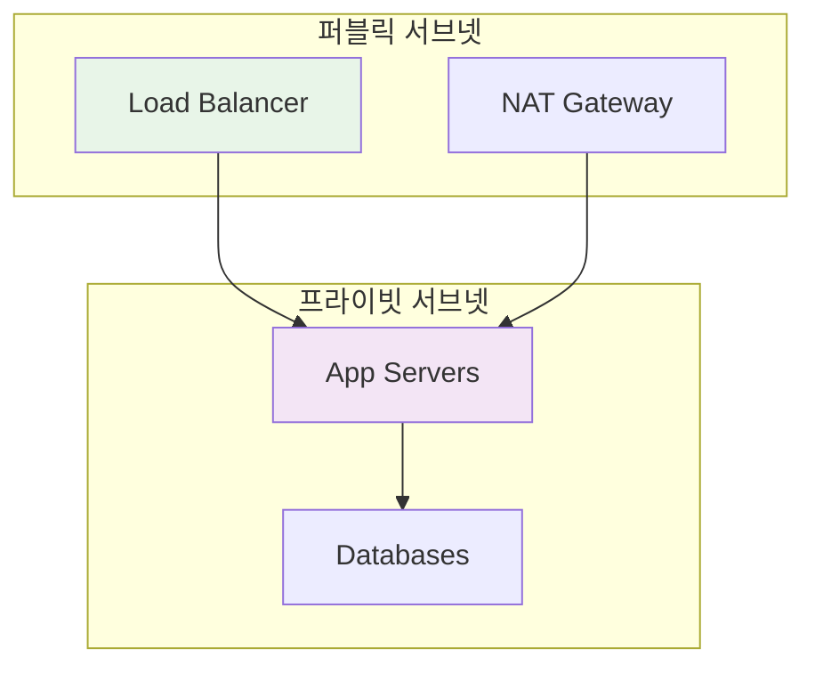
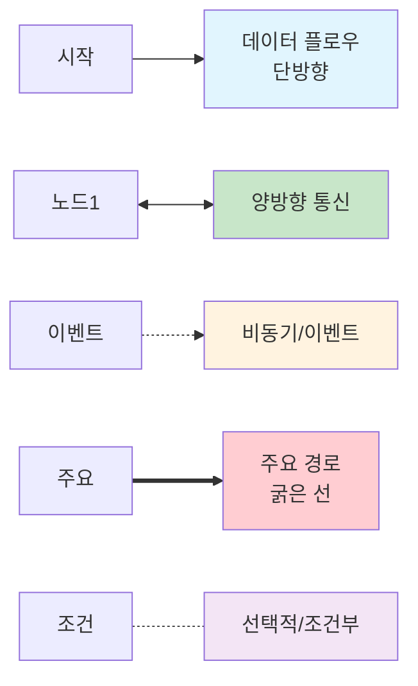
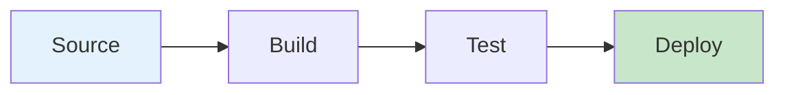
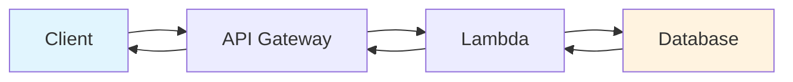
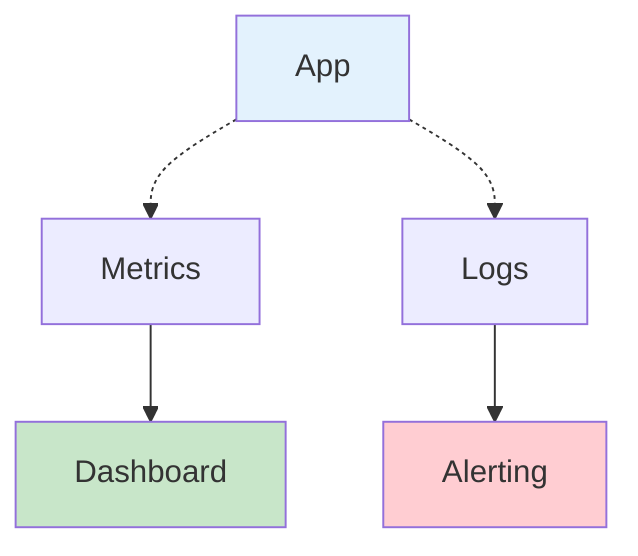
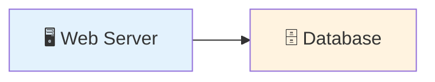

# 시각적 커뮤니케이션

## 학습 목표
- 아이콘과 시각적 요소의 효과적 사용법 학습
- DevOps 환경에서 표준화된 시각 언어 구축
- 접근성을 고려한 다이어그램 설계 방법 습득

## 1. 아이콘 vs 텍스트

### 시각적 인식의 과학
- **인간의 뇌**: 시각 정보를 텍스트보다 60,000배 빠르게 처리
- **패턴 인식**: 아이콘은 즉시 인식, 텍스트는 순차적 읽기 필요
- **기억 보존**: 시각적 정보가 3일 후에도 65% 기억 (텍스트는 10%)

### DevOps 표준 아이콘 활용

#### AWS 아이콘 체계
```
🖥️  컴퓨팅: EC2, Lambda, ECS, EKS
💾  스토리지: S3, EBS, EFS
🗄️  데이터베이스: RDS, DynamoDB, ElastiCache
🌐  네트워킹: VPC, ELB, CloudFront, Route53
🔧  개발도구: CodePipeline, CodeBuild, CodeDeploy
📊  모니터링: CloudWatch, X-Ray
```

#### 범용 DevOps 아이콘
```
🔄  CI/CD 파이프라인
🐳  컨테이너 (Docker/Kubernetes)
📈  모니터링 및 알람
🔒  보안 및 인증
⚡  이벤트 및 메시징
🔧  설정 관리
```

### 텍스트 사용 원칙
```
✅ 아이콘 + 간단한 라벨
   [EC2 아이콘] Web Server

✅ 고유한 식별자
   [RDS 아이콘] user-db-prod

❌ 긴 설명문
   "사용자 데이터를 저장하는 MySQL 데이터베이스 (프로덕션 환경)"

❌ 아이콘 없는 텍스트 박스
   [텍스트만] "웹 서버"
```

## 2. 공간 조직 원칙

### 정보 계층 구조

#### Z-패턴 레이아웃 (서구 문화권)


#### DevOps 다이어그램 적용


### 그룹화 전략

#### 1. 기능별 그룹화


#### 2. 환경별 그룹화


#### 3. 네트워크별 그룹화


### 화살표와 연결선 사용법

#### 화살표 의미 체계


#### DevOps 시나리오별 적용

**CI/CD 파이프라인**:


**API 호출 플로우**:


**모니터링 플로우**:


## 3. 접근성 고려사항

### 색상 독립적 설계

#### 문제가 되는 색상 의존
```
❌ 빨간색 = 에러, 초록색 = 정상 (색맹 고려 부족)
❌ 파란색 선 = 네트워크, 노란색 선 = 데이터 (구분 어려움)
```

#### 접근성 좋은 대안
```
✅ 모양 + 색상 조합
   🔴 [X] 에러    🟢 [✓] 정상
   
✅ 패턴 + 색상 조합
   ═══ 네트워크 (굵은 실선)
   ┈┈┈ 데이터 (점선)
   
✅ 라벨 + 시각적 구분
   [ERROR] 빨간 배경
   [OK] 초록 배경
```

### 범용 설계 원칙

#### 1. 명확한 대비
```
✅ 검은 텍스트 + 흰 배경 (대비비 21:1)
✅ 진한 파랑 + 흰 텍스트 (대비비 8.6:1)
❌ 회색 텍스트 + 연한 회색 배경 (대비비 2.1:1)
```

#### 2. 일관된 표기법
```
✅ 같은 개념 = 같은 아이콘/색상
   모든 데이터베이스 → 같은 아이콘
   모든 API → 같은 색상 체계

✅ 계층별 일관성
   레벨 1: 큰 아이콘, 굵은 선
   레벨 2: 중간 아이콘, 보통 선  
   레벨 3: 작은 아이콘, 얇은 선
```

#### 3. ASCII 아트 금지

**❌ 텍스트 기반 다이어그램 (피해야 할 방식)**:
```
+-------+     +--------+
| Web   |---->| DB     |
+-------+     +--------+
```

**✅ 적절한 도구 사용 (권장 방식)**:


**개선 효과**:
- 시각적 명확성 향상
- 확장성과 유지보수성 개선
- 다양한 출력 형식 지원 (PNG, SVG, PDF)

## 4. DevOps 시각 언어 표준화 (실습 준비)

### 팀 내 시각 언어 구축

#### 1. 아이콘 라이브러리 정의
```
📋 팀 표준 아이콘 세트
├── AWS 공식 아이콘 (인프라)
├── Kubernetes 아이콘 (컨테이너)  
├── 사용자 정의 아이콘 (내부 서비스)
└── 상태 표시 아이콘 (정상/경고/에러)
```

#### 2. 색상 팔레트 정의
```
🎨 DevOps 색상 체계
├── 주요: #2E86AB (파랑 - 안정성)
├── 보조: #A23B72 (자주 - 중요도)  
├── 성공: #F18F01 (주황 - 성공)
├── 경고: #C73E1D (빨강 - 위험)
└── 중성: #6C757D (회색 - 보조정보)
```

#### 3. 레이아웃 템플릿
```
📐 표준 레이아웃
├── 제목 + 범례 (상단)
├── 주요 플로우 (중앙)
├── 지원 시스템 (하단)
└── 메타데이터 (우측 하단)
```

### 정리해야 할 사항
- 팀에서 자주 사용하는 서비스/도구 목록
- 현재 사용 중인 다이어그램 도구 경험
- 개선하고 싶은 기존 다이어그램 사례

---
*다음: [04_도구_선택.md](04_tool_selection.md)*