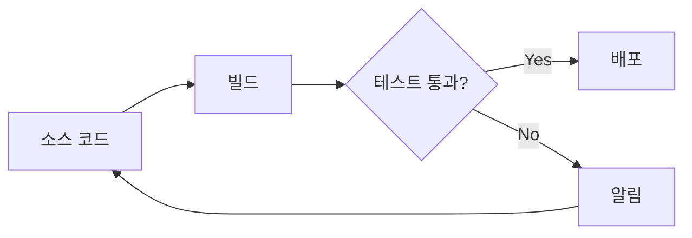
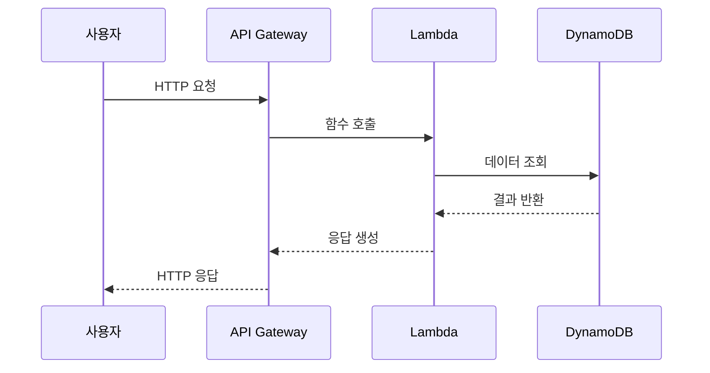
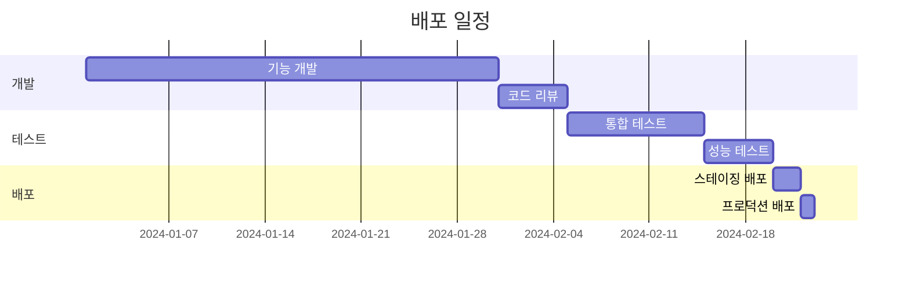
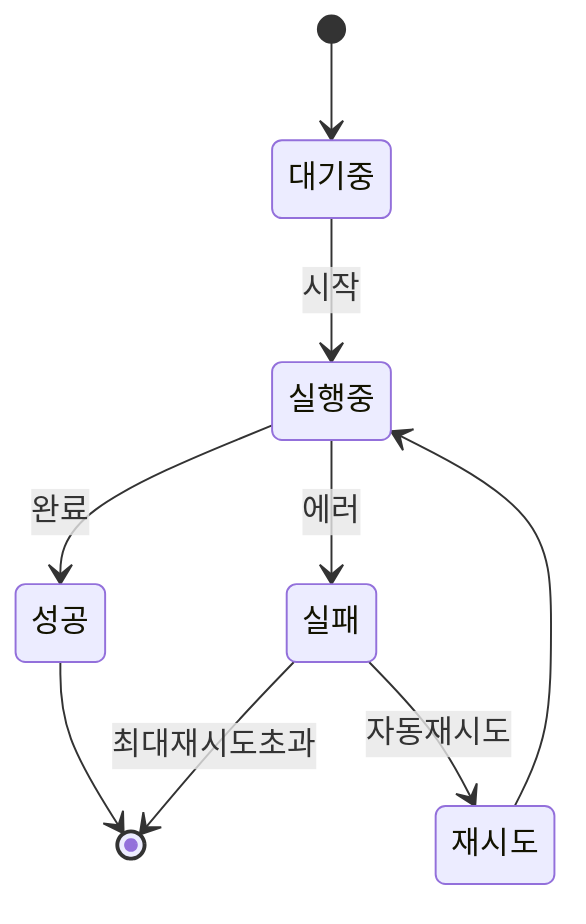
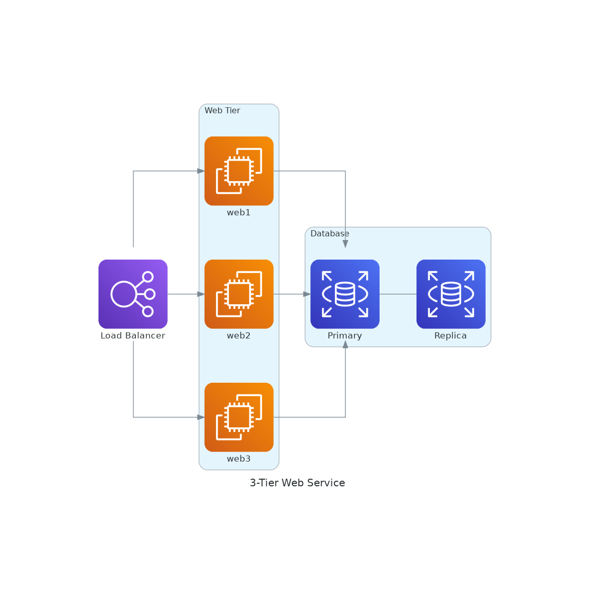
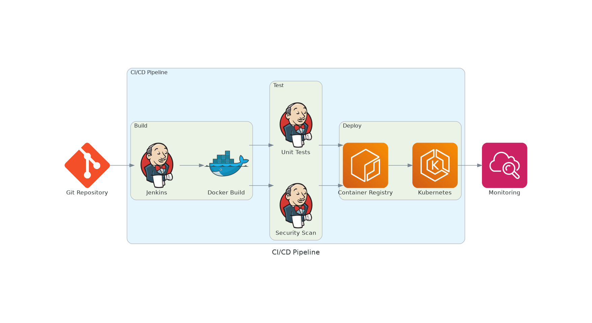
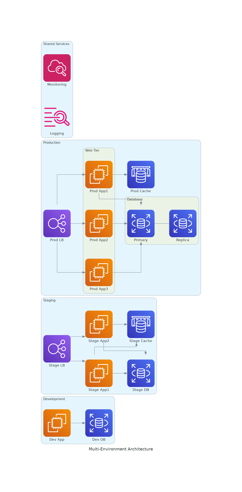
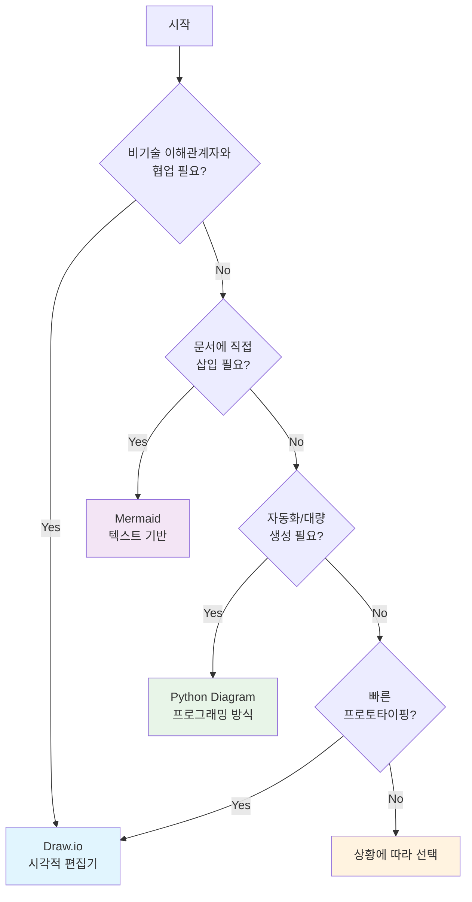

# 도구 선택 가이드 (10분)

## 학습 목표
- Draw.io, Mermaid, Python Diagram MCP의 특징과 장단점 이해
- DevOps 시나리오별 최적 도구 선택 방법 습득
- 각 도구의 실제 사용 사례와 워크플로우 파악

## 1. 도구 개요 (2분)

### 지원 도구 비교

| 특징 | Draw.io | Mermaid | Python Diagram MCP |
|------|---------|---------|-------------------|
| **유형** | 시각적 편집기 | 텍스트 기반 | 프로그래밍 방식 |
| **학습 곡선** | 낮음 | 중간 | 높음 |
| **버전 제어** | 어려움 | 쉬움 | 쉬움 |
| **자동화** | 불가능 | 가능 | 완전 자동화 |
| **협업** | 실시간 가능 | Git 기반 | Git 기반 |
| **출력 형식** | PNG, SVG, PDF | PNG, SVG | PNG, SVG, PDF |

## 2. Draw.io - 시각적 편집기 (2분)

### 주요 특징
- **드래그 앤 드롭**: 직관적인 인터페이스
- **풍부한 아이콘**: AWS, Azure, GCP, Kubernetes 등
- **실시간 협업**: 여러 사람이 동시 편집
- **애니메이션 지원**: GIF처럼 단계별 애니메이션 생성 가능 ⭐

### DevOps 사용 사례

#### ✅ 최적 사용 시나리오
```
🎯 비기술 이해관계자와의 회의
   - 경영진 보고
   - 고객 프레젠테이션
   - 아키텍처 리뷰

🎯 빠른 프로토타이핑
   - 브레인스토밍 세션
   - 화이트보드 대체
   - 실시간 토론

🎯 복잡한 시각적 표현
   - 네트워크 토폴로지
   - 상세한 인프라 다이어그램
   - 다층 아키텍처
```

### 애니메이션 기능 활용 (Draw.io 특별 기능)

#### CI/CD 파이프라인 단계별 표시
```
프레임 1: 소스 코드 커밋
프레임 2: 빌드 시작
프레임 3: 테스트 실행
프레임 4: 배포 진행
프레임 5: 모니터링 활성화
```

#### 장애 전파 시각화
```
프레임 1: 정상 상태
프레임 2: DB 장애 발생 (빨간색)
프레임 3: API 영향 (주황색)
프레임 4: 프론트엔드 영향 (노란색)
프레임 5: 복구 시작 (초록색)
```

### 장단점
```
✅ 장점
- 비개발자도 쉽게 사용
- 즉시 시각적 피드백
- 애니메이션으로 프로세스 표현
- 다양한 템플릿 제공

❌ 단점
- 버전 제어 어려움 (XML 형식)
- 자동화 불가능
- 대규모 다이어그램 관리 어려움
- 일관성 유지 수동 작업
```

## 3. Mermaid - 텍스트 기반 다이어그램 (3분)

### 주요 특징
- **마크다운 통합**: README, Wiki에 직접 삽입
- **버전 제어 친화적**: Git diff로 변경사항 추적
- **간단한 구문**: 빠른 학습과 작성
- **자동 렌더링**: GitHub, GitLab, Notion 등에서 자동 표시

### Mermaid 다이어그램 유형

#### 1. 플로우차트 (Flowchart)


#### 2. 시퀀스 다이어그램 (Sequence Diagram)


#### 3. 간트 차트 (Gantt Chart)


#### 4. 상태 다이어그램 (State Diagram)


### DevOps 사용 사례

#### ✅ 최적 사용 시나리오
```
🎯 기술 문서화
   - README.md에 아키텍처 설명
   - API 문서에 플로우 차트
   - 운영 가이드에 프로세스 다이어그램

🎯 코드 리뷰
   - PR에 변경사항 시각화
   - 설계 의도 명확화
   - 영향 범위 표시

🎯 자동화된 문서
   - CI/CD에서 자동 생성
   - 버전별 변경 추적
   - 일관된 스타일 유지
```

### 장단점
```
✅ 장점
- Git 친화적 (텍스트 기반)
- 빠른 작성과 수정
- 자동 렌더링 (GitHub 등)
- 일관된 스타일

❌ 단점
- 복잡한 레이아웃 제어 어려움
- 커스터마이징 제한적
- 일부 플랫폼 지원 부족
- 시각적 피드백 지연
```

## 4. Python Diagram MCP - 프로그래밍 방식 (3분)

### 주요 특징
- **완전 자동화**: 스크립트로 다이어그램 생성
- **데이터 기반**: 실제 인프라 상태 반영
- **일관성 보장**: 코드로 스타일 통일
- **대량 생성**: 여러 환경/버전 자동 생성

### Python Diagram 예시

#### 기본 사용법
```python
# import 문은 런타임에서 자동 처리됨
with Diagram("3-Tier Web Service", show=False):
    lb = ELB("Load Balancer")
    
    with Cluster("Web Tier"):
        web_servers = [EC2("web1"), EC2("web2"), EC2("web3")]
    
    with Cluster("Database"):
        db_primary = RDS("Primary")
        db_replica = RDS("Replica")
        db_primary - db_replica
    
    lb >> web_servers >> db_primary
```


#### CI/CD 파이프라인 자동 생성
```python
with Diagram("CI/CD Pipeline", show=False, direction="LR"):
    source = Codecommit("Source")
    build = Codebuild("Build")
    test = Codebuild("Test")
    deploy = Codedeploy("Deploy")
    
    with Cluster("Production"):
        lb = ELB("LB")
        instances = [EC2("app1"), EC2("app2")]
    
    source >> build >> test >> deploy >> lb >> instances
```


#### 환경별 다이어그램 자동 생성
```python
environments = ["dev", "staging", "prod"]

for env in environments:
    with Diagram(f"{env.upper()} Environment", show=False):
        # 환경별 리소스 생성
        lb = ELB(f"{env}-lb")
        app = EC2(f"{env}-app")
        db = RDS(f"{env}-db")
        
        lb >> app >> db
```


### DevOps 사용 사례

#### ✅ 최적 사용 시나리오
```
🎯 인프라 as 코드 문서화
   - Terraform/CloudFormation과 동기화
   - 실제 배포 상태 반영
   - 자동 업데이트

🎯 다중 환경 관리
   - Dev/Stage/Prod 자동 생성
   - 환경 간 차이 시각화
   - 일관된 문서화

🎯 대규모 시스템
   - 수십 개 서비스 자동 배치
   - 복잡한 의존성 표현
   - 동적 구성 반영
```

### 장단점
```
✅ 장점
- 완전 자동화 가능
- 실제 인프라와 동기화
- 대량 생성 용이
- 프로그래밍 제어

❌ 단점
- Python 지식 필요
- 초기 설정 복잡
- 즉각적 시각 피드백 없음
- 디버깅 어려움
```

## 5. 도구 선택 가이드 (실습 준비)

### 의사결정 플로우차트

```

```

### 실전 조합 전략
```
📋 프로젝트 초기
└─► Draw.io (빠른 스케치)

📋 개발 단계
└─► Mermaid (코드와 함께 문서화)

📋 운영 단계
└─► Python Diagram (실제 인프라 반영)

📋 프레젠테이션
└─► Draw.io (애니메이션 활용)
```

---
*다음: [05_실전_예제.md](05_practical_examples.md)*