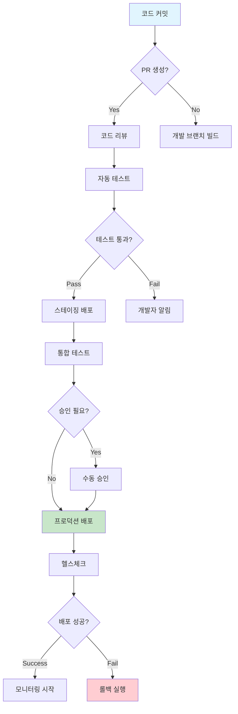
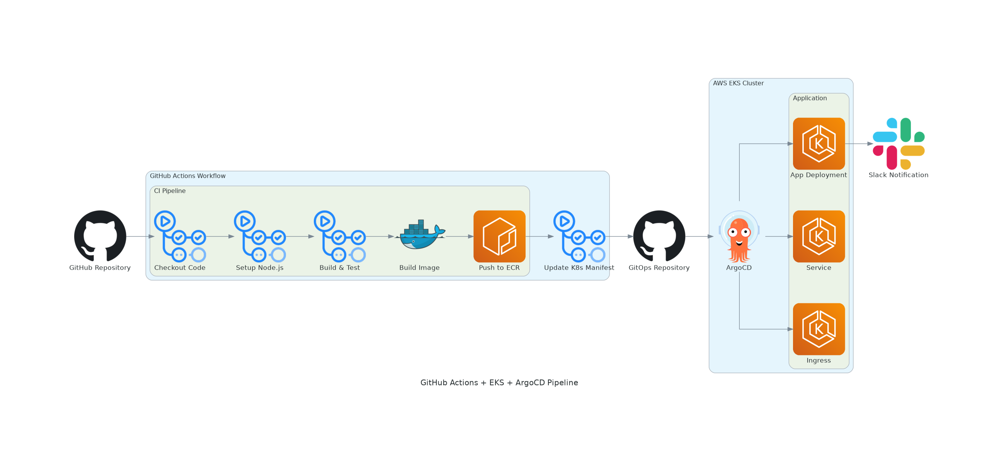
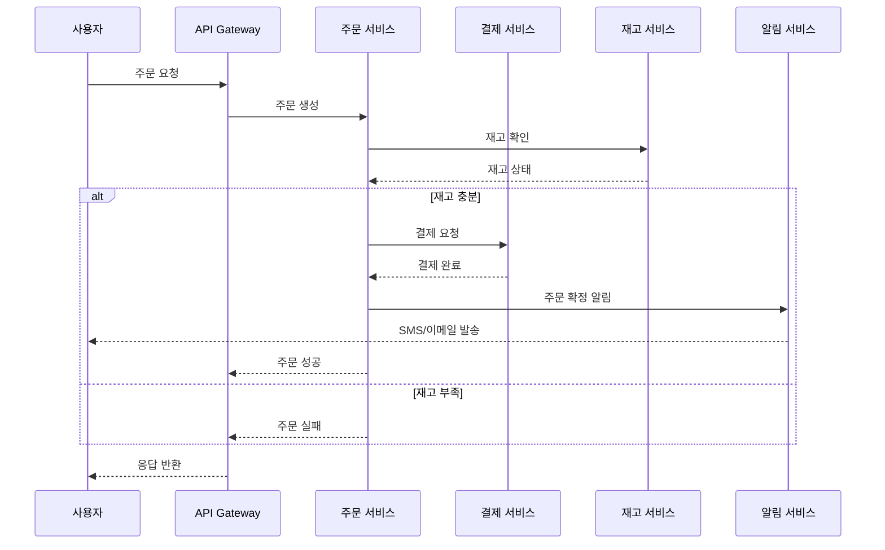
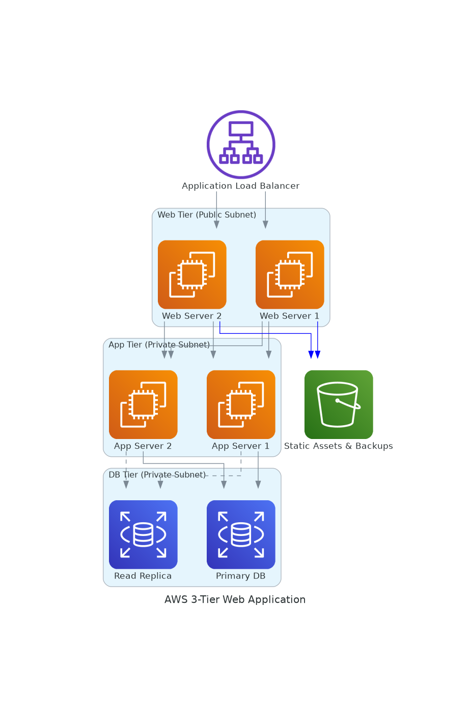
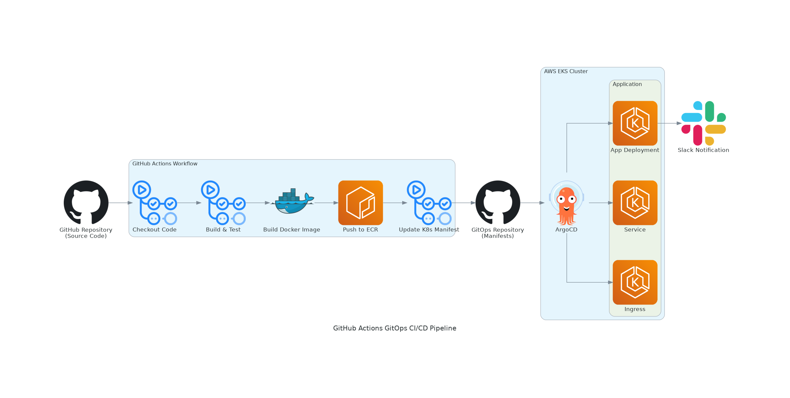
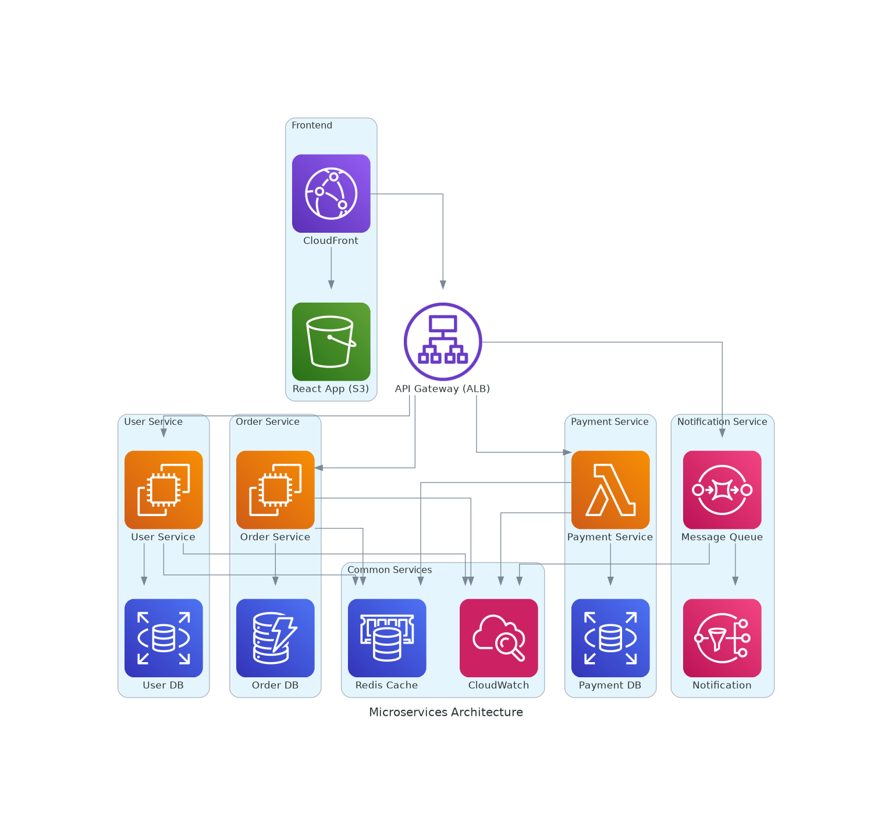

# 실전 다이어그램 예시 (20분)

## 학습 목표
- 실제 DevOps 시나리오에서 사용하는 다이어그램 작성법 습득
- Mermaid, MCP Python Diagram, Draw.io 도구별 활용 사례 학습
- 팀 협업을 위한 효과적인 시각화 기법 적용

## 1. Mermaid 실전 예시 (7분)

### 1.1 CI/CD 파이프라인 플로우

**시나리오**: 마이크로서비스 배포 파이프라인 설명 (5분 내 설명 가능)




**설명 포인트** (2분):
- 개발자 관점: 코드 커밋부터 배포까지의 자동화 흐름
- 운영팀 관점: 승인 지점과 롤백 전략
- 품질 관리: 테스트 게이트와 헬스체크

### 1.2 API 서비스 간 통신 플로우

**시나리오**: 주문 처리 마이크로서비스 아키텍처



**활용 팁**:
- 장애 상황 분석 시 어느 서비스에서 문제가 발생했는지 빠르게 파악
- 새로운 팀원에게 서비스 간 의존성 설명
- API 응답 시간 최적화 지점 식별

## 2. MCP Python Diagram 실전 예시 (8분)

### 2.1 MCP 설정 및 사용법

**MCP (Model Context Protocol) 설정**:

1. **MCP 서버 설정** (Claude Desktop 또는 호환 클라이언트):
```json
{
  "mcpServers": {
    "awslabs.aws-diagram-mcp-server": {
      "command": "uv",
      "args": [
        "tool",
        "run",
        "--from",
        "awslabs.aws-diagram-mcp-server",
        "awslabs.aws-diagram-mcp-server.exe"
      ],
      "env": {
        "FASTMCP_LOG_LEVEL": "ERROR"
      },
      "autoApprove": [
        "generate_diagram",
        "generate_diagram",
        "list_icons",
        "get_diagram_examples"
      ],
      "disabled": false
    }
  }
}
```

2. **기본 사용 프롬프트**:
```
"Python diagrams 라이브러리를 사용해서 AWS 3-tier 웹 애플리케이션 아키텍처 다이어그램을 생성해줘. 
- ALB 로드밸런서
- 웹 서버 2대 (퍼블릭 서브넷)
- 앱 서버 2대 (프라이빗 서브넷)  
- RDS Primary/Replica (프라이빗 서브넷)
- S3 스토리지
파일명은 '3tier-web-app'으로 저장해줘."
```

### 2.2 실전 프롬프트 예시

**시나리오 1: AWS 3-Tier 웹 애플리케이션**

**프롬프트**:
```
AWS 3-tier 웹 애플리케이션 아키텍처를 Python diagrams로 생성해줘:

구성요소:
- Application Load Balancer (ALB)
- Web Tier: EC2 웹서버 2대 (퍼블릭 서브넷)
- App Tier: EC2 앱서버 2대 (프라이빗 서브넷)
- DB Tier: RDS Primary + Read Replica (프라이빗 서브넷)
- S3: 정적 자산 및 백업

연결:
- ALB → 웹서버들
- 웹서버들 → 앱서버들
- 앱서버들 → Primary DB
- 앱서버들 → Read Replica (점선)
- 웹서버들 → S3 (파란색 선)

파일명: aws-3tier-webapp
```


**시나리오 2: GitHub Actions + EKS + ArgoCD 파이프라인**

**프롬프트**:
```
GitHub Actions와 EKS, ArgoCD를 사용한 GitOps CI/CD 파이프라인을 그려줘:

구성:
1. GitHub Repository (소스코드)
2. GitHub Actions Workflow:
   - Checkout Code
   - Build & Test  
   - Build Docker Image
   - Push to ECR
   - Update K8s Manifest
3. GitOps Repository (매니페스트)
4. AWS EKS Cluster:
   - ArgoCD
   - App Deployment
   - Service
   - Ingress
5. Slack 알림

연결 플로우:
GitHub Repo → GitHub Actions → ECR → GitOps Repo → ArgoCD → EKS → Slack

파일명: gitops-pipeline
```


**시나리오 3: 마이크로서비스 아키텍처**

**프롬프트**:
```
마이크로서비스 아키텍처를 그려줘:

Frontend:
- React App (CloudFront + S3)

API Gateway:
- ALB 또는 API Gateway

Microservices (각각 별도 클러스터):
- User Service (EC2 + RDS)
- Order Service (EC2 + DynamoDB)  
- Payment Service (Lambda + RDS)
- Notification Service (SQS + SNS)

공통 서비스:
- Redis (캐시)
- CloudWatch (모니터링)

파일명: microservices-arch
```


### 2.3 MCP 활용 팁

**효과적인 프롬프트 작성법**:

1. **구체적인 구성요소 명시**:
   - ❌ "웹 애플리케이션 그려줘"
   - ✅ "ALB + EC2 2대 + RDS Primary/Replica 구조로 그려줘"

2. **연결 관계 명확히 표현**:
   - ❌ "연결해줘"
   - ✅ "ALB → EC2들, EC2들 → RDS Primary, EC2들 → RDS Replica (점선)"

3. **스타일링 요구사항**:
   - 색상: "파란색 선", "빨간색 점선"
   - 방향: "왼쪽에서 오른쪽으로", "위에서 아래로"
   - 클러스터링: "Web Tier로 그룹핑"

4. **파일명 지정**:
   - 항상 파일명을 명시해서 관리 용이하게

**실제 생성된 다이어그램 예시**:


*3-tier 웹 서비스 아키텍처*


*GitHub Actions + EKS + ArgoCD GitOps 파이프라인*


*환경별 아키텍처 (Dev/Staging/Production)*

**Kubernetes 및 Helm 배포 예시**:


*Helm을 활용한 Kubernetes 애플리케이션 배포 구조*


*Helm 차트의 내부 구조와 템플릿 관계*


*Terraform을 활용한 인프라 코드 관리*

## 3. Draw.io 실전 예시 (5분)

### 3.1 인프라 스케일링 시나리오 (애니메이션 활용)

**시나리오**: 트래픽 증가에 따른 자동 스케일링 과정

**애니메이션 단계**:
1. **초기 상태**: 기본 인스턴스 2대
2. **트래픽 증가**: CPU 사용률 80% 초과
3. **스케일 아웃**: Auto Scaling Group이 인스턴스 4대로 확장
4. **로드 분산**: ALB가 트래픽을 4대로 분산
5. **안정화**: CPU 사용률 정상화

**Draw.io 애니메이션 기능**:
- 각 단계를 별도 레이어로 생성
- 시간 순서대로 레이어 표시/숨김
- GIF로 내보내기하여 문서나 프레젠테이션에 활용

### 3.2 장애 복구 프로세스

**시나리오**: 데이터베이스 장애 시 복구 절차

**애니메이션 흐름**:
1. **장애 발생**: Primary DB 다운 (빨간색 표시)
2. **감지**: CloudWatch 알람 트리거
3. **자동 페일오버**: RDS가 Read Replica를 Primary로 승격
4. **DNS 업데이트**: Route53이 새로운 엔드포인트로 라우팅
5. **서비스 복구**: 애플리케이션 정상 동작 재개

## 4. 도구별 활용 가이드라인 (3분)

### 언제 어떤 도구를 사용할까?

| 상황 | 추천 도구 | 이유 |
|------|-----------|------|
| **API 플로우 설명** | Mermaid | 시퀀스 다이어그램으로 시간 순서 표현 |
| **AWS 인프라 문서화** | MCP Python Diagram | 실제 AWS 아이콘으로 정확한 표현 |
| **프로세스 변화 설명** | Draw.io | 애니메이션으로 단계별 변화 시각화 |
| **간단한 플로우차트** | Mermaid | 코드로 관리 가능, 버전 관리 용이 |
| **복잡한 네트워크 구성** | Draw.io | 자유로운 배치와 상세한 표현 |
| **코드 리뷰용 아키텍처** | MCP Python Diagram | 코드로 작성되어 리뷰와 수정 용이 |

### 팀 협업을 위한 베스트 프랙티스

#### 1. 표준화된 아이콘과 색상 사용
```python
# 색상 코딩 예시
style_production = {"fillcolor": "#c8e6c9"}  # 초록: 프로덕션
style_staging = {"fillcolor": "#fff3e0"}     # 주황: 스테이징  
style_development = {"fillcolor": "#e3f2fd"} # 파랑: 개발
style_critical = {"fillcolor": "#ffcdd2"}    # 빨강: 중요/장애
```

#### 2. 계층별 추상화 레벨
- **Level 1**: 전체 시스템 개요 (경영진/PM용)
- **Level 2**: 서비스별 상세 (개발팀용)
- **Level 3**: 구현 세부사항 (엔지니어용)

#### 3. 문서화 규칙
- 다이어그램 제목에 목적과 대상 명시
- 마지막 업데이트 날짜 포함
- 관련 문서 링크 추가
- 5분 설명 규칙 준수 여부 체크

## 5. 실습 체크리스트 (2분)

### 즉시 적용 가능한 액션 아이템

#### ✅ 오늘 바로 해볼 것
- [ ] 현재 팀에서 사용하는 다이어그램 중 5분 규칙 위반 사례 찾기
- [ ] 가장 자주 설명하는 시스템을 Mermaid로 그려보기
- [ ] 팀 온보딩용 인프라 다이어그램을 MCP로 생성해보기

#### 📋 이번 주 내 완료할 것
- [ ] 팀 표준 아이콘과 색상 가이드 정의
- [ ] 기존 복잡한 다이어그램을 계층별로 분해
- [ ] Draw.io로 장애 대응 프로세스 애니메이션 제작

#### 🎯 한 달 내 목표
- [ ] 모든 주요 시스템의 5분 설명 가능한 다이어그램 완성
- [ ] 신규 입사자 온보딩 시 다이어그램 활용 프로세스 구축
- [ ] 장애 대응 시 다이어그램 기반 커뮤니케이션 정착

---

## 다음 단계

이제 실제 프로젝트에 이러한 원칙들을 적용해볼 차례입니다. 워크샵에서는:

1. **실제 시스템 분석**: 여러분의 현재 시스템을 5분 규칙에 맞게 다이어그램으로 표현
2. **도구 실습**: 각 도구를 직접 사용해서 다이어그램 생성
3. **팀 리뷰**: 동료들과 함께 다이어그램의 명확성과 유용성 평가

### 준비물
- 현재 담당하고 있는 시스템의 간단한 설명
- 팀에서 자주 발생하는 커뮤니케이션 문제 사례
- 개선하고 싶은 기존 다이어그램 (있다면)

---
*다음: [워크샵 - 실전 다이어그램 작성](../hands-on/README.md)*