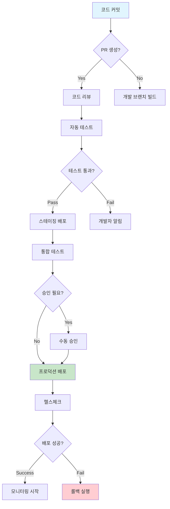
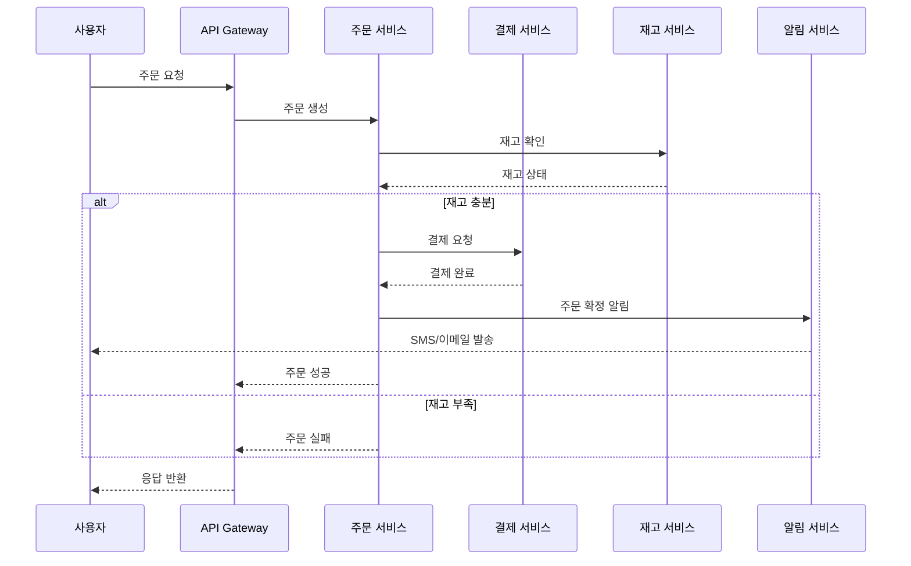

# 실전 다이어그램 예시 (20분)

## 학습 목표
- 실제 DevOps 시나리오에서 사용하는 다이어그램 작성법 습득
- Mermaid, MCP Python Diagram, Draw.io 도구별 활용 사례 학습
- 팀 협업을 위한 효과적인 시각화 기법 적용

## 1. Mermaid 실전 예시 (7분)

### 1.1 CI/CD 파이프라인 플로우

**시나리오**: 마이크로서비스 배포 파이프라인 설명 (5분 내 설명 가능)



**설명 포인트** (2분):
- 개발자 관점: 코드 커밋부터 배포까지의 자동화 흐름
- 운영팀 관점: 승인 지점과 롤백 전략
- 품질 관리: 테스트 게이트와 헬스체크

### 1.2 API 서비스 간 통신 플로우

**시나리오**: 주문 처리 마이크로서비스 아키텍처



**활용 팁**:
- 장애 상황 분석 시 어느 서비스에서 문제가 발생했는지 빠르게 파악
- 새로운 팀원에게 서비스 간 의존성 설명
- API 응답 시간 최적화 지점 식별

## 2. MCP Python Diagram 실전 예시 (8분)

### 2.1 AWS 3-Tier 웹 애플리케이션 아키텍처

실제 MCP 다이어그램을 생성해보겠습니다:

**Python 코드 예시**:
```python
from diagrams import Diagram, Cluster, Edge
from diagrams.aws.compute import EC2
from diagrams.aws.database import RDS
from diagrams.aws.network import ALB
from diagrams.aws.storage import S3

with Diagram("3-Tier Web Application", show=False, direction="TB"):
    # Load Balancer
    alb = ALB("Application Load Balancer")
    
    # Web Tier
    with Cluster("Web Tier (Public Subnet)"):
        web_servers = [EC2("Web Server 1"), EC2("Web Server 2")]
    
    # Application Tier  
    with Cluster("Application Tier (Private Subnet)"):
        app_servers = [EC2("App Server 1"), EC2("App Server 2")]
    
    # Database Tier
    with Cluster("Database Tier (Private Subnet)"):
        primary_db = RDS("Primary DB")
        replica_db = RDS("Read Replica")
    
    # Storage
    s3 = S3("Static Assets & Backups")
    
    # Connections
    alb >> web_servers
    web_servers >> app_servers
    app_servers >> primary_db
    app_servers >> Edge(style="dashed") >> replica_db
    web_servers >> Edge(color="blue") >> s3
```

**실제 생성된 다이어그램 예시**:


*복잡한 마이크로서비스 보안 아키텍처 - 실제 프로덕션 환경 예시*


*간소화된 마이크로서비스 구조 - 5분 설명 규칙 적용 예시*

**설명 포인트** (3분):
- **개발자 관점**: 애플리케이션 배포 위치와 데이터 플로우
- **인프라 엔지니어 관점**: 네트워크 분리와 보안 그룹 설정
- **운영팀 관점**: 로드밸런싱과 데이터베이스 복제 전략

### 2.2 CI/CD 파이프라인 인프라

**시나리오**: 컨테이너 기반 CI/CD 인프라 아키텍처

```python
with Diagram("CI/CD Pipeline Infrastructure", show=False, direction="LR"):
    # Source Control
    developer = User("Developer")
    
    with Cluster("Source & Build"):
        github = Github("GitHub")
        codebuild = Codebuild("CodeBuild")
        ecr = ECR("Container Registry")
    
    with Cluster("Deployment Pipeline"):
        codepipeline = Codepipeline("CodePipeline")
        codedeploy = Codedeploy("CodeDeploy")
    
    with Cluster("Target Environment"):
        with Cluster("EKS Cluster"):
            eks = EKS("Kubernetes")
            pods = [ECS("App Pod 1"), ECS("App Pod 2")]
    
    # Monitoring
    cloudwatch = Cloudwatch("CloudWatch")
    
    # Flow
    developer >> github >> codebuild >> ecr
    ecr >> codepipeline >> codedeploy >> eks >> pods
    pods >> cloudwatch
```

**실제 CI/CD 파이프라인 예시**:


*전체 CI/CD 파이프라인 아키텍처 - 소스부터 배포까지*


*GitHub Actions 기반 자동화 워크플로우*


*GitOps 방식의 배포 자동화*

**활용 팁**:
- 새로운 팀원에게 배포 프로세스 설명
- 장애 발생 시 어느 단계에서 문제가 생겼는지 빠르게 파악
- 보안 검토 시 각 단계별 권한과 접근 제어 확인

### 2.3 마이크로서비스 모니터링 아키텍처

```python
with Diagram("Microservices Monitoring Stack", show=False):
    # Applications
    with Cluster("Microservices"):
        services = [ECS("User Service"), ECS("Order Service"), ECS("Payment Service")]
    
    # Monitoring Stack
    with Cluster("Observability"):
        prometheus = EC2("Prometheus")
        grafana = EC2("Grafana")
        jaeger = EC2("Jaeger")
    
    # Logging
    with Cluster("Logging"):
        elasticsearch = ES("Elasticsearch")
        kibana = EC2("Kibana")
        logstash = EC2("Logstash")
    
    # Storage
    s3_logs = S3("Log Archive")
    
    # Connections
    services >> prometheus >> grafana
    services >> jaeger
    services >> logstash >> elasticsearch >> kibana
    elasticsearch >> s3_logs
```

**Kubernetes 및 Helm 배포 예시**:


*Helm을 활용한 Kubernetes 애플리케이션 배포 구조*


*Helm 차트의 내부 구조와 템플릿 관계*


*Terraform을 활용한 인프라 코드 관리*

## 3. Draw.io 실전 예시 (5분)

### 3.1 인프라 스케일링 시나리오 (애니메이션 활용)

**시나리오**: 트래픽 증가에 따른 자동 스케일링 과정

**애니메이션 단계**:
1. **초기 상태**: 기본 인스턴스 2대
2. **트래픽 증가**: CPU 사용률 80% 초과
3. **스케일 아웃**: Auto Scaling Group이 인스턴스 4대로 확장
4. **로드 분산**: ALB가 트래픽을 4대로 분산
5. **안정화**: CPU 사용률 정상화

**Draw.io 애니메이션 기능**:
- 각 단계를 별도 레이어로 생성
- 시간 순서대로 레이어 표시/숨김
- GIF로 내보내기하여 문서나 프레젠테이션에 활용

### 3.2 장애 복구 프로세스

**시나리오**: 데이터베이스 장애 시 복구 절차

**애니메이션 흐름**:
1. **장애 발생**: Primary DB 다운 (빨간색 표시)
2. **감지**: CloudWatch 알람 트리거
3. **자동 페일오버**: RDS가 Read Replica를 Primary로 승격
4. **DNS 업데이트**: Route53이 새로운 엔드포인트로 라우팅
5. **서비스 복구**: 애플리케이션 정상 동작 재개

## 4. 도구별 활용 가이드라인 (3분)

### 언제 어떤 도구를 사용할까?

| 상황 | 추천 도구 | 이유 |
|------|-----------|------|
| **API 플로우 설명** | Mermaid | 시퀀스 다이어그램으로 시간 순서 표현 |
| **AWS 인프라 문서화** | MCP Python Diagram | 실제 AWS 아이콘으로 정확한 표현 |
| **프로세스 변화 설명** | Draw.io | 애니메이션으로 단계별 변화 시각화 |
| **간단한 플로우차트** | Mermaid | 코드로 관리 가능, 버전 관리 용이 |
| **복잡한 네트워크 구성** | Draw.io | 자유로운 배치와 상세한 표현 |
| **코드 리뷰용 아키텍처** | MCP Python Diagram | 코드로 작성되어 리뷰와 수정 용이 |

### 팀 협업을 위한 베스트 프랙티스

#### 1. 표준화된 아이콘과 색상 사용
```python
# 색상 코딩 예시
style_production = {"fillcolor": "#c8e6c9"}  # 초록: 프로덕션
style_staging = {"fillcolor": "#fff3e0"}     # 주황: 스테이징  
style_development = {"fillcolor": "#e3f2fd"} # 파랑: 개발
style_critical = {"fillcolor": "#ffcdd2"}    # 빨강: 중요/장애
```

#### 2. 계층별 추상화 레벨
- **Level 1**: 전체 시스템 개요 (경영진/PM용)
- **Level 2**: 서비스별 상세 (개발팀용)
- **Level 3**: 구현 세부사항 (엔지니어용)

#### 3. 문서화 규칙
- 다이어그램 제목에 목적과 대상 명시
- 마지막 업데이트 날짜 포함
- 관련 문서 링크 추가
- 5분 설명 규칙 준수 여부 체크

## 5. 실습 체크리스트 (2분)

### 즉시 적용 가능한 액션 아이템

#### ✅ 오늘 바로 해볼 것
- [ ] 현재 팀에서 사용하는 다이어그램 중 5분 규칙 위반 사례 찾기
- [ ] 가장 자주 설명하는 시스템을 Mermaid로 그려보기
- [ ] 팀 온보딩용 인프라 다이어그램을 MCP로 생성해보기

#### 📋 이번 주 내 완료할 것
- [ ] 팀 표준 아이콘과 색상 가이드 정의
- [ ] 기존 복잡한 다이어그램을 계층별로 분해
- [ ] Draw.io로 장애 대응 프로세스 애니메이션 제작

#### 🎯 한 달 내 목표
- [ ] 모든 주요 시스템의 5분 설명 가능한 다이어그램 완성
- [ ] 신규 입사자 온보딩 시 다이어그램 활용 프로세스 구축
- [ ] 장애 대응 시 다이어그램 기반 커뮤니케이션 정착

---

## 다음 단계

이제 실제 프로젝트에 이러한 원칙들을 적용해볼 차례입니다. 워크샵에서는:

1. **실제 시스템 분석**: 여러분의 현재 시스템을 5분 규칙에 맞게 다이어그램으로 표현
2. **도구 실습**: 각 도구를 직접 사용해서 다이어그램 생성
3. **팀 리뷰**: 동료들과 함께 다이어그램의 명확성과 유용성 평가

### 준비물
- 현재 담당하고 있는 시스템의 간단한 설명
- 팀에서 자주 발생하는 커뮤니케이션 문제 사례
- 개선하고 싶은 기존 다이어그램 (있다면)

---
*다음: [워크샵 - 실전 다이어그램 작성](../hands-on/README.md)*