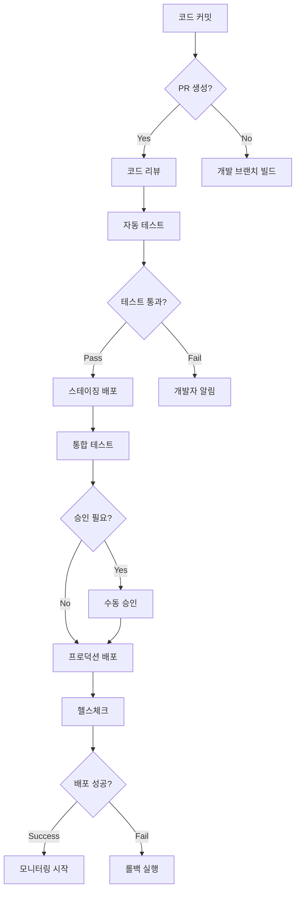
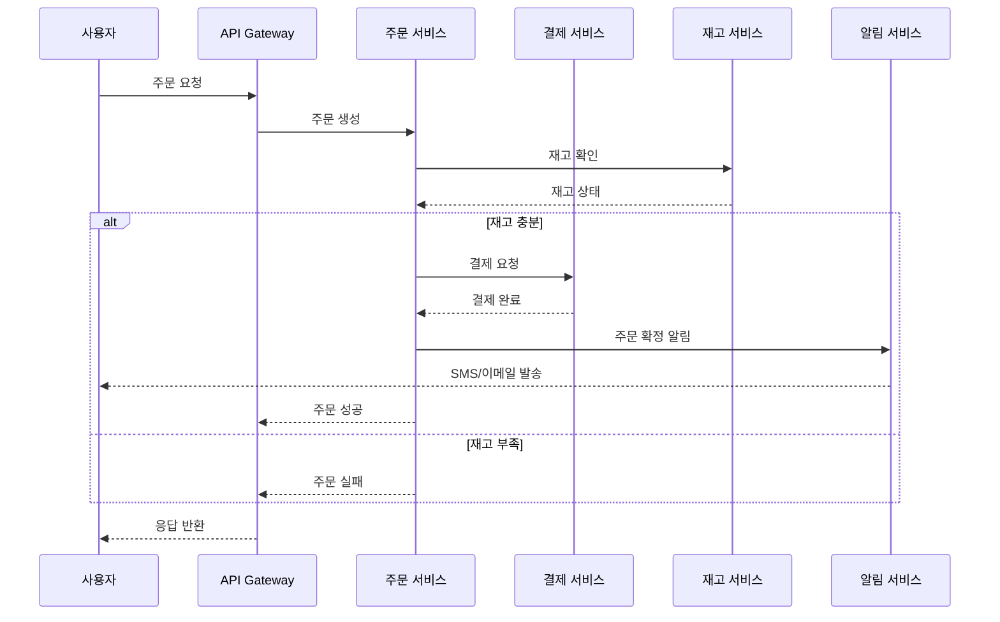

# 🎯 효과적인 DevOps 다이어그램 작성법

**5분 설명 규칙과 시각적 커뮤니케이션**

*KT Cloud TECH UP 2025 - 클라우드 네이티브 과정*

---

## 📋 오늘의 학습 목표

- **다이어그램 기초 원칙** 이해
- **복잡도 관리** 전략 습득  
- **시각적 커뮤니케이션** 기법 학습
- **도구 선택** 가이드
- **실전 예제** 및 실습

<div class="highlight">
💡 핵심: "5분 안에 설명할 수 없다면, 너무 복잡합니다"
</div>

---

# 1️⃣ 다이어그램 기초 원칙

---

## 🤔 왜 다이어그램이 중요한가?

### DevOps 환경에서의 역할
- **의사소통 도구**: 개발자, 인프라 엔지니어, 운영팀 간 공통 언어
- **문서화**: 시스템 아키텍처와 프로세스의 시각적 기록
- **문제 해결**: 장애 상황에서 빠른 이해와 대응
- **온보딩**: 신규 팀원의 시스템 이해 가속화

<div class="warning">
❌ 나쁜 예: "API가 느려요"<br>
✅ 좋은 예: [API 플로우 다이어그램을 보며] "3번 단계에서 병목이 발생하고 있습니다"
</div>

---

## ⏰ 5분 설명 규칙

### 핵심 원칙
> **"다이어그램을 설명하는 데 5분 이상 걸린다면, 너무 복잡합니다"**

### 인지 부하 이론
- **인간의 작업 기억**: 동시에 처리할 수 있는 정보는 7±2개
- **시각적 처리**: 복잡한 다이어그램은 인지 과부하 유발
- **효과적 커뮤니케이션**: 간단할수록 더 많은 사람이 이해

---

## 🎯 5분 규칙 적용 방법

### 실제 측정 방법
1. **타이머 설정**: 실제로 5분 타이머를 켜고 설명해보기
2. **청중 테스트**: 동료에게 설명하고 이해도 확인
3. **분해 전략**: 5분을 초과하면 여러 다이어그램으로 분할

### DevOps 시나리오별 적용
- **CI/CD 파이프라인**: 전체 플로우 → 각 단계별 상세
- **인프라 아키텍처**: 고수준 개요 → 네트워크/보안/모니터링 세부
- **API 플로우**: 전체 요청 흐름 → 각 서비스별 내부 로직

---

## ✅ 효과적인 다이어그램의 특징

### 좋은 다이어그램
- **명확한 목적**: 무엇을 보여주려는지 분명
- **적절한 추상화**: 목적에 맞는 세부 수준
- **논리적 흐름**: 정보가 자연스럽게 흐름
- **일관된 스타일**: 같은 규칙으로 표현

### 피해야 할 다이어그램
- **모든 것을 담으려는 시도**: "완벽한" 다이어그램의 함정
- **ASCII 아트**: 확장성과 가독성 문제
- **색상 의존**: 흑백 인쇄나 색맹 고려 부족
- **일관성 부족**: 같은 개념을 다르게 표현

---

# 2️⃣ 복잡도 관리

---

## 📊 복잡도 평가 기준

### 정량적 지표
- **요소 개수**: 박스, 화살표, 라벨의 총 개수
- **연결 복잡도**: 각 요소당 평균 연결 수
- **계층 깊이**: 중첩된 그룹의 단계 수

<div class="warning">
🚨 위험 신호들<br>
❌ 한 화면에 20개 이상의 서비스<br>
❌ 교차하는 화살표가 5개 이상<br>
❌ 3단계 이상의 중첩 그룹<br>
❌ 라벨을 읽기 위해 확대가 필요
</div>

---

## 🔧 분해 전략 - 계층적 분해

### 추상화 레벨별 분해

**레벨 1: 비즈니스 관점** (경영진용)
```
사용자 → 서비스 → 데이터
비용, 성능, 가용성 지표
```

**레벨 2: 시스템 관점** (아키텍트용)  
```
프론트엔드 → API → 백엔드 → DB
로드밸런서, 캐시, 큐 포함
```

**레벨 3: 구현 관점** (개발자용)
```
각 서비스의 내부 구조
함수, 클래스, 모듈 수준
```

---

## 🎯 관심사별 분해

### 도메인별 모듈화

**🔍 네트워크 다이어그램**
- VPC, 서브넷, 보안그룹
- 트래픽 흐름과 방화벽 규칙

**🔍 데이터 플로우 다이어그램**  
- 데이터 소스 → 처리 → 저장
- ETL 파이프라인과 데이터 변환

**🔍 배포 다이어그램**
- CI/CD 파이프라인 단계
- 환경별 배포 전략

---

## 🔗 관계 유지 전략

### 다이어그램 간 연결 방법

#### 1. 명시적 참조
```
📋 마스터 다이어그램: "전체 시스템 개요"
├── 📄 상세 다이어그램 A: "AWS 서비스 구성도"
├── 📄 상세 다이어그램 B: "MSA 구성"
├── 📄 상세 다이어그램 C: "CI/CD 배포 전략"
└── 📄 상세 다이어그램 D: "모니터링 스택"
```

#### 2. 일관된 명명 규칙
<div class="success">
✅ 좋은 예: user-api (마스터) → user-api-internal (상세)<br>
❌ 나쁜 예: API (마스터) → 사용자서비스상세 (상세)
</div>

---

# 3️⃣ 시각적 커뮤니케이션

---

## 👁️ 아이콘 vs 텍스트

### 시각적 인식의 과학
- **인간의 뇌**: 시각 정보를 텍스트보다 **60,000배** 빠르게 처리
- **패턴 인식**: 아이콘은 즉시 인식, 텍스트는 순차적 읽기 필요
- **기억 보존**: 시각적 정보가 3일 후에도 65% 기억 (텍스트는 10%)

### DevOps 표준 아이콘 활용
```
🖥️  컴퓨팅: EC2, Lambda, ECS, EKS
💾  스토리지: S3, EBS, EFS
🗄️  데이터베이스: RDS, DynamoDB, ElastiCache
🌐  네트워킹: VPC, ELB, CloudFront, Route53
🔧  개발도구: CodePipeline, CodeBuild, CodeDeploy
📊  모니터링: CloudWatch, X-Ray
```

---

## 📐 공간 조직 원칙

### Z-패턴 레이아웃 (서구 문화권)
```
시작점 → 중요 정보
   ↓         ↓
보조 정보 → 결론/결과
```

### 그룹화 전략
- **기능별 그룹화**: 프론트엔드, 백엔드, 데이터
- **환경별 그룹화**: 개발, 스테이징, 프로덕션
- **네트워크별 그룹화**: 퍼블릭 서브넷, 프라이빗 서브넷

---

## 🎨 화살표와 연결선 사용법

### 화살표 의미 체계
- **→** 데이터 플로우 (단방향)
- **↔** 양방향 통신
- **⇢** 비동기/이벤트 (점선)
- **⟹** 주요 경로 (굵은 선)
- **⋯** 선택적/조건부 (점선)

### DevOps 시나리오별 적용
- **CI/CD**: Source → Build → Test → Deploy
- **API 호출**: Client ↔ API Gateway ↔ Lambda → Database
- **모니터링**: App ⇢ Metrics → Dashboard, Logs → Alerting

---

## ♿ 접근성 고려사항

### 색상 독립적 설계

<div class="warning">
❌ 문제가 되는 색상 의존<br>
빨간색 = 에러, 초록색 = 정상 (색맹 고려 부족)<br>
파란색 선 = 네트워크, 노란색 선 = 데이터 (구분 어려움)
</div>

<div class="success">
✅ 접근성 좋은 대안<br>
🔴 [X] 에러    🟢 [✓] 정상 (모양 + 색상)<br>
═══ 네트워크 (굵은 실선) ┈┈┈ 데이터 (점선)
</div>

---

# 4️⃣ 도구 선택 가이드

---

## 🛠️ 도구 개요

| 특징 | Draw.io | Mermaid | Python Diagram MCP |
|------|---------|---------|-------------------|
| **유형** | 시각적 편집기 | 텍스트 기반 | 프로그래밍 방식 |
| **학습 곡선** | 낮음 | 중간 | 높음 |
| **버전 제어** | 어려움 | 쉬움 | 쉬움 |
| **자동화** | 불가능 | 가능 | 완전 자동화 |
| **협업** | 실시간 가능 | Git 기반 | Git 기반 |

---

## 🎨 Draw.io - 시각적 편집기

### 주요 특징
- **드래그 앤 드롭**: 직관적인 인터페이스
- **풍부한 아이콘**: AWS, Azure, GCP, Kubernetes 등
- **실시간 협업**: 여러 사람이 동시 편집
- **애니메이션 지원**: GIF처럼 단계별 애니메이션 생성 가능 ⭐

### 최적 사용 시나리오
- 🎯 비기술 이해관계자와의 회의
- 🎯 빠른 프로토타이핑
- 🎯 복잡한 시각적 표현
- 🎯 프로세스 변화 애니메이션

---

## 📝 Mermaid - 텍스트 기반

### 주요 특징
- **마크다운 통합**: README, Wiki에 직접 삽입
- **버전 제어 친화적**: Git diff로 변경사항 추적
- **간단한 구문**: 빠른 학습과 작성
- **자동 렌더링**: GitHub, GitLab, Notion 등에서 자동 표시

### 다이어그램 유형
- **플로우차트**: CI/CD 파이프라인
- **시퀀스 다이어그램**: API 호출 플로우
- **간트 차트**: 프로젝트 일정
- **상태 다이어그램**: 시스템 상태 변화

---

## 🐍 Python Diagram MCP - 프로그래밍 방식

### 주요 특징
- **완전 자동화**: 스크립트로 다이어그램 생성
- **데이터 기반**: 실제 인프라 상태 반영
- **일관성 보장**: 코드로 스타일 통일
- **대량 생성**: 여러 환경/버전 자동 생성

### 최적 사용 시나리오
- 🎯 인프라 as 코드 문서화
- 🎯 다중 환경 관리
- 🎯 대규모 시스템
- 🎯 자동화된 문서 생성

---

## 🎯 도구 선택 의사결정 플로우

```
시작
 ↓
비기술 이해관계자와 협업 필요? → Yes → Draw.io
 ↓ No
문서에 직접 삽입 필요? → Yes → Mermaid
 ↓ No
자동화/대량 생성 필요? → Yes → Python Diagram MCP
 ↓ No
빠른 프로토타이핑? → Yes → Draw.io
 ↓ No
상황에 따라 선택
```

---

# 5️⃣ 실전 예제

---

## 🔄 Mermaid 실전 예시

### CI/CD 파이프라인 플로우



---

## 🔄 API 서비스 간 통신 플로우



---

## 🐍 Python Diagram MCP 실전 예시

### 3-Tier 웹 서비스 아키텍처


---

## 🚀 AWS 3-Tier 웹 애플리케이션


---

## 🔄 CI/CD 파이프라인


---

## 🚀 GitOps 파이프라인


---

## 🏗️ 마이크로서비스 아키텍처


---

## 🌍 다중 환경 구성


---

## 📋 도구별 활용 가이드라인

| 상황 | 추천 도구 | 이유 |
|------|-----------|------|
| **API 플로우 설명** | Mermaid | 시퀀스 다이어그램으로 시간 순서 표현 |
| **AWS 인프라 문서화** | MCP Python Diagram | 실제 AWS 아이콘으로 정확한 표현 |
| **프로세스 변화 설명** | Draw.io | 애니메이션으로 단계별 변화 시각화 |
| **간단한 플로우차트** | Mermaid | 코드로 관리 가능, 버전 관리 용이 |
| **복잡한 네트워크 구성** | Draw.io | 자유로운 배치와 상세한 표현 |
| **코드 리뷰용 아키텍처** | MCP Python Diagram | 코드로 작성되어 리뷰와 수정 용이 |

---

## 🎯 팀 협업 베스트 프랙티스

### 1. 표준화된 아이콘과 색상 사용
```python
# 색상 코딩 예시
style_production = {"fillcolor": "#c8e6c9"}  # 초록: 프로덕션
style_staging = {"fillcolor": "#fff3e0"}     # 주황: 스테이징  
style_development = {"fillcolor": "#e3f2fd"} # 파랑: 개발
style_critical = {"fillcolor": "#ffcdd2"}    # 빨강: 중요/장애
```

### 2. 계층별 추상화 레벨
- **Level 1**: 전체 시스템 개요 (경영진/PM용)
- **Level 2**: 서비스별 상세 (개발팀용)
- **Level 3**: 구현 세부사항 (엔지니어용)

---

## ✅ 실습 체크리스트

### 즉시 적용 가능한 액션 아이템

#### 오늘 바로 해볼 것
- [ ] 현재 팀에서 사용하는 다이어그램 중 5분 규칙 위반 사례 찾기
- [ ] 가장 자주 설명하는 시스템을 Mermaid로 그려보기
- [ ] 팀 온보딩용 인프라 다이어그램을 MCP로 생성해보기

#### 이번 주 내 완료할 것
- [ ] 팀 표준 아이콘과 색상 가이드 정의
- [ ] 기존 복잡한 다이어그램을 계층별로 분해
- [ ] Draw.io로 장애 대응 프로세스 애니메이션 제작

---

## 🎯 핵심 메시지

<div class="highlight">
💡 기억해야 할 3가지<br><br>
1️⃣ <strong>5분 설명 규칙</strong>: 5분 안에 설명할 수 없다면 분해하세요<br>
2️⃣ <strong>목적에 맞는 도구 선택</strong>: 상황에 따라 적절한 도구 사용<br>
3️⃣ <strong>팀 표준화</strong>: 일관된 아이콘, 색상, 명명 규칙 적용
</div>

### 다음 단계
- **실제 시스템 분석**: 현재 시스템을 5분 규칙에 맞게 다이어그램으로 표현
- **도구 실습**: 각 도구를 직접 사용해서 다이어그램 생성
- **팀 리뷰**: 동료들과 함께 다이어그램의 명확성과 유용성 평가

---

# 🙋‍♂️ Q&A

**질문과 토론**

*효과적인 DevOps 다이어그램 작성을 위한 여러분의 경험과 궁금한 점을 공유해주세요*

---

# 감사합니다! 🎉

**KT Cloud TECH UP 2025 - 클라우드 네이티브 과정**

*다음: 워크샵 - 실전 다이어그램 작성*
