# Mermaid 치트시트

## 개요

이 문서는 Mermaid 다이어그램 작성을 위한 빠른 참조 가이드입니다. 가장 자주 사용하는 문법과 패턴을 정리했습니다.

---

## 순서도 (Flowchart)

### 기본 문법

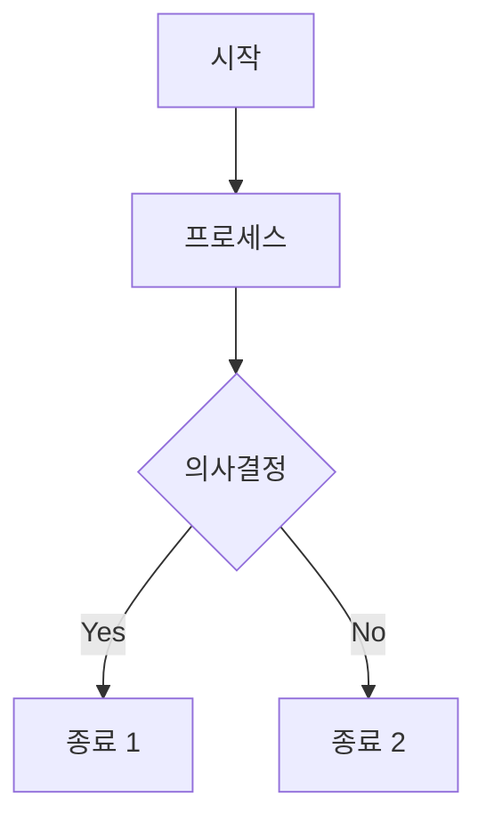

### 노드 타입

| 문법 | 모양 | 용도 |
|------|------|------|
| `[텍스트]` | 직사각형 | 프로세스, 작업 |
| `([텍스트])` | 둥근 직사각형 | 시작/종료 |
| `{텍스트}` | 마름모 | 의사결정 |
| `((텍스트))` | 원 | 연결점 |
| `[(텍스트)]` | 원통 | 데이터베이스 |
| `[/텍스트/]` | 평행사변형 | 입력/출력 |

### 연결선 스타일

| 문법 | 모양 | 용도 |
|------|------|------|
| `-->` | 실선 화살표 | 일반 흐름 |
| `-.->` | 점선 화살표 | 선택적 흐름 |
| `==>` | 굵은 화살표 | 강조 흐름 |
| `--텍스트-->` | 레이블 있는 화살표 | 조건 표시 |
| `---|텍스트|` | 레이블 있는 선 | 관계 표시 |

### 방향 지정

```
flowchart TD  %% Top to Down (위에서 아래)
flowchart LR  %% Left to Right (왼쪽에서 오른쪽)
flowchart RL  %% Right to Left (오른쪽에서 왼쪽)
flowchart BT  %% Bottom to Top (아래에서 위)
```

### 일반적인 패턴

#### 순차 프로세스


#### 조건부 분기
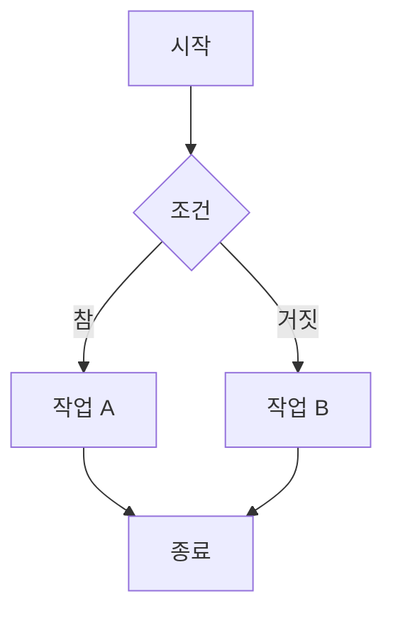

#### 병렬 처리
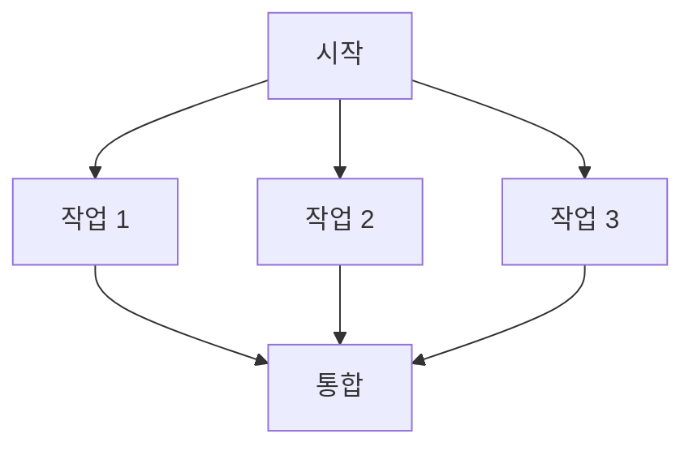

---

## 시퀀스 다이어그램 (Sequence Diagram)

### 기본 문법

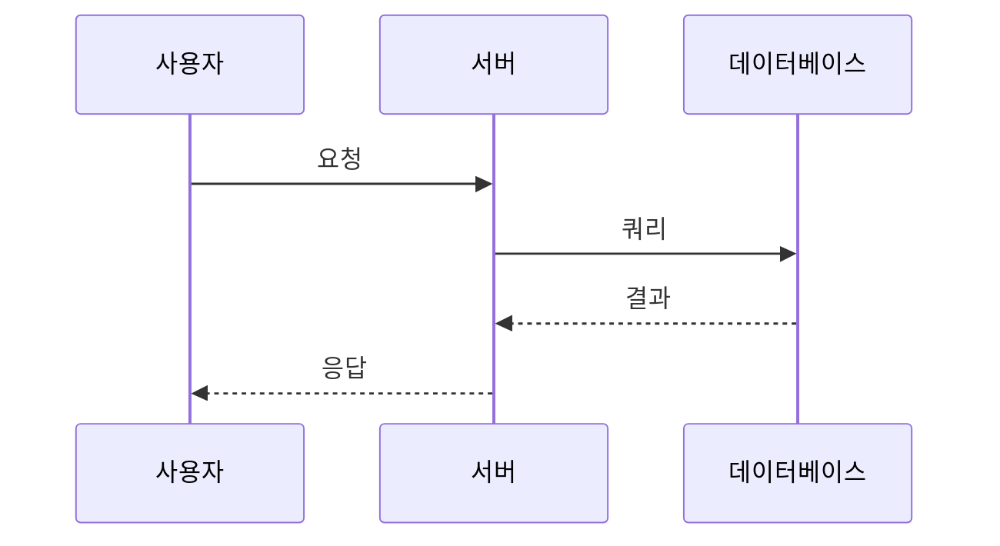

### 화살표 타입

| 문법 | 모양 | 용도 |
|------|------|------|
| `->>` | 실선 화살표 | 동기 메시지 |
| `-->>` | 점선 화살표 | 응답 메시지 |
| `-x` | X 끝 | 비동기 메시지 |
| `-)` | 열린 화살표 | 비동기 응답 |

### 활성화 박스

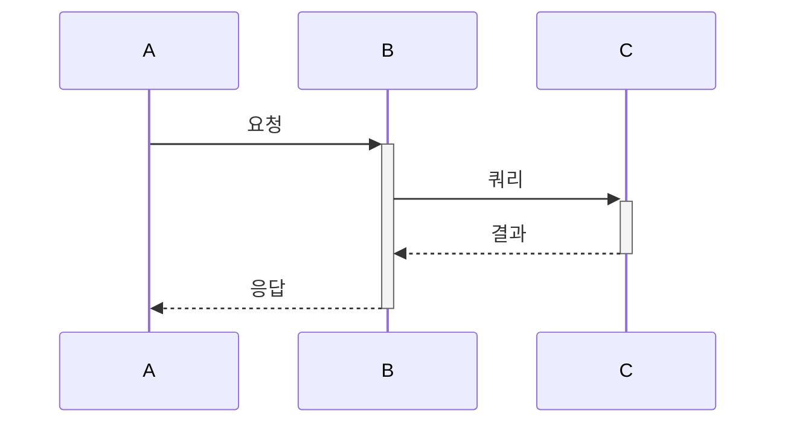

### 노트 추가

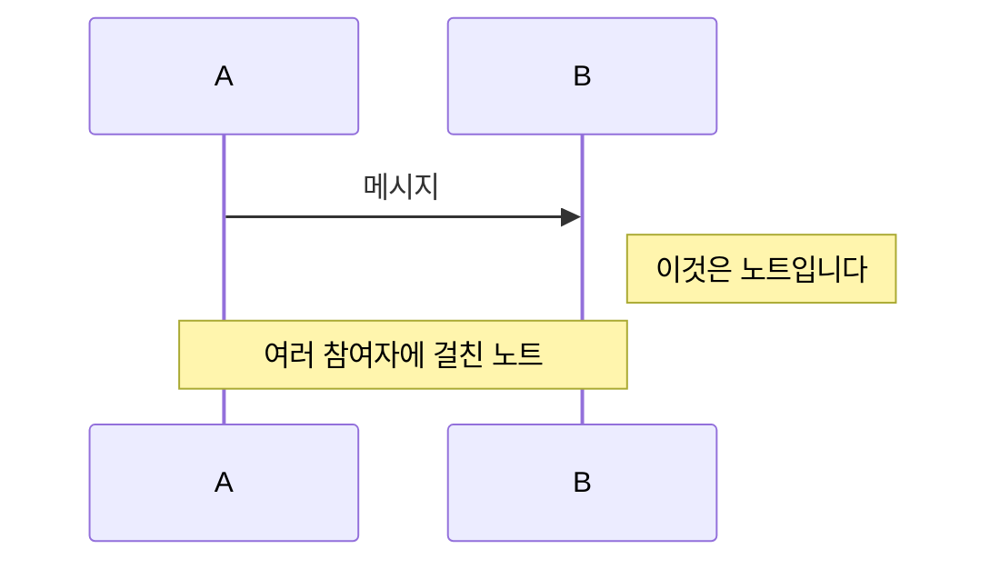

### 루프와 조건

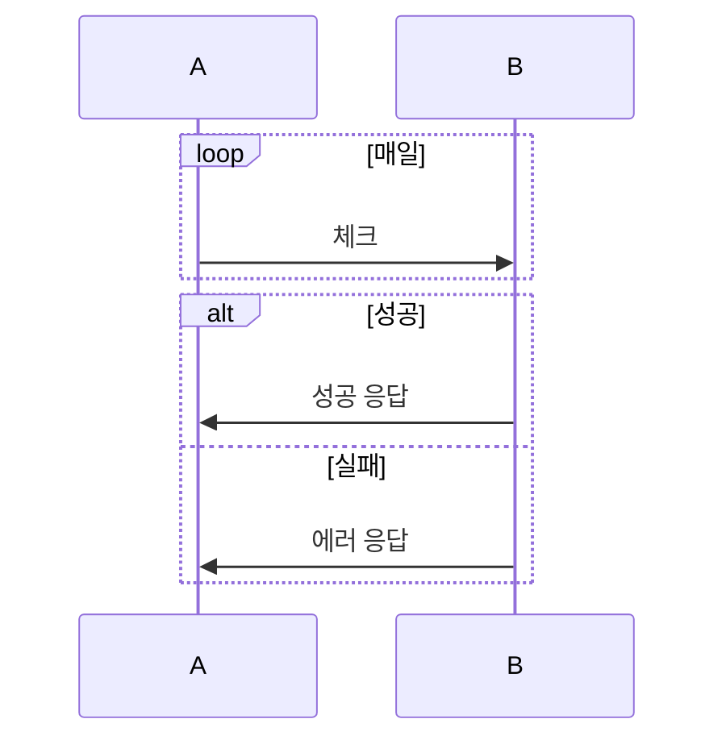

---

## 아키텍처 다이어그램

### 기본 구조

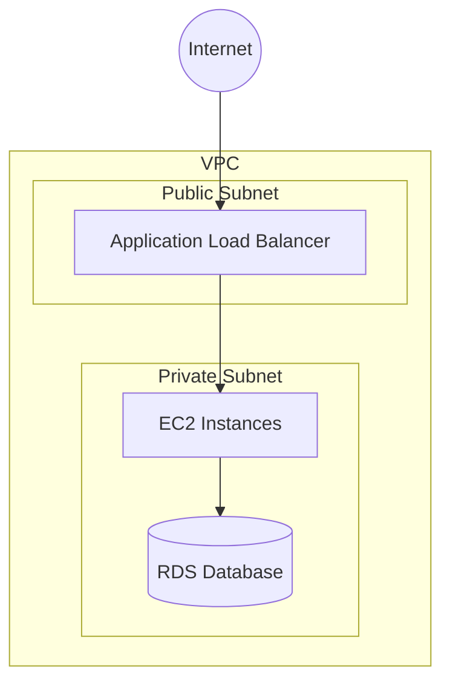

### 서브그래프 (그룹화)

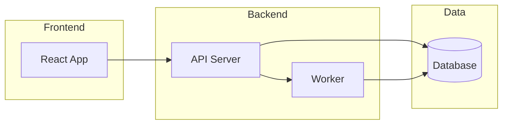

---

## 스타일링

### 노드 스타일

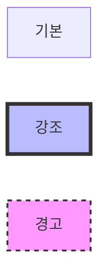

### 클래스 정의

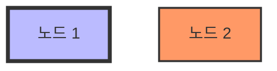

---

## 실전 팁

### 1. 가독성 향상
- 노드 ID는 짧게, 레이블은 명확하게
- 복잡한 다이어그램은 서브그래프로 분리
- 일관된 방향 사용 (보통 TD 또는 LR)

### 2. 성능 최적화
- 너무 많은 노드는 피하기 (20-30개 이하 권장)
- 복잡한 다이어그램은 여러 개로 분리

### 3. 협업 팁
- 의미 있는 노드 ID 사용
- 주석으로 설명 추가
- 버전 관리 시스템에 코드 저장

---

## 일반적인 패턴

### CI/CD 파이프라인

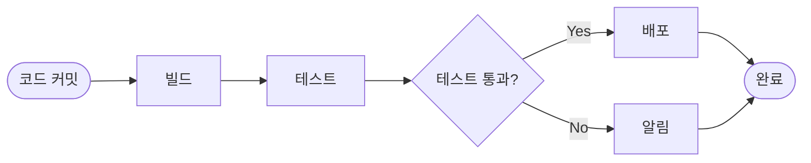

### 마이크로서비스 아키텍처

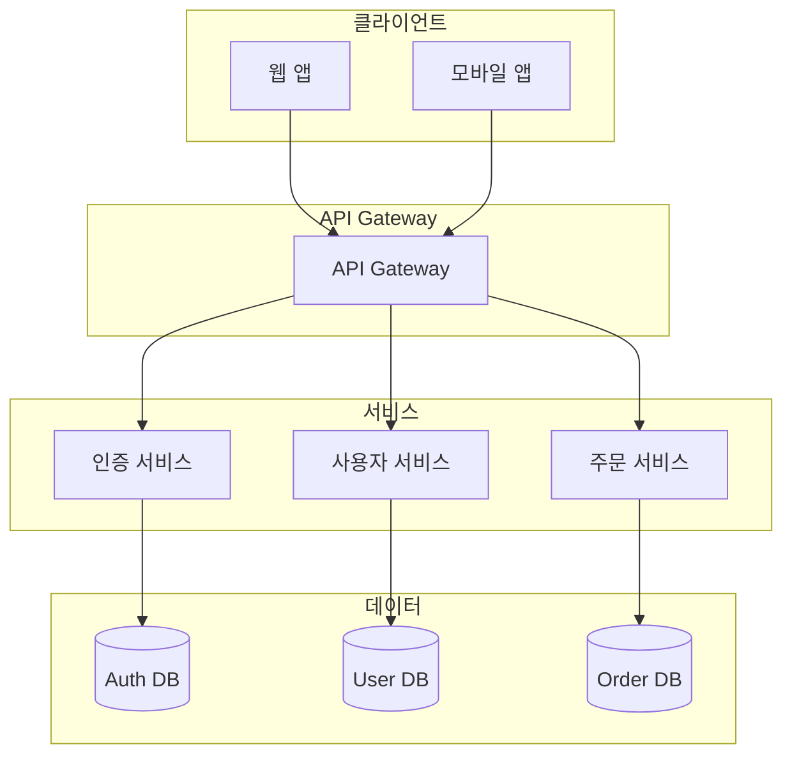

### 사용자 인증 플로우

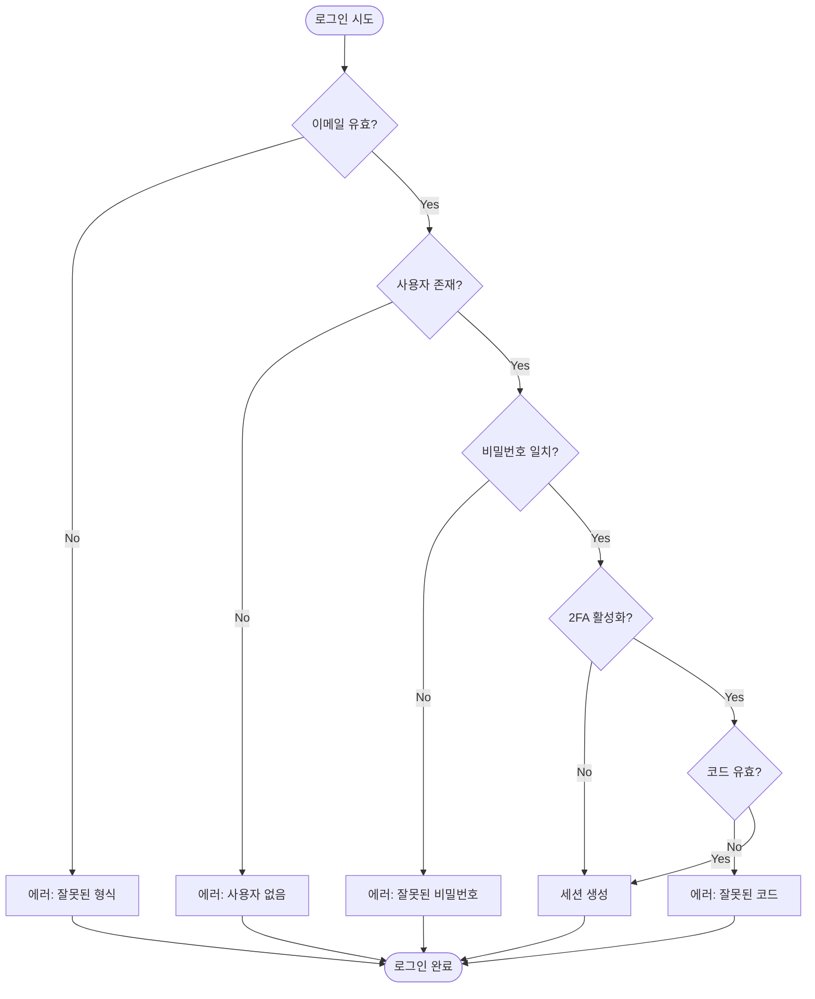

---

## 추가 리소스

- **공식 문서**: https://mermaid.js.org/
- **라이브 에디터**: https://mermaid.live/
- **GitHub 지원**: GitHub 마크다운에서 기본 지원

---

## 빠른 시작 템플릿

### 간단한 순서도
```
flowchart TD
    Start([시작]) --> Process[프로세스]
    Process --> End([종료])
```

### 간단한 시퀀스
```
sequenceDiagram
    A->>B: 요청
    B-->>A: 응답
```

### 간단한 아키텍처
```
graph LR
    Client[클라이언트] --> Server[서버]
    Server --> DB[(데이터베이스)]
```

이 치트시트를 참고하여 빠르게 Mermaid 다이어그램을 작성하세요!
