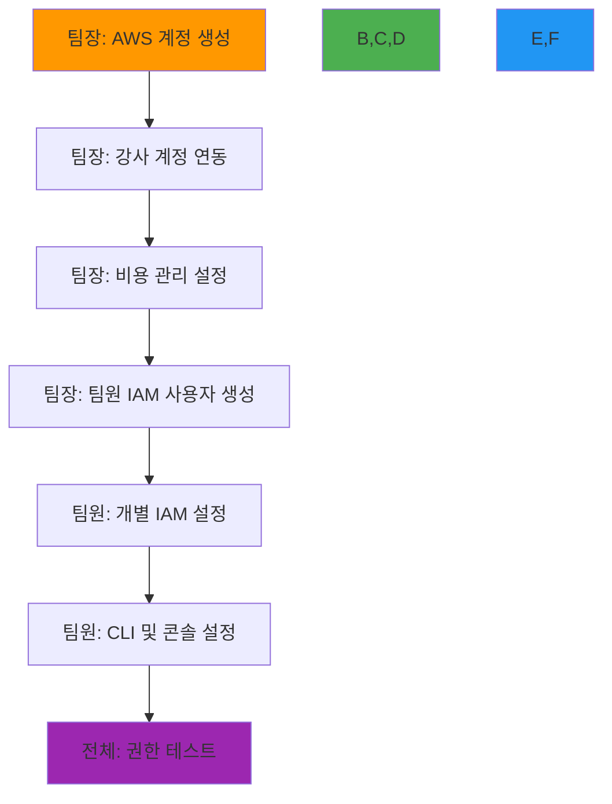
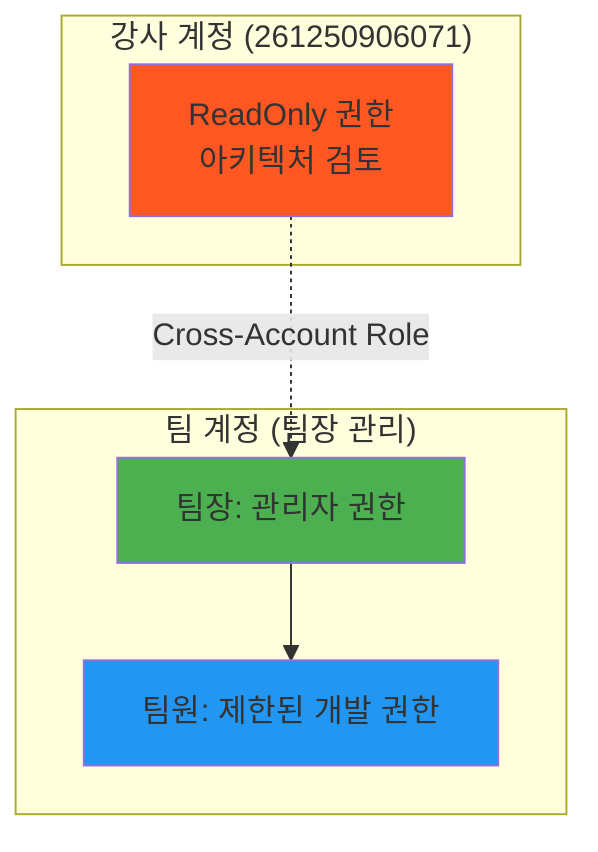

# 📚 Theory Guide

**🎓 학습 가이드** • **⚙️ 환경 설정** • **🔧 도구 사용법** • **🚀 실습 준비**

*DevOps 과정 학습을 위한 필수 가이드 모음*

---

## 📋 가이드 목록

### 🔐 환경 설정
- **[팀장용 AWS 계정 설정](./aws_account_setup_guide.md)** - 팀 프로젝트용 AWS 계정 구성 및 비용 관리
- **[개인용 AWS IAM Credential 설정](./aws-iam-setup.md)** - 팀 환경에서 개별 IAM 사용자 설정

### 🛠️ 도구 설정 (예정)
- **[Kubernetes Dashboard 및 Observability 도구](./kubernetes-observability-tools.md)** - Dashboard, Prometheus, Grafana, Metrics Server 설치 가이드
- **Docker 환경 설정** - Docker Desktop 설치 및 설정
- **Kubernetes 로컬 환경** - Kind, Minikube 설정
- **개발 도구 설정** - VS Code, Git, 필수 확장 프로그램

### 📚 학습 자료 (예정)
- **DevOps 용어집** - 핵심 용어 정리
- **AWS 서비스 맵** - 주요 AWS 서비스 관계도
- **Kubernetes 리소스 치트시트** - 자주 사용하는 kubectl 명령어

---

## 🎯 사용 방법

### 팀 프로젝트 환경 설정 순서

#### 1단계: 팀장 설정 (필수 선행)
**팀장이 먼저 완료해야 할 작업**:
- **[AWS 계정 설정 가이드](./aws_account_setup_guide.md)** 완료
- 팀 AWS 계정 생성 및 비용 관리 설정
- 강사 계정 ReadOnly 권한 연동
- 팀원별 IAM 사용자 생성

#### 2단계: 개별 팀원 설정
**각 팀원이 개별적으로 수행**:
- **[AWS IAM Credential 설정](./aws-iam-setup.md)** 완료
- 팀장이 제공한 IAM 사용자 정보로 CLI 설정
- 개인 보안 강화 (MFA 등)

### 권장 설정 순서

---

## 💰 비용 관리 체계

### 팀 예산 구조
- **기본 프로젝트 (11월)**: 20만원 (~$150)
- **심화 프로젝트 (12월-1월)**: 30만원 (~$225)

### 역할별 책임
- **팀장**: 계정 관리, 예산 모니터링, 비용 차단 정책 관리
- **팀원**: 개별 리소스 관리, 일일 비용 체크, 절약 수칙 준수
- **강사**: 아키텍처 검토, 비용 최적화 조언, 85% 초과 시 개입

---

## 🔒 보안 및 권한 체계

### 3단계 권한 구조

### 비용 차단 정책
- **대용량 인스턴스**: m5.large 이상 완전 차단
- **GPU 인스턴스**: p3, g4 시리즈 완전 차단
- **고비용 서비스**: NAT Gateway, Elasticsearch 등 제한
- **스토리지 제한**: EBS 100GB 이상 차단

---

## 📞 지원 체계

### 단계별 지원
1. **팀 내 지원**: 팀장 및 팀원 간 상호 지원
2. **강사 지원**: 기술적 문제 및 아키텍처 검토
3. **비용 관리**: 예산 초과 시 즉시 강사 개입

### 연락처
- **강사**: 김선우 (niceguy6112@gmail.com, 010-8507-7219)
- **지원 범위**: 계정 설정, 권한 문제, 비용 최적화, 아키텍처 검토

---

## ⚠️ 중요 주의사항

### 필수 준수 사항
- **팀장 우선 설정**: 개별 설정 전 팀장이 반드시 계정 설정 완료
- **비용 모니터링**: 매일 비용 확인 및 팀 내 공유
- **승인 프로세스**: 새로운 서비스 사용 시 강사 승인 필요
- **보안 수칙**: Access Key 공유 금지, MFA 설정 권장

### 비상 상황 대응
- **85% 예산 사용**: 강사 자동 알림 + 리소스 검토
- **95% 예산 사용**: 모든 리소스 즉시 중지 + 강사 상담
- **예산 초과**: 계정 일시 정지 + 원인 분석

---

**🤝 팀 협업** • **💰 비용 최적화** • **🔒 안전한 환경** • **🚀 성공적인 실습**

*체계적인 팀 환경에서 안전하고 효율적인 AWS 학습*

