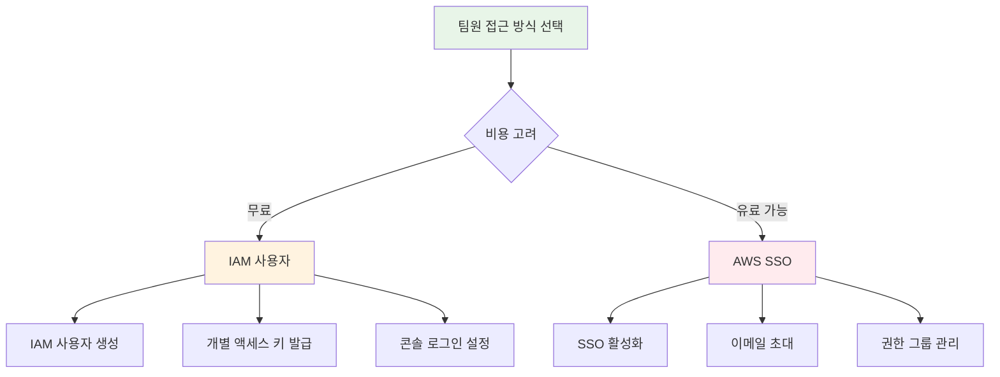
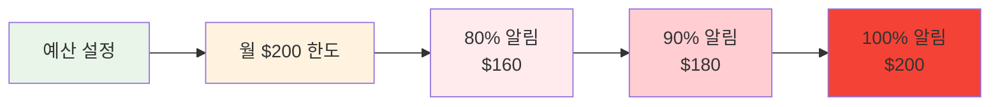
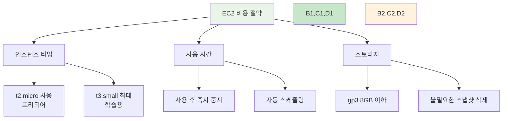
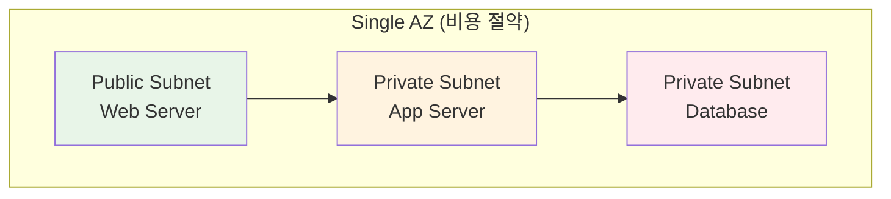

# 🚀 팀장용 AWS 계정 세팅 가이드

<div align="center">

**🎯 팀 프로젝트를 위한 AWS 계정 구성** • **💰 비용 최적화 중심**

*안전하고 경제적인 AWS 환경 구축 가이드*

</div>

---

## 📋 개요

### 🎯 목표
- 팀 프로젝트용 AWS 계정 생성 및 구성
- 교육 계정(261250906071)과의 ReadOnly 권한 연동
- 팀원 접근 권한 관리 (IAM/SSO)
- 비용 최적화 및 예산 관리 설정

### ⚠️ 중요 사항
- **비용 관리**: 최대 예산 $200 설정 필수
- **보안**: ReadOnly 권한으로 안전한 학습 환경
- **협업**: 팀원 모두가 접근 가능한 환경 구성

---

## 🔧 Step 1: AWS 계정 생성

### 1-1. 개인 AWS 계정 생성

**🌐 AWS 계정 가입**
```bash
# AWS 콘솔 접속
https://aws.amazon.com/ko/
```

**📝 가입 절차**:
1. **이메일 주소**: 팀 대표 이메일 또는 개인 이메일
2. **계정 이름**: `[팀명]-devops-2025` (예: team1-devops-2025)
3. **결제 정보**: 신용카드 등록 (필수)
4. **전화번호 인증**: SMS 인증 완료
5. **지원 플랜**: Basic (무료) 선택

**✅ 체크포인트**:
- [ ] AWS 계정 생성 완료
- [ ] 루트 계정 MFA 설정 완료
- [ ] 결제 정보 등록 완료

---

## 🔐 Step 2: 교육 계정 ReadOnly 권한 부여

### 2-1. Cross-Account Role 생성

**🎯 목적**: 교육 계정(261250906071)에서 팀 계정을 ReadOnly로 접근

**IAM 역할 생성**:
```json
{
  "Version": "2012-10-17",
  "Statement": [
    {
      "Effect": "Allow",
      "Principal": {
        "AWS": "arn:aws:iam::261250906071:root"
      },
      "Action": "sts:AssumeRole",
      "Condition": {
        "StringEquals": {
          "sts:ExternalId": "kdt-devops-2025"
        }
      }
    }
  ]
}
```

### 2-2. ReadOnly 정책 연결

**📋 연결할 정책들**:
- `ReadOnlyAccess` (AWS 관리형 정책)
- `ViewOnlyAccess` (추가 보안)

**🔧 설정 방법**:
1. **IAM 콘솔** → **역할** → **역할 생성**
2. **신뢰할 수 있는 엔터티**: 다른 AWS 계정
3. **계정 ID**: `261250906071`
4. **외부 ID**: `kdt-devops-2025`
5. **정책 연결**: ReadOnlyAccess
6. **역할 이름**: `KDT-DevOps-ReadOnly-Role`

**✅ 체크포인트**:
- [ ] Cross-Account Role 생성 완료
- [ ] ReadOnly 정책 연결 완료
- [ ] 역할 ARN 확인 및 기록

---

## 👥 Step 3: 팀원 접근 권한 설정

### 3-1. 접근 방식 선택



### 3-2. 권장 방식: IAM 사용자 (비용 무료)

**👤 팀원별 IAM 사용자 생성**:
```bash
# AWS CLI로 사용자 생성 (선택사항)
aws iam create-user --user-name team-member-1
aws iam create-user --user-name team-member-2
aws iam create-user --user-name team-member-3
```

**🔑 콘솔 접근 설정**:
1. **IAM 콘솔** → **사용자** → **사용자 추가**
2. **사용자 이름**: `team-member-[번호]`
3. **액세스 유형**: AWS Management Console 액세스
4. **콘솔 비밀번호**: 자동 생성 또는 사용자 지정
5. **비밀번호 재설정**: 다음 로그인 시 필요

**📋 권한 정책 연결**:
- `ReadOnlyAccess`: 기본 읽기 권한
- `IAMReadOnlyAccess`: IAM 정보 조회
- 사용자 정의 정책 (필요시)

### 3-3. 대안: AWS SSO (Identity Center)

**💰 비용**: 월 $6/사용자 (5명 이상 시 고려)

**🚀 SSO 설정 (선택사항)**:
1. **AWS SSO 활성화**
2. **사용자 그룹 생성**: `DevOps-Team`
3. **이메일 초대**: 팀원 이메일로 초대
4. **권한 세트**: ReadOnly 권한 할당

**✅ 체크포인트**:
- [ ] 팀원 접근 방식 결정
- [ ] 사용자 계정 생성 완료
- [ ] 로그인 정보 팀원 공유

---

## 🧪 Step 4: ReadOnly 접근 테스트

### 4-1. 기본 접근 테스트

**🔍 테스트 항목들**:
```bash
# EC2 인스턴스 조회 (읽기)
aws ec2 describe-instances

# S3 버킷 목록 조회 (읽기)
aws s3 ls

# IAM 사용자 목록 조회 (읽기)
aws iam list-users

# 리소스 생성 시도 (실패해야 함)
aws ec2 run-instances --image-id ami-12345 --instance-type t2.micro
# 예상 결과: AccessDenied 오류
```

### 4-2. 권한 검증 체크리스트

**✅ 읽기 권한 확인**:
- [ ] EC2 인스턴스 목록 조회 가능
- [ ] S3 버킷 및 객체 조회 가능
- [ ] CloudWatch 메트릭 조회 가능
- [ ] 비용 및 청구 정보 조회 가능

**❌ 쓰기 권한 차단 확인**:
- [ ] EC2 인스턴스 생성 차단됨
- [ ] S3 객체 업로드 차단됨
- [ ] IAM 정책 수정 차단됨
- [ ] 리소스 삭제 차단됨

### 4-3. 교육 계정 연동 테스트

**🔗 Cross-Account 접근 테스트**:
```bash
# 교육 계정에서 팀 계정 역할 assume
aws sts assume-role \
  --role-arn "arn:aws:iam::[팀계정ID]:role/KDT-DevOps-ReadOnly-Role" \
  --role-session-name "education-readonly-session" \
  --external-id "kdt-devops-2025"
```

---

## 💰 Step 5: 예산 및 비용 관리 설정

### 5-1. 예산 알림 설정

**🎯 예산 한도**: 최대 $200

**📊 예산 생성**:


**⚙️ 설정 방법**:
1. **Billing 콘솔** → **Budgets** → **Create budget**
2. **Budget type**: Cost budget
3. **Budget amount**: $200 (Monthly)
4. **Alert thresholds**: 
   - 80% ($160) - 이메일 알림
   - 90% ($180) - 이메일 + SMS 알림
   - 100% ($200) - 긴급 알림

### 5-2. 비용 최적화 설정

**🛡️ 비용 차단 정책**:
```json
{
  "Version": "2012-10-17",
  "Statement": [
    {
      "Effect": "Deny",
      "Action": [
        "ec2:RunInstances"
      ],
      "Resource": "*",
      "Condition": {
        "ForAllValues:StringNotEquals": {
          "ec2:InstanceType": [
            "t2.micro",
            "t2.small",
            "t3.micro",
            "t3.small"
          ]
        }
      }
    }
  ]
}
```

**⚠️ 고비용 서비스 차단**:
- **대용량 인스턴스**: m5.large 이상 차단
- **GPU 인스턴스**: p3, g4 시리즈 차단
- **데이터베이스**: RDS 대용량 인스턴스 차단
- **스토리지**: EBS gp3 1TB 이상 차단

### 5-3. 자동 리소스 정리

**🔄 자동화 스크립트**:
```bash
#!/bin/bash
# 매일 밤 12시 실행되는 정리 스크립트

# 중지된 EC2 인스턴스 7일 후 종료
aws ec2 describe-instances \
  --filters "Name=instance-state-name,Values=stopped" \
  --query 'Reservations[].Instances[?LaunchTime<=`2024-01-01`].[InstanceId]' \
  --output text | xargs -I {} aws ec2 terminate-instances --instance-ids {}

# 사용하지 않는 EBS 볼륨 삭제 (7일 이상 미연결)
aws ec2 describe-volumes \
  --filters "Name=status,Values=available" \
  --query 'Volumes[?CreateTime<=`2024-01-01`].[VolumeId]' \
  --output text | xargs -I {} aws ec2 delete-volume --volume-id {}

# 오래된 스냅샷 삭제 (30일 이상)
aws ec2 describe-snapshots --owner-ids self \
  --query 'Snapshots[?StartTime<=`2024-01-01`].[SnapshotId]' \
  --output text | xargs -I {} aws ec2 delete-snapshot --snapshot-id {}
```

---

## 🚨 초보자 비용 절약 가이드

### 💡 주요 비용 발생 원인과 예방

**1. 🖥️ EC2 인스턴스 관련**


**⚠️ 피해야 할 것들**:
- ❌ **대용량 인스턴스**: m5.large 이상 ($0.096/시간)
- ❌ **GPU 인스턴스**: p3.2xlarge ($3.06/시간)
- ❌ **24시간 실행**: 인스턴스 중지 잊지 말기
- ❌ **다중 AZ**: 학습용으로는 단일 AZ 사용

**✅ 권장 사항**:
- ✅ **t2.micro**: 프리티어 ($0/월, 750시간)
- ✅ **t3.small**: 학습용 적정 ($0.0208/시간)
- ✅ **즉시 중지**: 사용 후 바로 중지
- ✅ **스케줄링**: CloudWatch Events로 자동 중지

**2. 💾 스토리지 관련**

**EBS 볼륨 최적화**:
```bash
# 권장 설정
Volume Type: gp3 (최신, 비용 효율적)
Size: 8GB (프리티어) ~ 20GB (최대)
IOPS: 3000 (기본값)
Throughput: 125 MB/s (기본값)
```

**S3 스토리지 관리**:
- **Standard**: 자주 접근하는 파일만
- **IA (Infrequent Access)**: 백업용
- **Lifecycle Policy**: 30일 후 자동 삭제

**3. 🌐 네트워킹 관련**

**데이터 전송 비용 절약**:
- **같은 AZ 내**: 무료
- **다른 AZ 간**: $0.01/GB
- **인터넷 아웃바운드**: $0.09/GB (첫 1GB 무료)

**권장 아키텍처**:


### 🔧 비용 모니터링 도구

**📊 일일 비용 체크**:
```bash
# 어제 비용 확인
aws ce get-cost-and-usage \
  --time-period Start=2024-01-01,End=2024-01-02 \
  --granularity DAILY \
  --metrics BlendedCost \
  --group-by Type=DIMENSION,Key=SERVICE

# 이번 달 누적 비용
aws ce get-cost-and-usage \
  --time-period Start=2024-01-01,End=2024-01-31 \
  --granularity MONTHLY \
  --metrics BlendedCost
```

**📱 모바일 알림 설정**:
- **AWS 모바일 앱**: 실시간 비용 알림
- **Slack 연동**: 일일 비용 리포트
- **이메일 알림**: 예산 초과 시 즉시 알림

---

## 📋 최종 체크리스트

### ✅ 계정 설정 완료 확인
- [ ] **AWS 계정 생성**: 팀 대표 계정 생성 완료
- [ ] **MFA 설정**: 루트 계정 보안 강화
- [ ] **결제 정보**: 신용카드 등록 및 확인

### ✅ 권한 설정 완료 확인
- [ ] **Cross-Account Role**: 교육 계정 ReadOnly 접근 설정
- [ ] **팀원 계정**: IAM 사용자 또는 SSO 설정
- [ ] **권한 테스트**: 읽기 권한 확인, 쓰기 권한 차단 확인

### ✅ 비용 관리 완료 확인
- [ ] **예산 설정**: $200 월 예산 및 알림 설정
- [ ] **비용 정책**: 고비용 서비스 차단 정책 적용
- [ ] **모니터링**: 일일 비용 체크 시스템 구축

### ✅ 팀 공유 완료 확인
- [ ] **로그인 정보**: 팀원들에게 접근 정보 공유
- [ ] **사용 가이드**: 비용 절약 가이드 팀 교육
- [ ] **비상 연락**: 예산 초과 시 대응 방안 공유

---

## 🆘 문제 해결 가이드

### 🔧 자주 발생하는 문제들

**1. Cross-Account Role 접근 실패**
```bash
# 문제: AssumeRole 실패
# 해결: 신뢰 정책 확인
aws iam get-role --role-name KDT-DevOps-ReadOnly-Role
```

**2. 팀원 로그인 실패**
```bash
# 문제: 콘솔 로그인 불가
# 해결: 비밀번호 재설정
aws iam create-login-profile --user-name team-member-1 --password NewPassword123!
```

**3. 예산 알림 미수신**
```bash
# 문제: 예산 알림이 오지 않음
# 해결: SNS 주제 및 구독 확인
aws sns list-subscriptions
```

### 📞 지원 연락처

**🎓 교육 관련 문의**:
- **강사진**: [강사 이메일]
- **교육 계정 관리자**: [관리자 연락처]

**💰 비용 관련 긴급 상황**:
- **AWS 지원**: AWS Support (Basic Plan)
- **비용 최적화**: AWS Trusted Advisor

---

<div align="center">

**🎯 안전한 학습 환경** • **💰 비용 최적화** • **🤝 팀 협업 지원**

*AWS 클라우드에서 함께 성장하는 DevOps 여정*

</div>