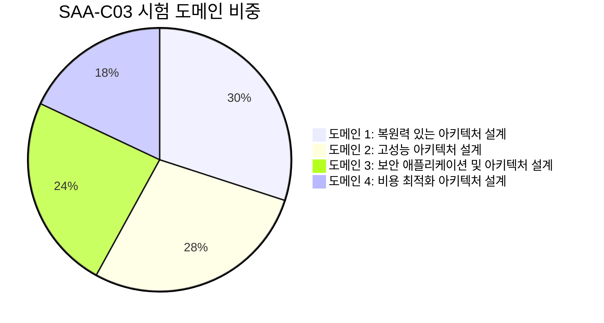
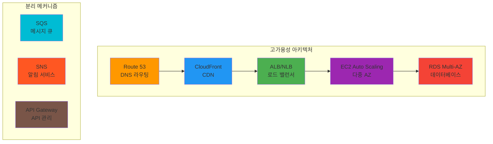
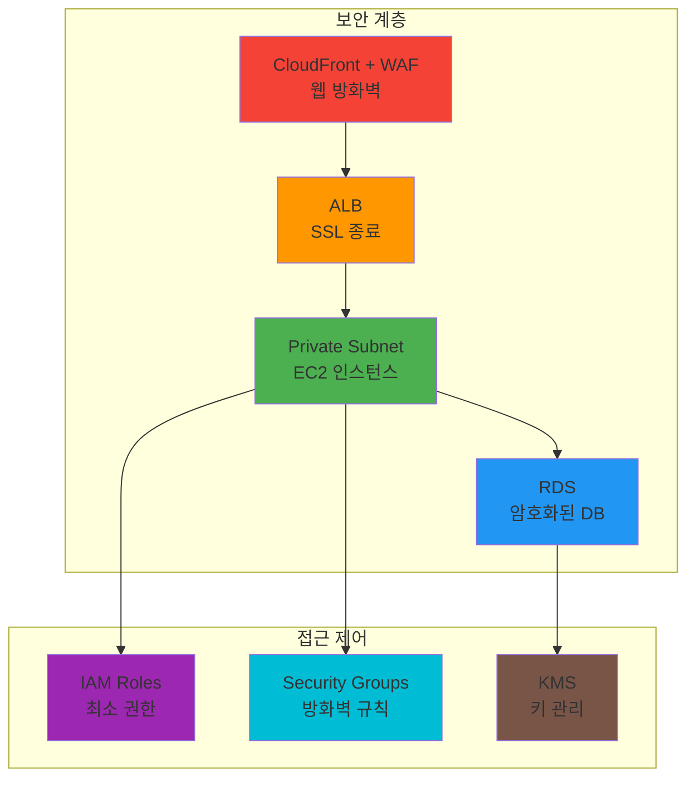
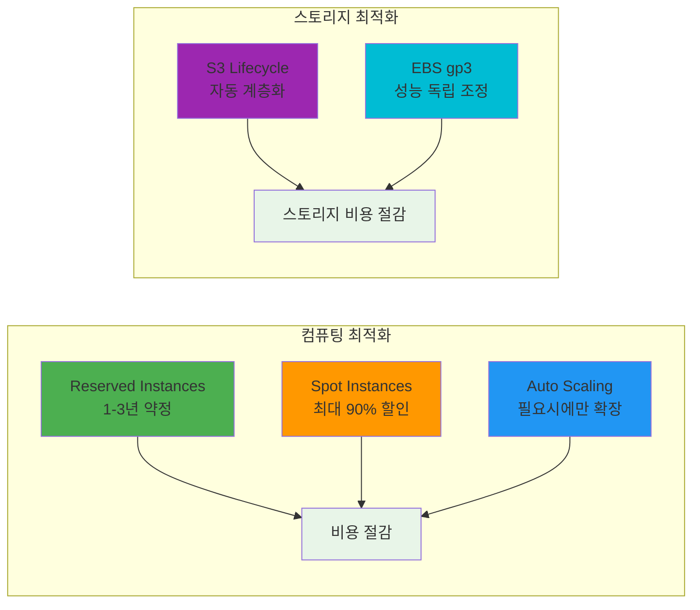
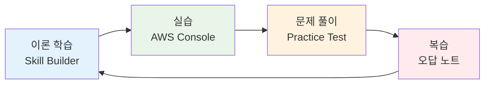
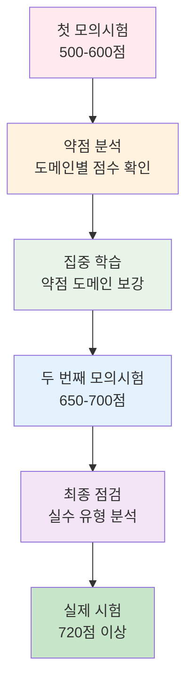
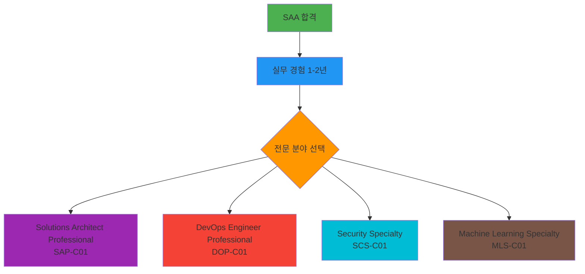

# 🏆 AWS Solutions Architect Associate (SAA-C03) 시험 가이드

<div align="center">


**☁️ AWS 공식 자격증** • **🎯 Associate 레벨** • **💼 실무 필수 자격증**

*클라우드 아키텍트로 성장하는 첫 번째 관문*

</div>

---

## 📋 시험 개요

### 🏢 주관 기관
- **주관**: Amazon Web Services (AWS)
- **공식 사이트**: [aws.amazon.com/certification](https://aws.amazon.com/certification/)
- **한국 공식 파트너**: PSI Services, Pearson VUE

### 💰 시험 비용
- **정가**: **$150 USD** (약 20만원)
- **재시험**: 동일 금액 (14일 대기 후 재응시 가능)
- **할인 혜택**: 
  - 학생 할인: 50% (AWS Educate 프로그램)
  - 이전 자격증 보유자: 50% 할인 바우처 제공

### 📊 시험 정보
| 항목 | 세부사항 |
|------|----------|
| **시험 코드** | SAA-C03 |
| **문제 수** | **65문제** |
| **시험 시간** | **130분** (2시간 10분) |
| **합격 점수** | **720점 / 1000점** (72%) |
| **문제 유형** | 객관식, 복수 정답 |
| **언어** | 영어, 일본어, 한국어, 중국어(간체) |
| **유효 기간** | **3년** |

---

## 🎯 시험 도메인 및 출제 비중

### 📈 도메인별 가중치


### 📚 도메인별 상세 내용

#### 🏗️ 도메인 1: 복원력 있는 아키텍처 설계 (30%)
**핵심 주제**:
- **다중 계층 아키텍처 솔루션 설계**
  - 3-tier 아키텍처 (Web, App, DB)
  - 마이크로서비스 아키텍처
  - 서버리스 아키텍처

- **고가용성 및 내결함성 솔루션 설계**
  - Multi-AZ 배포
  - Auto Scaling Groups
  - Elastic Load Balancer
  - Route 53 Health Checks

- **분리 메커니즘을 사용한 설계**
  - SQS, SNS를 통한 느슨한 결합
  - API Gateway
  - CloudFront

**주요 서비스**:


#### ⚡ 도메인 2: 고성능 아키텍처 설계 (28%)
**핵심 주제**:
- **확장 가능한 및 탄력적인 컴퓨팅 솔루션 식별**
  - EC2 인스턴스 유형 선택
  - Auto Scaling 전략
  - Spot Instances 활용

- **고성능 스토리지 솔루션 선택**
  - EBS 볼륨 유형 (gp3, io2, st1, sc1)
  - EFS vs FSx
  - S3 스토리지 클래스

- **고성능 네트워킹 솔루션 선택**
  - Enhanced Networking
  - Placement Groups
  - VPC 설계

**성능 최적화 매트릭스**:
| 워크로드 유형 | 컴퓨팅 | 스토리지 | 네트워킹 |
|---------------|--------|----------|----------|
| **웹 애플리케이션** | t3.medium + ASG | gp3 EBS | ALB + CloudFront |
| **데이터베이스** | r5.xlarge | io2 EBS | Placement Group |
| **빅데이터** | c5n.large | S3 + EFS | Enhanced Networking |
| **ML/AI** | p3.2xlarge | FSx Lustre | SR-IOV |

#### 🔒 도메인 3: 보안 애플리케이션 및 아키텍처 설계 (24%)
**핵심 주제**:
- **보안 액세스 설계**
  - IAM 정책 및 역할
  - MFA 및 임시 자격 증명
  - Cross-account access

- **보안 애플리케이션 계층 설계**
  - VPC 보안 그룹 및 NACL
  - WAF 및 Shield
  - Certificate Manager

- **적절한 데이터 보안 옵션 선택**
  - 전송 중 암호화 (TLS/SSL)
  - 저장 시 암호화 (KMS, CloudHSM)
  - S3 버킷 정책

**보안 아키텍처 예시**:


#### 💰 도메인 4: 비용 최적화 아키텍처 설계 (18%)
**핵심 주제**:
- **비용 효율적인 스토리지 솔루션 식별**
  - S3 Intelligent Tiering
  - Lifecycle 정책
  - EBS 최적화

- **비용 효율적인 컴퓨팅 및 데이터베이스 서비스 식별**
  - Reserved Instances vs Spot Instances
  - RDS Reserved Instances
  - Lambda vs EC2 비용 분석

**비용 최적화 전략**:


---

## 📚 추천 학습 리소스

### 🎓 AWS 공식 학습 자료

#### 1. **AWS Skill Builder** (무료 + 유료)
- **URL**: [skillbuilder.aws](https://skillbuilder.aws/)
- **추천 코스**:
  - **AWS Cloud Practitioner Essentials** (무료)
  - **Architecting on AWS** (유료)
  - **AWS Solutions Architect Learning Plan** (무료)

#### 2. **AWS 공식 시험 가이드**
- **시험 가이드**: [AWS SAA-C03 Exam Guide](https://d1.awsstatic.com/training-and-certification/docs-sa-assoc/AWS-Certified-Solutions-Architect-Associate_Exam-Guide.pdf)
- **샘플 문제**: [AWS SAA Sample Questions](https://d1.awsstatic.com/training-and-certification/docs-sa-assoc/AWS-Certified-Solutions-Architect-Associate_Sample-Questions.pdf)

#### 3. **AWS Hands-on Labs**
- **AWS Free Tier**: 12개월 무료 실습 환경
- **AWS Well-Architected Labs**: 실제 아키텍처 실습

### 📖 추천 교재 및 온라인 강의

#### 📚 교재
1. **"AWS Certified Solutions Architect Study Guide"** - Ben Piper, David Clinton
2. **"AWS Certified Solutions Architect Official Study Guide"** - Joe Baron 외

#### 🎥 온라인 강의 플랫폼
1. **A Cloud Guru** - 실습 중심 강의
2. **Linux Academy** - 심화 실습 환경
3. **Udemy** - Stephane Maarek 강의 (한국어 자막)
4. **Coursera** - AWS 공식 파트너 강의

### 🛠️ 실습 환경 구축

#### AWS 계정 설정
```bash
# AWS CLI 설치 및 설정
pip install awscli
aws configure

# 기본 VPC 및 보안 그룹 생성
aws ec2 create-vpc --cidr-block 10.0.0.0/16
aws ec2 create-security-group --group-name MySecurityGroup --description "My security group"
```

#### 필수 실습 시나리오
1. **3-Tier 웹 애플리케이션 구축**
2. **Auto Scaling 및 Load Balancer 설정**
3. **RDS Multi-AZ 데이터베이스 구성**
4. **S3 정적 웹사이트 호스팅**
5. **CloudFormation 템플릿 작성**

---

## 📅 학습 계획 및 일정

### 🗓️ 8주 학습 로드맵

#### Week 1-2: 기초 개념 (Foundation)
- **목표**: AWS 기본 서비스 이해
- **학습 내용**:
  - AWS 글로벌 인프라 (리전, AZ)
  - IAM (사용자, 그룹, 역할, 정책)
  - EC2 (인스턴스, AMI, 보안 그룹)
  - VPC (서브넷, 라우팅, NAT)

#### Week 3-4: 스토리지 및 데이터베이스
- **목표**: 데이터 관리 서비스 마스터
- **학습 내용**:
  - S3 (버킷, 객체, 스토리지 클래스)
  - EBS (볼륨 유형, 스냅샷)
  - RDS (Multi-AZ, Read Replica)
  - DynamoDB (NoSQL 기초)

#### Week 5-6: 네트워킹 및 보안
- **목표**: 고급 네트워킹과 보안 구현
- **학습 내용**:
  - ELB (ALB, NLB, CLB)
  - Route 53 (DNS, Health Check)
  - CloudFront (CDN, 캐싱)
  - WAF, Shield (보안 서비스)

#### Week 7-8: 모니터링 및 최적화
- **목표**: 운영 및 비용 최적화
- **학습 내용**:
  - CloudWatch (메트릭, 로그, 알람)
  - CloudTrail (API 로깅)
  - Cost Explorer (비용 분석)
  - Trusted Advisor (최적화 권장사항)

### 📊 일일 학습 계획

```mermaid
gantt
    title 일일 학습 스케줄
    dateFormat HH:mm
    axisFormat %H:%M
    
    section 오전
    이론 학습 (Skill Builder)    :09:00, 2h
    실습 (Hands-on Labs)         :11:00, 2h
    
    section 오후
    문제 풀이 (Practice Tests)   :14:00, 1h
    복습 및 정리                 :15:00, 1h
    
    section 저녁
    추가 실습 (선택)             :19:00, 2h
```


---

## 🎯 시험 준비 전략

### 📝 효과적인 학습 방법

#### 1. **이론 + 실습 병행**


#### 2. **핵심 서비스 우선 학습**
- **필수 서비스** (80% 출제): EC2, VPC, S3, RDS, IAM
- **중요 서비스** (15% 출제): ELB, Auto Scaling, CloudFront
- **기타 서비스** (5% 출제): Lambda, API Gateway, SQS

#### 3. **실무 시나리오 중심 학습**
- 단순 암기보다는 "왜 이 서비스를 선택해야 하는가?" 이해
- 비용, 성능, 보안, 가용성 관점에서 서비스 비교
- 실제 아키텍처 설계 경험 축적

### 🧪 모의시험 및 평가

#### 추천 모의시험 플랫폼
1. **AWS 공식 Practice Exam** ($20) - 가장 실제와 유사
2. **Whizlabs** - 다양한 문제 유형
3. **MeasureUp** - 상세한 해설 제공
4. **Tutorials Dojo** - 한국어 지원

#### 합격 기준 점수 달성 전략


---

## 💡 시험 당일 팁

### 🕐 시험 전 준비사항
- [ ] **신분증 확인** (여권 또는 운전면허증)
- [ ] **시험 센터 위치 및 교통편 확인**
- [ ] **충분한 수면** (최소 7시간)
- [ ] **가벼운 식사** (과식 금지)

### 📝 시험 중 전략
1. **시간 관리**: 문제당 평균 2분 (65문제 / 130분)
2. **문제 읽기**: 키워드 중심으로 빠르게 파악
3. **소거법 활용**: 명백히 틀린 선택지부터 제거
4. **플래그 기능**: 어려운 문제는 플래그 후 나중에 재검토
5. **검토 시간**: 마지막 15-20분은 플래그된 문제 재검토

### ⚠️ 주의사항
- **추측 금지**: 확실하지 않으면 소거법 활용
- **시간 분배**: 한 문제에 너무 오래 머물지 말 것
- **실무 경험**: 이론보다는 실무 관점에서 접근
- **AWS 베스트 프랙티스**: AWS가 권장하는 방식 선택

---

## 🏆 합격 후 다음 단계

### 📈 경력 발전 경로


### 💼 취업 및 연봉 정보
- **신입 클라우드 엔지니어**: 3,500-4,500만원
- **경력 2-3년 솔루션 아키텍트**: 5,000-7,000만원
- **시니어 클라우드 아키텍트**: 7,000-10,000만원+

### 🌟 지속적인 학습
- **AWS re:Invent** 참석 (매년 11월)
- **AWS User Group** 참여
- **기술 블로그** 작성 및 지식 공유
- **오픈소스 프로젝트** 기여

---

## 📞 추가 지원 및 문의

### 🆘 학습 지원
- **AWS 한국 사용자 그룹**: [AWSKRUG](https://www.facebook.com/groups/awskrug/)
- **AWS 공식 한국 블로그**: [aws.amazon.com/ko/blogs/korea/](https://aws.amazon.com/ko/blogs/korea/)
- **Stack Overflow**: AWS 태그 질문 및 답변

### 📧 시험 관련 문의
- **AWS Training**: [aws.amazon.com/training/](https://aws.amazon.com/training/)
- **PSI Services**: 시험 예약 및 변경
- **Pearson VUE**: 시험 센터 정보

---

<div align="center">

**🏆 AWS SAA 자격증으로 클라우드 전문가의 첫 걸음을 시작하세요!**

**☁️ 체계적 학습** • **🛠️ 실습 중심** • **🎯 합격 보장** • **💼 취업 연계**

*여러분의 클라우드 여정을 응원합니다!*

</div>