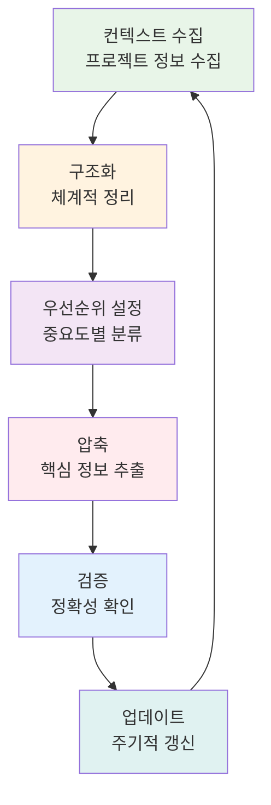
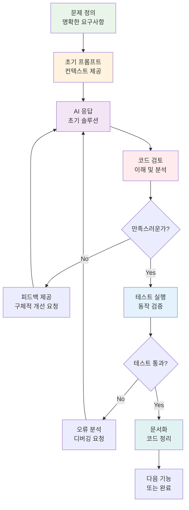
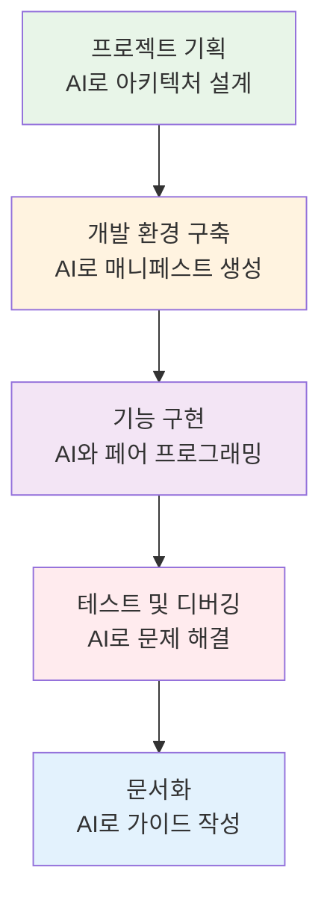
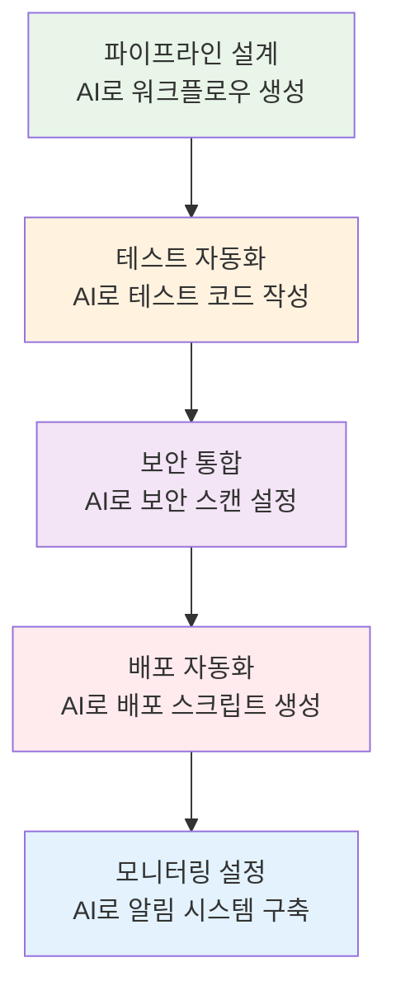

# 🚀 프로젝트 준비 가이드: 바이브코딩 & 프롬프트 엔지니어링

<div align="center">

**🤖 AI 협업** • **💡 프롬프트 전략** • **⚡ 바이브코딩** • **🎯 프로젝트 성공**

*AI 도구를 활용한 효율적인 DevOps 프로젝트 개발 방법론*

</div>

---

## 🎯 가이드 목적

### 📚 학습 목표
- **AI 협업**: ChatGPT, Claude, GitHub Copilot 등 AI 도구의 효과적 활용
- **프롬프트 엔지니어링**: 정확하고 유용한 결과를 얻는 프롬프트 작성법
- **바이브코딩**: AI와 함께하는 빠르고 효율적인 코딩 방법론
- **프로젝트 전략**: Week 3 이후 프로젝트에서의 실무 적용 방안

### 🤔 왜 필요한가?

**현실 상황**:
- 💼 **실무 트렌드**: AI 도구 활용이 개발자의 필수 역량이 된 시대
- 🏠 **일상 비유**: AI는 강력한 어시스턴트, 올바른 소통법이 중요
- 📊 **생산성**: AI 활용으로 개발 속도 3-5배 향상 가능

---

## 🤖 AI 도구별 활용 전략

<details>
<summary><strong>🔍 ChatGPT/Claude 활용법</strong></summary>

**DevOps 시나리오별 프롬프트 패턴**:

#### 1. 아키텍처 설계 프롬프트
```
역할: 당신은 10년 경력의 DevOps 아키텍트입니다.

상황: 
- 마이크로서비스 기반 웹 애플리케이션
- 사용자 1만명, 일일 트래픽 10만 요청
- AWS 클라우드 환경
- 예산 제약: 월 $500

요청:
1. Kubernetes 기반 아키텍처 설계
2. 비용 최적화 방안
3. 확장성 고려사항
4. 보안 체크포인트

출력 형식:
- 아키텍처 다이어그램 (Mermaid)
- 구성요소별 상세 설명
- 예상 비용 분석
- 단계별 구현 계획
```

#### 2. 트러블슈팅 프롬프트
```
역할: Kubernetes 전문가

문제 상황:
- Pod가 CrashLoopBackOff 상태
- 로그: "connection refused to database"
- 환경: EKS 클러스터, RDS MySQL

디버깅 정보:
[kubectl describe pod 결과 붙여넣기]

요청:
1. 문제 원인 분석
2. 단계별 해결 방법
3. 예방 방안
4. 모니터링 개선점

체크리스트 형태로 답변해주세요.
```

#### 3. 코드 리뷰 프롬프트
```
역할: 시니어 DevOps 엔지니어

코드 리뷰 대상:
[Kubernetes 매니페스트 또는 Terraform 코드]

리뷰 관점:
- 보안 베스트 프랙티스
- 성능 최적화
- 가독성 및 유지보수성
- 에러 처리

출력:
1. 개선 필요 사항 (우선순위별)
2. 수정된 코드 예시
3. 추가 권장사항
```

</details>

<details>
<summary><strong>🛠️ GitHub Copilot 활용법</strong></summary>

**효과적인 코멘트 작성 패턴**:

#### 1. Dockerfile 최적화
```dockerfile
# Multi-stage build for Node.js app with security hardening
# Base: Alpine Linux for minimal size
# Features: Non-root user, health check, cache optimization

# Build stage
FROM node:18-alpine AS builder
# ... Copilot이 최적화된 빌드 단계 생성
```

#### 2. Kubernetes 매니페스트
```yaml
# Production-ready WordPress deployment
# Features: Rolling update, resource limits, health checks, PVC
apiVersion: apps/v1
kind: Deployment
# ... Copilot이 완성된 매니페스트 생성
```

#### 3. Terraform 인프라
```hcl
# AWS EKS cluster with best practices
# Features: Private subnets, managed node groups, IRSA
resource "aws_eks_cluster" "main" {
  # ... Copilot이 보안 강화된 EKS 설정 생성
}
```

</details>

<details>
<summary><strong>🎨 Cursor/Windsurf 활용법</strong></summary>

**프로젝트 전체 컨텍스트 활용**:

#### 1. 전체 프로젝트 분석
```
@workspace 현재 프로젝트의 아키텍처를 분석하고 다음을 제안해주세요:
1. 개선 가능한 부분
2. 보안 취약점
3. 성능 최적화 방안
4. 모니터링 강화 방안
```

#### 2. 일관성 있는 코드 생성
```
@codebase 기존 코딩 스타일과 패턴을 참고하여 
새로운 마이크로서비스를 위한 Kubernetes 매니페스트를 생성해주세요.
서비스명: user-service
요구사항: Redis 연동, JWT 인증, 헬스체크
```

</details>

<details>
<summary><strong>🚀 Amazon Q Developer 활용법</strong></summary>

**AWS 특화 DevOps 지원**:

#### 1. AWS 아키텍처 설계
```
/dev AWS에서 3-tier 웹 애플리케이션을 위한 완전한 인프라를 설계해주세요.

요구사항:
- EKS 클러스터 (프로덕션 레디)
- RDS Aurora PostgreSQL (Multi-AZ)
- ElastiCache Redis
- ALB + CloudFront
- VPC + Private Subnets
- 보안 그룹 및 NACL

특징:
- 고가용성 (99.9% 이상)
- 자동 스케일링
- 비용 최적화
- 보안 강화
```

#### 2. Terraform 코드 생성
```
/transform 다음 수동 AWS 설정을 Terraform 코드로 변환해주세요:

[AWS 콘솔 설정 내용 또는 스크린샷]

요청사항:
- 모듈화된 구조
- 변수와 출력값 분리
- 태깅 전략 포함
- 보안 베스트 프랙티스 적용
```

#### 3. AWS 서비스 통합
```
/explain EKS 클러스터에서 다음 AWS 서비스들을 통합하는 방법을 설명해주세요:

통합 대상:
- AWS Load Balancer Controller
- EBS CSI Driver
- AWS for Fluent Bit
- AWS Distro for OpenTelemetry
- Karpenter (노드 오토스케일링)

각 서비스별 설치 방법, 설정 파일, 그리고 실무 고려사항을 포함해주세요.
```

#### 4. 보안 및 컴플라이언스
```
/review 현재 EKS 클러스터 설정을 AWS 보안 베스트 프랙티스 관점에서 검토해주세요:

[현재 클러스터 설정 파일들]

검토 항목:
- IAM 역할 및 정책
- 네트워크 보안
- Pod 보안 표준
- 시크릿 관리
- 로깅 및 모니터링
- 컴플라이언스 (SOC2, PCI-DSS)
```

#### 5. 비용 최적화
```
/optimize 현재 AWS 인프라의 비용을 최적화하는 방안을 제안해주세요:

현재 구성:
[리소스 목록 및 사용량]

최적화 목표:
- 월 비용 30% 절감
- 성능 저하 없음
- 가용성 유지

다음 관점에서 분석해주세요:
- 인스턴스 타입 최적화
- 예약 인스턴스 활용
- Spot 인스턴스 적용
- 스토리지 최적화
- 네트워크 비용 절감
```

#### 6. 실시간 문제 해결
```
/troubleshoot EKS 클러스터에서 다음 문제가 발생했습니다:

증상:
- Pod가 Pending 상태에서 멈춤
- 노드 리소스는 충분함
- 에러 로그: "pod has unbound immediate PersistentVolumeClaims"

환경:
- EKS 1.28
- EBS CSI Driver 설치됨
- StorageClass 설정됨

단계별 해결 방법과 예방 방안을 제시해주세요.
```

</details>

---

## 🔧 IDE별 AI 규칙 설정 가이드

<details>
<summary><strong>📋 컨텍스트 엔지니어링 개념</strong></summary>

**정의**: AI가 프로젝트의 맥락을 이해하고 일관된 결과를 생성할 수 있도록 체계적으로 컨텍스트를 관리하는 방법론

**핵심 원칙**:
1. **일관성**: 프로젝트 전반에 걸친 일관된 코딩 스타일과 아키텍처 패턴
2. **누적성**: 이전 작업의 맥락을 지속적으로 활용
3. **진화성**: 프로젝트 진행에 따른 컨텍스트의 점진적 개선
4. **특화성**: DevOps 도메인에 특화된 규칙과 패턴

</details>

<details>
<summary><strong>🎯 Cursor IDE 규칙 설정</strong></summary>

#### .cursorrules 파일 생성
```bash
# 프로젝트 루트에 .cursorrules 파일 생성
touch .cursorrules
```

#### DevOps 프로젝트용 .cursorrules 예시
```yaml
# DevOps & Kubernetes 전문가 규칙
role: "당신은 10년 경력의 DevOps 엔지니어이자 Kubernetes 전문가입니다."

project_context:
  type: "클라우드 네이티브 DevOps 프로젝트"
  stack: ["Kubernetes", "Docker", "Terraform", "AWS", "Prometheus", "Grafana"]
  architecture: "마이크로서비스 아키텍처"
  deployment: "Kubernetes 기반 컨테이너 오케스트레이션"

coding_standards:
  yaml:
    - "YAML 파일은 2칸 들여쓰기 사용"
    - "리소스 이름은 kebab-case 사용 (예: my-service)"
    - "라벨과 셀렉터는 일관된 명명 규칙 적용"
    - "모든 Deployment에 리소스 제한 설정 필수"
    - "헬스체크 (liveness/readiness probe) 필수 포함"
  
  terraform:
    - "리소스 이름은 snake_case 사용"
    - "모든 리소스에 태그 필수 적용"
    - "변수는 variables.tf에 정의"
    - "출력값은 outputs.tf에 정의"
    - "모듈화 구조 권장"
  
  dockerfile:
    - "멀티스테이지 빌드 사용"
    - "Alpine Linux 베이스 이미지 우선 사용"
    - "non-root 사용자로 실행"
    - "불필요한 패키지 설치 금지"
    - "헬스체크 명령어 포함"

security_requirements:
  - "모든 시크릿은 Kubernetes Secret 오브젝트 사용"
  - "컨테이너는 non-root 사용자로 실행"
  - "네트워크 정책으로 트래픽 제한"
  - "이미지 스캔 결과 포함"
  - "RBAC 권한 최소화 원칙 적용"

monitoring_standards:
  - "모든 서비스에 Prometheus 메트릭 엔드포인트 제공"
  - "구조화된 로깅 (JSON 형태) 사용"
  - "분산 트레이싱 헤더 전파"
  - "SLI/SLO 메트릭 정의"

response_format:
  - "코드 생성 시 상세한 주석 포함"
  - "베스트 프랙티스 설명 추가"
  - "보안 고려사항 명시"
  - "테스트 방법 제공"
  - "트러블슈팅 가이드 포함"

example_patterns:
  # 간단한 패턴 예시 (Few-shot prompt 활용)
  kubernetes_deployment: |
    apiVersion: apps/v1
    kind: Deployment
    metadata:
      name: {{ service-name }}
      labels:
        app: {{ service-name }}
    spec:
      replicas: 3
      template:
        spec:
          containers:
          - name: {{ service-name }}
            image: {{ image }}
            resources:
              requests:
                memory: "128Mi"
                cpu: "100m"
            livenessProbe:
              httpGet:
                path: /health
                port: 8080
  
  terraform_module: |
    resource "aws_eks_cluster" "{{ cluster-name }}" {
      name     = var.cluster_name
      role_arn = aws_iam_role.cluster.arn
      vpc_config {
        subnet_ids = var.subnet_ids
      }
    }

few_shot_examples:
  # Few-shot prompt로 더 효과적인 학습
  - "다음과 같은 패턴으로 Kubernetes Service를 생성해주세요:"
  - "이전 예시를 참고하여 StatefulSet을 만들어주세요:"
  - "위 Deployment 패턴을 따라 새로운 서비스를 구성해주세요:"

visualization_capabilities:
  # 코드 전용 AI 모델도 시각화 자료 생성 가능
  mermaid_diagrams:
    - "아키텍처 다이어그램을 Mermaid 형식으로 생성"
    - "워크플로우를 flowchart로 표현"
    - "시퀀스 다이어그램으로 프로세스 설명"
  
  svg_graphics:
    - "인프라 구성도를 SVG로 생성"
    - "네트워크 토폴로지 시각화"
    - "모니터링 대시보드 레이아웃"
  
  gantt_charts:
    - "프로젝트 일정을 Gantt 차트로 표현"
    - "배포 계획 타임라인 생성"
    - "마이그레이션 로드맵 시각화"
```

</details>

<details>
<summary><strong>🌟 Amazon Q Developer IDE 통합</strong></summary>

#### VS Code Extension 설정
```json
// settings.json에 Amazon Q 설정 추가
{
  "amazonQ.telemetry": false,
  "amazonQ.shareCodeWhispererContentWithAWS": false,
  "amazonQ.experiments": {
    "testFeature": true
  },
  "amazonQ.workspaceIndex": {
    "enabled": true,
    "maxFileSize": "1MB"
  }
}
```

#### 프로젝트별 컨텍스트 설정
```yaml
# .amazonq/project-context.yml
project:
  name: "DevOps Microservices Platform"
  type: "cloud-native"
  cloud_provider: "aws"
  
tech_stack:
  - kubernetes
  - terraform
  - docker
  - prometheus
  - grafana
  
aws_services:
  - eks
  - rds
  - elasticache
  - alb
  - route53
  - cloudfront
  
patterns:
  - microservices
  - gitops
  - infrastructure-as-code
  - observability
```

#### Amazon Q 전용 프롬프트 패턴
```
# AWS 리소스 생성
/dev Create an EKS cluster with the following specifications:
- Cluster name: production-cluster
- Kubernetes version: 1.28
- Node groups: 2 (on-demand + spot)
- Networking: Private subnets only
- Add-ons: EBS CSI, VPC CNI, CoreDNS
- Security: Pod Security Standards enforced

# 기존 인프라 분석
/explain @workspace Analyze the current Terraform configuration and suggest improvements for:
- Security posture
- Cost optimization
- High availability
- Monitoring coverage

# 문제 해결
/fix The following Kubernetes deployment is failing:
[deployment.yaml content]
Error: ImagePullBackOff
Help me troubleshoot and fix this issue.
```

</details>

<details>
<summary><strong>🛠️ VS Code + GitHub Copilot 설정</strong></summary>

#### settings.json 설정
```json
{
  "github.copilot.enable": {
    "*": true,
    "yaml": true,
    "dockerfile": true,
    "terraform": true,
    "shell": true
  },
  "github.copilot.advanced": {
    "length": 500,
    "temperature": 0.1,
    "top_p": 1,
    "inlineSuggestCount": 3
  },
  "yaml.schemas": {
    "https://raw.githubusercontent.com/instrumenta/kubernetes-json-schema/master/v1.18.0-standalone-strict/all.json": "*.k8s.yaml",
    "https://json.schemastore.org/github-workflow.json": ".github/workflows/*.yml"
  }
}
```

#### DevOps 전용 스니펫 생성
```json
// .vscode/devops.code-snippets
{
  "Kubernetes Deployment": {
    "prefix": "k8s-deploy",
    "body": [
      "# Production-ready Kubernetes Deployment",
      "apiVersion: apps/v1",
      "kind: Deployment",
      "metadata:",
      "  name: ${1:service-name}",
      "spec:",
      "  replicas: ${2:3}",
      "  template:",
      "    spec:",
      "      containers:",
      "      - name: ${1:service-name}",
      "        image: ${3:image:tag}",
      "        resources:",
      "          requests:",
      "            memory: \"${4:128Mi}\"",
      "            cpu: \"${5:100m}\""
    ],
    "description": "Kubernetes Deployment with best practices"
  }
}
```

</details>

<details>
<summary><strong>🎨 시각화 자료 생성 활용법</strong></summary>

#### 1. Mermaid 다이어그램 생성
```
다음 AWS 아키텍처를 Mermaid 다이어그램으로 표현해주세요:
- EKS 클러스터
- RDS 데이터베이스
- ElastiCache
- ALB
- CloudFront

각 구성요소 간의 연결 관계와 데이터 흐름을 포함해주세요.
```

#### 2. SVG 인프라 다이어그램
```
마이크로서비스 아키텍처를 SVG 형식으로 시각화해주세요:
- 서비스 간 통신
- 데이터베이스 연결
- 외부 API 통합
- 로드밸런서 구성

색상 코딩과 아이콘을 사용하여 직관적으로 표현해주세요.
```

#### 3. Gantt 차트 프로젝트 계획
```
DevOps 프로젝트 일정을 Gantt 차트로 생성해주세요:

Phase 1: 인프라 구축 (2주)
- EKS 클러스터 설정
- 네트워킹 구성
- 보안 설정

Phase 2: 애플리케이션 배포 (3주)
- CI/CD 파이프라인
- 모니터링 시스템
- 테스트 자동화

Phase 3: 운영 최적화 (2주)
- 성능 튜닝
- 비용 최적화
- 문서화
```

#### 4. Few-Shot Prompt 활용 예시
```
다음 예시를 참고하여 새로운 서비스를 생성해주세요:

예시 1:
apiVersion: apps/v1
kind: Deployment
metadata:
  name: frontend
spec:
  replicas: 3
  template:
    spec:
      containers:
      - name: frontend
        image: nginx:alpine
        ports:
        - containerPort: 80

예시 2:
apiVersion: apps/v1
kind: Deployment
metadata:
  name: backend
spec:
  replicas: 2
  template:
    spec:
      containers:
      - name: backend
        image: node:18-alpine
        ports:
        - containerPort: 3000

이제 "database" 서비스를 위한 StatefulSet을 같은 패턴으로 생성해주세요.
```

### 🎯 시각화 자료 활용 팁

#### 코드 전용 AI 모델의 시각화 능력
- **Mermaid**: 복잡한 아키텍처도 코드로 표현 가능
- **SVG**: 벡터 그래픽으로 확장 가능한 다이어그램
- **ASCII Art**: 간단한 구조도나 플로우차트
- **Gantt**: 프로젝트 관리와 일정 계획
- **PlantUML**: UML 다이어그램을 텍스트로 생성

#### 활용 시나리오
- **문서화**: README 파일에 포함할 시각적 설명
- **프레젠테이션**: 기술 발표용 다이어그램
- **계획 수립**: 프로젝트 로드맵과 일정 관리
- **교육 자료**: 복잡한 개념의 시각적 설명
- **트러블슈팅**: 문제 상황의 시각적 분석

</details>
      "    app: ${1:service-name}",
      "spec:",
      "  replicas: ${2:3}",
      "  selector:",
      "    matchLabels:",
      "      app: ${1:service-name}",
      "  template:",
      "    metadata:",
      "      labels:",
      "        app: ${1:service-name}",
      "    spec:",
      "      securityContext:",
      "        runAsNonRoot: true",
      "        runAsUser: 1000",
      "      containers:",
      "      - name: ${1:service-name}",
      "        image: ${3:image:tag}",
      "        ports:",
      "        - containerPort: ${4:8080}",
      "        resources:",
      "          requests:",
      "            memory: \"${5:128Mi}\"",
      "            cpu: \"${6:100m}\"",
      "          limits:",
      "            memory: \"${7:256Mi}\"",
      "            cpu: \"${8:200m}\"",
      "        livenessProbe:",
      "          httpGet:",
      "            path: ${9:/health}",
      "            port: ${4:8080}",
      "          initialDelaySeconds: 30",
      "          periodSeconds: 10",
      "        readinessProbe:",
      "          httpGet:",
      "            path: ${10:/ready}",
      "            port: ${4:8080}",
      "          initialDelaySeconds: 5",
      "          periodSeconds: 5"
    ],
    "description": "Production-ready Kubernetes Deployment with best practices"
  }
}
```

<details>
<summary><strong>🎨 기타 IDE 설정</strong></summary>

#### Windsurf IDE 설정 (간소화)
```yaml
# Windsurf AI 규칙 설정
project_type: "DevOps & Cloud Native"

ai_behavior:
  expertise_level: "senior"
  response_style: "detailed_with_explanations"
  code_quality: "production_ready"
  security_focus: "high"

devops_patterns:
  infrastructure_as_code:
    - "Terraform 모듈화 구조 사용"
    - "상태 파일 원격 저장 (S3 + DynamoDB)"
  
  kubernetes_manifests:
    - "Kustomize 오버레이 패턴 적용"
    - "헬름 차트 템플릿 활용"
  
  visualization:
    - "Mermaid 다이어그램으로 아키텍처 표현"
    - "SVG로 인프라 구성도 생성"
    - "Gantt 차트로 프로젝트 일정 관리"

few_shot_learning:
  - "이전 예시를 참고하여 패턴 학습"
  - "유사한 구조의 코드 생성"
  - "점진적 복잡도 증가"

context_awareness:
  - "이전 대화 내용 참조"
  - "프로젝트 파일 구조 이해"
  - "기존 코드 패턴 일관성 유지"
```

#### JetBrains IDEs + Amazon Q 설정 (간소화)
```xml
<!-- .idea/amazonq.xml -->
<component name="AmazonQSettings">
  <option name="enableCodeWhisperer" value="true" />
  <option name="enableChatAssistant" value="true" />
  <option name="projectContext">
    <ProjectContext>
      <option name="cloudProvider" value="AWS" />
      <option name="projectType" value="DevOps" />
      <option name="visualizationSupport" value="true" />
      <option name="fewShotLearning" value="enabled" />
    </ProjectContext>
  </option>
</component>
```

</details>

<details>
<summary><strong>💡 Few-Shot Prompt 전략</strong></summary>

#### 효과적인 Few-Shot 패턴
```
다음 3가지 예시를 보고 패턴을 학습한 후, 새로운 서비스를 생성해주세요:

예시 1 (웹 서버):
[간단한 nginx 배포 YAML]

예시 2 (API 서버):
[Node.js API 배포 YAML]

예시 3 (데이터베이스):
[MySQL StatefulSet YAML]

이제 Redis 캐시 서버를 위한 배포를 같은 패턴으로 생성해주세요.
```

#### Few-Shot의 장점
- **학습 효율성**: 긴 설명보다 예시가 더 효과적
- **일관성**: 기존 패턴을 따라 일관된 코드 생성
- **점진적 학습**: 단순한 예시에서 복잡한 구조로 확장
- **컨텍스트 유지**: 프로젝트 스타일과 규칙 자동 적용

</details>

---

---

## 📚 컨텍스트 관리 전략

### 🔄 주기적 컨텍스트 업데이트

#### 1. 프로젝트 초기 설정 (Week 3 시작)
```markdown
# 프로젝트 컨텍스트 초기화

## 프로젝트 개요
- **목표**: Kubernetes 기반 마이크로서비스 플랫폼 구축
- **기술 스택**: K8s, Docker, Terraform, AWS, Prometheus
- **아키텍처**: 3-tier 웹 애플리케이션
- **팀 구성**: 4명 (프론트엔드 1, 백엔드 2, DevOps 1)

## 현재 진행 상황
- [x] 요구사항 분석 완료
- [x] 아키텍처 설계 완료
- [ ] 개발 환경 구축
- [ ] CI/CD 파이프라인 구축
- [ ] 모니터링 시스템 구축

## 주요 의사결정
- **컨테이너 레지스트리**: AWS ECR
- **클러스터**: EKS (관리형)
- **데이터베이스**: RDS PostgreSQL
- **모니터링**: Prometheus + Grafana
- **로깅**: ELK Stack
```

#### 2. 주간 컨텍스트 업데이트
```markdown
# Week 3 진행 상황 업데이트

## 완료된 작업
- ✅ EKS 클러스터 구축 (Terraform)
- ✅ 기본 네임스페이스 및 RBAC 설정
- ✅ Ingress Controller 설치 (NGINX)
- ✅ 프론트엔드 서비스 배포 완료

## 현재 작업 중
- 🔄 백엔드 API 서비스 개발 및 배포
- 🔄 데이터베이스 연동 및 마이그레이션
- 🔄 서비스 간 통신 설정

## 발견된 이슈
- **이슈 1**: Pod 간 DNS 해상도 문제
  - **해결책**: CoreDNS 설정 조정
  - **상태**: 해결 완료
  - **Amazon Q 활용**: `/troubleshoot DNS resolution issues in EKS`

- **이슈 2**: 이미지 풀 속도 저하
  - **해결책**: 이미지 캐싱 전략 도입
  - **상태**: 진행 중
  - **Amazon Q 활용**: `/optimize Container image pull performance in EKS`

## 다음 주 계획
- 모니터링 시스템 구축 (Amazon Q: `/dev Prometheus + Grafana setup for EKS`)
- 로깅 파이프라인 설정 (Amazon Q: `/generate Fluent Bit configuration for EKS`)
- 보안 정책 강화 (Amazon Q: `/review Security posture of current EKS setup`)
- 성능 테스트 및 최적화 (Amazon Q: `/optimize EKS cluster performance`)
```

#### 3. 일일 컨텍스트 스냅샷
```markdown
# 2024-11-15 작업 컨텍스트

## 오늘의 목표
- [ ] 백엔드 API Deployment 완성
- [ ] PostgreSQL StatefulSet 배포
- [ ] API-DB 연결 테스트
- [ ] 헬스체크 엔드포인트 구현

## 현재 작업 중인 파일
- `k8s/backend/deployment.yaml`
- `k8s/database/statefulset.yaml`
- `terraform/rds.tf`

## 최근 변경사항
- 백엔드 이미지 태그: v1.2.3 → v1.2.4
- 데이터베이스 리소스 제한 증가
- 네트워크 정책 추가

## 참고할 이전 작업
- 프론트엔드 배포 패턴 (성공 사례)
- Redis 캐시 설정 방법
- 로드밸런서 구성
```

### 🎯 컨텍스트 활용 프롬프트 패턴

#### 1. 프로젝트 연속성 유지
```
현재 프로젝트 컨텍스트를 참고하여 다음 작업을 수행해주세요:

[현재 컨텍스트 정보 붙여넣기]

요청사항:
- 기존 패턴과 일관성을 유지하면서
- 이전 이슈 해결 경험을 반영하여
- 다음 단계 작업을 위한 [구체적 요청]

이전 작업과의 연관성과 개선점도 함께 설명해주세요.
```

#### 2. 문제 해결 시 컨텍스트 활용
```
프로젝트 진행 중 다음 문제가 발생했습니다:

[문제 상황 설명]

프로젝트 컨텍스트:
[현재 아키텍처, 기술 스택, 이전 해결 사례]

이전에 해결한 유사한 문제들:
[관련 이슈와 해결 방법]

이 컨텍스트를 바탕으로 체계적인 해결 방안을 제시해주세요.
```

#### 3. 코드 리뷰 시 컨텍스트 적용
```
다음 코드를 프로젝트 표준과 비교하여 리뷰해주세요:

[코드 내용]

프로젝트 표준:
[코딩 스타일, 보안 요구사항, 성능 기준]

기존 유사 코드 패턴:
[참고할 기존 구현 사례]

일관성, 보안, 성능 관점에서 개선점을 제안해주세요.
```

### 📊 컨텍스트 품질 관리

#### 1. 컨텍스트 검증 체크리스트
- [ ] **완전성**: 필요한 모든 정보가 포함되어 있는가?
- [ ] **정확성**: 현재 상태를 정확히 반영하고 있는가?
- [ ] **일관성**: 이전 컨텍스트와 일관된 형식인가?
- [ ] **관련성**: 현재 작업과 직접적으로 관련된 정보인가?
- [ ] **시의성**: 최신 정보로 업데이트되어 있는가?

#### 2. 컨텍스트 최적화 전략


#### 3. 팀 컨텍스트 공유 방법
- **공유 문서**: 팀 위키나 Confluence에 컨텍스트 문서 관리
- **버전 관리**: Git을 통한 컨텍스트 파일 버전 관리
- **자동화**: CI/CD 파이프라인에서 컨텍스트 자동 업데이트
- **알림**: 중요한 컨텍스트 변경 시 팀 알림

---

## ⚡ 바이브코딩 방법론

### 🎯 바이브코딩이란?

**정의**: AI와의 자연스러운 대화를 통해 빠르게 코드를 작성하고 개선하는 방법론

**핵심 원칙**:
1. **반복적 개선**: 초기 버전 → 피드백 → 개선 → 완성
2. **컨텍스트 유지**: 대화 맥락을 통한 일관된 개발
3. **실시간 검증**: 생성된 코드의 즉시 테스트와 수정
4. **학습 통합**: AI 제안을 이해하고 자신의 지식과 결합

### 🔄 바이브코딩 워크플로우



### 📝 실전 바이브코딩 예시

**시나리오**: Kubernetes에서 WordPress + MySQL 배포

#### Step 1: 문제 정의
```
목표: Kubernetes에서 WordPress와 MySQL을 배포
요구사항:
- 데이터 영속성 보장
- 보안 강화 (Secret 사용)
- 헬스체크 포함
- 프로덕션 레디
```

#### Step 2: 초기 프롬프트
```
WordPress와 MySQL을 Kubernetes에 배포하는 완전한 매니페스트를 작성해주세요.

요구사항:
- MySQL: StatefulSet, PVC 사용, 루트 패스워드 Secret
- WordPress: Deployment, MySQL 연동, 헬스체크
- Service: ClusterIP와 LoadBalancer
- ConfigMap: WordPress 설정
- 네임스페이스: wordpress-app

프로덕션 환경 고려사항도 포함해주세요.
```

#### Step 3: AI 응답 검토 및 개선
```
생성된 매니페스트를 검토했습니다. 다음 사항을 개선해주세요:

1. MySQL StatefulSet에 리소스 제한 추가
2. WordPress Deployment에 롤링 업데이트 전략 설정
3. 보안 컨텍스트 추가 (non-root 사용자)
4. 네트워크 정책으로 트래픽 제한
5. HPA (Horizontal Pod Autoscaler) 설정

각 개선사항에 대한 설명도 함께 제공해주세요.
```

#### Step 4: 테스트 및 검증
```
매니페스트를 적용했는데 다음 오류가 발생합니다:

```
Error: pods "mysql-0" is forbidden: unable to validate against any security policy
```

이 오류를 해결하고, 전체 배포가 성공적으로 완료되도록 도와주세요.
또한 배포 상태를 확인하는 스크립트도 제공해주세요.
```

---

## 🎯 프로젝트별 AI 활용 전략

### 🏗️ Week 3-4: Kubernetes 심화 프로젝트

**AI 활용 포인트**:
1. **클러스터 설계**: 아키텍처 다이어그램 생성
2. **매니페스트 작성**: 복잡한 YAML 파일 자동 생성
3. **헬름 차트**: 재사용 가능한 차트 템플릿 작성
4. **모니터링 설정**: Prometheus/Grafana 설정 최적화

**프롬프트 예시**:
```
3-tier 웹 애플리케이션을 위한 Kubernetes 헬름 차트를 작성해주세요.

구성요소:
- Frontend: React (Nginx 서빙)
- Backend: Node.js API
- Database: PostgreSQL
- Cache: Redis
- Monitoring: Prometheus + Grafana

요구사항:
- 환경별 values.yaml (dev, staging, prod)
- 보안 강화 (NetworkPolicy, SecurityContext)
- 자동 스케일링 (HPA, VPA)
- 백업 전략 포함
```

### 🚀 Week 5-6: CI/CD 파이프라인 프로젝트

**AI 활용 포인트**:
1. **파이프라인 설계**: GitLab CI/GitHub Actions 워크플로우
2. **테스트 자동화**: 단위/통합/E2E 테스트 스크립트
3. **보안 스캔**: SAST/DAST 도구 통합
4. **배포 전략**: Blue-Green, Canary 배포 구현

**프롬프트 예시**:
```
마이크로서비스를 위한 완전한 CI/CD 파이프라인을 GitHub Actions로 구현해주세요.

요구사항:
- 멀티 서비스 모노레포 구조
- 변경된 서비스만 빌드/배포
- 보안 스캔 (Trivy, SonarQube)
- 테스트 자동화 (Jest, Cypress)
- Kubernetes 배포 (ArgoCD 연동)
- 슬랙 알림 통합

각 단계별 상세 설명과 에러 처리도 포함해주세요.
```

### 🌐 최종 프로젝트: 클라우드 네이티브 플랫폼

**AI 활용 포인트**:
1. **인프라 코드**: Terraform으로 AWS/Azure 리소스 관리
2. **서비스 메시**: Istio 설정과 트래픽 관리
3. **관측성**: 로깅, 메트릭, 트레이싱 통합
4. **비용 최적화**: FinOps 전략과 자동화

**프롬프트 예시**:
```
AWS에서 완전한 클라우드 네이티브 플랫폼을 구축하는 Terraform 코드를 작성해주세요.

아키텍처:
- EKS 클러스터 (다중 AZ)
- RDS Aurora (Multi-AZ)
- ElastiCache Redis
- ALB + CloudFront
- Route53 + ACM
- VPC + Private Subnets

특징:
- 비용 최적화 (Spot 인스턴스, 예약 인스턴스)
- 보안 강화 (WAF, GuardDuty, Config)
- 모니터링 (CloudWatch, X-Ray)
- 백업 및 재해복구

모듈화된 구조로 재사용 가능하게 작성해주세요.
```

---

## 💡 프롬프트 엔지니어링 베스트 프랙티스

### 🎯 효과적인 프롬프트 구조

#### 1. CLEAR 프레임워크
- **C**ontext: 상황과 배경 정보
- **L**ength: 원하는 답변의 길이와 형식
- **E**xamples: 구체적인 예시 제공
- **A**udience: 대상 독자 수준
- **R**ole: AI의 역할 정의

#### 2. 단계별 프롬프트 작성법

**기본 템플릿**:
```
역할: [전문가 역할 정의]

상황: 
- [프로젝트 배경]
- [기술 스택]
- [제약 조건]

요청:
1. [구체적 요구사항 1]
2. [구체적 요구사항 2]
3. [구체적 요구사항 3]

출력 형식:
- [원하는 형식 지정]
- [포함할 섹션들]

추가 고려사항:
- [보안, 성능, 비용 등]
```

### 🔧 DevOps 특화 프롬프트 패턴

#### 1. 인프라 설계 패턴
```
시스템 아키텍트 역할로 다음 요구사항을 만족하는 인프라를 설계해주세요:

비즈니스 요구사항:
- [사용자 수, 트래픽, 성능 요구사항]

기술적 제약사항:
- [예산, 기술 스택, 컴플라이언스]

출력:
1. 아키텍처 다이어그램 (Mermaid)
2. 구성요소별 상세 설명
3. 비용 분석
4. 위험 요소 및 대응 방안
5. 단계별 구현 계획
```

#### 2. 문제 해결 패턴
```
DevOps 전문가로서 다음 문제를 해결해주세요:

문제 상황:
- [구체적 증상]
- [에러 메시지]
- [환경 정보]

디버깅 정보:
```
[로그, 설정 파일 등]
```

요청:
1. 문제 원인 분석 (가능성 높은 순서)
2. 단계별 해결 방법
3. 검증 방법
4. 재발 방지 방안
5. 모니터링 개선점

체크리스트 형태로 제공해주세요.
```

#### 3. 코드 생성 패턴
```
[기술스택] 전문가로서 다음 기능을 구현해주세요:

요구사항:
- [기능 명세]
- [성능 요구사항]
- [보안 요구사항]

제약조건:
- [기술적 제약]
- [환경적 제약]

출력:
1. 완전한 코드 (주석 포함)
2. 설정 파일
3. 테스트 코드
4. 배포 스크립트
5. 사용법 가이드

베스트 프랙티스를 적용하여 프로덕션 레디 수준으로 작성해주세요.
```

---

## 🚀 실전 적용 가이드

### 📅 프로젝트 단계별 AI 활용 계획

#### Week 3-4: Kubernetes 마스터리


#### Week 5-6: CI/CD 파이프라인


### 🎯 성공을 위한 핵심 팁

#### 1. AI와의 효과적인 협업
- **명확한 소통**: 모호한 요청보다는 구체적이고 명확한 지시
- **반복적 개선**: 한 번에 완벽한 결과를 기대하지 말고 점진적 개선
- **컨텍스트 유지**: 대화의 맥락을 유지하여 일관된 결과 도출
- **검증과 이해**: AI 결과를 맹신하지 말고 항상 검증하고 이해

#### 2. 학습과 성장
- **AI 의존도 조절**: AI는 도구일 뿐, 기본 지식과 이해가 중요
- **새로운 기술 탐색**: AI를 통해 최신 기술과 베스트 프랙티스 학습
- **창의적 활용**: 정해진 패턴을 벗어나 창의적인 활용 방법 모색
- **지속적 개선**: 프롬프트 기법과 활용 방법의 지속적 개선

#### 3. 팀 협업에서의 AI 활용
- **지식 공유**: 효과적인 프롬프트와 활용법을 팀원과 공유
- **표준화**: 팀 내 AI 활용 가이드라인과 베스트 프랙티스 수립
- **품질 관리**: AI 생성 코드의 리뷰와 품질 관리 프로세스 구축
- **역할 분담**: AI가 잘하는 것과 사람이 잘하는 것의 적절한 분담

---

## 🎯 AI 도구별 특화 활용

### ChatGPT/Claude
- **강점**: 복잡한 아키텍처 설계, 문제 해결 논리
- **활용**: 전략 수립, 문서 작성, 교육 자료

### GitHub Copilot
- **강점**: 코드 자동 완성, 패턴 인식
- **활용**: 반복적인 코드 작성, 보일러플레이트

### Amazon Q Developer
- **강점**: AWS 서비스 전문성, 실시간 문제 해결
- **활용**: AWS 인프라 구축, 보안 검토, 비용 최적화
- **특화 기능**: 
  - AWS 서비스 통합 가이드
  - 실시간 보안 스캔
  - 비용 분석 및 최적화
  - AWS 베스트 프랙티스 적용

### Cursor/Windsurf
- **강점**: 프로젝트 전체 컨텍스트 이해
- **활용**: 대규모 리팩토링, 일관성 유지

### 🎯 도구별 최적 활용 시나리오

#### 프로젝트 초기 단계
- **ChatGPT/Claude**: 아키텍처 설계, 기술 스택 선정
- **Amazon Q**: AWS 서비스 선택, 비용 예측, 보안 요구사항 분석
- **Cursor**: 프로젝트 구조 설정, 초기 코드 생성

#### 개발 단계
- **GitHub Copilot**: 일상적인 코드 작성, 반복 패턴
- **Amazon Q**: AWS 리소스 생성, Terraform 코드 생성, IAM 정책 설정
- **Windsurf**: 복잡한 로직 구현, 디버깅

#### 배포 단계
- **Amazon Q**: EKS 클러스터 설정, CI/CD 파이프라인 구축
- **GitHub Copilot**: GitHub Actions 워크플로우 작성
- **Cursor**: 배포 스크립트 통합 관리

#### 운영 단계
- **Amazon Q**: 실시간 모니터링, AWS 서비스 트러블슈팅, 비용 최적화
- **ChatGPT/Claude**: 복잡한 문제 분석, 해결 전략 수립
- **모든 도구**: 지속적인 개선과 최적화

#### 보안 및 컴플라이언스
- **Amazon Q**: AWS 보안 베스트 프랙티스 검토, 컴플라이언스 체크
- **ChatGPT/Claude**: 보안 정책 문서화, 위험 분석
- **Cursor/Windsurf**: 보안 코드 패턴 적용

---

## 📈 지속적 개선 방안

### 🔄 주간 회고
- AI 활용 경험 공유 (도구별 효과성 비교)
- 효과적인 프롬프트 패턴 발견
- Amazon Q Developer 신기능 테스트 결과
- 문제점과 개선 방안 논의
- 새로운 활용 아이디어 제안

### 📚 지속적 학습
- 새로운 AI 도구 탐색 (Amazon Q 업데이트, Claude 신기능 등)
- 프롬프트 엔지니어링 기법 학습
- AWS 서비스 업데이트와 AI 통합 기능 학습
- 업계 베스트 프랙티스 연구
- 커뮤니티 참여와 지식 공유
- Amazon Q Developer 커뮤니티 참여

### 🎯 성공을 위한 핵심 팁

#### 1. AI와의 효과적인 협업
- **명확한 소통**: 모호한 요청보다는 구체적이고 명확한 지시
- **반복적 개선**: 한 번에 완벽한 결과를 기대하지 말고 점진적 개선
- **컨텍스트 유지**: 대화의 맥락을 유지하여 일관된 결과 도출
- **검증과 이해**: AI 결과를 맹신하지 말고 항상 검증하고 이해

#### 2. 학습과 성장
- **AI 의존도 조절**: AI는 도구일 뿐, 기본 지식과 이해가 중요
- **새로운 기술 탐색**: AI를 통해 최신 기술과 베스트 프랙티스 학습
- **창의적 활용**: 정해진 패턴을 벗어나 창의적인 활용 방법 모색
- **지속적 개선**: 프롬프트 기법과 활용 방법의 지속적 개선

#### 3. 팀 협업에서의 AI 활용
- **지식 공유**: 효과적인 프롬프트와 활용법을 팀원과 공유
- **표준화**: 팀 내 AI 활용 가이드라인과 베스트 프랙티스 수립
- **품질 관리**: AI 생성 코드의 리뷰와 품질 관리 프로세스 구축
- **역할 분담**: AI가 잘하는 것과 사람이 잘하는 것의 적절한 분담

---

<div align="center">

**🤖 AI 협업** • **💡 스마트 개발** • **🚀 생산성 향상** • **🎯 프로젝트 성공**

*AI와 함께하는 차세대 DevOps 개발 방법론*

</div>