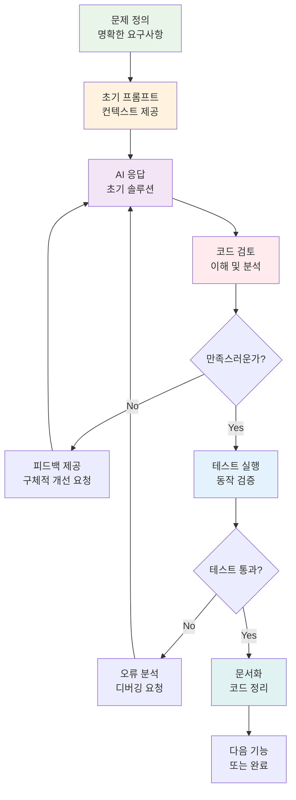
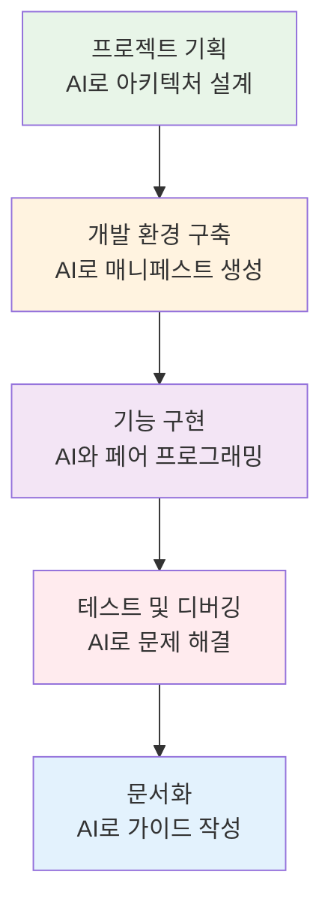
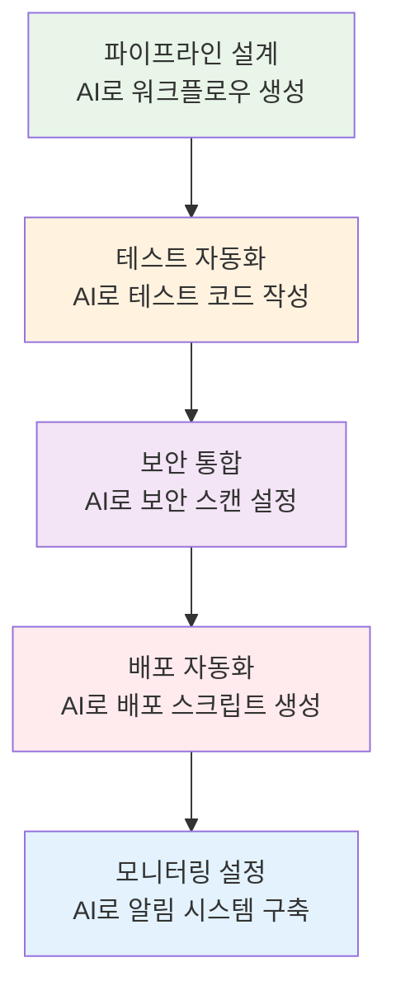

# 🚀 프로젝트 준비 가이드: 바이브코딩 & 프롬프트 엔지니어링

<div align="center">

**🤖 AI 협업** • **💡 프롬프트 전략** • **⚡ 바이브코딩** • **🎯 프로젝트 성공**

*AI 도구를 활용한 효율적인 DevOps 프로젝트 개발 방법론*

</div>

---

## 🎯 가이드 목적

### 📚 학습 목표
- **AI 협업**: ChatGPT, Claude, GitHub Copilot 등 AI 도구의 효과적 활용
- **프롬프트 엔지니어링**: 정확하고 유용한 결과를 얻는 프롬프트 작성법
- **바이브코딩**: AI와 함께하는 빠르고 효율적인 코딩 방법론
- **프로젝트 전략**: Week 3 이후 프로젝트에서의 실무 적용 방안

### 🤔 왜 필요한가?

**현실 상황**:
- 💼 **실무 트렌드**: AI 도구 활용이 개발자의 필수 역량이 된 시대
- 🏠 **일상 비유**: AI는 강력한 어시스턴트, 올바른 소통법이 중요
- 📊 **생산성**: AI 활용으로 개발 속도 3-5배 향상 가능

---

## 🤖 AI 도구별 활용 전략

### 🔍 ChatGPT/Claude 활용법

**DevOps 시나리오별 프롬프트 패턴**:

#### 1. 아키텍처 설계 프롬프트
```
역할: 당신은 10년 경력의 DevOps 아키텍트입니다.

상황: 
- 마이크로서비스 기반 웹 애플리케이션
- 사용자 1만명, 일일 트래픽 10만 요청
- AWS 클라우드 환경
- 예산 제약: 월 $500

요청:
1. Kubernetes 기반 아키텍처 설계
2. 비용 최적화 방안
3. 확장성 고려사항
4. 보안 체크포인트

출력 형식:
- 아키텍처 다이어그램 (Mermaid)
- 구성요소별 상세 설명
- 예상 비용 분석
- 단계별 구현 계획
```

#### 2. 트러블슈팅 프롬프트
```
역할: Kubernetes 전문가

문제 상황:
- Pod가 CrashLoopBackOff 상태
- 로그: "connection refused to database"
- 환경: EKS 클러스터, RDS MySQL

디버깅 정보:
```yaml
[kubectl describe pod 결과 붙여넣기]
```

요청:
1. 문제 원인 분석
2. 단계별 해결 방법
3. 예방 방안
4. 모니터링 개선점

체크리스트 형태로 답변해주세요.
```

#### 3. 코드 리뷰 프롬프트
```
역할: 시니어 DevOps 엔지니어

코드 리뷰 대상:
```yaml
[Kubernetes 매니페스트 또는 Terraform 코드]
```

리뷰 관점:
- 보안 베스트 프랙티스
- 성능 최적화
- 가독성 및 유지보수성
- 에러 처리

출력:
1. 개선 필요 사항 (우선순위별)
2. 수정된 코드 예시
3. 추가 권장사항
```

### 🛠️ GitHub Copilot 활용법

**효과적인 코멘트 작성 패턴**:

#### 1. Dockerfile 최적화
```dockerfile
# Multi-stage build for Node.js app with security hardening
# Base: Alpine Linux for minimal size
# Features: Non-root user, health check, cache optimization

# Build stage
FROM node:18-alpine AS builder
# ... Copilot이 최적화된 빌드 단계 생성
```

#### 2. Kubernetes 매니페스트
```yaml
# Production-ready WordPress deployment
# Features: Rolling update, resource limits, health checks, PVC
apiVersion: apps/v1
kind: Deployment
# ... Copilot이 완성된 매니페스트 생성
```

#### 3. Terraform 인프라
```hcl
# AWS EKS cluster with best practices
# Features: Private subnets, managed node groups, IRSA
resource "aws_eks_cluster" "main" {
  # ... Copilot이 보안 강화된 EKS 설정 생성
}
```

### 🎨 Cursor/Windsurf 활용법

**프로젝트 전체 컨텍스트 활용**:

#### 1. 전체 프로젝트 분석
```
@workspace 현재 프로젝트의 아키텍처를 분석하고 다음을 제안해주세요:
1. 개선 가능한 부분
2. 보안 취약점
3. 성능 최적화 방안
4. 모니터링 강화 방안
```

#### 2. 일관성 있는 코드 생성
```
@codebase 기존 코딩 스타일과 패턴을 참고하여 
새로운 마이크로서비스를 위한 Kubernetes 매니페스트를 생성해주세요.
서비스명: user-service
요구사항: Redis 연동, JWT 인증, 헬스체크
```

---

## ⚡ 바이브코딩 방법론

### 🎯 바이브코딩이란?

**정의**: AI와의 자연스러운 대화를 통해 빠르게 코드를 작성하고 개선하는 방법론

**핵심 원칙**:
1. **반복적 개선**: 초기 버전 → 피드백 → 개선 → 완성
2. **컨텍스트 유지**: 대화 맥락을 통한 일관된 개발
3. **실시간 검증**: 생성된 코드의 즉시 테스트와 수정
4. **학습 통합**: AI 제안을 이해하고 자신의 지식과 결합

### 🔄 바이브코딩 워크플로우



### 📝 실전 바이브코딩 예시

**시나리오**: Kubernetes에서 WordPress + MySQL 배포

#### Step 1: 문제 정의
```
목표: Kubernetes에서 WordPress와 MySQL을 배포
요구사항:
- 데이터 영속성 보장
- 보안 강화 (Secret 사용)
- 헬스체크 포함
- 프로덕션 레디
```

#### Step 2: 초기 프롬프트
```
WordPress와 MySQL을 Kubernetes에 배포하는 완전한 매니페스트를 작성해주세요.

요구사항:
- MySQL: StatefulSet, PVC 사용, 루트 패스워드 Secret
- WordPress: Deployment, MySQL 연동, 헬스체크
- Service: ClusterIP와 LoadBalancer
- ConfigMap: WordPress 설정
- 네임스페이스: wordpress-app

프로덕션 환경 고려사항도 포함해주세요.
```

#### Step 3: AI 응답 검토 및 개선
```
생성된 매니페스트를 검토했습니다. 다음 사항을 개선해주세요:

1. MySQL StatefulSet에 리소스 제한 추가
2. WordPress Deployment에 롤링 업데이트 전략 설정
3. 보안 컨텍스트 추가 (non-root 사용자)
4. 네트워크 정책으로 트래픽 제한
5. HPA (Horizontal Pod Autoscaler) 설정

각 개선사항에 대한 설명도 함께 제공해주세요.
```

#### Step 4: 테스트 및 검증
```
매니페스트를 적용했는데 다음 오류가 발생합니다:

```
Error: pods "mysql-0" is forbidden: unable to validate against any security policy
```

이 오류를 해결하고, 전체 배포가 성공적으로 완료되도록 도와주세요.
또한 배포 상태를 확인하는 스크립트도 제공해주세요.
```

---

## 🎯 프로젝트별 AI 활용 전략

### 🏗️ Week 3-4: Kubernetes 심화 프로젝트

**AI 활용 포인트**:
1. **클러스터 설계**: 아키텍처 다이어그램 생성
2. **매니페스트 작성**: 복잡한 YAML 파일 자동 생성
3. **헬름 차트**: 재사용 가능한 차트 템플릿 작성
4. **모니터링 설정**: Prometheus/Grafana 설정 최적화

**프롬프트 예시**:
```
3-tier 웹 애플리케이션을 위한 Kubernetes 헬름 차트를 작성해주세요.

구성요소:
- Frontend: React (Nginx 서빙)
- Backend: Node.js API
- Database: PostgreSQL
- Cache: Redis
- Monitoring: Prometheus + Grafana

요구사항:
- 환경별 values.yaml (dev, staging, prod)
- 보안 강화 (NetworkPolicy, SecurityContext)
- 자동 스케일링 (HPA, VPA)
- 백업 전략 포함
```

### 🚀 Week 5-6: CI/CD 파이프라인 프로젝트

**AI 활용 포인트**:
1. **파이프라인 설계**: GitLab CI/GitHub Actions 워크플로우
2. **테스트 자동화**: 단위/통합/E2E 테스트 스크립트
3. **보안 스캔**: SAST/DAST 도구 통합
4. **배포 전략**: Blue-Green, Canary 배포 구현

**프롬프트 예시**:
```
마이크로서비스를 위한 완전한 CI/CD 파이프라인을 GitHub Actions로 구현해주세요.

요구사항:
- 멀티 서비스 모노레포 구조
- 변경된 서비스만 빌드/배포
- 보안 스캔 (Trivy, SonarQube)
- 테스트 자동화 (Jest, Cypress)
- Kubernetes 배포 (ArgoCD 연동)
- 슬랙 알림 통합

각 단계별 상세 설명과 에러 처리도 포함해주세요.
```

### 🌐 최종 프로젝트: 클라우드 네이티브 플랫폼

**AI 활용 포인트**:
1. **인프라 코드**: Terraform으로 AWS/Azure 리소스 관리
2. **서비스 메시**: Istio 설정과 트래픽 관리
3. **관측성**: 로깅, 메트릭, 트레이싱 통합
4. **비용 최적화**: FinOps 전략과 자동화

**프롬프트 예시**:
```
AWS에서 완전한 클라우드 네이티브 플랫폼을 구축하는 Terraform 코드를 작성해주세요.

아키텍처:
- EKS 클러스터 (다중 AZ)
- RDS Aurora (Multi-AZ)
- ElastiCache Redis
- ALB + CloudFront
- Route53 + ACM
- VPC + Private Subnets

특징:
- 비용 최적화 (Spot 인스턴스, 예약 인스턴스)
- 보안 강화 (WAF, GuardDuty, Config)
- 모니터링 (CloudWatch, X-Ray)
- 백업 및 재해복구

모듈화된 구조로 재사용 가능하게 작성해주세요.
```

---

## 💡 프롬프트 엔지니어링 베스트 프랙티스

### 🎯 효과적인 프롬프트 구조

#### 1. CLEAR 프레임워크
- **C**ontext: 상황과 배경 정보
- **L**ength: 원하는 답변의 길이와 형식
- **E**xamples: 구체적인 예시 제공
- **A**udience: 대상 독자 수준
- **R**ole: AI의 역할 정의

#### 2. 단계별 프롬프트 작성법

**기본 템플릿**:
```
역할: [전문가 역할 정의]

상황: 
- [프로젝트 배경]
- [기술 스택]
- [제약 조건]

요청:
1. [구체적 요구사항 1]
2. [구체적 요구사항 2]
3. [구체적 요구사항 3]

출력 형식:
- [원하는 형식 지정]
- [포함할 섹션들]

추가 고려사항:
- [보안, 성능, 비용 등]
```

### 🔧 DevOps 특화 프롬프트 패턴

#### 1. 인프라 설계 패턴
```
시스템 아키텍트 역할로 다음 요구사항을 만족하는 인프라를 설계해주세요:

비즈니스 요구사항:
- [사용자 수, 트래픽, 성능 요구사항]

기술적 제약사항:
- [예산, 기술 스택, 컴플라이언스]

출력:
1. 아키텍처 다이어그램 (Mermaid)
2. 구성요소별 상세 설명
3. 비용 분석
4. 위험 요소 및 대응 방안
5. 단계별 구현 계획
```

#### 2. 문제 해결 패턴
```
DevOps 전문가로서 다음 문제를 해결해주세요:

문제 상황:
- [구체적 증상]
- [에러 메시지]
- [환경 정보]

디버깅 정보:
```
[로그, 설정 파일 등]
```

요청:
1. 문제 원인 분석 (가능성 높은 순서)
2. 단계별 해결 방법
3. 검증 방법
4. 재발 방지 방안
5. 모니터링 개선점

체크리스트 형태로 제공해주세요.
```

#### 3. 코드 생성 패턴
```
[기술스택] 전문가로서 다음 기능을 구현해주세요:

요구사항:
- [기능 명세]
- [성능 요구사항]
- [보안 요구사항]

제약조건:
- [기술적 제약]
- [환경적 제약]

출력:
1. 완전한 코드 (주석 포함)
2. 설정 파일
3. 테스트 코드
4. 배포 스크립트
5. 사용법 가이드

베스트 프랙티스를 적용하여 프로덕션 레디 수준으로 작성해주세요.
```

---

## 🚀 실전 적용 가이드

### 📅 프로젝트 단계별 AI 활용 계획

#### Week 3-4: Kubernetes 마스터리


#### Week 5-6: CI/CD 파이프라인


### 🎯 성공을 위한 핵심 팁

#### 1. AI와의 효과적인 협업
- **명확한 소통**: 모호한 요청보다는 구체적이고 명확한 지시
- **반복적 개선**: 한 번에 완벽한 결과를 기대하지 말고 점진적 개선
- **컨텍스트 유지**: 대화의 맥락을 유지하여 일관된 결과 도출
- **검증과 이해**: AI 결과를 맹신하지 말고 항상 검증하고 이해

#### 2. 학습과 성장
- **AI 의존도 조절**: AI는 도구일 뿐, 기본 지식과 이해가 중요
- **새로운 기술 탐색**: AI를 통해 최신 기술과 베스트 프랙티스 학습
- **창의적 활용**: 정해진 패턴을 벗어나 창의적인 활용 방법 모색
- **지속적 개선**: 프롬프트 기법과 활용 방법의 지속적 개선

#### 3. 팀 협업에서의 AI 활용
- **지식 공유**: 효과적인 프롬프트와 활용법을 팀원과 공유
- **표준화**: 팀 내 AI 활용 가이드라인과 베스트 프랙티스 수립
- **품질 관리**: AI 생성 코드의 리뷰와 품질 관리 프로세스 구축
- **역할 분담**: AI가 잘하는 것과 사람이 잘하는 것의 적절한 분담

---

## 📊 AI 활용 성과 측정

### 🎯 측정 지표

#### 개발 효율성
- **코드 작성 속도**: AI 활용 전후 비교
- **버그 발생률**: AI 생성 코드의 품질 측정
- **학습 시간**: 새로운 기술 습득 시간 단축
- **문제 해결 시간**: 트러블슈팅 소요 시간 감소

#### 프로젝트 품질
- **코드 품질**: 정적 분석 도구를 통한 품질 측정
- **보안 수준**: 보안 취약점 발견 및 해결 능력
- **문서화 수준**: 자동 생성된 문서의 완성도
- **테스트 커버리지**: AI 생성 테스트 코드의 효과성

### 📈 지속적 개선 방안

#### 1. 주간 회고
- AI 활용 경험 공유
- 효과적인 프롬프트 패턴 발견
- 문제점과 개선 방안 논의
- 새로운 활용 아이디어 제안

#### 2. 월간 평가
- 프로젝트 성과 분석
- AI 활용 ROI 측정
- 팀 역량 향상도 평가
- 다음 달 목표 설정

#### 3. 지속적 학습
- 새로운 AI 도구 탐색
- 프롬프트 엔지니어링 기법 학습
- 업계 베스트 프랙티스 연구
- 커뮤니티 참여와 지식 공유

---

<div align="center">

**🤖 AI 협업** • **💡 스마트 개발** • **🚀 생산성 향상** • **🎯 프로젝트 성공**

*AI와 함께하는 차세대 DevOps 개발 방법론*

</div>