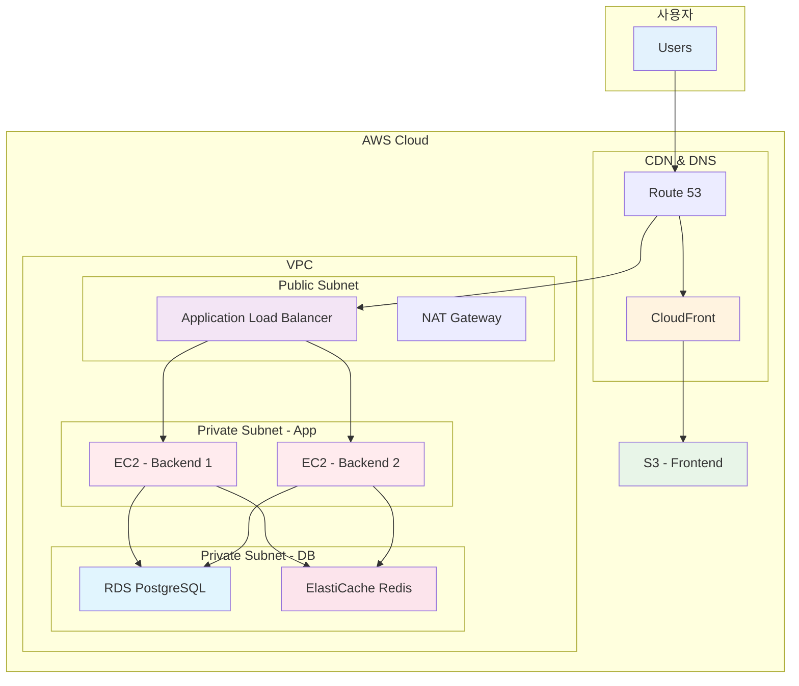

# November Week 1: AWS 기초 집중 과정

<div align="center">

**☁️ AWS 글로벌 인프라** • **🖥️ 컴퓨팅** • **📦 스토리지** • **🌐 네트워킹** • **🗄️ 데이터베이스**

*AWS 핵심 서비스 이해 및 실무 아키텍처 학습*

</div>

---

## 🎯 Week 1 목표

### 전체 학습 목표
- AWS 글로벌 인프라 및 핵심 개념 이해
- 주요 AWS 서비스 (EC2, S3, RDS, VPC 등) 실무 활용
- 실제 프로젝트를 AWS에 배포하는 경험
- 비용 효율적인 아키텍처 설계 능력

### 주간 성과물
- 팀 프론트엔드를 S3 + CloudFront로 배포
- 팀 백엔드를 EC2에 Docker로 배포
- RDS 데이터베이스 연동
- 전체 시스템 통합 및 운영

---

## 📅 주간 커리큘럼

### [Day 1: AWS 기초 & 컴퓨팅 서비스](./day1/README.md)
**시간**: 09:00-14:00

**이론 세션**:
- Session 1: AWS 글로벌 인프라 (Region, AZ, Edge Location)
- Session 2: EC2 (Elastic Compute Cloud)
- Session 3: Lambda (서버리스 컴퓨팅)

**실습**:
- Lab 1: EC2 인스턴스 생성 및 웹 서버 배포

**학습 포인트**:
- AWS 인프라의 기본 구조 이해
- IaaS vs PaaS vs FaaS 비교
- EC2와 Lambda 선택 기준

---

### [Day 2: 네트워킹 & 스토리지](./day2/README.md)
**시간**: 09:00-14:00

**이론 세션**:
- Session 1: VPC (Virtual Private Cloud)
- Session 2: S3 (Simple Storage Service)
- Session 3: EBS & EFS 스토리지

**실습**:
- Lab 1: S3 + CloudFront 정적 웹사이트 배포

**학습 포인트**:
- AWS 네트워크 격리 및 보안
- 객체 스토리지 vs 블록 스토리지
- 팀 프론트엔드 배포 경험

---

### [Day 3: 데이터베이스 & 캐싱](./day3/README.md)
**시간**: 09:00-14:00

**이론 세션**:
- Session 1: RDS (Relational Database Service)
- Session 2: DynamoDB (NoSQL)
- Session 3: ElastiCache (Redis/Memcached)

**실습**:
- Lab 1: RDS PostgreSQL 구성 및 연동

**학습 포인트**:
- 관리형 데이터베이스 장점
- RDS vs DynamoDB 선택 기준
- 캐싱 전략 및 성능 최적화

---

### [Day 4: 로드밸런싱 & 고가용성](./day4/README.md)
**시간**: 09:00-14:00

**이론 세션**:
- Session 1: ELB (Elastic Load Balancing)
- Session 2: Auto Scaling
- Session 3: Route 53 (DNS)

**실습**:
- Lab 1: ALB + Auto Scaling 구성

**학습 포인트**:
- 로드밸런싱 및 자동 확장
- 고가용성 아키텍처 설계
- DNS 기반 트래픽 라우팅

---

### [Day 5: 실전 아키텍처 & 모니터링](./day5/README.md)
**시간**: 09:00-14:00

**이론 세션**:
- Session 1: 실전 아키텍처 패턴
- Session 2: CloudWatch (모니터링)
- Session 3: 비용 최적화 & 보안

**실습**:
- Lab 1: 전체 시스템 통합 배포

**학습 포인트**:
- 3-Tier 아키텍처 구현
- 모니터링 및 알람 설정
- 비용 효율적 운영 전략

---

## 🏗️ Week 1 전체 아키텍처

### 최종 구축 아키텍처


### 서비스별 역할
- **CloudFront + S3**: 프론트엔드 정적 호스팅 (Day 2)
- **ALB + EC2**: 백엔드 API 서버 (Day 3-4)
- **RDS**: 관계형 데이터베이스 (Day 3)
- **ElastiCache**: 세션 스토어 & 캐싱 (Day 3)
- **Route 53**: DNS 라우팅 (Day 4)

---

## 📊 일일 학습 구조

### 표준 시간표
```
09:00-09:20  Session 1 (20분)
09:20-09:40  Session 2 (20분)
09:40-10:00  휴식 (20분)
10:00-11:00  Session 3 (60분)
11:00-12:00  실습 준비 (60분)
12:00-13:00  점심시간 (60분)
13:00-13:50  Lab 실습 (50분)
```

### 학습 방식
- **이론**: AWS Web Console 중심 설명
- **실습**: 직접 클릭하며 리소스 생성
- **팀 프로젝트**: 실제 프로젝트 배포 경험

---

## 💰 주간 예상 비용

### 일별 비용 (프리티어 활용)
| Day | 주요 리소스 | 예상 비용 |
|-----|------------|-----------|
| Day 1 | EC2 t3.micro | $0.10 |
| Day 2 | S3 + CloudFront | $0.01 |
| Day 3 | RDS db.t3.micro | $0.20 |
| Day 4 | ALB + ASG | $0.30 |
| Day 5 | 전체 통합 | $0.40 |
| **합계** | | **$1.01** |

### 비용 절감 팁
- 프리티어 최대 활용 (t3.micro, db.t3.micro)
- 실습 완료 후 즉시 리소스 삭제
- 태그 기반 리소스 관리
- Cost Explorer로 일일 비용 확인

---

## ✅ Week 1 완료 체크리스트

### 이론 이해도
- [ ] AWS 글로벌 인프라 구조 이해
- [ ] 주요 서비스 (EC2, S3, RDS, VPC) 개념 파악
- [ ] 서비스 선택 기준 이해
- [ ] 비용 구조 및 최적화 방법 습득

### 실습 완료
- [ ] EC2 인스턴스 생성 및 관리
- [ ] S3 + CloudFront 정적 호스팅
- [ ] RDS 데이터베이스 구성
- [ ] ALB + Auto Scaling 설정
- [ ] 전체 시스템 통합 배포

### 팀 프로젝트
- [ ] 프론트엔드 S3 배포 완료
- [ ] 백엔드 EC2 배포 완료
- [ ] 데이터베이스 연동 성공
- [ ] 전체 시스템 동작 확인

---

## 🔗 다음 주 준비

### Week 2 예고: Terraform IaC
- Infrastructure as Code 개념
- Terraform으로 AWS 리소스 관리
- 코드로 인프라 버전 관리
- 재사용 가능한 모듈 작성

### 사전 준비사항
- Week 1에서 구축한 아키텍처 이해
- AWS CLI 설치 및 설정
- Terraform 설치 (Week 2 시작 전)

---

## 📚 참고 자료

### AWS 공식 문서
- [AWS 시작하기](https://aws.amazon.com/getting-started/)
- [AWS 프리티어](https://aws.amazon.com/free/)
- [AWS 아키텍처 센터](https://aws.amazon.com/architecture/)

### 학습 리소스
- [AWS Well-Architected Framework](https://aws.amazon.com/architecture/well-architected/)
- [AWS 요금 계산기](https://calculator.aws/)
- [AWS 비용 최적화](https://aws.amazon.com/pricing/cost-optimization/)

---

## 💡 학습 팁

### 효과적인 학습 방법
1. **이론 → 실습 → 복습**: 즉시 적용하며 학습
2. **팀 협업**: 서로 가르치고 배우기
3. **문서화**: 실습 과정 기록 및 공유
4. **질문하기**: 막히는 부분 즉시 질문

### 트러블슈팅
- AWS 공식 문서 먼저 확인
- 에러 메시지 정확히 읽기
- CloudWatch Logs 활용
- 팀원과 함께 문제 해결

---

<div align="center">

**☁️ AWS 기초 완성** • **🏗️ 실전 아키텍처** • **💰 비용 최적화** • **🚀 프로젝트 배포**

*Week 1: AWS 핵심 서비스 마스터 및 실전 배포 경험*

</div>
