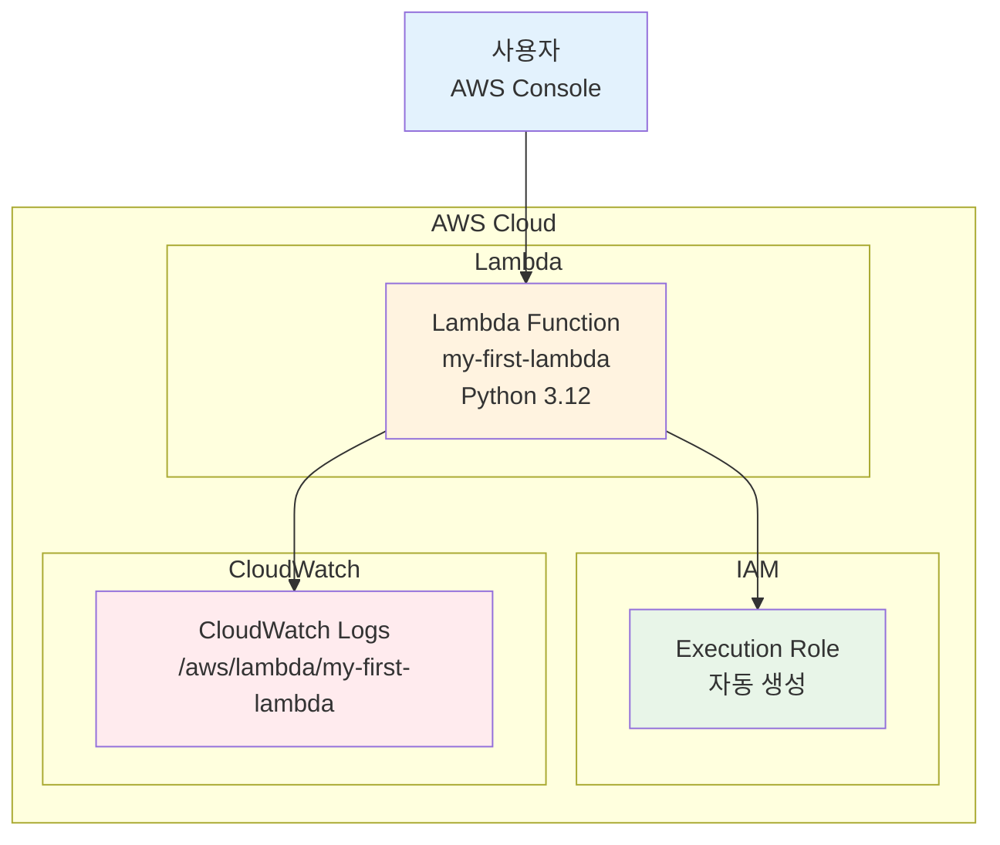

# November Week 1 Day 1 Lab 1: 첫 Lambda 함수 만들기

<div align="center">

**⚡ 서버리스 시작** • **🚀 5분 배포** • **💰 무료 실습**

*AWS Console에서 Lambda 함수 생성부터 테스트까지*

</div>

---

## 🕘 Lab 정보
**시간**: 11:00-12:00 (60분)
**목표**: Lambda 함수 생성, 코드 작성, 테스트 실행
**방식**: AWS Web Console 실습
**예상 비용**: $0 (프리티어 범위 내)

## 🎯 학습 목표
- [ ] Lambda 함수 생성 및 기본 설정 이해
- [ ] Python 코드로 간단한 함수 작성
- [ ] 테스트 이벤트 생성 및 실행
- [ ] CloudWatch Logs로 실행 결과 확인

---

## 🏗️ 구축할 아키텍처

### 📐 아키텍처 다이어그램



**이미지 자리**: 아키텍처 다이어그램 이미지
<!-- 이미지 삽입 위치: architecture-diagram.png -->

**사용할 AWS 서비스**:
- **Lambda**: 서버리스 함수 실행
- **CloudWatch Logs**: 로그 저장 및 확인
- **IAM**: Lambda 실행 권한 (자동 생성)

### 🔗 참조 Session

**당일 Session**:
- [Session 1: AWS 글로벌 인프라](./session_1.md) - Region, AZ 개념
- [Session 2: 클라우드 컴퓨팅 모델](./session_2.md) - IaaS, PaaS, SaaS
- [Session 3: AWS Lambda](./session_3.md) - 서버리스 컴퓨팅, Lambda 개념

---

## 🛠️ Step 1: Lambda 함수 생성 (10분)

### 📋 이 단계에서 할 일
- Lambda 함수 생성
- 기본 설정 구성
- IAM 역할 자동 생성

### 🔗 참조 개념
- [Session 3: AWS Lambda](./session_3.md) - Lambda 함수 생성 및 설정

### 📝 실습 절차

#### 1-1. Lambda 콘솔 접속

**AWS Console 경로**:
```
AWS Console → Lambda → Functions → Create function
```

**이미지 자리**: Lambda 콘솔 메인 화면
<!-- 이미지 삽입 위치: step1-1-lambda-console.png -->

#### 1-2. 함수 생성 설정

**설정 값**:
| 항목 | 값 | 설명 |
|------|-----|------|
| Function name | `my-first-lambda` | 함수 이름 |
| Runtime | Python 3.12 | 실행 환경 |
| Architecture | x86_64 | 프로세서 아키텍처 |
| Permissions | Create new role | IAM 역할 자동 생성 |

**이미지 자리**: 함수 생성 설정 화면
<!-- 이미지 삽입 위치: step1-2-create-function.png -->

**⚠️ 주의사항**:
- 함수 이름은 소문자, 숫자, 하이픈만 사용
- Runtime은 최신 Python 버전 선택
- IAM 역할은 자동 생성 선택 (기본 실행 권한)

#### 1-3. 함수 생성 완료

**Create function** 버튼 클릭

**이미지 자리**: 함수 생성 완료 화면
<!-- 이미지 삽입 위치: step1-3-function-created.png -->

### ✅ Step 1 검증

**확인 사항**:
- [ ] Lambda 함수가 생성됨
- [ ] Function overview에 함수 정보 표시
- [ ] IAM 역할이 자동 생성됨 (my-first-lambda-role-xxxxx)

**이미지 자리**: 검증 결과 화면
<!-- 이미지 삽입 위치: step1-verification.png -->

---

## 🛠️ Step 2: Lambda 함수 코드 작성 (15분)

### 📋 이 단계에서 할 일
- 기본 코드 확인
- 간단한 Python 코드 작성
- 코드 배포

### 🔗 참조 개념
- [Session 3: AWS Lambda](./session_3.md) - Lambda 함수 코드 작성

### 📝 실습 절차

#### 2-1. 기본 코드 확인

**Code source** 탭에서 기본 코드 확인:
```python
import json

def lambda_handler(event, context):
    # TODO implement
    return {
        'statusCode': 200,
        'body': json.dumps('Hello from Lambda!')
    }
```

**이미지 자리**: 기본 코드 화면
<!-- 이미지 삽입 위치: step2-1-default-code.png -->

#### 2-2. 코드 수정

**다음 코드로 변경**:
```python
import json
from datetime import datetime

def lambda_handler(event, context):
    # 현재 시간 가져오기
    current_time = datetime.now().strftime("%Y-%m-%d %H:%M:%S")
    
    # 이벤트에서 이름 가져오기 (없으면 "Guest")
    name = event.get('name', 'Guest')
    
    # 응답 메시지 생성
    message = f"Hello, {name}! Current time is {current_time}"
    
    # 로그 출력 (CloudWatch Logs에 기록됨)
    print(f"Lambda invoked by: {name}")
    print(f"Event received: {json.dumps(event)}")
    
    return {
        'statusCode': 200,
        'body': json.dumps({
            'message': message,
            'timestamp': current_time,
            'input_name': name
        })
    }
```

**이미지 자리**: 수정된 코드 화면
<!-- 이미지 삽입 위치: step2-2-modified-code.png -->

**코드 설명**:
- `event`: Lambda 함수에 전달되는 입력 데이터
- `context`: 실행 환경 정보 (요청 ID, 메모리 등)
- `print()`: CloudWatch Logs에 로그 기록
- `return`: API Gateway 등에 반환할 응답

#### 2-3. 코드 배포

**Deploy** 버튼 클릭

**예상 결과**:
```
Changes deployed successfully
```

**이미지 자리**: 배포 완료 화면
<!-- 이미지 삽입 위치: step2-3-deployed.png -->

### ✅ Step 2 검증

**확인 사항**:
- [ ] 코드가 저장됨
- [ ] "Changes deployed" 메시지 표시
- [ ] 코드 에디터에 수정한 코드 표시

**이미지 자리**: 검증 결과 화면
<!-- 이미지 삽입 위치: step2-verification.png -->

---

## 🛠️ Step 3: 테스트 이벤트 생성 (10분)

### 📋 이 단계에서 할 일
- 테스트 이벤트 생성
- 다양한 입력 데이터 테스트

### 📝 실습 절차

#### 3-1. 테스트 이벤트 생성

**Test** 탭 클릭 → **Create new event**

**이미지 자리**: 테스트 이벤트 생성 화면
<!-- 이미지 삽입 위치: step3-1-create-test-event.png -->

**설정 값**:
| 항목 | 값 |
|------|-----|
| Event name | `test-event-1` |
| Event JSON | 아래 JSON 입력 |

**테스트 이벤트 JSON**:
```json
{
  "name": "Alice"
}
```

**Save** 버튼 클릭

**이미지 자리**: 테스트 이벤트 저장 완료
<!-- 이미지 삽입 위치: step3-1-test-event-saved.png -->

#### 3-2. 추가 테스트 이벤트 생성

**테스트 이벤트 2**:
```json
{
  "name": "Bob",
  "age": 30,
  "city": "Seoul"
}
```

**테스트 이벤트 3** (이름 없음):
```json
{
  "message": "Hello Lambda"
}
```

**이미지 자리**: 3개 테스트 이벤트 목록
<!-- 이미지 삽입 위치: step3-2-test-events-list.png -->

### ✅ Step 3 검증

**확인 사항**:
- [ ] 3개의 테스트 이벤트 생성됨
- [ ] 각 이벤트에 다른 JSON 데이터 포함

---

## 🛠️ Step 4: Lambda 함수 실행 및 테스트 (10분)

### 📋 이 단계에서 할 일
- Lambda 함수 실행
- 실행 결과 확인
- CloudWatch Logs 확인

### 📝 실습 절차

#### 4-1. 함수 실행

**Test** 버튼 클릭 (test-event-1 선택)

**예상 결과**:
```json
{
  "statusCode": 200,
  "body": "{\"message\": \"Hello, Alice! Current time is 2025-11-01 14:30:00\", \"timestamp\": \"2025-11-01 14:30:00\", \"input_name\": \"Alice\"}"
}
```

**이미지 자리**: 테스트 실행 결과
<!-- 이미지 삽입 위치: step4-1-test-result.png -->

**실행 정보**:
```
Duration: 2.5 ms
Billed Duration: 3 ms
Memory Size: 128 MB
Max Memory Used: 38 MB
```

#### 4-2. 다른 테스트 이벤트 실행

**test-event-2** 실행:
- 이름: Bob
- 추가 필드 (age, city)는 무시됨

**test-event-3** 실행:
- 이름 없음 → "Guest"로 처리

**이미지 자리**: 여러 테스트 결과 비교
<!-- 이미지 삽입 위치: step4-2-multiple-tests.png -->

#### 4-3. CloudWatch Logs 확인

**Monitor** 탭 → **View CloudWatch logs**

**이미지 자리**: CloudWatch Logs 화면
<!-- 이미지 삽입 위치: step4-3-cloudwatch-logs.png -->

**로그 내용**:
```
START RequestId: abc123...
Lambda invoked by: Alice
Event received: {"name": "Alice"}
END RequestId: abc123...
REPORT RequestId: abc123... Duration: 2.5 ms Billed Duration: 3 ms
```

### ✅ Step 4 검증

**확인 사항**:
- [ ] 3개 테스트 모두 성공 (statusCode: 200)
- [ ] 각 테스트마다 다른 응답 메시지
- [ ] CloudWatch Logs에 실행 로그 기록됨
- [ ] Duration이 밀리초 단위로 표시됨

**이미지 자리**: 전체 검증 결과
<!-- 이미지 삽입 위치: step4-verification.png -->

---

## 💰 비용 확인

### 예상 비용 계산

**실습 사용량**:
- 요청 수: 3회
- 실행 시간: 약 3ms × 3회 = 9ms
- 메모리: 128MB

**프리티어 범위**:
- 월 1M requests 무료
- 월 400K GB-초 무료

**실제 비용**: **$0** (프리티어 범위 내)

---

## 🔍 트러블슈팅

### 문제 1: 함수 생성 실패

**증상**:
- "Unable to create function" 오류

**원인**:
- IAM 권한 부족

**해결 방법**:
1. AWS 계정에 Lambda 생성 권한 확인
2. 관리자에게 권한 요청

### 문제 2: 테스트 실행 실패

**증상**:
- "Execution failed" 오류

**원인**:
- 코드 문법 오류

**해결 방법**:
1. 코드 에디터에서 빨간 밑줄 확인
2. Python 문법 검증
3. Deploy 버튼 다시 클릭

### 문제 3: CloudWatch Logs 없음

**증상**:
- 로그가 표시되지 않음

**원인**:
- IAM 역할에 CloudWatch Logs 권한 없음

**해결 방법**:
1. Configuration → Permissions 확인
2. IAM 역할에 CloudWatch Logs 권한 추가

---

## 🧹 리소스 정리 (5분)

### ⚠️ 중요: Lambda 함수 삭제

**삭제 절차**:

#### 1. Lambda 함수 삭제

**AWS Console 경로**:
```
Lambda → Functions → my-first-lambda → Actions → Delete
```

**이미지 자리**: Lambda 함수 삭제 화면
<!-- 이미지 삽입 위치: cleanup-1-delete-function.png -->

**확인**:
- "delete" 입력하여 삭제 확인

**이미지 자리**: 삭제 확인 화면
<!-- 이미지 삽입 위치: cleanup-1-confirm-delete.png -->

#### 2. CloudWatch Logs 삭제 (선택)

**AWS Console 경로**:
```
CloudWatch → Logs → Log groups → /aws/lambda/my-first-lambda → Actions → Delete
```

**이미지 자리**: CloudWatch Logs 삭제 화면
<!-- 이미지 삽입 위치: cleanup-2-delete-logs.png -->

### ✅ 정리 완료 확인

**확인 사항**:
- [ ] Lambda 함수 삭제됨
- [ ] CloudWatch Log Group 삭제됨 (선택)
- [ ] IAM 역할 자동 삭제됨

**이미지 자리**: 정리 완료 확인
<!-- 이미지 삽입 위치: cleanup-verification.png -->

---

## 💡 Lab 회고

### 🤝 페어 회고 (5분)
1. **가장 인상 깊었던 부분**: Lambda 함수가 얼마나 빠르게 생성되고 실행되는지
2. **어려웠던 점**: 
3. **실무 적용 아이디어**: 

### 📊 학습 성과
- **기술적 성취**: Lambda 함수 생성 및 실행 완료
- **이해도 향상**: 서버리스 컴퓨팅의 간편함 체험
- **다음 Lab 준비**: API Gateway와 Lambda 연동

---

## 🔗 관련 자료

### 📚 Session 복습
- [Session 3: AWS Lambda](./session_3.md)

### 📖 AWS 공식 문서
- [Lambda 시작하기](https://docs.aws.amazon.com/lambda/latest/dg/getting-started.html)
- [Lambda Python 런타임](https://docs.aws.amazon.com/lambda/latest/dg/lambda-python.html)

### 🎯 다음 Lab
- Lab 2: API Gateway + Lambda 통합 (예정)

---

<div align="center">

**✅ Lab 완료** • **🧹 리소스 정리 필수** • **💰 비용 $0**

*첫 Lambda 함수 생성 완료! 서버리스의 시작*

</div>
