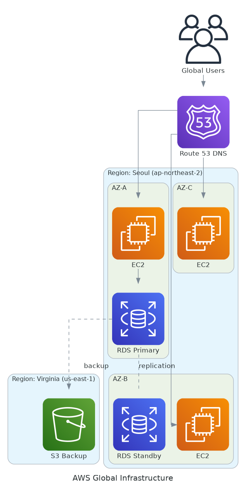
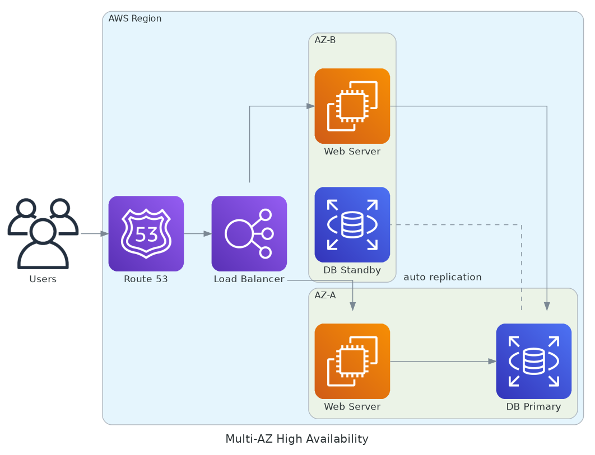

# November Week 1 Day 1 Session 1: AWS 글로벌 인프라

<div align="center">

**🌍 Region** • **🏢 Availability Zone** • **⚡ Edge Location**

*AWS 글로벌 인프라 구조와 고가용성 아키텍처*

</div>

---

## 🕘 세션 정보
**시간**: 09:00-09:20 (20분)
**목표**: AWS 글로벌 인프라 구조 이해 및 리전 선택 기준 습득

---

## 📖 서비스 개요

### 1. 생성 배경 (Why?)

**문제 상황**:
- **단일 데이터센터 위험**: 화재, 정전, 자연재해 시 전체 서비스 중단
- **지역별 지연시간**: 미국 서버를 한국에서 접속 시 200-300ms 지연
- **데이터 주권 법규**: GDPR 등 국가별 데이터 보관 규정
- **확장성 한계**: 단일 위치에서 글로벌 서비스 제공 어려움

**AWS 글로벌 인프라 솔루션**:
- **33개 Region**: 전 세계 지리적으로 분산된 데이터센터 그룹
- **105개 Availability Zone**: Region 내 물리적으로 분리된 데이터센터
- **600+ Edge Location**: CDN을 위한 캐시 서버 (CloudFront)
- **고가용성**: 한 AZ 장애 시 다른 AZ로 자동 전환

---

### 2. 핵심 원리 (How?)

**AWS 글로벌 인프라 아키텍처**:



*그림: AWS 글로벌 인프라 - Region, AZ, 그리고 Cross-Region 복제*

```
AWS 글로벌 인프라
├── Region (33개)
│   ├── Availability Zone A (독립 전원, 네트워크)
│   ├── Availability Zone B (독립 전원, 네트워크)
│   └── Availability Zone C (독립 전원, 네트워크)
├── Edge Location (600+)
│   └── CloudFront CDN 캐시
└── Regional Edge Cache
    └── 대용량 콘텐츠 캐싱
```

**작동 원리**:
- **Region**: 지리적으로 완전히 분리된 데이터센터 그룹 (예: 서울, 도쿄, 버지니아)
- **Availability Zone (AZ)**: Region 내 물리적으로 분리된 데이터센터 (각 Region에 최소 3개)
  - 독립적인 전원 공급 (UPS, 발전기)
  - 독립적인 냉각 시스템
  - 독립적인 네트워크 연결
  - AZ 간 고속 전용 네트워크 (< 2ms 지연시간)
- **Edge Location**: 사용자와 가까운 위치의 캐시 서버 (CloudFront, Route 53)

**고가용성 메커니즘**:



*그림: Multi-AZ 배포를 통한 고가용성 구현 - Load Balancer가 여러 AZ의 웹 서버로 트래픽 분산*

**주요 특징**:
- **자동 장애 조치**: Primary DB 장애 시 Standby로 자동 전환 (1-2분)
- **로드 밸런싱**: ALB가 정상 AZ로만 트래픽 전송
- **데이터 복제**: AZ 간 동기식 복제로 데이터 일관성 보장

---

### 3. 주요 사용 사례 (When?)

**적합한 경우**:
- **글로벌 서비스**: 전 세계 사용자에게 낮은 지연시간 제공
- **고가용성 요구**: 99.99% 이상 가용성 필요 (연간 52분 이하 다운타임)
- **재해 복구**: 자연재해, 데이터센터 장애 대비
- **규정 준수**: 데이터 주권 법규 (GDPR, 개인정보보호법)

**실제 사례**:
- **Netflix**: 3개 Region에 서비스 분산 (미국, 유럽, 아시아)
- **Airbnb**: 리전별 데이터 저장으로 GDPR 준수
- **Spotify**: Edge Location 활용으로 음악 스트리밍 최적화

---

### 4. 비슷한 서비스 비교 (Which?)

**AWS 내 대안 서비스**:
- **Single Region** vs **Multi-Region**
  - 언제 Single Region: 국내 서비스, 낮은 복잡도, 비용 절감
  - 언제 Multi-Region: 글로벌 서비스, 재해 복구, 규정 준수

- **Multi-AZ** vs **Single-AZ**
  - 언제 Multi-AZ: 프로덕션 환경, 고가용성 필요
  - 언제 Single-AZ: 개발/테스트 환경, 비용 절감

- **CloudFront (Edge)** vs **Direct Access**
  - 언제 CloudFront: 정적 콘텐츠, 글로벌 사용자, 성능 최적화
  - 언제 Direct Access: 동적 콘텐츠, 지역 서비스

**선택 기준**:
| 기준 | Single Region | Multi-Region | Edge Location |
|------|---------------|--------------|---------------|
| 가용성 | 99.9% | 99.99%+ | 99.99%+ |
| 지연시간 | 지역 내 낮음 | 글로벌 낮음 | 최저 |
| 비용 | 낮음 | 높음 (복제 비용) | 중간 |
| 복잡도 | 낮음 | 높음 | 중간 |
| 재해 복구 | 제한적 | 완벽 | N/A |

---

### 5. 장단점 분석

**장점**:
- ✅ **고가용성**: Multi-AZ 배포로 99.99% 이상 가용성
- ✅ **낮은 지연시간**: 사용자와 가까운 Region/Edge 선택
- ✅ **재해 복구**: 지리적 분산으로 자연재해 대비
- ✅ **규정 준수**: 데이터 주권 법규 준수 용이
- ✅ **확장성**: 글로벌 확장 시 새 Region 추가

**단점/제약사항**:
- ⚠️ **비용 증가**: Multi-Region 배포 시 데이터 복제 비용
- ⚠️ **복잡도**: 리전 간 데이터 동기화 및 관리
- ⚠️ **지연시간**: 리전 간 통신 시 100-200ms 지연
- ⚠️ **서비스 가용성**: 신규 서비스는 일부 Region만 지원

**대안**:
- 비용 절감: Single Region + Multi-AZ
- 간단한 구조: CloudFront만 사용 (Origin은 Single Region)

---

### 6. 비용 구조 💰

**과금 방식**:
- **Region 자체**: 무료 (리전 선택에 비용 없음)
- **리소스 가격**: Region별로 다름 (10-30% 차이)
- **데이터 전송**: 
  - 같은 AZ 내: 무료
  - 같은 Region 다른 AZ: $0.01/GB
  - 다른 Region: $0.02/GB
  - 인터넷 아웃바운드: $0.09/GB (첫 10TB)

**프리티어 혜택**:
- Region/AZ 선택: 무료
- 데이터 전송: 100GB/월 무료 (인터넷 아웃바운드)
- CloudFront: 1TB 데이터 전송 무료 (12개월)

**비용 최적화 팁**:
1. **저렴한 Region 선택**: 버지니아(us-east-1)가 가장 저렴 (기준 가격)
2. **같은 AZ 배치**: EC2-RDS 같은 AZ에 배치하여 데이터 전송 비용 절감
3. **CloudFront 활용**: 반복 요청 캐싱으로 Origin 비용 절감
4. **VPC Endpoint**: S3/DynamoDB 접근 시 인터넷 경유 없이 무료 접근
5. **리전 간 복제 최소화**: 필요한 데이터만 복제

**리전별 가격 비교 (EC2 t3.micro 기준)**:
| Region | 위치 | 시간당 | 월간 (730시간) | 기준 대비 |
|--------|------|--------|----------------|-----------|
| us-east-1 | 버지니아 | $0.0104 | $7.59 | 기준 (100%) |
| us-west-2 | 오레곤 | $0.0104 | $7.59 | 100% |
| ap-northeast-2 | 서울 | $0.0116 | $8.47 | 112% |
| ap-northeast-1 | 도쿄 | $0.0152 | $11.10 | 146% |
| eu-west-1 | 아일랜드 | $0.0126 | $9.20 | 121% |

**Lab 예상 비용**:
- Region 선택: $0
- AZ 배치: $0
- 데이터 전송 (1GB): $0 (프리티어)
- 합계: **$0**

---

### 7. 최신 업데이트 🆕

**2024년 주요 변경사항**:
- **신규 Region 추가**:
  - 2024.03: 멕시코 (Mexico Central)
  - 2024.05: 뉴질랜드 (Auckland)
  - 2024.08: 태국 (Bangkok)
- **AZ 확장**: 기존 Region에 추가 AZ 배치 (서울 3개 → 4개)
- **Edge Location 확장**: 50개 신규 Edge Location 추가
- **Local Zone 확장**: 32개 도시에 Local Zone 추가

**2025년 예정**:
- **신규 Region**: 사우디아라비아, 대만, 유럽 Sovereign Cloud
- **Wavelength Zone 확장**: 5G 엣지 컴퓨팅 확대
- **더 빠른 AZ 간 네트워크**: < 1ms 지연시간 목표

**Deprecated 기능**:
- **EC2-Classic**: 2022년 종료 (VPC 필수)
- **일부 구형 Region**: 신규 서비스 미지원

**참조**: [AWS Global Infrastructure](https://aws.amazon.com/about-aws/global-infrastructure/) (2024.10 업데이트)

---

### 8. 잘 사용하는 방법 ✅

**베스트 프랙티스**:
1. **Multi-AZ 배포**: 프로덕션 환경은 최소 2개 AZ 사용
2. **리전 선택 기준**:
   - 1순위: 사용자와의 지연시간
   - 2순위: 규정 준수 (데이터 주권)
   - 3순위: 서비스 가용성
   - 4순위: 비용
3. **태그 전략**: Region/AZ 정보를 태그로 관리
4. **재해 복구 계획**: 다른 Region에 백업 또는 Pilot Light
5. **CloudFront 활용**: 정적 콘텐츠는 Edge에서 캐싱

**실무 팁**:
- **지연시간 측정**: [CloudPing.info](https://www.cloudping.info/)로 리전별 지연시간 확인
- **AZ ID 사용**: AZ 이름(ap-northeast-2a) 대신 AZ ID 사용 (계정마다 다름)
- **Placement Group**: 낮은 지연시간 필요 시 Cluster Placement Group
- **Cross-Region Replication**: S3, DynamoDB 자동 복제 기능 활용

**성능 최적화**:
- **같은 AZ 배치**: 통신이 많은 리소스는 같은 AZ에 배치
- **CloudFront 캐싱**: TTL 설정으로 Origin 부하 감소
- **Route 53 Latency Routing**: 사용자에게 가장 가까운 Region으로 라우팅

---

### 9. 잘못 사용하는 방법 ❌

**흔한 실수**:
1. **Single AZ 배포**: 프로덕션 환경을 단일 AZ에 배치 (장애 시 전체 중단)
2. **리전 선택 실수**: 비용만 보고 선택 (지연시간 무시)
3. **AZ 간 통신 과다**: 불필요한 Cross-AZ 트래픽으로 비용 증가
4. **백업 없음**: 같은 Region에만 백업 (Region 장애 시 복구 불가)
5. **서비스 가용성 미확인**: 신규 서비스가 해당 Region에 없음

**안티 패턴**:
- **모든 리소스 Single AZ**: 고가용성 부족
- **무분별한 Multi-Region**: 복잡도와 비용만 증가
- **Edge Location 미활용**: 글로벌 서비스인데 Direct Access
- **리전 간 빈번한 통신**: 높은 지연시간과 비용

**보안 취약점**:
- **Public Subnet만 사용**: Private Subnet 없이 모든 리소스 노출
- **Security Group 전체 오픈**: 0.0.0.0/0으로 모든 포트 오픈
- **VPC Peering 미사용**: 리전 간 통신을 인터넷 경유

---

### 10. 구성 요소 상세

**주요 구성 요소**:

**1. Region (리전)**:
- **역할**: 지리적으로 분리된 데이터센터 그룹
- **개수**: 33개 (2024년 기준)
- **명명 규칙**: `지역-방향-번호` (예: ap-northeast-2)
- **선택 기준**: 지연시간, 규정 준수, 서비스 가용성, 비용

**2. Availability Zone (AZ)**:
- **역할**: Region 내 물리적으로 분리된 데이터센터
- **개수**: Region당 최소 3개 (서울은 4개)
- **명명 규칙**: `리전코드 + 알파벳` (예: ap-northeast-2a)
- **특징**:
  - 독립 전원 (UPS, 발전기)
  - 독립 냉각 시스템
  - 독립 네트워크 (여러 ISP)
  - AZ 간 < 2ms 지연시간

**3. Edge Location**:
- **역할**: CDN 캐시 서버 (CloudFront, Route 53)
- **개수**: 600+ 지점 (전 세계)
- **위치**: 주요 도시 (서울, 부산, 도쿄, 뉴욕 등)
- **용도**: 정적 콘텐츠 캐싱, DNS 쿼리 응답

**4. Local Zone**:
- **역할**: Region 확장 (대도시 근처)
- **개수**: 32개 도시
- **용도**: 초저지연 필요 (게임, 미디어)
- **지연시간**: < 10ms

**5. Wavelength Zone**:
- **역할**: 5G 네트워크 엣지
- **위치**: 통신사 데이터센터
- **용도**: 모바일 엣지 컴퓨팅
- **지연시간**: < 10ms

**설정 옵션**:
- **Region 선택**: 리소스 생성 시 선택 (변경 불가)
- **AZ 선택**: Subnet 생성 시 선택
- **Multi-AZ**: RDS, ElastiCache 등 자동 복제
- **Cross-Region Replication**: S3, DynamoDB 자동 복제

**의존성**:
- **VPC**: Region 단위로 생성
- **Subnet**: AZ 단위로 생성
- **EC2, RDS**: Subnet에 배치 (AZ 결정)
- **S3**: Region 단위 (AZ 자동 분산)

---

### 11. 공식 문서 링크 (필수 5개)

**⚠️ 학생들이 직접 확인해야 할 공식 문서**:
- 📘 [AWS 글로벌 인프라 개요](https://docs.aws.amazon.com/whitepapers/latest/aws-overview/global-infrastructure.html)
- 📗 [AWS Regions and Availability Zones 가이드](https://docs.aws.amazon.com/AWSEC2/latest/UserGuide/using-regions-availability-zones.html)
- 📙 [AWS 글로벌 인프라 페이지](https://aws.amazon.com/about-aws/global-infrastructure/)
- 📕 [AWS Regions 및 AZ 상세 정보](https://docs.aws.amazon.com/global-infrastructure/latest/regions/)
- 🆕 [AWS What's New (최신 소식)](https://aws.amazon.com/about-aws/whats-new/)

**📡 RSS 피드** (최신 업데이트 구독):
- [AWS What's New RSS Feed](https://aws.amazon.com/ko/about-aws/whats-new/recent/feed/)
- RSS 리더에 추가하여 실시간 AWS 업데이트 확인 가능

---

## 📊 실습 연계

**Lab 1에서 구현**:
- 서울 Region (ap-northeast-2) 선택
- Multi-AZ Subnet 구성
- EC2 인스턴스 배치
- 고가용성 확인

**주의사항**:
- Region 선택 후 변경 불가
- AZ 이름은 계정마다 다름 (AZ ID 사용 권장)
- 프리티어는 모든 Region에서 사용 가능

---

<div align="center">

**🌍 글로벌 인프라** • **🏢 고가용성** • **💰 비용 최적화** • **⚡ 낮은 지연시간**

*AWS 글로벌 인프라를 이해하고 최적의 Region/AZ 선택*

</div>
