# 11월 보강 Week 1 Day 1 Session 3: AWS Lambda - 서버리스 컴퓨팅

<div align="center">

**⚡ 서버리스** • **🚀 자동 확장** • **💰 사용한 만큼만 과금**

*서버 관리 없이 코드만 실행하는 혁신적인 컴퓨팅 서비스*

</div>

---

## 🕘 세션 정보
**시간**: 11:00-11:50 (50분)
**목표**: AWS Lambda의 서버리스 아키텍처 이해 및 EC2와의 비교
**방식**: 이론 강의 + 실습 데모

## 🎯 세션 목표
### 📚 학습 목표
- **이해 목표**: 서버리스 컴퓨팅의 개념과 Lambda의 작동 원리 이해
- **적용 목표**: Lambda 함수 생성 및 이벤트 기반 실행 방법 습득
- **협업 목표**: EC2 vs Lambda 선택 기준을 팀원과 토론

---

## 🤔 왜 필요한가? (5분)

### 현실 문제 상황
**💼 실무 시나리오**: 
- "이미지 업로드 시 썸네일 생성하는데 EC2 인스턴스를 24시간 켜둬야 하나요?"
- "하루에 몇 번만 실행되는 배치 작업에 서버를 계속 운영해야 하나요?"
- "트래픽이 갑자기 증가하면 서버를 수동으로 늘려야 하나요?"

**🏠 일상 비유**: 
- **EC2**: 자가용 소유 - 사용하지 않아도 주차비, 보험료, 유지비 발생
- **Lambda**: 택시/우버 - 필요할 때만 사용하고 이동한 거리만큼만 지불

**☁️ AWS 아키텍처**:

```mermaid
graph TB
    subgraph "전통적 방식 (EC2)"
        A1[24시간 실행]
        A2[수동 확장]
        A3[서버 관리 필요]
        A4[고정 비용]
    end
    
    subgraph "서버리스 방식 (Lambda)"
        B1[필요할 때만 실행]
        B2[자동 확장]
        B3[서버 관리 불필요]
        B4[사용량 기반 과금]
    end
    
    A1 -.-> B1
    A2 -.-> B2
    A3 -.-> B3
    A4 -.-> B4
    
    style A1 fill:#ffebee
    style A2 fill:#ffebee
    style A3 fill:#ffebee
    style A4 fill:#ffebee
    style B1 fill:#e8f5e8
    style B2 fill:#e8f5e8
    style B3 fill:#e8f5e8
    style B4 fill:#e8f5e8
```


**📊 시장 동향**: 
- Netflix, Airbnb, Coca-Cola 등 글로벌 기업들이 Lambda 적극 활용
- 2024년 서버리스 시장 규모 $9.2B, 연평균 23% 성장 (Gartner)
- 개발자 생산성 40% 향상, 운영 비용 70% 절감 (AWS 고객 사례)

---

## 📖 핵심 개념 (35분)

### 🔍 개념 1: 서버리스 컴퓨팅이란? (12분)

> **정의**: 서버 인프라를 관리하지 않고 코드만 실행하는 클라우드 컴퓨팅 모델

**상세 설명**:
- **핵심 원리**: "서버가 없다"가 아니라 "서버를 신경 쓰지 않는다"
- **주요 특징**:
  1. **이벤트 기반 실행**: 특정 이벤트 발생 시에만 코드 실행
  2. **자동 확장**: 동시 요청 수에 따라 자동으로 확장/축소
  3. **사용량 기반 과금**: 실행 시간과 메모리 사용량만 과금
  4. **완전 관리형**: 서버 프로비저닝, 패치, 모니터링 모두 AWS가 담당
- **사용 목적**: 
  - 간헐적으로 실행되는 작업
  - 트래픽 변동이 큰 애플리케이션
  - 빠른 개발 및 배포가 필요한 경우

**시각적 이해**:

```mermaid
graph TB
    subgraph "서버리스 실행 흐름"
        A[이벤트 발생] --> B[Lambda 함수 트리거]
        B --> C[실행 환경 생성]
        C --> D[코드 실행]
        D --> E[결과 반환]
        E --> F[실행 환경 종료]
    end
    
    style A fill:#e3f2fd
    style B fill:#fff3e0
    style C fill:#fff3e0
    style D fill:#e8f5e8
    style E fill:#e8f5e8
    style F fill:#ffebee
```


**☁️ AWS 구현 예시**:

```mermaid
graph TB
    subgraph "Lambda 이벤트 소스"
        S3[S3 버킷]
        API[API Gateway]
        DDB[DynamoDB]
        SNS[SNS 토픽]
        CW[CloudWatch Events]
    end
    
    subgraph "Lambda 함수"
        L1[이미지 처리]
        L2[API 백엔드]
        L3[데이터 변환]
        L4[알림 전송]
        L5[스케줄 작업]
    end
    
    S3 --> L1
    API --> L2
    DDB --> L3
    SNS --> L4
    CW --> L5
    
    style S3 fill:#ff9800
    style API fill:#4caf50
    style DDB fill:#2196f3
    style SNS fill:#9c27b0
    style CW fill:#f44336
    style L1 fill:#e8f5e8
    style L2 fill:#e8f5e8
    style L3 fill:#e8f5e8
    style L4 fill:#e8f5e8
    style L5 fill:#e8f5e8
```


**🔧 AWS 서비스 매핑**:
- **이벤트 소스** → **AWS 서비스**: S3, API Gateway, DynamoDB, SNS, CloudWatch Events 등
- **실행 환경** → **Lambda Runtime**: Python, Node.js, Java, Go, .NET, Ruby, Custom Runtime
- **결과 저장** → **AWS 서비스**: S3, DynamoDB, RDS, SQS 등

---

### 🔍 개념 2: Lambda 함수 구조 및 실행 모델 (12분)

> **정의**: Lambda 함수는 이벤트를 입력받아 처리하고 결과를 반환하는 독립적인 코드 단위

**단계별 이해**:

**1단계: Lambda 함수 기본 구조**
```python
# Python Lambda 함수 예시
def lambda_handler(event, context):
    # event: 입력 데이터 (JSON 형태)
    # context: 실행 환경 정보
    
    # 비즈니스 로직
    name = event.get('name', 'World')
    message = f'Hello, {name}!'
    
    # 결과 반환
    return {
        'statusCode': 200,
        'body': message
    }
```

**2단계: 실행 환경 생명주기**

```mermaid
sequenceDiagram
    participant E as 이벤트 소스
    participant L as Lambda 서비스
    participant C as 실행 컨테이너
    participant F as 함수 코드
    
    E->>L: 1. 이벤트 전송
    L->>C: 2. 컨테이너 생성 (Cold Start)
    C->>F: 3. 런타임 초기화
    F->>F: 4. 함수 실행
    F->>L: 5. 결과 반환
    L->>E: 6. 응답 전달
    
    Note over C: 컨테이너 재사용 (Warm Start)
    E->>L: 7. 다음 이벤트
    L->>C: 8. 기존 컨테이너 재사용
    C->>F: 9. 함수 즉시 실행
```


**3단계: Cold Start vs Warm Start**
- **Cold Start**: 첫 실행 시 컨테이너 생성 (100-1000ms 지연)
- **Warm Start**: 기존 컨테이너 재사용 (1-10ms 지연)
- **최적화 방법**: Provisioned Concurrency, SnapStart (Java)

**실무 연결**:
- **사용 사례**: 
  - 이미지 리사이징 (S3 업로드 트리거)
  - REST API 백엔드 (API Gateway 연동)
  - 데이터 ETL (DynamoDB Streams)
  - 스케줄 작업 (CloudWatch Events)
- **장단점**:
  - ✅ 장점: 자동 확장, 비용 효율, 빠른 배포
  - ⚠️ 단점: Cold Start 지연, 15분 실행 제한, 상태 유지 불가
- **대안 기술**: 
  - EC2: 장시간 실행, 상태 유지 필요
  - ECS/Fargate: 컨테이너 기반, 더 긴 실행 시간
  - Step Functions: 복잡한 워크플로우 오케스트레이션

---

### 🔍 개념 3: EC2 vs Lambda 선택 기준 (11분)

> **정의**: 워크로드 특성에 따라 EC2와 Lambda 중 적합한 서비스 선택

**개념 간 관계**:

```mermaid
graph TB
    A[워크로드 분석] --> B{실행 패턴}
    B -->|지속적 실행| C[EC2 선택]
    B -->|간헐적 실행| D[Lambda 선택]
    
    C --> E[서버 관리 필요]
    D --> F[서버리스 운영]
    
    E --> G[고정 비용]
    F --> H[변동 비용]
    
    style A fill:#e8f5e8
    style B fill:#fff3e0
    style C fill:#ffebee
    style D fill:#e8f5e8
    style E fill:#ffebee
    style F fill:#e8f5e8
    style G fill:#ffebee
    style H fill:#e8f5e8
```


**종합 비교표**:
| 구분 | EC2 | Lambda |
|------|-----|--------|
| **실행 방식** | 지속적 실행 | 이벤트 기반 실행 |
| **확장** | 수동/Auto Scaling | 자동 확장 (0-수천 개) |
| **관리** | 서버 관리 필요 | 완전 관리형 |
| **비용** | 시간당 과금 (사용 여부 무관) | 실행 시간만 과금 |
| **실행 시간** | 무제한 | 최대 15분 |
| **상태 유지** | 가능 | 불가능 (Stateless) |
| **Cold Start** | 없음 | 있음 (100-1000ms) |
| **적합한 경우** | 웹 서버, DB, 장시간 작업 | API, 이벤트 처리, 배치 |

**🔑 핵심 키워드 정리**:
- **서버리스(Serverless)**: 서버 관리 없이 코드만 실행하는 모델
- **이벤트 기반(Event-Driven)**: 특정 이벤트 발생 시에만 실행
- **Cold Start**: 첫 실행 시 컨테이너 생성으로 인한 지연
- **Warm Start**: 기존 컨테이너 재사용으로 빠른 실행
- **Lambda 함수(Lambda Function)**: 독립적으로 실행되는 코드 단위
- **실행 환경(Execution Environment)**: Lambda 함수가 실행되는 격리된 컨테이너
- **동시성(Concurrency)**: 동시에 실행 가능한 Lambda 함수 인스턴스 수

---

## 💭 함께 생각해보기 (10분)

### 🤝 페어 토론 (5분)

**토론 주제**:
1. **개념 적용**: "여러분의 프로젝트에서 Lambda로 전환할 수 있는 부분은 무엇인가요?"
2. **문제 해결**: "Cold Start 문제를 어떻게 해결할 수 있을까요?"
3. **경험 공유**: "서버리스 아키텍처의 장단점을 실무 관점에서 토론해보세요"

**페어 활동 가이드**:
- 👥 **자유 페어링**: 관심사나 이해도가 비슷한 사람끼리
- 🔄 **역할 교대**: 5분씩 설명자/질문자 역할 바꾸기
- 📝 **핵심 정리**: 대화 내용 중 중요한 점 메모하기

### 🎯 전체 공유 (5분)

**인사이트 공유**:
- 페어 토론에서 나온 좋은 아이디어
- 아직 이해가 어려운 부분
- 다음 세션과의 연결고리 확인

**💡 이해도 체크 질문**:
- ✅ "Lambda와 EC2의 차이점을 설명할 수 있나요?"
- ✅ "Cold Start가 무엇이고 언제 발생하는지 아시나요?"
- ✅ "어떤 경우에 Lambda를 사용하는 것이 적합한가요?"

---

## 📝 세션 마무리

### ✅ 오늘 세션 성과
- [ ] 서버리스 컴퓨팅의 개념 이해
- [ ] Lambda 함수 구조 및 실행 모델 파악
- [ ] EC2 vs Lambda 선택 기준 습득
- [ ] 실무 적용 시나리오 토론

### 🎯 다음 세션 준비
- **오후 실습**: Lambda 함수 직접 생성 및 배포
- **연계 내용**: API Gateway와 Lambda 통합
- **사전 준비**: AWS Console Lambda 메뉴 미리 확인

---

## 🔄 개념 4: 비슷한 서비스 비교 (Which?) (5분)

### AWS 내 대안 서비스

**Lambda vs EC2**:
- **언제 Lambda 사용**: 
  - 간헐적 실행 (하루 몇 번)
  - 이벤트 기반 처리
  - 빠른 개발/배포 필요
  - 자동 확장 필요
- **언제 EC2 사용**: 
  - 지속적 실행 (24/7)
  - 장시간 작업 (15분 이상)
  - 상태 유지 필요
  - 특정 OS/소프트웨어 필요

**Lambda vs ECS/Fargate**:
- **언제 Lambda 사용**: 
  - 단순한 함수 실행
  - 15분 이내 작업
  - 빠른 시작 필요
- **언제 ECS/Fargate 사용**: 
  - 복잡한 컨테이너 애플리케이션
  - 장시간 실행
  - 마이크로서비스 아키텍처

**Lambda vs Step Functions**:
- **언제 Lambda 사용**: 
  - 단일 작업 실행
  - 간단한 로직
- **언제 Step Functions 사용**: 
  - 복잡한 워크플로우
  - 여러 Lambda 함수 조율
  - 상태 관리 필요

### 선택 기준 매트릭스

| 기준 | Lambda | EC2 | ECS/Fargate |
|------|--------|-----|-------------|
| **비용** | 사용량 기반 (저렴) | 시간당 과금 (중간) | 시간당 과금 (높음) |
| **성능** | Cold Start 있음 | 일관된 성능 | 일관된 성능 |
| **관리 복잡도** | 매우 낮음 | 높음 | 중간 |
| **적합한 규모** | 소규모-중규모 | 모든 규모 | 중규모-대규모 |
| **실행 시간** | 최대 15분 | 무제한 | 무제한 |
| **확장성** | 자동 (초 단위) | 수동/Auto Scaling | 자동 (분 단위) |

---

## ⚖️ 개념 5: 장단점 분석 (3분)

### 장점 ✅

1. **비용 효율성**
   - 실행 시간만 과금 (밀리초 단위)
   - 유휴 시간 비용 없음
   - 프리티어: 월 1M 요청 + 400K GB-초 무료

2. **자동 확장**
   - 동시 요청 수에 따라 자동 확장
   - 0에서 수천 개까지 즉시 확장
   - 확장 설정 불필요

3. **운영 부담 제로**
   - 서버 프로비저닝 불필요
   - 패치 및 업데이트 자동
   - 고가용성 기본 제공

4. **빠른 개발 및 배포**
   - 코드만 작성하면 즉시 배포
   - 인프라 설정 최소화
   - CI/CD 통합 용이

5. **다양한 통합**
   - 200개 이상 AWS 서비스 연동
   - 이벤트 기반 아키텍처 구현 용이

### 단점/제약사항 ⚠️

1. **실행 시간 제한**
   - 최대 15분 실행 제한
   - 장시간 작업 불가능
   - **대안**: Step Functions로 워크플로우 분할

2. **Cold Start 지연**
   - 첫 실행 시 100-1000ms 지연
   - 실시간 응답 필요 시 문제
   - **대안**: Provisioned Concurrency 사용

3. **상태 유지 불가**
   - Stateless 아키텍처만 가능
   - 세션 정보 외부 저장 필요
   - **대안**: DynamoDB, ElastiCache 활용

4. **디버깅 어려움**
   - 로컬 환경과 차이
   - 분산 로그 추적 필요
   - **대안**: CloudWatch Logs, X-Ray 활용

5. **벤더 종속성**
   - AWS Lambda 전용 코드
   - 다른 클라우드 이전 어려움
   - **대안**: 컨테이너 이미지 사용

---

## 💰 개념 6: 비용 구조 (5분)

### 과금 방식

**1. 요청 수 기반**
- **가격**: $0.20 per 1M requests
- **프리티어**: 월 1M requests 무료 (영구)

**2. 실행 시간 기반**
- **가격**: $0.0000166667 per GB-초
- **계산**: (메모리 GB) × (실행 시간 초)
- **프리티어**: 월 400,000 GB-초 무료 (영구)

### 프리티어 혜택 (영구)

```
월간 무료 사용량:
- 요청: 1,000,000 requests
- 실행 시간: 400,000 GB-초
  = 128MB 메모리 × 3,200,000초
  = 512MB 메모리 × 800,000초
  = 1GB 메모리 × 400,000초
```

### 비용 최적화 팁

1. **메모리 최적화**
   - 필요한 최소 메모리 설정
   - 메모리 증가 시 CPU도 증가 (성능 향상)
   - 실행 시간 단축으로 비용 절감 가능

2. **실행 시간 최적화**
   - 코드 최적화로 실행 시간 단축
   - 불필요한 라이브러리 제거
   - 초기화 코드를 핸들러 외부로 이동

3. **Provisioned Concurrency 신중 사용**
   - Cold Start 제거하지만 비용 증가
   - 필요한 경우에만 사용

4. **아키텍처 최적화**
   - 불필요한 Lambda 호출 제거
   - 배치 처리로 요청 수 감소
   - 캐싱 활용

5. **모니터링 및 알림**
   - CloudWatch로 비용 추적
   - 예산 알림 설정
   - 비정상 사용 패턴 감지

### 예상 비용 계산 (ap-northeast-2)

**시나리오 1: 간단한 API 백엔드**
```
월간 사용량:
- 요청: 100,000 requests
- 메모리: 512MB
- 평균 실행 시간: 200ms

비용 계산:
- 요청 비용: (100,000 - 1,000,000) × $0.20 / 1M = $0 (프리티어)
- 실행 시간: 100,000 × 0.2초 × 0.5GB = 10,000 GB-초
- 실행 비용: (10,000 - 400,000) × $0.0000166667 = $0 (프리티어)

월간 총 비용: $0 (프리티어 범위 내)
```

**시나리오 2: 이미지 처리 서비스**
```
월간 사용량:
- 요청: 5,000,000 requests
- 메모리: 1GB
- 평균 실행 시간: 3초

비용 계산:
- 요청 비용: (5,000,000 - 1,000,000) × $0.20 / 1M = $0.80
- 실행 시간: 5,000,000 × 3초 × 1GB = 15,000,000 GB-초
- 실행 비용: (15,000,000 - 400,000) × $0.0000166667 = $243.33

월간 총 비용: $244.13
```

**시나리오 3: 스케줄 배치 작업**
```
월간 사용량:
- 요청: 720 requests (시간당 1회)
- 메모리: 2GB
- 평균 실행 시간: 5분 (300초)

비용 계산:
- 요청 비용: (720 - 1,000,000) × $0.20 / 1M = $0 (프리티어)
- 실행 시간: 720 × 300초 × 2GB = 432,000 GB-초
- 실행 비용: (432,000 - 400,000) × $0.0000166667 = $0.53

월간 총 비용: $0.53
```

### 비용 비교: Lambda vs EC2

**Lambda (시나리오 1)**:
- 월간 비용: $0 (프리티어)
- 관리 비용: $0
- 총 비용: $0

**EC2 t3.micro (동일 워크로드)**:
- 인스턴스 비용: $7.59/월 (24시간 실행)
- 관리 시간: 월 2시간 × $50/시간 = $100
- 총 비용: $107.59

**절감액**: $107.59/월 (100% 절감)

---

## 🆕 개념 7: 최신 업데이트 (2분)

### 2024년 주요 변경사항

**1. Node.js 22 지원 (2024.11)**
- 최신 Node.js 런타임 지원
- 성능 향상 및 보안 강화

**2. Python 3.13 지원 (2024.10)**
- 최신 Python 런타임 지원
- 타입 힌트 개선

**3. Lambda SnapStart for Java 개선 (2024.09)**
- Cold Start 시간 90% 단축
- Java 11, 17 지원

**4. Application Signals 통합 (2024.09)**
- 자동 계측 및 모니터링
- 분산 추적 개선

**5. Response Streaming 개선 (2024.08)**
- 대용량 응답 스트리밍 지원
- 실시간 데이터 전송 최적화

### 2025년 예정

**1. 더 긴 실행 시간**
- 15분 제한 확대 검토 중

**2. 더 많은 메모리**
- 최대 10GB 메모리 지원 예정

**3. GPU 지원**
- ML 추론 워크로드 최적화

### Deprecated 기능

**1. Node.js 16 (2024.03 종료)**
- Node.js 18 이상으로 마이그레이션 필요

**2. Python 3.8 (2024.10 종료)**
- Python 3.9 이상으로 마이그레이션 필요

**3. .NET Core 3.1 (2023.04 종료)**
- .NET 6 이상으로 마이그레이션 필요

**참조**: [AWS Lambda What's New](https://aws.amazon.com/lambda/whats-new/)

---

## ✅ 개념 8: 잘 사용하는 방법 (3분)

### 베스트 프랙티스

**1. 함수 설계**
- 단일 책임 원칙 (Single Responsibility)
- 작고 집중된 함수 작성
- 재사용 가능한 코드 구조

**2. 성능 최적화**
- 초기화 코드를 핸들러 외부로 이동
- 연결 풀링 활용 (DB, HTTP)
- 환경 변수로 설정 관리

**3. 보안**
- IAM 역할로 권한 관리
- 환경 변수 암호화 (KMS)
- VPC 내부 리소스 접근 시 VPC 설정

**4. 모니터링**
- CloudWatch Logs로 로그 수집
- X-Ray로 분산 추적
- 커스텀 메트릭 활용

**5. 에러 처리**
- 재시도 로직 구현
- Dead Letter Queue 설정
- 적절한 타임아웃 설정

### 실무 팁

**1. Cold Start 최소화**
```python
# 초기화 코드를 핸들러 외부로
import boto3
s3 = boto3.client('s3')  # 재사용됨

def lambda_handler(event, context):
    # 핸들러 로직만
    bucket = event['bucket']
    key = event['key']
    s3.get_object(Bucket=bucket, Key=key)
```

**2. 환경 변수 활용**
```python
import os

DB_HOST = os.environ['DB_HOST']
DB_NAME = os.environ['DB_NAME']

def lambda_handler(event, context):
    # 환경 변수 사용
    connect_to_db(DB_HOST, DB_NAME)
```

**3. 로깅 구조화**
```python
import json
import logging

logger = logging.getLogger()
logger.setLevel(logging.INFO)

def lambda_handler(event, context):
    logger.info(json.dumps({
        'event': 'processing_started',
        'request_id': context.request_id
    }))
```

### 성능 최적화

**1. 메모리 튜닝**
- 메모리 증가 → CPU 증가 → 실행 시간 단축
- 비용 vs 성능 트레이드오프 분석

**2. 동시성 관리**
- Reserved Concurrency로 리소스 보호
- Provisioned Concurrency로 Cold Start 제거

**3. 레이어 활용**
- 공통 라이브러리를 레이어로 분리
- 배포 패키지 크기 최소화

---

## ❌ 개념 9: 잘못 사용하는 방법 (3분)

### 흔한 실수

**1. 장시간 실행 작업에 Lambda 사용**
```python
# ❌ 잘못된 예: 15분 이상 걸리는 작업
def lambda_handler(event, context):
    # 대용량 데이터 처리 (30분 소요)
    process_huge_dataset()  # 15분 제한으로 실패
```
**해결**: Step Functions로 작업 분할 또는 EC2/ECS 사용

**2. 상태 유지 시도**
```python
# ❌ 잘못된 예: 전역 변수로 상태 유지
counter = 0

def lambda_handler(event, context):
    global counter
    counter += 1  # 다음 실행에서 초기화될 수 있음
    return counter
```
**해결**: DynamoDB, ElastiCache 등 외부 저장소 사용

**3. 과도한 메모리 할당**
```python
# ❌ 잘못된 예: 불필요하게 큰 메모리
# 메모리: 10GB (실제 사용: 512MB)
def lambda_handler(event, context):
    # 간단한 작업
    return "Hello"
```
**해결**: 실제 필요한 메모리만 할당

**4. 동기 호출 남용**
```python
# ❌ 잘못된 예: 여러 Lambda를 동기로 호출
def lambda_handler(event, context):
    lambda_client.invoke(FunctionName='func1')  # 대기
    lambda_client.invoke(FunctionName='func2')  # 대기
    lambda_client.invoke(FunctionName='func3')  # 대기
```
**해결**: 비동기 호출 또는 Step Functions 사용

**5. 하드코딩된 설정**
```python
# ❌ 잘못된 예: 하드코딩
def lambda_handler(event, context):
    db_host = "prod-db.example.com"  # 하드코딩
    api_key = "sk-1234567890"  # 보안 위험
```
**해결**: 환경 변수 및 Secrets Manager 사용

### 안티 패턴

**1. 모놀리식 Lambda 함수**
- 하나의 함수에 모든 로직 포함
- 유지보수 어려움, 배포 위험 증가
- **해결**: 마이크로서비스 패턴으로 분리

**2. Cold Start 무시**
- 실시간 응답 필요한 API에 Lambda 사용
- 사용자 경험 저하
- **해결**: Provisioned Concurrency 또는 EC2 사용

**3. 과도한 권한 부여**
- Lambda에 Admin 권한 부여
- 보안 위험 증가
- **해결**: 최소 권한 원칙 적용

### 보안 취약점

**1. 환경 변수에 민감 정보 평문 저장**
```python
# ❌ 잘못된 예
DB_PASSWORD = os.environ['DB_PASSWORD']  # 평문
```
**해결**: Secrets Manager 또는 Parameter Store 사용

**2. 공개 Lambda 함수 URL**
```python
# ❌ 잘못된 예: 인증 없는 Function URL
# 누구나 접근 가능
```
**해결**: IAM 인증 또는 API Gateway 사용

**3. VPC 설정 누락**
```python
# ❌ 잘못된 예: Private 리소스 접근 시 VPC 미설정
# RDS, ElastiCache 접근 불가
```
**해결**: Lambda를 VPC에 배치

---

## 🔧 개념 10: 구성 요소 상세 (5분)

### 주요 구성 요소

**1. Lambda 함수 (Function)**
- **역할**: 실행 가능한 코드 단위
- **구성**:
  - 함수 코드 (Python, Node.js, Java 등)
  - 핸들러 (진입점)
  - 런타임 (실행 환경)
  - 메모리 (128MB - 10GB)
  - 타임아웃 (1초 - 15분)
- **선택 기준**: 워크로드 특성, 언어 선호도

**2. 실행 역할 (Execution Role)**
- **역할**: Lambda가 AWS 서비스에 접근할 권한
- **구성**:
  - IAM 역할
  - 정책 (Policy)
  - 신뢰 관계 (Trust Relationship)
- **선택 기준**: 최소 권한 원칙

**3. 트리거 (Trigger)**
- **역할**: Lambda 함수를 실행시키는 이벤트 소스
- **종류**:
  - API Gateway: HTTP 요청
  - S3: 파일 업로드
  - DynamoDB: 데이터 변경
  - CloudWatch Events: 스케줄
  - SNS/SQS: 메시지
- **선택 기준**: 이벤트 소스 유형

**4. 레이어 (Layer)**
- **역할**: 공통 코드 및 라이브러리 공유
- **구성**:
  - 라이브러리 (numpy, pandas 등)
  - 커스텀 런타임
  - 설정 파일
- **선택 기준**: 코드 재사용, 배포 크기 최적화

**5. 환경 변수 (Environment Variables)**
- **역할**: 설정 값 관리
- **구성**:
  - 키-값 쌍
  - 암호화 옵션 (KMS)
- **선택 기준**: 환경별 설정 분리

### 설정 옵션

**1. 메모리 설정**
- **범위**: 128MB - 10GB (1MB 단위)
- **영향**: 메모리 증가 → CPU 증가 → 성능 향상
- **권장**: 실제 사용량 + 20% 여유

**2. 타임아웃 설정**
- **범위**: 1초 - 15분
- **권장**: 평균 실행 시간 × 2

**3. 동시성 설정**
- **Reserved Concurrency**: 최대 동시 실행 수 제한
- **Provisioned Concurrency**: 미리 준비된 실행 환경
- **권장**: 중요 함수에만 Provisioned 사용

**4. VPC 설정**
- **사용 시기**: Private 리소스 접근 (RDS, ElastiCache)
- **주의**: Cold Start 증가 가능
- **권장**: Hyperplane ENI 사용 (최신 기능)

### 의존성

**Lambda 함수 실행을 위한 필수 요소**:

```mermaid
graph TB
    A[Lambda 함수] --> B[실행 역할]
    A --> C[런타임]
    A --> D[트리거]
    
    B --> E[IAM 정책]
    C --> F[언어 런타임]
    D --> G[이벤트 소스]
    
    A --> H[선택적 요소]
    H --> I[레이어]
    H --> J[VPC]
    H --> K[환경 변수]
    
    style A fill:#e8f5e8
    style B fill:#fff3e0
    style C fill:#fff3e0
    style D fill:#fff3e0
    style E fill:#e3f2fd
    style F fill:#e3f2fd
    style G fill:#e3f2fd
    style H fill:#ffebee
    style I fill:#f3e5f5
    style J fill:#f3e5f5
    style K fill:#f3e5f5
```


**AWS 서비스 통합**:
- **이벤트 소스**: S3, API Gateway, DynamoDB, SNS, SQS, CloudWatch Events
- **대상 서비스**: S3, DynamoDB, RDS, SQS, SNS, Step Functions
- **모니터링**: CloudWatch Logs, CloudWatch Metrics, X-Ray
- **보안**: IAM, KMS, Secrets Manager, VPC

---

## 📚 개념 11: 공식 문서 링크 (필수 5개)

### ⚠️ 학생들이 직접 확인해야 할 공식 문서

**📘 서비스 개요**:
- [AWS Lambda란 무엇인가?](https://docs.aws.amazon.com/lambda/latest/dg/welcome.html)
- Lambda의 기본 개념, 작동 원리, 주요 기능 소개

**📗 사용자 가이드**:
- [AWS Lambda 개발자 가이드](https://docs.aws.amazon.com/lambda/latest/dg/)
- 함수 생성, 배포, 모니터링, 최적화 등 전체 가이드

**📙 API 레퍼런스**:
- [AWS Lambda API 레퍼런스](https://docs.aws.amazon.com/lambda/latest/dg/API_Reference.html)
- Lambda API 호출 방법 및 파라미터 상세 설명

**📕 요금 정보**:
- [AWS Lambda 요금](https://aws.amazon.com/lambda/pricing/)
- 요청 수 및 실행 시간 기반 과금 구조, 프리티어 정보

**🆕 최신 업데이트**:
- [AWS Lambda What's New](https://aws.amazon.com/lambda/whats-new/)
- 최신 기능 업데이트, 런타임 지원, 성능 개선 사항

### 📖 추가 참고 자료

**베스트 프랙티스**:
- [Lambda 베스트 프랙티스](https://docs.aws.amazon.com/lambda/latest/dg/best-practices.html)
- 성능, 보안, 비용 최적화 가이드

**서버리스 아키텍처**:
- [서버리스 개발자 가이드](https://docs.aws.amazon.com/serverless/latest/devguide/)
- 서버리스 애플리케이션 설계 및 구축 가이드

**실습 예제**:
- [Lambda 샘플 애플리케이션](https://docs.aws.amazon.com/lambda/latest/dg/samples.html)
- 다양한 언어 및 사용 사례별 샘플 코드

---

<div align="center">

**⚡ 서버리스** • **🚀 자동 확장** • **💰 비용 효율** • **🔧 빠른 배포**

*Lambda로 시작하는 서버리스 여정*

</div>
