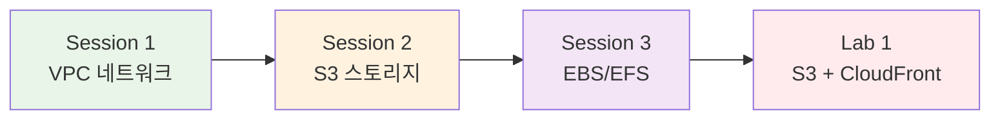

# November Week 1 Day 2: AWS 핵심 서비스 (VPC, S3, EBS/EFS)

**🌐 네트워킹** • **📦 스토리지** • **💾 영속성**

*AWS 인프라의 기본 구성 요소 학습*

---

## 🕘 일일 스케줄

| 시간 | 구분 | 내용 | 비고 |
|------|------|------|------|
| **09:00-09:40** | 📚 이론 1 | Session 1: VPC (40분) | 네트워크 격리 |
| **09:40-10:20** | 📚 이론 2 | Session 2: S3 (40분) | 객체 스토리지 |
| **10:20-11:00** | 📚 이론 3 | Session 3: EBS & EFS (40분) | 블록/파일 스토리지 |
| **11:00-12:00** | 🛠️ 실습 | Lab 1: S3 + CloudFront 배포 (60분) | 정적 웹사이트 |

---

## 🎯 Day 2 학습 목표

### 📚 이론 목표
- **VPC**: AWS 네트워크 격리 및 보안 개념 이해
- **S3**: 객체 스토리지 및 정적 웹사이트 호스팅
- **EBS/EFS**: 블록 스토리지와 파일 스토리지 차이점

### 🛠️ 실습 목표
- 팀 프론트엔드 프로젝트를 S3에 배포
- CloudFront CDN으로 글로벌 서비스 구성
- HTTPS 자동 전환 및 캐싱 동작 확인

---

## 📚 이론 세션

### [Session 1: VPC (Virtual Private Cloud)](./session_1.md)
**시간**: 09:00-09:40 (40분)

**핵심 내용**:
- VPC 개념 및 네트워크 격리
- Subnet, Route Table, Internet Gateway
- Security Group vs NACL
- VPC 설계 베스트 프랙티스

**학습 포인트**:
- AWS 네트워크의 기본 구조 이해
- 보안 그룹을 통한 트래픽 제어
- Public/Private Subnet 구분

---

### [Session 2: S3 (Simple Storage Service)](./session_2.md)
**시간**: 09:40-10:20 (40분)

**핵심 내용**:
- S3 객체 스토리지 개념
- 버킷, 객체, 스토리지 클래스
- 정적 웹사이트 호스팅
- 버킷 정책 및 접근 제어

**학습 포인트**:
- 무제한 확장 가능한 스토리지
- 정적 콘텐츠 호스팅 방법
- 비용 효율적인 스토리지 클래스 선택

---

### [Session 3: EBS & EFS 스토리지](./session_3.md)
**시간**: 10:20-11:00 (40분)

**핵심 내용**:
- EBS (Elastic Block Store) 블록 스토리지
- EFS (Elastic File System) 파일 스토리지
- EBS vs EFS vs S3 비교
- 스토리지 선택 기준

**학습 포인트**:
- EC2 인스턴스를 위한 영속적 스토리지
- 공유 스토리지 vs 전용 스토리지
- 성능과 비용 트레이드오프

---

## 🛠️ 실습 세션

### [Lab 1: S3 + CloudFront 정적 웹사이트 배포](./lab_1.md)
**시간**: 11:00-12:00 (60분)

**실습 목표**:
- 팀 프론트엔드 프로젝트 빌드
- S3 버킷 생성 및 정적 웹사이트 호스팅 설정
- CloudFront Distribution 생성 및 연동
- HTTP → HTTPS 자동 전환 확인

**실습 단계**:
1. **Step 1**: S3 버킷 생성 및 정적 호스팅 설정 (15분)
2. **Step 2**: 팀 프로젝트 빌드 및 배포 (20분)
3. **Step 3**: CloudFront Distribution 생성 (20분)
4. **Step 4**: HTTPS 전환 및 캐싱 테스트 (5분)

**예상 비용**: $0.01

---

## 🔗 세션 간 연결

### Day 1 복습
- **Region & AZ**: VPC는 Region 내에 생성
- **Edge Location**: CloudFront CDN 캐시 서버

### Day 2 흐름

### Day 3 준비
- **EC2**: VPC 내에서 실행되는 가상 서버
- **EBS**: EC2에 연결되는 블록 스토리지

---

## 💡 학습 팁

### 이론 학습
- VPC는 AWS 네트워크의 기초 - 다른 모든 서비스와 연결
- S3는 가장 많이 사용되는 서비스 - 다양한 활용 사례
- 스토리지 선택은 워크로드 특성에 따라 결정

### 실습 준비
- 팀 프론트엔드 프로젝트 빌드 미리 테스트
- `npm run build` 명령어 동작 확인
- 빌드 결과물 위치 확인 (build/ 또는 dist/)

### 트러블슈팅
- S3 403 Forbidden: 버킷 정책 확인
- CloudFront 배포 시간: 15-20분 소요 (인내심 필요)
- 캐시 무효화: CloudFront Invalidation 사용

---

## ✅ Day 2 완료 체크리스트

### 이론 이해도
- [ ] VPC의 역할과 구성 요소 이해
- [ ] S3 버킷과 객체 개념 파악
- [ ] EBS와 EFS의 차이점 설명 가능
- [ ] 스토리지 선택 기준 이해

### 실습 완료
- [ ] 팀 프론트엔드 프로젝트 빌드 성공
- [ ] S3 정적 웹사이트 호스팅 설정
- [ ] CloudFront Distribution 생성
- [ ] HTTPS 접속 및 캐싱 동작 확인

### 다음 준비
- [ ] EC2 개념 예습 (Day 3)
- [ ] SSH 키 페어 개념 이해
- [ ] 팀 백엔드 프로젝트 준비

---

## 📊 학습 성과

### 기술적 성취
- AWS 네트워크 및 스토리지 기초 완성
- 정적 웹사이트 배포 경험
- CDN을 통한 글로벌 서비스 구축

### 실무 연계
- 프론트엔드 배포 파이프라인 이해
- 비용 효율적인 정적 호스팅 방법
- HTTPS 보안 연결 자동화

---

**🌐 네트워킹** • **📦 스토리지** • **🚀 배포 자동화**

*Day 2: AWS 인프라의 기본 구성 요소 마스터*

