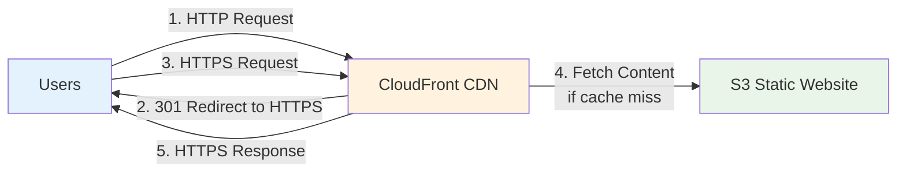
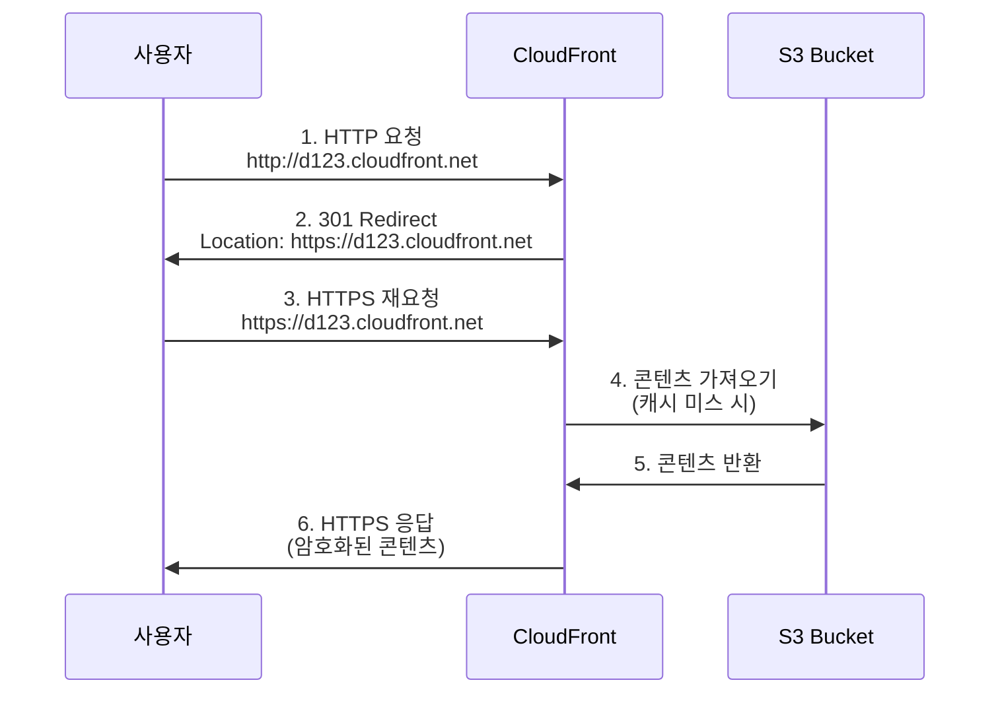

# Week 1 Day 2 Lab 1: S3 + CloudFront 정적 웹사이트 배포

<div align="center">

**🌐 정적 호스팅** • **⚡ CDN 캐싱** • **🔒 HTTPS 지원**

*S3와 CloudFront로 프론트엔드 배포 및 글로벌 서비스*

</div>

---

## 🕘 Lab 정보
**시간**: 11:00-12:00 (60분)
**목표**: S3 정적 웹사이트 호스팅 + CloudFront CDN 구성
**방식**: AWS Web Console 실습
**예상 비용**: $0.01

## 🎯 학습 목표
- [ ] S3 정적 웹사이트 호스팅 설정
- [ ] CloudFront Distribution 생성 및 연동
- [ ] HTTPS 지원 및 캐싱 동작 확인
- [ ] 글로벌 CDN의 성능 이점 체험

---

## 🏗️ 구축할 아키텍처

### 📐 아키텍처 다이어그램



*그림: S3 정적 웹사이트 호스팅 + CloudFront CDN 아키텍처*

**트래픽 흐름**:
```
1. 사용자 → CloudFront (HTTP 요청)
2. CloudFront → 자동으로 HTTPS로 301 Redirect
3. 사용자 → CloudFront (HTTPS 재요청)
4. CloudFront Edge Location → 캐시 확인, 미스 시 S3에서 콘텐츠 가져오기
5. CloudFront → 사용자에게 HTTPS로 콘텐츠 전달
```

### 🔒 HTTP → HTTPS 자동 전환



*그림: CloudFront의 HTTP → HTTPS 자동 리다이렉트 프로세스*

**보안 강화 메커니즘**:
1. **사용자가 HTTP로 접속 시도**:
   ```
   http://d1234abcd5678.cloudfront.net
   ```

2. **CloudFront가 자동으로 HTTPS로 리다이렉트** (301 Moved Permanently):
   ```
   HTTP/1.1 301 Moved Permanently
   Location: https://d1234abcd5678.cloudfront.net
   ```

3. **브라우저가 HTTPS로 재요청**:
   ```
   https://d1234abcd5678.cloudfront.net
   ```

4. **보안 연결 확립**:
   - ✅ SSL/TLS 암호화 통신
   - ✅ 데이터 도청 방지
   - ✅ 중간자 공격 차단
   - ✅ 브라우저 주소창 자물쇠 아이콘

**💡 핵심 장점**:
- **자동 보안**: 사용자가 HTTP로 접속해도 자동으로 HTTPS로 전환
- **투명한 전환**: 사용자는 리다이렉트를 거의 인지하지 못함
- **무료 SSL**: CloudFront 기본 SSL 인증서 제공
- **SEO 이점**: HTTPS는 검색 엔진 순위에 긍정적 영향

**사용된 AWS 서비스**:
- **S3**: 정적 파일 스토리지 및 웹 호스팅
- **CloudFront**: 글로벌 CDN 및 HTTPS 지원

**장점**:
- ✅ **서버 관리 불필요**: 완전 관리형 서비스
- ✅ **자동 HTTPS 전환**: HTTP 요청을 자동으로 HTTPS로 리다이렉트
- ✅ **무료 SSL 인증서**: CloudFront 기본 제공
- ✅ **글로벌 성능**: Edge Location 캐싱으로 전 세계 빠른 접근
- ✅ **비용 효율**: 서버 비용 없음, 프리티어 활용 가능
- ✅ **확장성**: 트래픽 급증 시 자동 스케일링
- ✅ **AWS 베스트 프랙티스**: 정적 웹사이트 배포 권장 아키텍처

**S3 단독 사용의 한계**:
- ❌ **HTTP만 지원**: S3 정적 웹사이트 호스팅은 HTTPS 미지원
- ❌ **보안 취약**: 암호화되지 않은 통신
- ❌ **SEO 불리**: 검색 엔진이 HTTPS 선호
- ❌ **브라우저 경고**: 최신 브라우저가 HTTP 사이트 경고 표시

**CloudFront 추가 시 해결**:
- ✅ **HTTPS 지원**: 무료 SSL 인증서로 보안 연결
- ✅ **자동 리다이렉트**: HTTP → HTTPS 자동 전환
- ✅ **성능 향상**: 글로벌 CDN 캐싱
- ✅ **DDoS 방어**: AWS Shield Standard 기본 제공

### 🔗 참조 Session
**당일 Session**:
- [Session 2: S3 스토리지](./session_2.md) - 버킷, 객체, 정적 호스팅

**이전 Day Session**:
- [Day 1 Session 1: AWS 글로벌 인프라](../day1/session_1.md) - Region, AZ, Edge Location (CloudFront)

---

## 🛠️ Step 1: S3 버킷 생성 및 정적 웹사이트 호스팅 설정 (15분)

### 📋 이 단계에서 할 일
- S3 버킷 생성
- 정적 웹사이트 호스팅 활성화
- 버킷 정책 설정 (Public 읽기 허용)

### 📝 실습 절차

#### 1-1. S3 버킷 생성

**AWS Console 경로**:
```
AWS Console → S3 → Create bucket
```

**설정 값**:
| 항목 | 값 | 설명 |
|------|-----|------|
| Bucket name | `nw1d2-frontend-[이름]` | 전역 고유 이름 (예: nw1d2-frontend-john) |
| Region | `ap-northeast-2` | 서울 리전 |
| Block Public Access | **모두 해제** | 정적 웹사이트 공개 필요 |

**⚠️ 주의사항**:
- 버킷 이름은 전역적으로 고유해야 함
- Block Public Access를 해제해야 웹사이트 접근 가능
- 실습용이므로 Public 허용 (프로덕션에서는 CloudFront OAI 사용)

#### 1-2. 정적 웹사이트 호스팅 활성화

**AWS Console 경로**:
```
S3 → 버킷 선택 → Properties → Static website hosting → Edit
```

**설정 값**:
| 항목 | 값 |
|------|-----|
| Static website hosting | Enable |
| Hosting type | Host a static website |
| Index document | `index.html` |
| Error document | `error.html` |

**결과 확인**:
- Bucket website endpoint 주소 복사 (예: `http://nw1d2-frontend-john.s3-website.ap-northeast-2.amazonaws.com`)

#### 1-3. 버킷 정책 설정

**AWS Console 경로**:
```
S3 → 버킷 선택 → Permissions → Bucket Policy → Edit
```

**버킷 정책 JSON**:
```json
{
    "Version": "2012-10-17",
    "Statement": [
        {
            "Sid": "PublicReadGetObject",
            "Effect": "Allow",
            "Principal": "*",
            "Action": "s3:GetObject",
            "Resource": "arn:aws:s3:::nw1d2-frontend-[이름]/*"
        }
    ]
}
```

**⚠️ 주의**: `nw1d2-frontend-[이름]` 부분을 실제 버킷 이름으로 변경

### ✅ Step 1 검증

**검증 방법**:
1. S3 버킷 목록에서 버킷 확인
2. Properties에서 Static website hosting 활성화 확인
3. Bucket website endpoint 주소 확인

**✅ 체크리스트**:
- [ ] S3 버킷 생성 완료
- [ ] 정적 웹사이트 호스팅 활성화
- [ ] 버킷 정책 설정 완료
- [ ] Bucket website endpoint 주소 복사

---

## 🛠️ Step 2: 팀 프로젝트 빌드 및 배포 (15분)

### 📋 이 단계에서 할 일
- 팀의 프론트엔드 프로젝트 빌드
- 빌드 결과물을 S3 버킷에 업로드
- 웹사이트 접근 테스트

### 📝 실습 절차

#### 2-1. 프론트엔드 프로젝트 빌드

**React 프로젝트 빌드**:
```bash
# 프로젝트 디렉토리로 이동
cd your-team-frontend-project

# 의존성 설치 (처음 한 번만)
npm install

# 프로덕션 빌드
npm run build

# 빌드 결과 확인
ls -la build/
# 또는 dist/ 폴더 확인 (Vite 사용 시)
```

**Vue 프로젝트 빌드**:
```bash
cd your-team-frontend-project
npm install
npm run build
ls -la dist/
```

**빌드 결과물 구조 예시**:
```
build/ (또는 dist/)
├── index.html
├── static/
│   ├── css/
│   │   └── main.*.css
│   ├── js/
│   │   └── main.*.js
│   └── media/
│       └── logo.*.png
└── favicon.ico
```

**⚠️ 빌드 전 확인사항**:
- `package.json`에 `build` 스크립트 존재 확인
- API 엔드포인트가 하드코딩되어 있다면 환경변수로 변경
- 빌드 에러 발생 시 의존성 버전 확인

#### 2-2. S3에 빌드 파일 업로드

**AWS Console 경로**:
```
S3 → 버킷 선택 → Upload
```

**업로드 방법**:

**방법 1: AWS Console 사용** (권장)
1. **Add folder** 클릭
2. `build/` 또는 `dist/` 폴더 **내부의 모든 파일** 선택
   - ⚠️ 폴더 자체가 아닌 폴더 내부 파일들을 선택
   - `index.html`이 S3 버킷 루트에 위치해야 함
3. **Upload** 클릭
4. 업로드 완료 대기

**방법 2: AWS CLI 사용** (빠른 배포)
```bash
# AWS CLI 설치 확인
aws --version

# S3 동기화 (빌드 폴더 전체 업로드)
aws s3 sync build/ s3://nw1d2-frontend-[이름]/ --delete

# 또는 Vite 사용 시
aws s3 sync dist/ s3://nw1d2-frontend-[이름]/ --delete

# 업로드 확인
aws s3 ls s3://nw1d2-frontend-[이름]/ --recursive
```

**⚠️ 주의사항**:
- **폴더 구조 유지**: `static/`, `css/`, `js/` 등
- **index.html 위치**: 반드시 S3 버킷 루트에 위치
- **파일명 대소문자**: 대소문자 구분 (Linux 기준)
- **--delete 옵션**: S3에 있지만 로컬에 없는 파일 삭제

#### 2-3. 웹사이트 접근 테스트

**테스트 방법**:
```
브라우저에서 Bucket website endpoint 주소 접속
예: http://nw1d2-frontend-john.s3-website.ap-northeast-2.amazonaws.com
```

**예상 결과**:
- ✅ 팀의 프론트엔드 UI 정상 표시
- ✅ CSS 스타일 적용 확인
- ✅ JavaScript 동작 확인
- ✅ 이미지/아이콘 로딩 확인

**⚠️ 트러블슈팅**:

**문제 1: 403 Forbidden**
```
원인: 버킷 정책 미설정 또는 Block Public Access 활성화
해결:
1. Permissions → Bucket Policy 확인
2. Block Public Access 모두 해제 확인
```

**문제 2: 404 Not Found**
```
원인: index.html이 루트에 없거나 파일명 오타
해결:
1. S3 버킷에서 index.html 위치 확인 (루트에 있어야 함)
2. 파일명 대소문자 확인 (Index.html ≠ index.html)
```

**문제 3: CSS/JS 미적용**
```
원인: 상대 경로 문제 또는 파일 업로드 누락
해결:
1. 브라우저 개발자 도구 (F12) → Network 탭 확인
2. 404 에러 파일 경로 확인
3. 해당 파일이 S3에 업로드되었는지 확인
```

**문제 4: API 호출 실패**
```
원인: CORS 설정 또는 API 엔드포인트 문제
해결:
1. 백엔드 API CORS 설정 확인
2. 환경변수로 API 엔드포인트 설정 확인
```

### ✅ Step 2 검증

**검증 명령어** (AWS CLI):
```bash
# S3 버킷 내용 확인
aws s3 ls s3://nw1d2-frontend-[이름]/ --recursive

# index.html 존재 확인
aws s3 ls s3://nw1d2-frontend-[이름]/index.html
```

**브라우저 테스트**:
```
1. Bucket website endpoint 접속
2. 개발자 도구 (F12) → Console 탭에서 에러 확인
3. Network 탭에서 리소스 로딩 상태 확인
```

**✅ 체크리스트**:
- [ ] 프론트엔드 프로젝트 빌드 성공
- [ ] 빌드 파일 S3 업로드 완료
- [ ] `index.html`이 S3 버킷 루트에 위치
- [ ] HTTP로 웹사이트 접근 성공
- [ ] CSS/JS 정상 로딩 확인
- [ ] 팀의 UI가 정상적으로 표시됨
- [ ] 브라우저 콘솔에 에러 없음

---

## 🛠️ Step 3: CloudFront Distribution 생성 (15분)

### 📋 이 단계에서 할 일
- CloudFront Distribution 생성
- S3 버킷을 Origin으로 설정
- HTTPS 지원 활성화

### 📝 실습 절차

#### 3-1. CloudFront Distribution 생성

**AWS Console 경로**:
```
AWS Console → CloudFront → Create distribution
```

**설정 값**:

**Origin 설정**:
| 항목 | 값 | 설명 |
|------|-----|------|
| Origin domain | S3 버킷 선택 | 드롭다운에서 선택 |
| Origin path | 비워둠 | 루트 경로 사용 |
| Name | 자동 생성 | 그대로 사용 |

**Default cache behavior**:
| 항목 | 값 | 설명 |
|------|-----|------|
| Viewer protocol policy | **Redirect HTTP to HTTPS** | HTTP → HTTPS 자동 리다이렉트 |
| Allowed HTTP methods | GET, HEAD | 정적 콘텐츠만 |
| Cache policy | CachingOptimized | 기본 캐싱 정책 |

**Settings**:
| 항목 | 값 | 설명 |
|------|-----|------|
| Price class | Use all edge locations | 전 세계 배포 |
| Default root object | `index.html` | 루트 접근 시 표시 |

**⚠️ 주의사항**:
- Origin domain은 S3 website endpoint가 아닌 S3 버킷 선택
- Redirect HTTP to HTTPS 필수 (보안)
- Distribution 생성에 5-10분 소요

#### 3-2. Distribution 배포 대기

**상태 확인**:
```
CloudFront → Distributions → Status 확인
```

**배포 상태**:
- **In Progress**: 배포 중 (5-10분 소요)
- **Deployed**: 배포 완료

**Distribution domain name 복사**:
- 예: `d1234abcd5678.cloudfront.net`

### ✅ Step 3 검증

**검증 방법**:
```
브라우저에서 CloudFront domain 접속
예: https://d1234abcd5678.cloudfront.net
```

**예상 결과**:
- ✅ HTTPS로 접근 가능
- ✅ 웹사이트 정상 표시
- ✅ 브라우저 주소창에 자물쇠 아이콘 (보안 연결)

**✅ 체크리스트**:
- [ ] CloudFront Distribution 생성 완료
- [ ] Status가 Deployed로 변경
- [ ] HTTPS로 웹사이트 접근 성공
- [ ] S3 HTTP와 동일한 콘텐츠 표시

---

## 🛠️ Step 4: 캐싱 동작 확인 및 성능 테스트 (10분)

### 📋 이 단계에서 할 일
- CloudFront 캐싱 동작 확인
- S3 직접 접근 vs CloudFront 성능 비교
- 캐시 무효화 테스트

### 📝 실습 절차

#### 4-1. HTTP → HTTPS 자동 전환 확인

**테스트 방법**:
1. **HTTP로 접속 시도**:
   ```
   http://d1234abcd5678.cloudfront.net
   ```

2. **브라우저 개발자 도구 확인** (F12 → Network 탭):
   ```
   Status: 301 Moved Permanently
   Location: https://d1234abcd5678.cloudfront.net
   ```

3. **자동으로 HTTPS로 리다이렉트**:
   - 주소창이 `https://`로 변경
   - 자물쇠 아이콘 표시
   - 보안 연결 확립

**예상 결과**:
- ✅ HTTP 요청 → 301 리다이렉트
- ✅ 자동으로 HTTPS로 전환
- ✅ 사용자는 투명하게 보안 연결 사용
- ✅ 브라우저 경고 없음

**💡 핵심 포인트**:
- 사용자가 실수로 HTTP로 접속해도 자동으로 보안 연결
- 별도 설정 없이 CloudFront가 자동 처리
- 모든 트래픽이 암호화되어 안전

#### 4-2. 캐싱 동작 확인

**브라우저 개발자 도구 열기**:
```
F12 또는 우클릭 → 검사 → Network 탭
```

**CloudFront 접속 후 확인**:
1. 페이지 새로고침 (Ctrl+F5)
2. Network 탭에서 index.html 선택
3. Response Headers 확인

**확인할 헤더**:
```
X-Cache: Hit from cloudfront (캐시 히트)
X-Cache: Miss from cloudfront (캐시 미스)
Age: 123 (캐시된 시간, 초 단위)
```

#### 4-3. 성능 비교

**테스트 방법**:
1. **S3 직접 접근** (HTTP):
   - `http://nw1d2-frontend-john.s3-website.ap-northeast-2.amazonaws.com`
   - Network 탭에서 로딩 시간 확인

2. **CloudFront 접근** (HTTPS):
   - `https://d1234abcd5678.cloudfront.net`
   - Network 탭에서 로딩 시간 확인

**예상 결과**:
- CloudFront가 더 빠름 (Edge Location 캐싱)
- 특히 이미지, CSS, JS 파일 로딩 속도 향상

#### 4-4. 캐시 무효화 테스트

**파일 수정**:
1. S3에서 index.html 수정
2. CloudFront로 접속 → 변경사항 미반영 (캐시됨)

**캐시 무효화**:
```
CloudFront → Distributions → 선택 → Invalidations → Create invalidation
```

**설정**:
| 항목 | 값 |
|------|-----|
| Object paths | `/*` (모든 파일) 또는 `/index.html` (특정 파일) |

**결과 확인**:
- 1-2분 후 CloudFront 재접속
- 변경사항 반영 확인

### ✅ Step 4 검증

**✅ 체크리스트**:
- [ ] HTTP → HTTPS 자동 리다이렉트 확인
- [ ] 301 상태 코드 확인
- [ ] 브라우저 자물쇠 아이콘 확인
- [ ] X-Cache 헤더 확인 (Hit/Miss)
- [ ] CloudFront가 S3보다 빠른 것 확인
- [ ] 캐시 무효화 성공
- [ ] 변경사항 반영 확인

---

## 🧹 리소스 정리 (5분)

### ⚠️ 중요: 반드시 순서대로 삭제

**삭제 순서**:
```
CloudFront Distribution → S3 버킷 객체 → S3 버킷
```

### 🗑️ 삭제 절차

#### 1. CloudFront Distribution 삭제

**AWS Console 경로**:
```
CloudFront → Distributions → 선택 → Disable
```

**단계**:
1. Distribution 선택
2. **Disable** 클릭 (5-10분 소요)
3. Status가 Disabled로 변경되면
4. **Delete** 클릭

**⚠️ 주의**: Disable 후에만 Delete 가능

#### 2. S3 버킷 객체 삭제

**AWS Console 경로**:
```
S3 → 버킷 선택 → Objects → 전체 선택 → Delete
```

#### 3. S3 버킷 삭제

**AWS Console 경로**:
```
S3 → 버킷 선택 → Delete
```

**확인**:
- 버킷 이름 입력하여 삭제 확인

### ✅ 정리 완료 확인

**✅ 최종 체크리스트**:
- [ ] CloudFront Distribution 삭제
- [ ] S3 버킷 객체 삭제
- [ ] S3 버킷 삭제
- [ ] 비용 확인 (Cost Explorer)

---

## 💰 비용 확인

### 예상 비용 계산
| 리소스 | 사용 시간 | 단가 | 예상 비용 |
|--------|----------|------|-----------|
| S3 스토리지 | 1시간 | $0.025/GB/월 | $0.0001 |
| S3 요청 | 100회 | $0.0004/1000 | $0.0001 |
| CloudFront | 1GB 전송 | $0.085/GB | $0.085 |
| **합계** | | | **~$0.01** |

**프리티어 혜택**:
- S3: 5GB 스토리지, 20,000 GET 요청 무료
- CloudFront: 1TB 데이터 전송, 10,000,000 요청 무료

---

## 🔍 트러블슈팅

### 문제 1: 403 Forbidden 오류

**증상**:
- S3 website endpoint 접속 시 403 오류

**원인**:
- 버킷 정책 미설정 또는 잘못된 설정
- Block Public Access 활성화

**해결 방법**:
1. Bucket Policy 확인 및 재설정
2. Block Public Access 모두 해제
3. 버킷 이름 확인 (ARN에서)

### 문제 2: CloudFront에서 S3 오류

**증상**:
- CloudFront 접속 시 AccessDenied 오류

**원인**:
- Origin 설정 오류 (S3 website endpoint 사용)

**해결 방법**:
1. CloudFront Origin을 S3 버킷으로 변경
2. S3 website endpoint가 아닌 S3 버킷 선택

### 문제 3: 캐시 무효화 안됨

**증상**:
- 파일 수정 후에도 이전 버전 표시

**원인**:
- 브라우저 캐시
- CloudFront 캐시

**해결 방법**:
1. 브라우저 캐시 삭제 (Ctrl+Shift+Delete)
2. CloudFront Invalidation 생성
3. 시크릿 모드로 테스트

---

## 💡 Lab 회고

### 🤝 팀 회고 (5분)
1. **S3 + CloudFront 장점**: 서버 관리 없이 프론트엔드 배포
2. **HTTPS 지원**: CloudFront로 무료 SSL 인증서
3. **글로벌 성능**: Edge Location 캐싱 효과
4. **실무 적용**: 팀 프로젝트 프론트엔드 배포 방안

### 📊 학습 성과
- **기술적 성취**: S3 정적 호스팅 + CloudFront CDN 구성
- **이해도 향상**: 캐싱 동작 원리 및 성능 이점
- **실무 역량**: AWS 베스트 프랙티스 적용

### 🎯 다음 Lab 준비
- **Lab 2**: VPC + EC2 + RDS 백엔드 배포
- **연계**: 프론트엔드(S3+CF) + 백엔드(EC2+RDS) 통합

---

<div align="center">

**🌐 정적 호스팅** • **⚡ CDN 캐싱** • **🔒 HTTPS 지원** • **💰 비용 효율**

*S3 + CloudFront로 프로덕션급 프론트엔드 배포*

</div>
