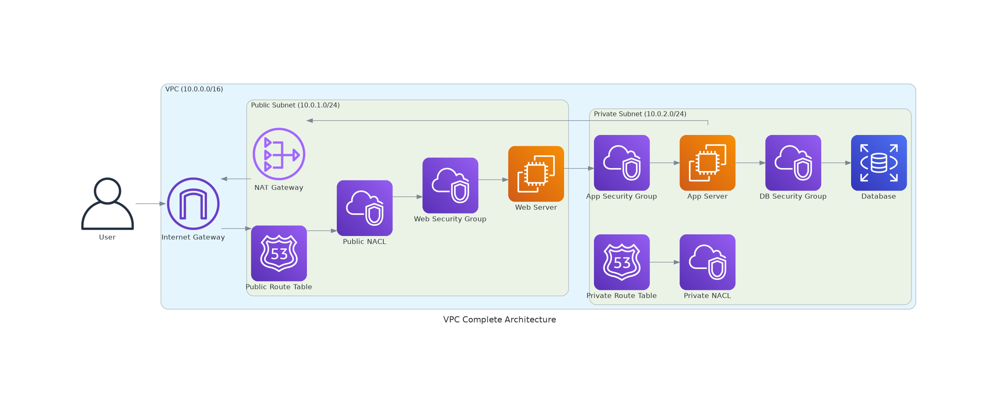
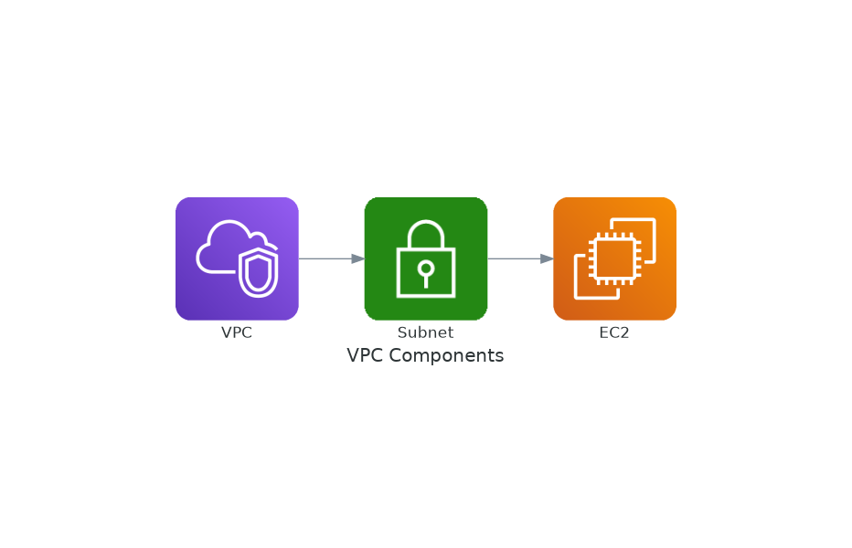
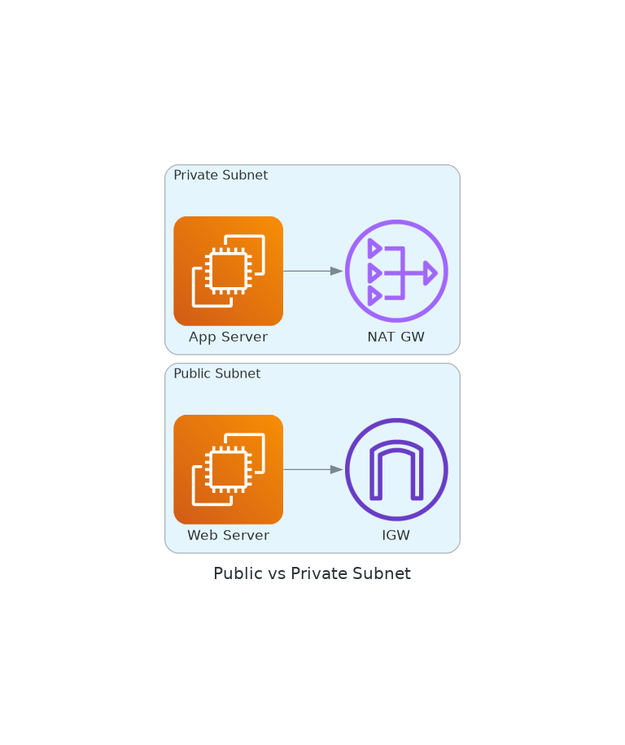

# November Week 1 Day 2 Session 1: VPC (Virtual Private Cloud)

<div align="center">

**🌐 네트워크 격리** • **🔒 보안 제어** • **🏗️ 인프라 기반**

*AWS에서 논리적으로 격리된 가상 네트워크 구축*

</div>

---

## 🕘 세션 정보
**시간**: 09:00-09:40 (40분)
**목표**: VPC 개념 이해 및 네트워크 구성 요소 파악

---

## 📖 서비스 개요

### 1. 생성 배경 (Why?)

**문제 상황**:
- **온프레미스 네트워크**: 물리적 라우터, 스위치 구매 및 설치 (수천만원)
- **공유 네트워크 보안**: 초기 클라우드는 다른 고객과 네트워크 공유 (보안 우려)
- **네트워크 제어 부족**: IP 대역, 라우팅 규칙 커스터마이징 불가
- **멀티 테넌시**: 고객 간 완전한 네트워크 격리 필요

**AWS VPC 솔루션**:
- **논리적 격리**: 각 고객마다 독립적인 가상 네트워크
- **완전한 제어**: IP 대역(CIDR), Subnet, Route Table 직접 설정
- **온프레미스 연결**: VPN, Direct Connect로 하이브리드 클라우드
- **무료**: VPC 자체는 비용 없음 (NAT Gateway 등 일부 리소스만 과금)

---

### 2. 핵심 원리 (How?)

**VPC 완전한 아키텍처**:



*그림: VPC의 모든 구성 요소 - IGW, NAT GW, Route Table, NACL, Security Group*

**VPC 구성 요소**:



*그림: VPC 내부 구성 요소 간 관계*

```
VPC (10.0.0.0/16)
├── Subnet (10.0.1.0/24) - Public
│   ├── Internet Gateway 연결
│   └── Public IP 자동 할당
├── Subnet (10.0.2.0/24) - Private
│   ├── NAT Gateway 통한 외부 접근
│   └── Private IP만 사용
├── Route Tables
│   ├── Public RT: 0.0.0.0/0 → IGW
│   └── Private RT: 0.0.0.0/0 → NAT GW
├── Security Group (인스턴스 레벨)
│   └── Stateful 방화벽
└── Network ACL (Subnet 레벨)
    └── Stateless 방화벽
```

**작동 원리**:
1. **CIDR 블록**: VPC 생성 시 IP 주소 범위 정의 (예: 10.0.0.0/16 = 65,536개 IP)
2. **Subnet 분할**: AZ별로 Subnet 생성 (예: 10.0.1.0/24 = 256개 IP)
3. **Route Table**: 트래픽 경로 제어 (인터넷, VPN, Peering)
4. **Internet Gateway**: Public Subnet의 인터넷 연결
5. **NAT Gateway**: Private Subnet의 아웃바운드 인터넷 연결
6. **Security Group**: 인스턴스별 방화벽 (Stateful)
7. **Network ACL**: Subnet별 방화벽 (Stateless)

**Public vs Private Subnet**:



*그림: Public Subnet과 Private Subnet의 차이*

---

### 3. 주요 사용 사례 (When?)

**적합한 경우**:
- **웹 애플리케이션**: Public Subnet에 웹 서버, Private Subnet에 DB
- **데이터베이스 격리**: Private Subnet에 RDS 배치로 보안 강화
- **하이브리드 클라우드**: VPN/Direct Connect로 온프레미스 연결
- **멀티 티어 아키텍처**: Web/App/DB 계층 분리

**실제 사례**:
- **Netflix**: 수천 개의 VPC로 서비스별 격리
- **Airbnb**: 리전별 VPC로 글로벌 서비스
- **Slack**: Private Subnet에 민감 데이터 격리

---

### 4. 비슷한 서비스 비교 (Which?)

**VPC 옵션 비교**:

| 구분 | Default VPC | Custom VPC |
|------|-------------|------------|
| **사용 시기** | 간단한 테스트, 학습 | 프로덕션 환경, 보안 요구 |
| **CIDR 블록** | 172.31.0.0/16 (고정) | 사용자 정의 |
| **Subnet** | 자동 생성 (AZ당 1개) | 수동 생성 |
| **Internet Gateway** | 자동 연결 | 수동 연결 |
| **보안 제어** | 제한적 | 완전한 제어 |
| **적합 사례** | 빠른 시작, 프로토타입 | 엔터프라이즈, 규정 준수 |

**네트워크 연결 옵션**:

| 구분 | VPC Peering | Transit Gateway | VPN Connection |
|------|-------------|-----------------|----------------|
| **사용 시기** | 소수 VPC 연결 (2-5개) | 다수 VPC 연결 (10개+) | 온프레미스 연결 |
| **비용** | 낮음 (데이터 전송만) | 중간 ($0.05/h + 데이터) | 낮음 ($0.05/h) |
| **복잡도** | 낮음 | 중간 | 중간 |
| **대역폭** | 높음 | 높음 | 제한적 (1.25 Gbps) |
| **관리** | 개별 Peering 관리 | 중앙 집중식 | VPN 터널 관리 |

**NAT 옵션 비교**:

| 구분 | NAT Gateway | NAT Instance |
|------|-------------|--------------|
| **사용 시기** | 관리형 선호, 고가용성 | 비용 절감, 커스터마이징 |
| **비용** | $0.045/h + 데이터 | EC2 비용만 |
| **가용성** | AWS 관리 (99.99%) | 직접 관리 필요 |
| **대역폭** | 최대 100 Gbps | 인스턴스 타입 의존 |
| **관리 부담** | 없음 | OS 패치, 모니터링 |

---

### 5. 장단점 분석

| 구분 | 내용 | 대안 |
|------|------|------|
| **✅ 장점** | | |
| 완전한 제어 | IP 범위, 라우팅, 보안 규칙 직접 설정 | - |
| 보안 강화 | 논리적 격리, Security Group, NACL | - |
| 온프레미스 연결 | VPN, Direct Connect 지원 | - |
| 무료 | VPC 자체는 비용 없음 | - |
| 확장성 | Subnet 추가, VPC Peering 가능 | - |
| **⚠️ 단점** | | |
| CIDR 변경 불가 | VPC 생성 후 CIDR 블록 변경 어려움 | 신중한 설계 필요 |
| NAT Gateway 비용 | $0.045/h + 데이터 처리 비용 | NAT Instance 사용 |
| VPC Peering 제한 | 최대 125개 Peering | Transit Gateway 사용 |
| 학습 곡선 | 네트워킹 지식 필요 | Default VPC로 시작 |

---

### 6. 비용 구조 💰

**무료 항목**:
- VPC 생성 및 사용: $0
- Subnet, Route Table: $0
- Internet Gateway: $0
- Security Groups, NACL: $0
- VPC Peering (연결 자체): $0

**유료 항목**:

| 항목 | 가격 (ap-northeast-2) | 설명 |
|------|----------------------|------|
| **NAT Gateway** | $0.062/hour | 시간당 과금 |
| | $0.062/GB | 데이터 처리 |
| **VPN Connection** | $0.05/hour | VPN 터널당 |
| **Transit Gateway** | $0.07/hour | 연결당 |
| | $0.02/GB | 데이터 처리 |
| **VPC Peering 데이터** | $0.01/GB | 같은 AZ |
| | $0.02/GB | 다른 AZ/Region |

**비용 최적화 팁**:
1. **NAT Gateway 대신 NAT Instance**: 저비용 환경에서 EC2 t3.nano 사용
2. **VPC Endpoint**: S3/DynamoDB 무료 접근 (인터넷 경유 불필요)
3. **데이터 전송 최소화**: 같은 AZ 내 리소스 배치
4. **Transit Gateway vs Peering**: 소수 VPC는 Peering이 저렴
5. **불필요한 NAT Gateway 삭제**: 사용하지 않는 Subnet의 NAT 제거

**Lab 예상 비용**:
- VPC: $0
- Subnet: $0
- Internet Gateway: $0
- NAT Gateway (1시간): $0.062
- 데이터 전송 (1GB): $0.062
- **합계**: ~$0.12

---

### 7. 최신 업데이트 🆕

**2024년 주요 변경사항**:
- **IPv6 지원 강화**: Dual-stack VPC 기본 지원
- **VPC Flow Logs 개선**: Parquet 형식 지원으로 비용 60% 절감
- **Network Access Analyzer**: 보안 분석 도구 추가
- **Prefix Lists 확장**: 최대 1,000개 항목 지원

**2025년 예정**:
- **VPC Lattice 통합**: 서비스 메시 기능 강화
- **더 큰 CIDR 블록**: /8 블록 지원 검토

**Deprecated 기능**:
- **EC2-Classic**: 2022년 종료 (모든 리소스 VPC 필수)

**참조**: [AWS VPC What's New](https://aws.amazon.com/vpc/whats-new/)

---

### 8. 잘 사용하는 방법 ✅

**베스트 프랙티스**:
1. **CIDR 블록 설계**: 10.0.0.0/16 권장 (65,536개 IP), 향후 확장 고려
2. **Multi-AZ 배포**: 최소 2개 AZ에 Subnet 생성 (고가용성)
3. **Public/Private 분리**: 웹 서버는 Public, DB는 Private
4. **Security Group 최소 권한**: 필요한 포트만 오픈
5. **VPC Flow Logs 활성화**: 네트워크 트래픽 모니터링

**실무 팁**:
- **Subnet 크기**: /24 (256 IP) 권장, AWS가 5개 IP 예약
- **Route Table 명명**: 용도 명확히 (public-rt, private-rt-az1)
- **태그 전략**: Name, Environment, Owner 태그 필수

**성능 최적화**:
- **같은 AZ 배치**: 지연시간 최소화, 데이터 전송 비용 절감
- **VPC Endpoint 사용**: S3/DynamoDB 직접 접근 (NAT 불필요)
- **Enhanced Networking**: EC2 인스턴스에서 활성화

---

### 9. 잘못 사용하는 방법 ❌

**흔한 실수**:

| 실수 | 문제점 | 올바른 방법 |
|------|--------|------------|
| **CIDR 중복** | VPC Peering 불가 | 각 VPC마다 다른 CIDR 사용 |
| **Subnet 너무 작음** | IP 부족 | /24 이상 권장 |
| **Public Subnet에 DB** | 보안 취약 | Private Subnet 사용 |
| **Security Group 전체 오픈** | 0.0.0.0/0 모든 포트 | 필요한 포트만 특정 IP에 |
| **NAT Gateway 없음** | Private Subnet 인터넷 불가 | NAT Gateway 또는 Instance |

**안티 패턴**:
- **단일 AZ 배포**: 고가용성 부족
- **Default VPC 프로덕션 사용**: 보안 제어 제한적
- **Route Table 공유**: 모든 Subnet이 같은 RT 사용 (유연성 부족)

**보안 취약점**:
- **NACL 미사용**: Security Group만으로 부족
- **VPC Flow Logs 미활성화**: 보안 사고 추적 불가
- **SSH 키 공유**: 인스턴스별 다른 키 사용

---

### 10. 구성 요소 상세

**주요 구성 요소**:

**1. CIDR 블록**:
- 역할: VPC의 IP 주소 범위 정의
- 형식: 10.0.0.0/16 (RFC 1918 사설 IP)
- 크기: /16 ~ /28 (65,536 ~ 16개 IP)
- 주의: 생성 후 변경 어려움

**2. Subnet**:
- 역할: AZ별 IP 주소 분할
- 종류: Public (IGW 연결), Private (NAT 연결)
- 크기: /24 권장 (256 IP, AWS 5개 예약)
- 배치: 최소 2개 AZ (고가용성)

**3. Route Table**:
- 역할: 트래픽 경로 제어
- 규칙: Destination (목적지) → Target (경로)
- 예시: 0.0.0.0/0 → Internet Gateway
- 우선순위: 가장 구체적인 규칙 우선

**4. Internet Gateway (IGW)**:
- 역할: VPC와 인터넷 연결
- 특징: VPC당 1개, 고가용성 (AWS 관리)
- 비용: 무료
- 연결: Public Subnet Route Table에 추가

**5. NAT Gateway**:
- 역할: Private Subnet의 아웃바운드 인터넷
- 배치: Public Subnet에 생성
- 고가용성: AZ별로 생성 권장
- 비용: $0.062/h + 데이터 처리

**6. Security Group**:
- 역할: 인스턴스 레벨 방화벽
- 특징: Stateful (응답 자동 허용)
- 규칙: Inbound, Outbound 별도 설정
- 기본: 모든 Outbound 허용, Inbound 거부

**7. Network ACL**:
- 역할: Subnet 레벨 방화벽
- 특징: Stateless (응답도 명시적 허용)
- 규칙: 번호 순서대로 평가
- 기본: 모든 트래픽 허용

---

### 11. 공식 문서 링크 (필수 5개)

**⚠️ 학생들이 직접 확인해야 할 공식 문서**:
- 📘 [VPC란 무엇인가?](https://docs.aws.amazon.com/vpc/latest/userguide/what-is-amazon-vpc.html)
- 📗 [VPC 사용자 가이드](https://docs.aws.amazon.com/vpc/latest/userguide/)
- 📙 [VPC API 레퍼런스](https://docs.aws.amazon.com/AWSEC2/latest/APIReference/OperationList-query-vpc.html)
- 📕 [VPC 요금](https://aws.amazon.com/vpc/pricing/)
- 🆕 [VPC 최신 업데이트](https://aws.amazon.com/vpc/whats-new/)

---

## 💭 함께 생각해보기 (5분)

### 🤝 페어 토론

**토론 주제**:
1. **개념 적용**: "여러분의 프로젝트에서 Public/Private Subnet을 어떻게 나눌 것인가요?"
2. **문제 해결**: "CIDR 블록을 10.0.0.0/16으로 설정하면 몇 개의 IP를 사용할 수 있나요?"
3. **경험 공유**: "Security Group과 NACL의 차이점을 실무 관점에서 토론해보세요"

### 🎯 전체 공유

**인사이트 공유**:
- VPC 설계 시 고려사항
- 네트워킹 개념 이해도 확인

**💡 이해도 체크 질문**:
- ✅ "Public Subnet과 Private Subnet의 차이를 설명할 수 있나요?"
- ✅ "Internet Gateway와 NAT Gateway의 역할을 아시나요?"
- ✅ "Security Group과 NACL의 차이점을 설명할 수 있나요?"

---

## 📝 세션 마무리

### ✅ 오늘 세션 성과
- [ ] VPC 개념 및 구성 요소 이해
- [ ] Public/Private Subnet 분리 원리 파악
- [ ] Security Group vs NACL 차이 습득

### 🎯 다음 세션 준비
- **Session 2**: S3 (Simple Storage Service)
- **연계 내용**: VPC 내 EC2에서 S3 접근
- **사전 준비**: 스토리지 개념 복습

---

<div align="center">

**🌐 네트워크 기반** • **🔒 보안 제어** • **🏗️ 인프라 설계**

*VPC는 모든 AWS 인프라의 시작점*

</div>
