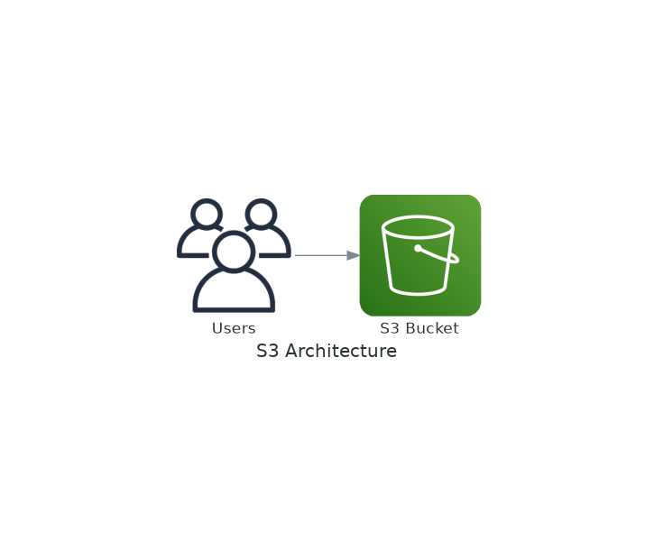
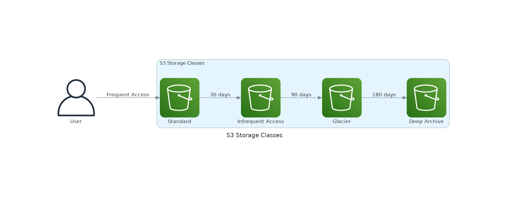

# November Week 1 Day 2 Session 2: S3 (Simple Storage Service)

<div align="center">

**📦 객체 스토리지** • **🌐 무제한 용량** • **💰 저렴한 비용**

*AWS의 핵심 스토리지 서비스 - 파일부터 빅데이터까지*

</div>

---

## 🕘 세션 정보
**시간**: 09:40-10:20 (40분)
**목표**: S3 개념 이해 및 스토리지 클래스 선택 기준 습득

---

## 📖 서비스 개요

### 1. 생성 배경 (Why?)

**문제 상황**:
- **스토리지 용량 제한**: 온프레미스 스토리지 확장 시 하드웨어 구매 (수천만원)
- **백업 관리 부담**: 테이프 백업, 오프사이트 보관 복잡
- **확장성 부족**: 트래픽 급증 시 스토리지 병목
- **데이터 내구성**: 하드웨어 장애 시 데이터 손실 위험

**AWS S3 솔루션**:
- **무제한 용량**: 파일 크기 최대 5TB, 버킷당 무제한 객체
- **99.999999999% 내구성**: 11 nines, 연간 10,000개 객체 중 1개 손실 확률
- **자동 확장**: 트래픽 증가 시 자동 스케일링
- **저렴한 비용**: $0.025/GB부터 (Glacier Deep Archive)

---

### 2. 핵심 원리 (How?)

**S3 아키텍처**:



*그림: S3의 버킷, 객체, 스토리지 클래스 구조*

**S3 구성 요소**:

```
S3
├── Bucket (버킷)
│   ├── 전역 고유 이름 (my-unique-bucket-name)
│   ├── Region 지정 (ap-northeast-2)
│   └── 버전 관리 (선택)
├── Object (객체)
│   ├── Key (파일 경로): folder/file.jpg
│   ├── Value (데이터): 최대 5TB
│   ├── Metadata (메타데이터)
│   └── Version ID (버전 관리 시)
└── Storage Class (스토리지 클래스)
    ├── Standard (자주 접근)
    ├── Intelligent-Tiering (자동 최적화)
    ├── Glacier (아카이브)
    └── Deep Archive (장기 보관)
```

**작동 원리**:


*그림: S3 버킷, 객체, 스토리지 클래스 구조*

1. **버킷 생성**: 전역 고유 이름으로 버킷 생성
2. **객체 업로드**: PUT 요청으로 파일 업로드
3. **자동 복제**: 최소 3개 AZ에 자동 복제 (Standard)
4. **접근 제어**: IAM, Bucket Policy, ACL
5. **데이터 전송**: HTTPS 암호화 전송
6. **수명 주기**: 자동으로 스토리지 클래스 전환

**스토리지 클래스 비교**:



*그림: 접근 빈도와 비용에 따른 스토리지 클래스 선택*

---

### 3. 주요 사용 사례 (When?)

**적합한 경우**:
- **정적 웹 호스팅**: HTML, CSS, JS, 이미지 파일
- **백업 및 아카이브**: 데이터베이스 백업, 로그 파일
- **빅데이터 분석**: Data Lake, Athena 쿼리
- **미디어 스토리지**: 동영상, 이미지, 오디오 파일
- **소프트웨어 배포**: 설치 파일, 업데이트 패키지

**실제 사례**:
- **Netflix**: 동영상 콘텐츠 저장 (수 페타바이트)
- **Airbnb**: 숙소 사진 저장 및 CDN 연동
- **Dropbox**: 초기 파일 스토리지로 S3 사용
- **Reddit**: 사용자 업로드 이미지 저장

---

### 4. 비슷한 서비스 비교 (Which?)

**S3 스토리지 클래스 비교**:

| 클래스 | 사용 시기 | 접근 시간 | 최소 보관 | 비용 (GB/월) |
|--------|----------|----------|----------|-------------|
| **Standard** | 자주 접근 (주 1회+) | 즉시 | 없음 | $0.025 |
| **Intelligent-Tiering** | 접근 패턴 불규칙 | 즉시 | 없음 | $0.025 + 모니터링 |
| **Standard-IA** | 가끔 접근 (월 1회) | 즉시 | 30일 | $0.0138 |
| **One Zone-IA** | 재생성 가능 데이터 | 즉시 | 30일 | $0.011 |
| **Glacier Instant** | 분기 1회 접근 | 즉시 | 90일 | $0.005 |
| **Glacier Flexible** | 연 1-2회 접근 | 1-5분 | 90일 | $0.0045 |
| **Glacier Deep Archive** | 거의 접근 안함 | 12시간 | 180일 | $0.002 |

**AWS 스토리지 서비스 비교**:

| 구분 | S3 | EBS | EFS |
|------|-----|-----|-----|
| **타입** | 객체 스토리지 | 블록 스토리지 | 파일 스토리지 |
| **사용 시기** | 정적 파일, 백업 | EC2 루트 볼륨 | 공유 파일 시스템 |
| **접근 방법** | HTTP API | EC2 마운트 | NFS 마운트 |
| **용량** | 무제한 | 최대 64TB | 무제한 |
| **성능** | 높은 처리량 | 높은 IOPS | 중간 |
| **비용** | 낮음 | 중간 | 높음 |
| **공유** | 인터넷 공유 가능 | 단일 EC2 | 여러 EC2 |

---

### 5. 장단점 분석

| 구분 | 내용 | 대안 |
|------|------|------|
| **✅ 장점** | | |
| 무제한 용량 | 파일 크기 최대 5TB, 버킷당 무제한 | - |
| 높은 내구성 | 99.999999999% (11 nines) | - |
| 저렴한 비용 | $0.002/GB (Deep Archive) | - |
| 자동 확장 | 트래픽 증가 시 자동 스케일링 | - |
| 다양한 기능 | 버전 관리, 수명 주기, 복제 | - |
| **⚠️ 단점** | | |
| 일관성 모델 | 최종 일관성 (Eventually Consistent) | S3 Strong Consistency 사용 |
| 파일 시스템 아님 | 디렉토리 구조 없음 (Key로 시뮬레이션) | EFS 사용 |
| 검색 제한 | 파일 내용 검색 불가 | Athena, S3 Select 사용 |
| 비용 누적 | 장기 보관 시 비용 누적 | Glacier로 전환 |

---

### 6. 비용 구조 💰

**과금 항목**:

| 항목 | 가격 (ap-northeast-2) | 설명 |
|------|----------------------|------|
| **스토리지** | $0.025/GB/월 | Standard 클래스 |
| **요청** | $0.0047/1K PUT | 업로드 요청 |
| | $0.00037/1K GET | 다운로드 요청 |
| **데이터 전송** | $0.126/GB | 인터넷 아웃바운드 (첫 10TB) |
| | $0 | 인바운드 (업로드) |
| | $0 | CloudFront로 전송 |

**스토리지 클래스별 비용**:

| 클래스 | 스토리지 | 검색 비용 | 최소 보관 |
|--------|----------|----------|----------|
| Standard | $0.025/GB | 없음 | 없음 |
| Standard-IA | $0.0138/GB | $0.01/GB | 30일 |
| Glacier Flexible | $0.0045/GB | $0.01/GB | 90일 |
| Deep Archive | $0.002/GB | $0.02/GB | 180일 |

**프리티어 혜택** (12개월):
- 스토리지: 5GB Standard
- PUT 요청: 2,000개
- GET 요청: 20,000개
- 데이터 전송: 15GB 아웃바운드

**비용 최적화 팁**:
1. **수명 주기 정책**: 30일 후 IA, 90일 후 Glacier 자동 전환
2. **Intelligent-Tiering**: 접근 패턴 불규칙 시 자동 최적화
3. **CloudFront 사용**: 데이터 전송 비용 절감
4. **S3 Select**: 전체 파일 대신 필요한 데이터만 검색
5. **압축**: 업로드 전 파일 압축으로 스토리지 비용 절감
6. **불필요한 버전 삭제**: 버전 관리 시 오래된 버전 정리

**Lab 예상 비용**:
- 스토리지 (1GB): $0.025
- PUT 요청 (100개): $0.0005
- GET 요청 (1000개): $0.0004
- **합계**: ~$0.03

---

### 7. 최신 업데이트 🆕

**2024년 주요 변경사항**:
- **S3 Express One Zone**: 밀리초 단위 지연시간 (10배 빠름)
- **S3 Object Lambda**: 객체 검색 시 실시간 변환
- **S3 Batch Operations**: 대량 객체 일괄 처리
- **S3 Storage Lens**: 스토리지 사용량 분석 강화

**2025년 예정**:
- **S3 Tables**: 테이블 형식 데이터 최적화
- **더 빠른 Glacier 검색**: Instant Retrieval 확대

**Deprecated 기능**:
- **S3 Transfer Acceleration 일부 리전**: 특정 리전 지원 종료

**참조**: [AWS S3 What's New](https://aws.amazon.com/s3/whats-new/)

---

### 8. 잘 사용하는 방법 ✅

**베스트 프랙티스**:
1. **버킷 이름 규칙**: 소문자, 숫자, 하이픈만 사용 (DNS 호환)
2. **버전 관리 활성화**: 실수로 삭제 방지
3. **수명 주기 정책**: 자동으로 스토리지 클래스 전환
4. **암호화 활성화**: SSE-S3 또는 SSE-KMS
5. **액세스 로깅**: S3 Access Logs 또는 CloudTrail

**실무 팁**:
- **Key 설계**: 날짜 기반 파티셔닝 (year=2025/month=11/day=01/)
- **멀티파트 업로드**: 100MB 이상 파일은 멀티파트 사용
- **CloudFront 연동**: 정적 웹사이트 성능 향상

**성능 최적화**:
- **병렬 업로드**: 여러 파일 동시 업로드
- **Transfer Acceleration**: 글로벌 업로드 속도 향상
- **S3 Select**: 필요한 데이터만 검색

---

### 9. 잘못 사용하는 방법 ❌

**흔한 실수**:

| 실수 | 문제점 | 올바른 방법 |
|------|--------|------------|
| **Public 버킷** | 모든 사람이 접근 가능 | Bucket Policy로 제한 |
| **버전 관리 없음** | 삭제 시 복구 불가 | 버전 관리 활성화 |
| **수명 주기 미설정** | 불필요한 비용 발생 | 자동 전환 정책 |
| **암호화 미사용** | 데이터 유출 위험 | SSE-S3 기본 암호화 |
| **로깅 미활성화** | 보안 사고 추적 불가 | Access Logs 활성화 |

**안티 패턴**:
- **데이터베이스 대용**: S3는 트랜잭션 미지원
- **파일 시스템 대용**: 빈번한 수정 작업 부적합
- **실시간 처리**: 지연시간 있음 (Express One Zone 제외)

**보안 취약점**:
- **ACL 사용**: Bucket Policy 권장
- **하드코딩 키**: IAM Role 사용
- **HTTPS 미사용**: 전송 중 암호화 필수

---

### 10. 구성 요소 상세

**주요 구성 요소**:

**1. Bucket (버킷)**:
- 역할: 객체를 저장하는 컨테이너
- 이름: 전역 고유 (3-63자, 소문자)
- Region: 생성 시 지정 (변경 불가)
- 제한: 계정당 100개 (요청 시 증가 가능)

**2. Object (객체)**:
- 역할: 실제 데이터 (파일)
- Key: 객체 식별자 (경로 포함)
- Value: 데이터 (최대 5TB)
- Metadata: 키-값 쌍 (Content-Type 등)

**3. Storage Class (스토리지 클래스)**:
- 역할: 비용 및 성능 최적화
- 선택: 접근 빈도에 따라 선택
- 전환: 수명 주기 정책으로 자동

**4. Versioning (버전 관리)**:
- 역할: 객체 변경 이력 보관
- 활성화: 버킷 레벨 설정
- 복구: 이전 버전 복원 가능

**5. Lifecycle (수명 주기)**:
- 역할: 자동 스토리지 클래스 전환
- 규칙: 일수 기반 (30일 후 IA)
- 삭제: 만료 후 자동 삭제

**6. Replication (복제)**:
- 역할: 다른 버킷으로 자동 복제
- 종류: CRR (Cross-Region), SRR (Same-Region)
- 용도: 재해 복구, 규정 준수

---

### 11. 공식 문서 링크 (필수 5개)

**⚠️ 학생들이 직접 확인해야 할 공식 문서**:
- 📘 [S3란 무엇인가?](https://docs.aws.amazon.com/AmazonS3/latest/userguide/Welcome.html)
- 📗 [S3 사용자 가이드](https://docs.aws.amazon.com/AmazonS3/latest/userguide/)
- 📙 [S3 API 레퍼런스](https://docs.aws.amazon.com/AmazonS3/latest/API/)
- 📕 [S3 요금](https://aws.amazon.com/s3/pricing/)
- 🆕 [S3 최신 업데이트](https://aws.amazon.com/s3/whats-new/)

---

## 💭 함께 생각해보기 (5분)

### 🤝 페어 토론

**토론 주제**:
1. **개념 적용**: "여러분의 프로젝트에서 S3를 어떻게 활용할 수 있나요?"
2. **문제 해결**: "자주 접근하는 파일과 거의 접근하지 않는 파일을 어떻게 관리하시겠어요?"
3. **경험 공유**: "S3와 EBS의 차이점을 실무 관점에서 토론해보세요"

### 🎯 전체 공유

**💡 이해도 체크 질문**:
- ✅ "S3의 내구성 11 nines가 무엇을 의미하나요?"
- ✅ "Standard와 Glacier의 차이를 설명할 수 있나요?"
- ✅ "S3를 파일 시스템처럼 사용할 수 없는 이유는?"

---

## 📝 세션 마무리

### ✅ 오늘 세션 성과
- [ ] S3 개념 및 스토리지 클래스 이해
- [ ] 비용 최적화 전략 습득
- [ ] 실무 활용 사례 파악

### 🎯 다음 세션 준비
- **Session 3**: EBS vs EFS
- **연계 내용**: 블록/파일 스토리지와 S3 비교

---

<div align="center">

**📦 무제한 스토리지** • **💰 저렴한 비용** • **🔒 높은 내구성**

*S3는 AWS의 가장 기본적이면서도 강력한 스토리지*

</div>
