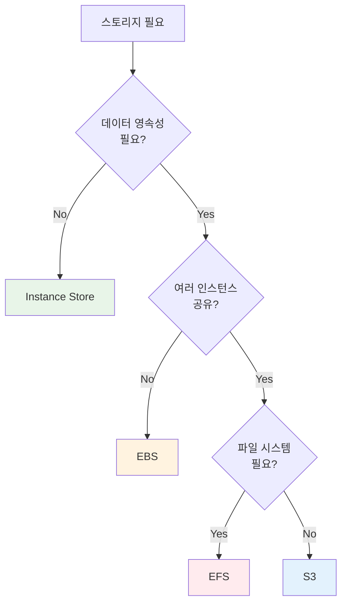

# Week 1 Day 2 Session 3: EBS & EFS 스토리지

<div align="center">

**💾 블록 스토리지** • **📁 파일 스토리지** • **🔄 공유 스토리지**

*EC2 인스턴스를 위한 영속적 스토리지 솔루션*

</div>

---

## 🕘 Session 정보
**시간**: 11:00-11:50 (50분)
**목표**: EBS와 EFS의 차이점 이해 및 적절한 스토리지 선택
**방식**: 이론 강의 + 실습 데모

## 🎯 학습 목표
### 📚 학습 목표
- **이해 목표**: EBS와 EFS의 근본적인 차이점 이해
- **적용 목표**: 워크로드에 맞는 스토리지 선택 능력
- **협업 목표**: 스토리지 설계 시 팀원과 의사결정

### 🛠️ 실무 역량
- 블록 스토리지 vs 파일 스토리지 선택
- 성능 요구사항에 맞는 EBS 타입 선택
- 공유 스토리지가 필요한 상황 판단

---

## 🤔 왜 필요한가? (5분)

### 현실 문제 상황

**💼 실무 시나리오**:
```
상황 1: "EC2 인스턴스를 종료했는데 데이터가 다 날아갔어요!"
→ Instance Store (임시 스토리지) 사용

상황 2: "여러 서버에서 같은 파일을 공유해야 하는데..."
→ EBS는 단일 인스턴스만 연결 가능

상황 3: "데이터베이스 성능이 너무 느려요"
→ 잘못된 EBS 타입 선택 (gp2 대신 io2 필요)
```

**🏠 일상 비유**:
- **EBS**: 개인 외장 하드 (한 대 PC에만 연결)
- **EFS**: 네트워크 공유 폴더 (여러 PC에서 동시 접근)
- **Instance Store**: 임시 USB (PC 끄면 데이터 사라짐)

**학습 전후 비교**:


---

## 📖 핵심 개념 (35분)

### 🔍 개념 1: EBS (Elastic Block Store) (12분)

> **정의**: EC2 인스턴스에 연결하는 블록 수준 스토리지 볼륨

#### 1. 생성 배경 (Why?)

**문제 상황**:
- Instance Store: 인스턴스 종료 시 데이터 손실
- 로컬 디스크: 확장성 부족, 백업 어려움
- 물리 서버: 디스크 교체 시 다운타임

**EBS 솔루션**:
- 네트워크 기반 블록 스토리지
- 인스턴스와 독립적인 생명주기
- 스냅샷을 통한 백업 및 복구
- 동적 크기 조정 및 타입 변경

#### 2. 핵심 원리 (How?)

**EBS 아키텍처**:
```
EC2 Instance
    ↓ (네트워크 연결)
EBS Volume (단일 AZ)
    ↓ (자동 복제)
동일 AZ 내 여러 물리 디스크
```

**작동 원리**:
1. **볼륨 생성**: 특정 AZ에 EBS 볼륨 생성
2. **인스턴스 연결**: 같은 AZ의 EC2에 연결
3. **블록 접근**: OS가 일반 디스크처럼 인식
4. **자동 복제**: AZ 내에서 자동으로 복제 (내구성 99.999%)
5. **스냅샷**: S3에 증분 백업 저장

**EBS 볼륨 타입**:

| 타입 | 용도 | IOPS | 처리량 | 가격 |
|------|------|------|--------|------|
| **gp3** | 범용 SSD (권장) | 3,000-16,000 | 125-1,000 MB/s | 낮음 |
| **gp2** | 범용 SSD (이전) | 100-16,000 | 128-250 MB/s | 낮음 |
| **io2** | 고성능 SSD | 100-64,000 | 1,000 MB/s | 높음 |
| **st1** | 처리량 최적화 HDD | - | 500 MB/s | 매우 낮음 |
| **sc1** | Cold HDD | - | 250 MB/s | 가장 낮음 |

#### 3. 주요 사용 사례 (When?)

**적합한 경우**:
- ✅ 데이터베이스 (MySQL, PostgreSQL)
- ✅ 부트 볼륨 (OS 설치)
- ✅ 로그 파일 저장
- ✅ 단일 인스턴스 애플리케이션

**실제 사례**:
- **Netflix**: 수백만 개의 EBS 볼륨으로 데이터베이스 운영
- **Airbnb**: io2 Block Express로 고성능 DB
- **Slack**: gp3로 비용 절감 (gp2 대비 20% 저렴)

#### 4. 비슷한 서비스 비교 (Which?)

**AWS 내 대안 서비스**:

**Instance Store vs EBS**:
- **Instance Store 사용**: 임시 데이터, 캐시, 버퍼
- **EBS 사용**: 영속적 데이터, 데이터베이스, 중요 파일

**EFS vs EBS**:
- **EBS 사용**: 단일 인스턴스, 고성능 필요, 블록 접근
- **EFS 사용**: 여러 인스턴스 공유, 파일 시스템 필요

**선택 기준**:

| 기준 | EBS | Instance Store | EFS |
|------|-----|----------------|-----|
| 영속성 | ✅ 영구 | ❌ 임시 | ✅ 영구 |
| 공유 | ❌ 단일 | ❌ 단일 | ✅ 다중 |
| 성능 | 높음 | 매우 높음 | 중간 |
| 비용 | 중간 | 무료 | 높음 |

#### 5. 장단점 분석

**장점**:
- ✅ 데이터 영속성 (인스턴스와 독립적)
- ✅ 스냅샷 백업 (S3 저장)
- ✅ 동적 크기 조정 (다운타임 없음)
- ✅ 암호화 지원 (KMS)
- ✅ 다양한 타입 선택

**단점/제약사항**:
- ⚠️ 단일 AZ (다른 AZ 인스턴스 연결 불가)
- ⚠️ 단일 인스턴스만 연결 (io2 Block Express 제외)
- ⚠️ 네트워크 기반 (Instance Store보다 느림)
- ⚠️ 비용 발생 (사용하지 않아도 과금)

**대안**:
- 임시 데이터: Instance Store
- 공유 필요: EFS
- 아카이브: S3 Glacier

#### 6. 비용 구조 💰

**과금 방식**:
- **프로비저닝 용량**: GB당 월 단위 과금
- **IOPS**: io2/io2 Block Express는 IOPS당 추가 과금
- **처리량**: gp3는 125 MB/s 초과 시 추가 과금
- **스냅샷**: S3 저장 용량만큼 과금

**프리티어 혜택** (12개월):
- gp2/gp3: 30GB/월 무료
- 스냅샷: 1GB/월 무료

**비용 최적화 팁**:
1. **gp3 사용**: gp2 대비 20% 저렴
2. **적절한 크기**: 과도한 프로비저닝 방지
3. **스냅샷 관리**: 오래된 스냅샷 삭제
4. **타입 변경**: 워크로드에 맞게 최적화
5. **미사용 볼륨 삭제**: 연결되지 않은 볼륨 정리

**예상 비용 (ap-northeast-2)**:

| 타입 | 용량 | IOPS | 월 비용 |
|------|------|------|---------|
| gp3 | 100GB | 3,000 | $8.00 |
| gp2 | 100GB | 300 | $10.00 |
| io2 | 100GB | 10,000 | $65.00 |

**Lab 예상 비용**:
- gp3 8GB (1시간): $0.001
- 스냅샷 8GB: $0.0005
- 합계: ~$0.002

#### 7. 최신 업데이트 🆕

**2024년 주요 변경사항**:
- **gp3 기본값**: 새 볼륨 생성 시 gp3 권장
- **io2 Block Express**: 최대 256,000 IOPS 지원
- **스냅샷 아카이브**: 75% 비용 절감 (장기 보관)
- **Fast Snapshot Restore**: 스냅샷 복원 시간 단축

**2025년 예정**:
- 더 큰 볼륨 크기 지원 (현재 최대 64TB)
- 멀티 연결 확대 (io2 Block Express)

**참조**: [AWS EBS What's New](https://aws.amazon.com/ebs/whats-new/)

#### 8. 잘 사용하는 방법 ✅

**베스트 프랙티스**:
1. **gp3 우선 사용**: 대부분의 워크로드에 적합
2. **정기 스냅샷**: 자동화된 백업 설정
3. **암호화 활성화**: 기본 암호화 사용
4. **CloudWatch 모니터링**: IOPS, 처리량 추적
5. **적절한 크기**: 실제 사용량 기반 프로비저닝

**실무 팁**:
- **볼륨 워밍업**: 새 볼륨은 초기화 필요 (dd 명령어)
- **스냅샷 전략**: 일일/주간/월간 백업 조합
- **타입 변경**: 다운타임 없이 온라인 변경 가능

**성능 최적화**:
- **EBS 최적화 인스턴스**: 전용 네트워크 대역폭
- **RAID 구성**: 여러 볼륨으로 성능 향상
- **프로비저닝 IOPS**: 일관된 성능 필요 시

#### 9. 잘못 사용하는 방법 ❌

**흔한 실수**:
1. **다른 AZ 연결 시도**: 같은 AZ에만 연결 가능
2. **과도한 프로비저닝**: 필요 이상의 용량/IOPS
3. **스냅샷 미설정**: 백업 없이 운영
4. **암호화 미사용**: 민감 데이터 보호 부족
5. **미사용 볼륨 방치**: 불필요한 비용 발생

**안티 패턴**:
- **공유 스토리지로 사용**: EBS는 단일 인스턴스만 (EFS 사용)
- **gp2 계속 사용**: gp3가 더 저렴하고 성능 좋음
- **루트 볼륨만 사용**: 데이터는 별도 볼륨 분리

**보안 취약점**:
- **스냅샷 공개**: 스냅샷 권한 설정 확인
- **암호화 키 관리**: KMS 키 로테이션 설정
- **삭제 보호 미설정**: 실수로 볼륨 삭제 방지

#### 10. 구성 요소 상세

**주요 구성 요소**:

**1. Volume (볼륨)**:
- 역할: 블록 스토리지 단위
- 속성: 크기, 타입, IOPS, 처리량
- 생명주기: 인스턴스와 독립적

**2. Snapshot (스냅샷)**:
- 역할: 증분 백업
- 저장: S3 (자동 관리)
- 용도: 백업, 복구, AMI 생성

**3. Volume Type (볼륨 타입)**:
- gp3/gp2: 범용 SSD
- io2/io1: 프로비저닝 IOPS SSD
- st1: 처리량 최적화 HDD
- sc1: Cold HDD

**설정 옵션**:
- **크기**: 1GB ~ 64TB
- **IOPS**: 타입별 상이
- **처리량**: 타입별 상이
- **암호화**: KMS 키 선택
- **Multi-Attach**: io2 Block Express만 지원

**의존성**:
- **EC2**: 같은 AZ의 인스턴스에 연결
- **KMS**: 암호화 키 관리
- **CloudWatch**: 모니터링 메트릭

#### 11. 공식 문서 링크 (필수 5개)

**⚠️ 학생들이 직접 확인해야 할 공식 문서**:
- 📘 [EBS란 무엇인가?](https://docs.aws.amazon.com/AWSEC2/latest/UserGuide/AmazonEBS.html)
- 📗 [EBS 사용자 가이드](https://docs.aws.amazon.com/AWSEC2/latest/UserGuide/ebs-volumes.html)
- 📙 [EBS API 레퍼런스](https://docs.aws.amazon.com/AWSEC2/latest/APIReference/API_Operations_Amazon_Elastic_Block_Store.html)
- 📕 [EBS 요금](https://aws.amazon.com/ebs/pricing/)
- 🆕 [EBS 최신 업데이트](https://aws.amazon.com/ebs/whats-new/)

---

### 🔍 개념 2: EFS (Elastic File System) (12분)

> **정의**: 여러 EC2 인스턴스가 동시에 접근할 수 있는 완전 관리형 NFS 파일 시스템

#### 1. 생성 배경 (Why?)

**문제 상황**:
- EBS: 단일 인스턴스만 연결 가능
- 공유 스토리지: 여러 서버에서 같은 파일 접근 필요
- NFS 서버 관리: 직접 구축 시 운영 부담

**EFS 솔루션**:
- 완전 관리형 NFS 파일 시스템
- 여러 AZ에서 동시 접근
- 자동 확장 및 축소
- 고가용성 및 내구성

#### 2. 핵심 원리 (How?)

**EFS 아키텍처**:
```
여러 EC2 인스턴스 (다중 AZ)
    ↓ (NFS 마운트)
EFS 파일 시스템 (리전 전체)
    ↓ (자동 복제)
여러 AZ의 스토리지
```

**작동 원리**:
1. **파일 시스템 생성**: 리전 수준에서 생성
2. **마운트 타겟**: 각 AZ에 마운트 타겟 생성
3. **NFS 마운트**: EC2에서 NFS 프로토콜로 마운트
4. **자동 확장**: 파일 추가 시 자동으로 용량 증가
5. **자동 복제**: 여러 AZ에 자동 복제

**EFS 성능 모드**:

| 모드 | 지연시간 | 처리량 | 용도 |
|------|----------|--------|------|
| **General Purpose** | 낮음 | 중간 | 웹 서버, CMS |
| **Max I/O** | 높음 | 높음 | 빅데이터, 미디어 처리 |

**EFS 처리량 모드**:

| 모드 | 특징 | 비용 | 용도 |
|------|------|------|------|
| **Bursting** | 크기 기반 | 낮음 | 일반적 워크로드 |
| **Provisioned** | 고정 처리량 | 높음 | 일관된 성능 필요 |
| **Elastic** | 자동 조정 | 중간 | 변동 워크로드 |

#### 3. 주요 사용 사례 (When?)

**적합한 경우**:
- ✅ 웹 서버 콘텐츠 공유 (WordPress, Drupal)
- ✅ 컨테이너 스토리지 (EKS, ECS)
- ✅ 빅데이터 분석 (여러 인스턴스 동시 접근)
- ✅ 미디어 처리 (공유 작업 디렉토리)

**실제 사례**:
- **Lyft**: EFS로 머신러닝 모델 공유
- **Zillow**: 부동산 이미지 공유 스토리지
- **Coursera**: 강의 콘텐츠 배포

#### 4. 비슷한 서비스 비교 (Which?)

**EBS vs EFS**:
- **EBS 사용**: 단일 인스턴스, 고성능, 데이터베이스
- **EFS 사용**: 여러 인스턴스, 파일 공유, 컨테이너

**FSx vs EFS**:
- **EFS 사용**: Linux 워크로드, NFS 프로토콜
- **FSx for Windows 사용**: Windows 워크로드, SMB 프로토콜
- **FSx for Lustre 사용**: HPC, 머신러닝 (S3 연동)

**선택 기준**:

| 기준 | EBS | EFS | FSx |
|------|-----|-----|-----|
| 공유 | ❌ | ✅ | ✅ |
| 프로토콜 | 블록 | NFS | SMB/Lustre |
| 성능 | 매우 높음 | 중간 | 높음 |
| 비용 | 낮음 | 높음 | 매우 높음 |

#### 5. 장단점 분석

**장점**:
- ✅ 여러 인스턴스 동시 접근
- ✅ 자동 확장 (용량 관리 불필요)
- ✅ 고가용성 (여러 AZ 복제)
- ✅ 완전 관리형 (운영 부담 없음)
- ✅ POSIX 호환 (표준 파일 시스템)

**단점/제약사항**:
- ⚠️ 높은 비용 (EBS 대비 3배)
- ⚠️ 낮은 성능 (EBS 대비)
- ⚠️ Linux만 지원 (Windows는 FSx)
- ⚠️ 지연시간 (네트워크 기반)

**대안**:
- 단일 인스턴스: EBS
- Windows: FSx for Windows
- 고성능: FSx for Lustre

#### 6. 비용 구조 💰

**과금 방식**:
- **사용량 기반**: 실제 사용한 GB당 과금
- **스토리지 클래스**: Standard, Infrequent Access
- **처리량**: Provisioned 모드는 추가 과금

**프리티어 혜택** (12개월):
- Standard: 5GB/월 무료

**비용 최적화 팁**:
1. **Lifecycle Management**: 오래된 파일 IA로 이동
2. **Infrequent Access**: 자주 접근하지 않는 파일
3. **Elastic 처리량**: 자동 조정으로 비용 절감
4. **불필요한 파일 삭제**: 정기적인 정리

**예상 비용 (ap-northeast-2)**:

| 스토리지 클래스 | GB당 월 비용 |
|----------------|--------------|
| Standard | $0.30 |
| Infrequent Access | $0.025 |

**Lab 예상 비용**:
- Standard 1GB (1시간): $0.00004
- 합계: ~$0.0001

#### 7. 최신 업데이트 🆕

**2024년 주요 변경사항**:
- **Elastic 처리량**: 자동 조정 기능 개선
- **Replication**: 리전 간 복제 지원
- **Archive**: 장기 보관용 스토리지 클래스

**2025년 예정**:
- 더 빠른 성능 모드
- 더 저렴한 스토리지 클래스

**참조**: [AWS EFS What's New](https://aws.amazon.com/efs/whats-new/)

#### 8. 잘 사용하는 방법 ✅

**베스트 프랙티스**:
1. **Lifecycle Management**: 자동으로 IA 이동
2. **보안 그룹**: NFS 포트 (2049) 제한
3. **암호화**: 전송 중/저장 시 암호화
4. **백업**: AWS Backup 사용
5. **모니터링**: CloudWatch 메트릭 추적

**실무 팁**:
- **마운트 옵션**: nfsvers=4.1, rsize=1048576
- **Auto Scaling**: EFS와 함께 EC2 Auto Scaling
- **컨테이너**: EKS/ECS에서 PersistentVolume

**성능 최적화**:
- **병렬 접근**: 여러 스레드로 동시 읽기/쓰기
- **큰 파일**: 작은 파일보다 성능 좋음
- **캐싱**: 자주 접근하는 파일 로컬 캐시

#### 9. 잘못 사용하는 방법 ❌

**흔한 실수**:
1. **데이터베이스 저장**: EFS는 DB에 부적합 (EBS 사용)
2. **Windows 사용**: EFS는 Linux만 (FSx 사용)
3. **고성능 필요**: EBS가 더 빠름
4. **비용 무시**: EBS 대비 3배 비쌈
5. **보안 그룹 미설정**: 모든 인스턴스 접근 가능

**안티 패턴**:
- **단일 인스턴스**: 공유 불필요하면 EBS
- **작은 파일 많음**: 성능 저하
- **빈번한 쓰기**: Bursting 모드 한계

**보안 취약점**:
- **공개 마운트**: VPC 내부만 접근
- **암호화 미사용**: 민감 데이터 보호
- **IAM 정책**: 파일 시스템 접근 제어

#### 10. 구성 요소 상세

**주요 구성 요소**:

**1. File System (파일 시스템)**:
- 역할: NFS 파일 시스템
- 속성: 성능 모드, 처리량 모드
- 생명주기: 리전 수준

**2. Mount Target (마운트 타겟)**:
- 역할: AZ별 접근 지점
- 속성: IP 주소, 보안 그룹
- 개수: AZ당 1개

**3. Access Point (액세스 포인트)**:
- 역할: 애플리케이션별 접근 제어
- 속성: 경로, 권한, 사용자
- 용도: 멀티 테넌시

**설정 옵션**:
- **성능 모드**: General Purpose, Max I/O
- **처리량 모드**: Bursting, Provisioned, Elastic
- **스토리지 클래스**: Standard, IA
- **암호화**: 전송 중, 저장 시
- **Lifecycle**: IA 이동 정책

**의존성**:
- **VPC**: 마운트 타겟 배치
- **보안 그룹**: NFS 포트 제어
- **KMS**: 암호화 키 관리

#### 11. 공식 문서 링크 (필수 5개)

**⚠️ 학생들이 직접 확인해야 할 공식 문서**:
- 📘 [EFS란 무엇인가?](https://docs.aws.amazon.com/efs/latest/ug/whatisefs.html)
- 📗 [EFS 사용자 가이드](https://docs.aws.amazon.com/efs/latest/ug/)
- 📙 [EFS API 레퍼런스](https://docs.aws.amazon.com/efs/latest/ug/api-reference.html)
- 📕 [EFS 요금](https://aws.amazon.com/efs/pricing/)
- 🆕 [EFS 최신 업데이트](https://aws.amazon.com/efs/whats-new/)

---

### 🔍 개념 3: EBS vs EFS 비교 및 선택 기준 (11분)

> **핵심**: 워크로드 특성에 따른 최적의 스토리지 선택

#### 종합 비교표

| 특성 | EBS | EFS | Instance Store |
|------|-----|-----|----------------|
| **타입** | 블록 스토리지 | 파일 스토리지 | 임시 블록 스토리지 |
| **연결** | 단일 인스턴스 | 다중 인스턴스 | 단일 인스턴스 |
| **범위** | 단일 AZ | 리전 전체 | 인스턴스 로컬 |
| **영속성** | ✅ 영구 | ✅ 영구 | ❌ 임시 |
| **성능** | 매우 높음 | 중간 | 최고 |
| **비용** | 낮음 | 높음 | 무료 |
| **확장** | 수동 | 자동 | 고정 |
| **백업** | 스냅샷 | AWS Backup | 불가 |
| **프로토콜** | 블록 | NFS | 블록 |
| **용도** | DB, 부트 볼륨 | 공유 파일 | 캐시, 버퍼 |

#### 선택 결정 트리



#### 실무 시나리오별 선택

**시나리오 1: 웹 애플리케이션**
```
요구사항: WordPress 멀티 서버
선택: EFS
이유: 여러 웹 서버가 동일한 콘텐츠 공유
```

**시나리오 2: 데이터베이스**
```
요구사항: MySQL 데이터베이스
선택: EBS (io2)
이유: 고성능 IOPS, 단일 인스턴스
```

**시나리오 3: 로그 수집**
```
요구사항: 여러 서버 로그 중앙화
선택: EFS 또는 S3
이유: 공유 접근, 장기 보관
```

**시나리오 4: 캐시 서버**
```
요구사항: Redis 캐시
선택: Instance Store
이유: 최고 성능, 데이터 손실 허용
```

#### 비용 효율성 비교

**100GB 데이터 기준 (월 비용)**:

| 스토리지 | 비용 | 특징 |
|----------|------|------|
| EBS gp3 | $8 | 단일 인스턴스 |
| EFS Standard | $30 | 다중 인스턴스 |
| EFS IA | $2.5 | 자주 접근 안함 |
| Instance Store | $0 | 임시 데이터 |

---

## 💭 함께 생각해보기 (10분)

### 🤝 페어 토론 (5분)

**토론 주제**:
1. **스토리지 선택**: "우리 프로젝트에 EBS와 EFS 중 어떤 것이 적합할까요?"
2. **비용 최적화**: "스토리지 비용을 줄이려면 어떤 전략을 사용할 수 있을까요?"
3. **실무 경험**: "스토리지 관련 문제를 겪은 경험이 있다면 공유해주세요"

**페어 활동 가이드**:
- 👥 **자유 페어링**: 관심사나 경험이 비슷한 사람끼리
- 🔄 **역할 교대**: 5분씩 설명자/질문자 역할 바꾸기
- 📝 **핵심 정리**: 대화 내용 중 중요한 점 메모하기

### 🎯 전체 공유 (5분)

**공유 내용**:
- **인사이트**: 페어 토론에서 나온 좋은 아이디어
- **질문**: 아직 이해가 어려운 부분
- **실무 연계**: 실제 프로젝트 적용 방안

### 💡 이해도 체크 질문

- ✅ "EBS와 EFS의 가장 큰 차이점은 무엇인가요?"
- ✅ "어떤 상황에서 EFS 대신 EBS를 선택해야 하나요?"
- ✅ "Instance Store는 언제 사용하는 것이 적합한가요?"

---

## 🔑 핵심 키워드

### 🆕 새로운 용어
- **EBS (Elastic Block Store)**: EC2용 블록 스토리지
- **EFS (Elastic File System)**: 공유 파일 시스템
- **Instance Store**: 인스턴스 로컬 임시 스토리지
- **IOPS**: 초당 입출력 작업 수
- **NFS**: Network File System 프로토콜
- **스냅샷**: EBS 증분 백업
- **마운트 타겟**: EFS 접근 지점

### 🔤 기술 용어
- **블록 스토리지**: 블록 단위 데이터 저장
- **파일 스토리지**: 파일 시스템 기반 저장
- **프로비저닝**: 미리 할당하는 방식
- **Bursting**: 일시적 성능 향상
- **Lifecycle**: 자동 스토리지 클래스 전환

### 🔤 실무 용어
- **gp3/io2**: EBS 볼륨 타입
- **General Purpose/Max I/O**: EFS 성능 모드
- **Standard/IA**: EFS 스토리지 클래스

---

## 📝 Session 마무리

### ✅ 오늘 Session 성과
- [ ] EBS와 EFS의 차이점 명확히 이해
- [ ] 워크로드별 스토리지 선택 기준 습득
- [ ] 비용 최적화 전략 파악
- [ ] 실무 적용 방안 도출

### 🎯 다음 Session 준비
- **Lab 1**: VPC & EC2 기본 구성 (실습)
- **연계 내용**: 오늘 배운 스토리지를 EC2에 연결
- **사전 준비**: AWS 계정 로그인 확인

---

<div align="center">

**💾 블록 vs 파일** • **🔄 단일 vs 공유** • **💰 비용 vs 성능**

*워크로드에 맞는 최적의 스토리지 선택*

</div>
